# Sequence-to-Sequence Models and RNNs — Layman’s Notes

> Beginner-friendly notes derived from three transcripts covering recurrent neural networks (RNNs), encoder–decoder models, training, and translation inference.

## What you should understand by the end

You should be able to explain:

1. Why ordinary neural networks are not naturally suited to ordered data.
2. How an RNN carries information from one step to the next.
3. How an encoder and decoder cooperate to transform one sequence into another.
4. What teacher forcing does during training.
5. Why generating a translation is different from training the model.
6. How common PyTorch terms such as embeddings, hidden states, padding, logits, and cross-entropy fit together.

---

## 1. The central idea

A **sequence** is an ordered collection of items.

Examples:

- Words in a sentence
- Measurements over time
- Notes in a melody
- Frames in a video
- Events in a log

The order matters. These two sentences contain the same words, but not the same meaning:

- “The man bites the dog.”
- “The dog bites the man.”

A basic **bag-of-words** representation mostly records which words occur and how often. It can therefore lose the distinction between those sentences. A sequence model processes items in order, allowing earlier items to affect how later items are interpreted.

### One-sentence mental model

> A sequence model reads or writes one item at a time while carrying forward a changing summary of what has happened so far.

---

## 2. Common input-to-output patterns

“Sequence-to-sequence” is one member of a larger family of input/output patterns.

| Pattern | Input | Output | Example |
|---|---|---|---|
| One-to-one | One item | One item | Classifying one image |
| Sequence-to-label | Many ordered items | One label | Classifying a document as positive or negative |
| Label-to-sequence | One item or condition | Many ordered items | Generating a caption or image sequence from a prompt |
| Sequence-to-sequence | Many ordered items | Many ordered items | Translation, summarization, conversational response |

The input and output sequences do **not** have to contain the same number of items.

For example:

```text
Input:  "How are you?"       3 word tokens
Output: "Wie geht es dir?"   4 word tokens
```

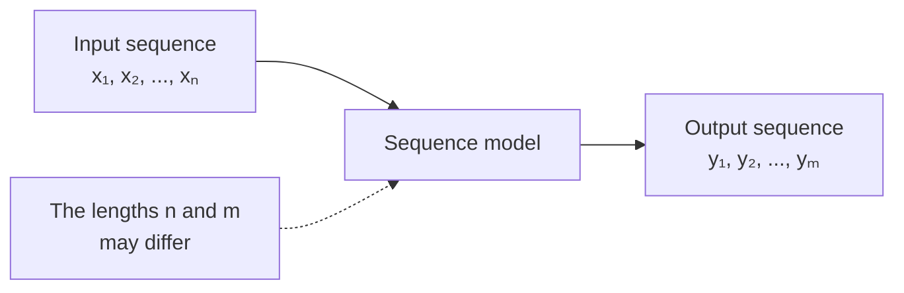

---

## 3. Why sequence data breaks the usual independence idea

Many standard machine-learning examples are presented as though each sample can be handled independently.

Suppose a model classifies individual photographs. The classification of one photograph usually does not need the model’s prediction for the previous photograph.

Language is different. The interpretation of a word often depends on earlier words:

```text
“I deposited cash at the ...”
```

After reading the earlier words, **bank** is more likely than **river**.

### The urn analogy from the transcript

Imagine drawing numbered balls from an urn.

- If each ball is replaced, every draw begins under the same conditions.
- If a ball is not replaced, later probabilities depend on earlier draws.

A sequence resembles the second situation: the current step is conditioned on what came before it.

Conceptually:

```math
P(y_t) \quad \text{versus} \quad P(y_t \mid y_1, y_2, \ldots, y_{t-1})
```

The second expression says:

> The probability of the current item depends on the previous items.

That dependence creates the need for **memory**, or at least a compact representation of prior context.

### Important clarification about IID

**Independent and identically distributed (IID)** does not simply mean that every value is identical.

- **Independent:** observing one sample does not change the probability of another.
- **Identically distributed:** samples are assumed to come from the same underlying data-generating process.

Within a sentence, tokens are not independent. However, training examples such as complete sentence pairs are often treated approximately as independently sampled examples from a dataset.

---

## 4. The basic RNN

A **recurrent neural network (RNN)** processes a sequence one step at a time.

At step `t`, it receives:

- The current input, `x_t`
- The previous hidden state, `h_(t-1)`

It calculates:

- A new hidden state, `h_t`
- Optionally, an output or prediction for that step

The hidden state acts as the model’s working memory.

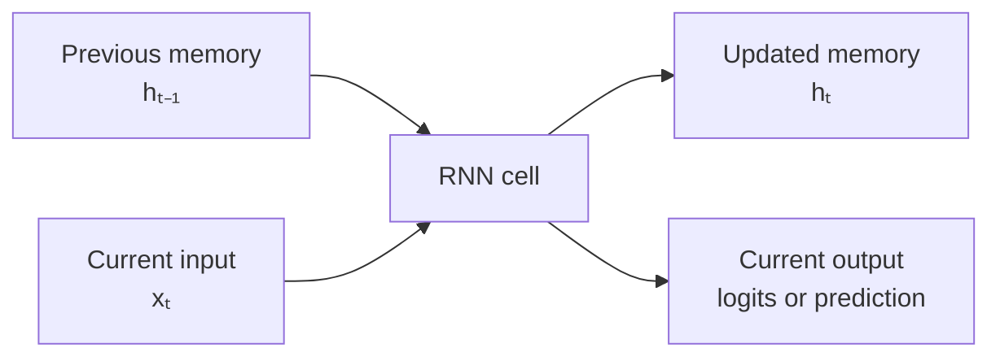

A simplified mathematical view is:

```math
h_t = \tanh(W_x x_t + W_h h_{t-1} + b_h)
```

```math
z_t = W_o h_t + b_o
```

Where:

- `x_t` is the current input vector.
- `h_(t-1)` is the previous hidden state.
- `h_t` is the updated hidden state.
- `z_t` contains output scores, usually called **logits**.
- The `W` values and biases are learned parameters.

You do not need to memorize the formulas yet. The important idea is:

> New memory = a learned combination of the current input and previous memory.

### An RNN unrolled through time

An RNN is usually one reusable cell applied repeatedly, not a completely different network for every token.

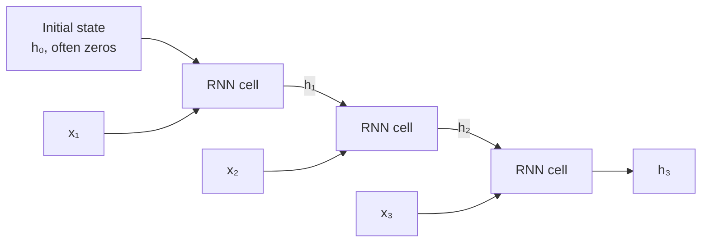

The repeated boxes represent the **same learned operation** reused at each step.

### Analogy: reading with a notepad

Imagine reading a sentence while maintaining a tiny notepad:

1. Read the next word.
2. Update the notepad with what now seems important.
3. Use the notepad to interpret the next word.

The hidden state is that notepad. Because it has limited space, details can be lost as the sequence becomes longer.

---

## 5. Embeddings: converting tokens into useful vectors

Neural networks operate on numbers, not directly on words.

A vocabulary assigns each token an integer ID:

```text
<pad> = 0
<bos> = 1
<eos> = 2
hello = 3
world = 4
```

An **embedding layer** uses the token ID to retrieve a learned dense vector:

```text
Token ID 3 → [0.18, -0.42, 0.71, ...]
```

The embedding is the numeric representation passed into the RNN or LSTM.

```mermaid
flowchart LR
    T[Token<br/>\"hello\"] --> I[Token ID<br/>3]
    I --> E[Embedding lookup]
    E --> V[Dense vector<br/>xₜ]
    V --> R[RNN or LSTM]
```

An embedding layer is therefore best understood as a **learned lookup table** that maps discrete token IDs to continuous vectors.

---

## 6. Why simple RNNs struggle with long-range context

A simple RNN can theoretically pass information through many steps. In practice, training it to preserve important information over long distances is difficult.

During training, gradients are propagated backward through all of the sequence steps. They may:

- Shrink toward zero, called the **vanishing-gradient problem**
- Grow excessively, called the **exploding-gradient problem**

As a result, a simple RNN often emphasizes recent information and loses older context.

A more accurate statement than “RNNs only remember short-term information” is:

> Simple RNNs have difficulty learning reliable long-range dependencies.

Two gated variants were designed to improve this behavior.

### GRU: gated recurrent unit

A GRU has gates that regulate memory:

- **Update gate:** how much previous information should be retained
- **Reset gate:** how much previous information should be ignored while processing the current input

Analogy: editing a running note by deciding what to preserve and what to rewrite.

### LSTM: long short-term memory

An LSTM commonly exposes two state values:

- `h_t`: hidden state, the current working representation
- `c_t`: cell state, a longer-running memory path

Its gates are commonly described as:

- **Forget gate:** what old memory should be removed
- **Input gate:** what new information should be written
- **Output gate:** what part of memory should be exposed as the current hidden state

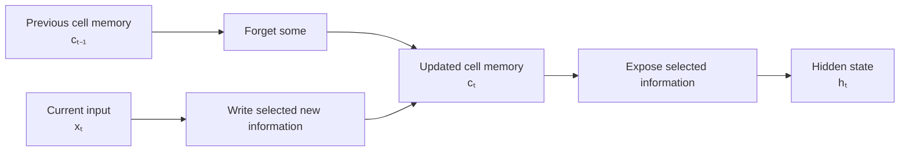

LSTMs and GRUs reduce the long-memory problem; they do not guarantee perfect memory.

---

## 7. Preparing text for model training

Before a model sees a sentence, the text is transformed into tensors.

### Typical preprocessing pipeline

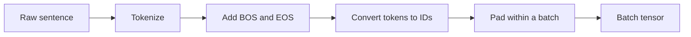

### Tokenization

Split text into model-readable units called **tokens**. A token may be a word, part of a word, punctuation, or another unit.

### Numericalization

Convert every token into its vocabulary ID.

### Special tokens

| Token | Meaning | Purpose |
|---|---|---|
| `<bos>` | Beginning of sequence | Tells the decoder to start generating |
| `<eos>` | End of sequence | Tells the decoder to stop |
| `<pad>` | Padding | Fills unused positions so examples can form a rectangular tensor |
| `<unk>` | Unknown token | Represents an item absent from the vocabulary in older tokenization systems |

Example:

```text
Original:      I am ready
With markers: <bos> I am ready <eos>
Token IDs:     1     19 8  42    2
```

### Why padding is needed

Sequences in a batch may have different lengths:

```text
<bos> hello <eos>
<bos> how are you <eos>
```

A tensor is rectangular, so the shorter sequence is padded:

```text
<bos> hello <eos> <pad> <pad>
<bos> how   are   you   <eos>
```

Important correction:

> PyTorch does not require every batch to contain the same number of examples. It requires each tensor to have a consistent shape. Within a normal padded batch, sequences must therefore be made the same length.

Grouping sentences of similar lengths reduces wasted padding and can make training more efficient.

---

## 8. Encoder–decoder architecture

A classic sequence-to-sequence translation model has two components:

- **Encoder:** reads and summarizes the source sequence
- **Decoder:** uses that summary to generate the target sequence

### High-level flow

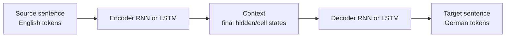

### Analogy: interpreter taking notes

The encoder is like an interpreter listening to a complete sentence and making notes. The decoder then speaks the translated sentence while consulting those notes.

In the simplest architecture, the final encoder state is the only summary passed to the decoder. This creates an **information bottleneck**, especially for long sentences. Later architectures add mechanisms such as attention so the decoder can consult all encoder states, but attention is outside the main scope of these transcripts.

---

## 9. The encoder in detail

For every source token, the encoder:

1. Converts the token ID into an embedding.
2. Feeds the embedding and prior state into the recurrent layer.
3. Produces updated hidden state information.
4. Passes that state to the next time step.

With an LSTM, the encoder carries both hidden and cell states.

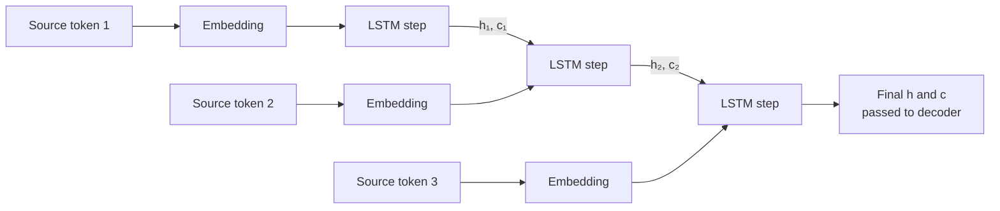

### What the PyTorch encoder returns

A PyTorch LSTM returns:

- `outputs`: a hidden representation for every source time step
- `hidden`: the final hidden state for each recurrent layer
- `cell`: the final cell state for each recurrent layer

In the simple encoder–decoder model from the transcripts, only `hidden` and `cell` are retained. `outputs` are discarded because there is no attention mechanism using them.

### Typical encoder components

```text
Embedding → Dropout → LSTM → final hidden and cell states
```

Common constructor parameters:

| Parameter | Meaning |
|---|---|
| `input_dim` | Source vocabulary size |
| `emb_dim` | Number of values in each embedding vector |
| `hid_dim` | Size of the LSTM hidden and cell states |
| `n_layers` | Number of stacked recurrent layers |
| `dropout` | Probability of dropping selected activations during training |

---

## 10. The decoder in detail

The decoder generates one target token at a time.

At every step it receives:

- The token chosen for the current input
- The previous hidden state
- The previous cell state, for an LSTM

It then produces:

- Updated hidden and cell states
- A score for every token in the target vocabulary

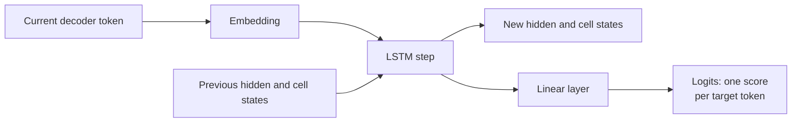

### Typical decoder components

```text
Embedding → Dropout → LSTM → Linear layer → vocabulary logits
```

Common constructor parameters:

| Parameter | Meaning |
|---|---|
| `output_dim` | Target vocabulary size |
| `emb_dim` | Target embedding width |
| `hid_dim` | LSTM hidden/cell-state width |
| `n_layers` | Number of stacked LSTM layers |
| `dropout` | Dropout probability |

### Logits, softmax, and token choice

The final linear layer returns one **logit** per possible target token. A softmax can convert these logits into probabilities.

However, an important PyTorch detail is:

> `nn.CrossEntropyLoss` expects raw logits and internally performs the relevant log-softmax calculation. Do not apply softmax first when feeding values into this loss.

For choosing the largest-scoring token, `argmax(logits)` and `argmax(softmax(logits))` select the same index.

---

## 11. How the full sequence-to-sequence model works

### Encoding phase

The source sentence is processed completely. The final encoder states initialize the decoder.

### Decoding phase

1. Give the decoder `<bos>` as its first token.
2. Produce logits over the target vocabulary.
3. Select the next input token.
4. Feed that token and the updated state into the next decoder step.
5. Repeat until `<eos>` or a maximum length is reached.

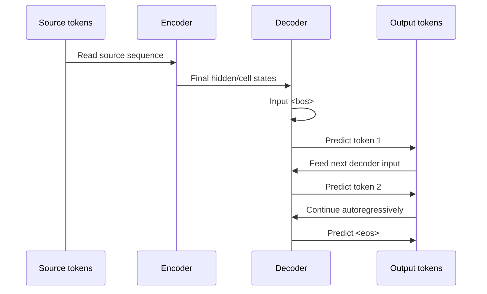

**Autoregressive** means that each newly generated item helps determine the following item.

---

## 12. Teacher forcing

During training, the correct target sentence is known. The decoder can therefore be given either:

- The **correct previous token** from the training target
- Its **own previous prediction**

Using the correct previous token is called **teacher forcing**.

### Example

Correct German target:

```text
<bos> ich bin bereit <eos>
```

Suppose the decoder has just tried to generate the word after `<bos>`.

- With teacher forcing, the next decoder input is the correct token `ich`.
- Without teacher forcing, the next input is whatever the model predicted, perhaps incorrectly.

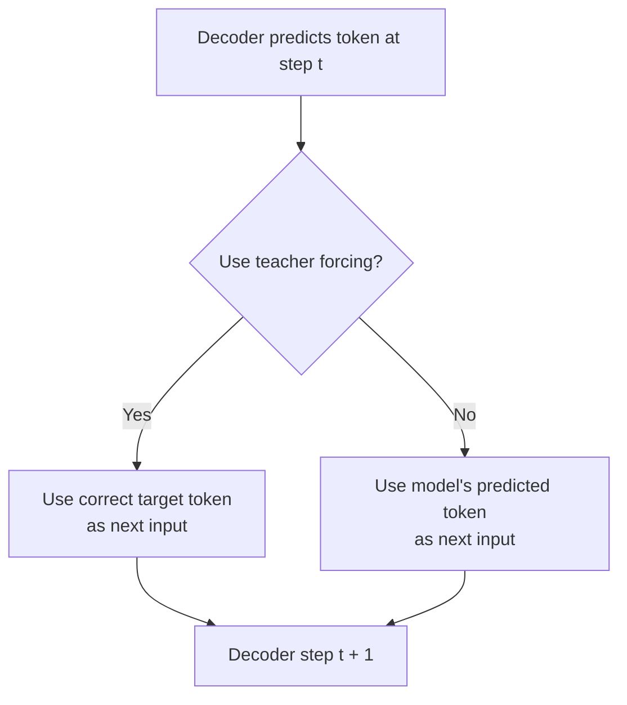

### Why teacher forcing helps

Early in training, the model’s predictions are poor. If every bad prediction becomes the next input, errors compound and training becomes difficult. Teacher forcing keeps the decoder on a useful path often enough to learn the task.

### The trade-off

At real-use time, the correct next token is unavailable. The model must consume its own outputs. Heavy reliance on teacher forcing can therefore create a mismatch between training and inference, often called **exposure bias**.

The `teacher_forcing_ratio` controls how often the correct token is used during training.

---

## 13. Training the model

Training answers this question:

> Given the source sentence and the known correct target sentence, how should the model’s weights change so that the correct target tokens receive higher scores?

### Typical training loop

1. Set the model to training mode with `model.train()`.
2. Move source and target tensors to the chosen device.
3. Clear old gradients.
4. Run the model’s forward pass.
5. Align predictions with the correct target tokens.
6. Calculate cross-entropy loss while ignoring padding.
7. Backpropagate the loss.
8. Optionally clip gradients.
9. Update parameters with the optimizer.
10. Track average loss.

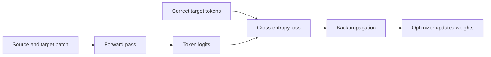

### Why `<bos>` is excluded from the loss

The first decoder input is usually the already-provided `<bos>` token. The model is not expected to predict that starting marker from a previous target token.

Therefore, training commonly compares:

```text
Predictions: outputs[1:]
Targets:     target[1:]
```

The exact axes depend on the code’s tensor layout, but the idea is to skip the starting position.

### Why tensors are reshaped

A typical model output may have shape:

```text
[target_length, batch_size, target_vocabulary_size]
```

Cross-entropy commonly expects:

```text
[number_of_token_predictions, target_vocabulary_size]
```

The output is flattened across time and batch:

```text
[(target_length - 1) × batch_size, target_vocabulary_size]
```

The target is flattened to:

```text
[(target_length - 1) × batch_size]
```

Conceptually, this turns every non-starting target position into one classification example: “Which vocabulary token belongs here?”

### Padding must not count as a real prediction

Loss should normally ignore `<pad>` positions. In PyTorch, this is commonly configured with the padding token ID:

```python
criterion = nn.CrossEntropyLoss(ignore_index=pad_index)
```

Otherwise, the model is rewarded or punished for artificial filler positions.

### Cross-entropy in plain language

At each target position, the model scores every possible word. Cross-entropy penalizes it when the correct word receives too little probability.

The total or average loss combines that penalty across valid target positions and examples.

---

## 14. Evaluation mode

Validation and testing use held-out data to estimate how well the model generalizes.

Typical differences from training:

- Use `model.eval()` rather than `model.train()`.
- Disable gradient tracking with `torch.no_grad()`.
- Do not call backward propagation.
- Do not update model weights.
- Commonly disable teacher forcing to better resemble inference, depending on the evaluation goal.

`model.eval()` changes the behavior of layers such as dropout. It does not itself disable gradient tracking, which is why `torch.no_grad()` is also useful.

---

## 15. Inference: generating a translation

**Inference** means using the trained model to generate an output for a new input.

Unlike training, the correct translation is not available. The decoder must use its own generated token as the next input.

### Greedy translation procedure

1. Tokenize the source sentence.
2. Add source `<bos>` and `<eos>` markers as required by the preprocessing pipeline.
3. Convert tokens to IDs and form the expected tensor shape.
4. Run the encoder to obtain hidden and cell states.
5. Initialize the decoder input with the target `<bos>` token.
6. Run one decoder step.
7. Select the token with the highest logit.
8. Append that token to the output.
9. Feed it back into the decoder.
10. Stop when `<eos>` appears or when the maximum output length is reached.
11. Convert token IDs back into text and remove special tokens.

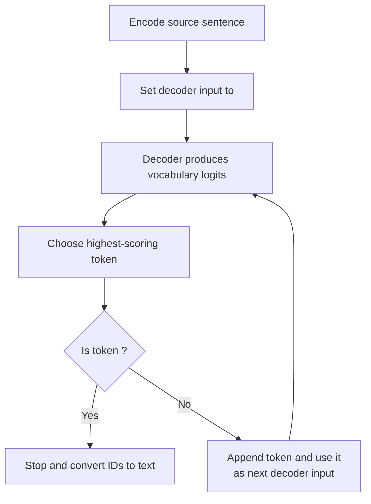

### Why a maximum length is required

A poorly trained model might never emit `<eos>`. A maximum length prevents an infinite generation loop.

### Greedy decoding

Greedy decoding always selects the currently highest-scoring token.

Advantages:

- Simple
- Fast
- Deterministic

Disadvantage:

- The best token at the current step may lead to a worse complete sentence later.

### Top-k sampling

Top-k sampling limits consideration to the `k` highest-scoring tokens and samples among them. It is often used for open-ended text generation because it introduces controlled variety.

For deterministic translation, **beam search** is a more traditional alternative to greedy decoding because it tracks several promising partial translations. Top-k sampling is not automatically better for translation; the appropriate strategy depends on the task.

---

## 16. Training versus inference

This distinction is essential.

| Feature | Training | Inference |
|---|---|---|
| Correct target available? | Yes | No |
| Teacher forcing possible? | Yes | No |
| Gradients calculated? | Yes | No |
| Weights updated? | Yes | No |
| Dropout active? | Usually yes | No |
| Decoder input after `<bos>` | Correct token or model prediction | Model prediction |
| Main goal | Learn parameters | Generate an output |

### Mental model

- **Training:** the learner can sometimes look at the answer key while practicing.
- **Inference:** the learner must answer alone.

---

## 17. A concrete translation walkthrough

Suppose the source sentence is:

```text
I am ready
```

A simplified pipeline looks like this:

### Source preparation

```text
Raw text
→ ["I", "am", "ready"]
→ ["<bos>", "I", "am", "ready", "<eos>"]
→ [1, 19, 8, 42, 2]
```

### Encoder

The encoder reads the IDs through embeddings and LSTM steps. Its final hidden and cell states represent a compressed summary of the source.

### Decoder generation

```text
Input <bos> → predicts "ich"
Input "ich" → predicts "bin"
Input "bin" → predicts "bereit"
Input "bereit" → predicts <eos>
```

### Final postprocessing

```text
["ich", "bin", "bereit", "<eos>"]
→ remove <eos>
→ "ich bin bereit"
```

---

## 18. Simplified PyTorch-shaped pseudocode

The following is conceptual rather than a drop-in implementation.

### Encoder

```python
class Encoder(nn.Module):
    def __init__(self, input_dim, emb_dim, hid_dim, n_layers, dropout):
        super().__init__()
        self.embedding = nn.Embedding(input_dim, emb_dim)
        self.dropout = nn.Dropout(dropout)
        self.lstm = nn.LSTM(emb_dim, hid_dim, n_layers, dropout=dropout)

    def forward(self, source):
        embedded = self.dropout(self.embedding(source))
        _, (hidden, cell) = self.lstm(embedded)
        return hidden, cell
```

### Decoder

```python
class Decoder(nn.Module):
    def __init__(self, output_dim, emb_dim, hid_dim, n_layers, dropout):
        super().__init__()
        self.embedding = nn.Embedding(output_dim, emb_dim)
        self.dropout = nn.Dropout(dropout)
        self.lstm = nn.LSTM(emb_dim, hid_dim, n_layers, dropout=dropout)
        self.output_layer = nn.Linear(hid_dim, output_dim)

    def forward(self, token, hidden, cell):
        token = token.unsqueeze(0)  # Add one-step time dimension.
        embedded = self.dropout(self.embedding(token))
        output, (hidden, cell) = self.lstm(embedded, (hidden, cell))
        logits = self.output_layer(output.squeeze(0))
        return logits, hidden, cell
```

### Sequence-to-sequence forward pass

```python
def forward(source, target, teacher_forcing_ratio):
    hidden, cell = encoder(source)
    decoder_input = target[0]  # Usually <bos> for every sequence.

    for step in range(1, target_length):
        logits, hidden, cell = decoder(decoder_input, hidden, cell)
        outputs[step] = logits

        predicted_token = logits.argmax(dim=1)
        use_teacher = random.random() < teacher_forcing_ratio
        decoder_input = target[step] if use_teacher else predicted_token

    return outputs
```

---

## 19. Transcript wording that needs correction or nuance

The transcripts contain speech-to-text errors and a few oversimplifications. These are the important corrections.

| Transcript idea | Better interpretation |
|---|---|
| “Seek-to-seek” | **Sequence-to-sequence**, often abbreviated **seq2seq** |
| “Summoning the output” | Calculating cross-entropy by comparing predicted logits with correct target token IDs |
| “Set the model to valve” | Set the model to **evaluation mode** with `model.eval()` |
| “Hidden and sell states” | Hidden and **cell** states |
| “PyTorch requires consistent batch sizes” | Tensor dimensions must be rectangular; sequence lengths are padded within a batch |
| “RNNs only remember short-term information” | Simple RNNs struggle to learn long-range dependencies |
| “The encoder is a series of RNNs” | Usually one recurrent layer is **unrolled over time** and applies shared weights at every token |
| “Seq2seq models are harder to train than RNNs” | A seq2seq model may be built from RNNs; the full encoder–decoder training problem is more involved than a simple single-output RNN task |
| “Apply softmax, then calculate cross-entropy” | In PyTorch, pass raw logits directly to `nn.CrossEntropyLoss` |
| “Top-k is more fluent than greedy” | This can help open-ended generation, but translation often uses greedy or beam search depending on requirements |

---

## 20. Common points of confusion

### Is the hidden state the model’s entire memory?

For a simple RNN, it is the primary carried state. For an LSTM, memory is divided between the hidden state and cell state. The model’s learned weights also contain general knowledge learned during training, while the states contain information about the current sequence.

### Is the encoder’s final state the translation?

No. It is a learned numeric summary. The decoder turns that summary into target-language tokens.

### Does the decoder generate all words at once?

In the classic RNN encoder–decoder model, no. It generates one token at a time.

### Why does the decoder need its previous token if it already has a hidden state?

The hidden state summarizes context, while the previous token tells the decoder exactly what was most recently produced. Both help determine the next token.

### Are the repeated RNN boxes separate models?

No. An unrolled diagram shows the same recurrent operation reused at different time steps with shared parameters.

### Does `<eos>` merely pad the sequence?

No. `<eos>` is meaningful and marks completion. `<pad>` is artificial filler used for tensor shape alignment.

### Does lower training loss guarantee good translations?

No. A model may overfit the training set. Validation loss and translation-quality metrics or human evaluation are needed to judge generalization.

---

## 21. The whole system in one diagram

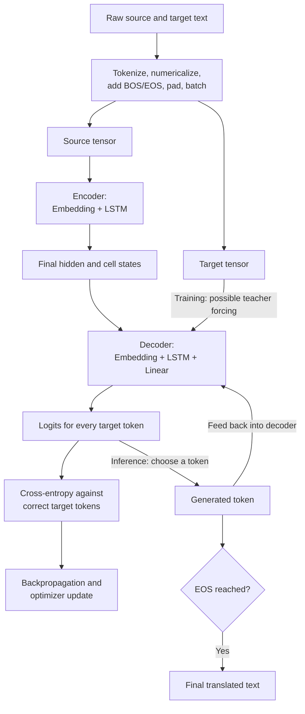

---

## 22. Compact review sheet

### Sequence model

Processes ordered data where earlier elements can affect later ones.

### RNN

Reuses a recurrent cell at every time step and carries a hidden state forward.

### GRU

Uses reset and update gates to regulate hidden-state information.

### LSTM

Uses hidden and cell states plus gates to better preserve useful information over longer spans.

### Embedding

A learned mapping from token IDs to dense vectors.

### Encoder

Reads the source sequence and produces context states.

### Decoder

Generates the target sequence one token at a time.

### Teacher forcing

During training, sometimes supplies the correct previous target token to the decoder.

### Cross-entropy

Measures how poorly the model scores the correct target token at each position.

### Greedy decoding

Chooses the highest-scoring token at every generation step.

### Inference

Runs the trained model without target answers, gradients, or weight updates.

---

## 23. Self-check questions

1. Why can a bag-of-words representation confuse “the man bites the dog” with “the dog bites the man”?
2. What two pieces of information enter a basic RNN at time step `t`?
3. Why can source and target sequence lengths differ?
4. What does an embedding layer return when given a token ID?
5. What information does an LSTM carry that a GRU does not expose separately?
6. Why does a padded batch need the loss function to ignore `<pad>`?
7. What is passed from the encoder to the decoder in the simple model?
8. During teacher forcing, what becomes the decoder’s next input?
9. Why is teacher forcing unavailable during normal inference?
10. Why must an inference loop stop at either `<eos>` or a maximum length?
11. Why should raw logits, rather than softmax probabilities, be passed to PyTorch’s `CrossEntropyLoss`?
12. What is the practical trade-off between greedy decoding and methods that consider multiple candidate sequences?

---

## 24. Final mental model

Think of the model as two collaborators:

1. The **encoder** reads the source sentence and writes a compressed internal note.
2. The **decoder** starts with `<bos>`, reads that note, and writes the translation one token at a time.
3. During training, the decoder is sometimes shown the correct previous token so that it can learn efficiently.
4. During inference, it must rely on its own previous output until it produces `<eos>`.

The most important limitation of this classic design is that one fixed encoder summary must carry the meaning of the entire source sequence. That limitation motivates later ideas such as attention and Transformers.

---

## Source transcripts

- `01-s2s-rnn.txt` — introduction to sequence-to-sequence models, IID, RNNs, GRUs, and LSTMs
- `02-s2s-rnn.txt` — data loading, training, evaluation, and translation inference
- `03-s2s-rnn.txt` — encoder–decoder architecture, PyTorch components, and teacher forcing
