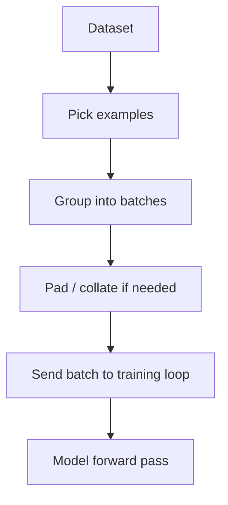
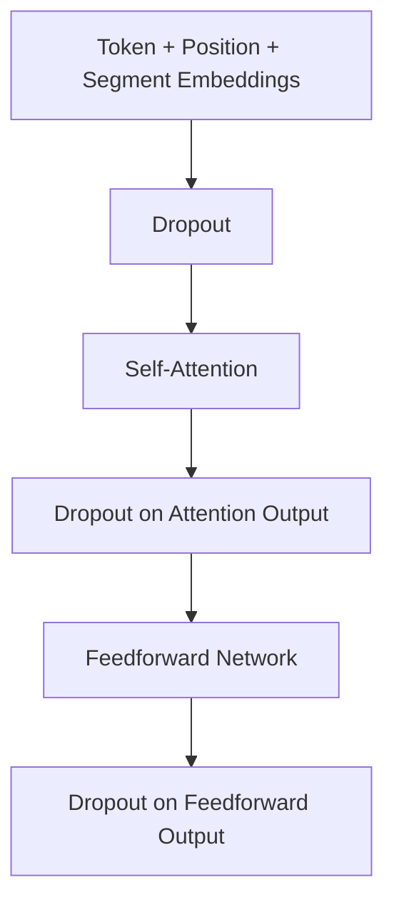
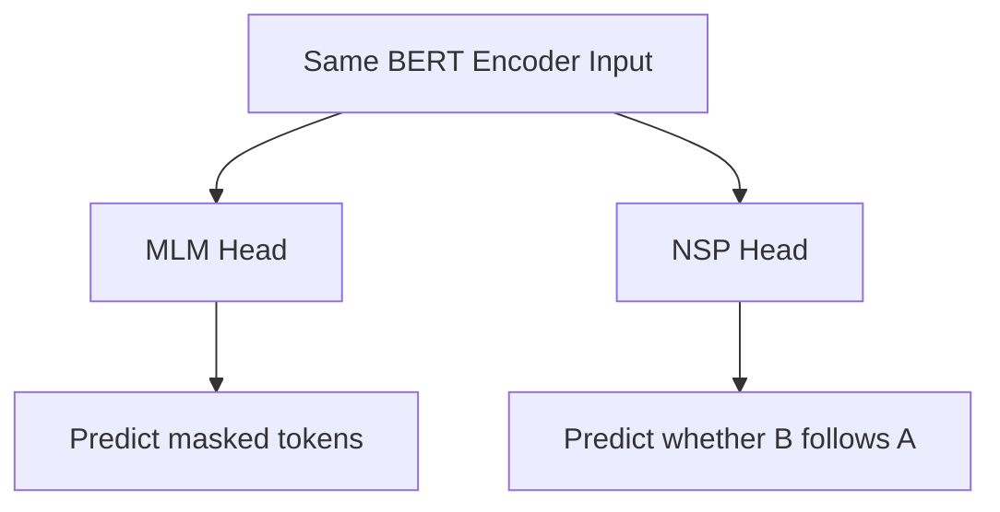

# DataLoader

A **DataLoader** is the thing that feeds data to the model during training or evaluation.

It does **not** usually create the data. It takes an existing dataset and serves it up in model-friendly pieces.

Think of it like a cafeteria worker:

```text
Dataset = all the food in the kitchen
DataLoader = the worker who puts food onto trays
Batch = one tray of food
Model = the person eating one tray at a time
```

In PyTorch, a `DataLoader` usually does four main things:



## Example

Suppose your dataset has 10,000 BERT training examples.

Each example might contain:

```text
input_ids        = token IDs
segment_ids      = sentence A/B labels
attention_mask   = which tokens are real vs padding
mlm_labels       = correct masked-token answers
nsp_label        = whether sentence B follows sentence A
```

The DataLoader groups examples together:

```text
Example 1
Example 2
Example 3
Example 4
```

into a batch:

```text
Batch of 4 examples
```

So instead of the model seeing one example at a time, it sees a batch:

```python
for batch in train_loader:
    input_ids = batch["input_ids"]
    segment_ids = batch["segment_ids"]
    mlm_labels = batch["mlm_labels"]
    nsp_labels = batch["nsp_labels"]

    nsp_logits, mlm_logits = model(input_ids, segment_ids)
```

## Why batching matters

Training one example at a time is usually inefficient.

A batch lets the GPU process many examples in parallel:

```text
Without batch:
1 sequence → model
1 sequence → model
1 sequence → model

With batch:
32 sequences → model
```

That is usually much faster.

## What about different sequence lengths?

This is where the **collate function** matters.

Example sentences:

```text
"The cat slept."              → 4 tokens
"The small black cat slept."  → 6 tokens
```

The model needs them to have the same length inside a batch, so the collate function pads them:

```text
[The, cat, slept, PAD, PAD, PAD]
[The, small, black, cat, slept, PAD]
```

So:

```text
Dataset gives individual examples.
Collate function combines/pads them.
DataLoader delivers the final batch.
```

## Simple PyTorch-shaped example

```python
dataset = BERTCSVDataset("train.csv")

train_loader = DataLoader(
    dataset,
    batch_size=32,
    shuffle=True,
    collate_fn=collate_batch
)

for batch in train_loader:
    input_ids = batch["input_ids"]
    segment_ids = batch["segment_ids"]
    labels = batch["labels"]

    outputs = model(input_ids, segment_ids)
```

## In one sentence

The **DataLoader** is the pipeline that takes examples from your dataset, groups them into batches, optionally shuffles and pads them, and hands each batch to the training loop.

# Dropout

**Dropout** is a regularization trick used during training to make the model less fragile.

In plain terms: during training, dropout randomly “turns off” some neuron outputs so the model cannot rely too heavily on one exact pathway.

Example:

```text
Without dropout:
token representation → uses all dimensions every time

With dropout:
token representation → randomly hides some dimensions during training
```

So if a vector is:

```text
[0.8, -0.2, 1.1, 0.5, -0.7]
```

dropout might temporarily make it:

```text
[0.8,  0.0, 1.1, 0.0, -0.7]
```

The goal is:

```text
Don't memorize one brittle pattern.
Learn a more robust pattern that still works when some signals are missing.
```

During inference/evaluation, dropout is turned **off**. The whole model is used.

---

## Where dropout appears in transformers

In transformer architectures, dropout is commonly used in a few places:



It can be applied to:

1. **Embeddings**
    
2. **Attention weights or attention outputs**
    
3. **Feedforward layer outputs**
    
4. **Residual connections**
    

The purpose is always the same: reduce overfitting.

---

# Why BERT uses segment embeddings

BERT’s input embedding is usually the sum of three things:

```text
final input vector =
token embedding
+ position embedding
+ segment/token-type embedding
```

Example:

```text
[CLS] The dog barked [SEP] It was loud [SEP]
```

BERT also receives segment IDs:

```text
Tokens:      [CLS] The dog barked [SEP] It was loud [SEP]
Segment ID:   0    0   0    0     0    1  1   1    1
```

Segment embeddings tell BERT:

```text
These tokens belong to sentence A.
These tokens belong to sentence B.
```

That obviously helps **NSP**, because NSP asks:

> Does sentence B naturally follow sentence A?

So your question is exactly right:

> Why does MLM need segment encoding?

The answer is:

**MLM itself does not strictly need segment embeddings.**

MLM can work perfectly fine on a single sequence without segment IDs. For example:

```text
The dog [MASK] loudly.
```

BERT can predict:

```text
barked
```

using token context and position information alone.

---

# So why are segment embeddings still used during MLM?

Because in original BERT, MLM and NSP are trained **together on the same input format**.

The model receives sentence pairs like:

```text
[CLS] Sentence A [SEP] Sentence B [SEP]
```

Then it has two jobs at the same time:



So even when computing the MLM loss, the encoder representations were produced using segment embeddings.

Segment embeddings are not “for MLM” in the same direct way they are “for NSP.” They are part of the shared input representation.

---

## Important distinction

Think of it like this:

```text
NSP needs segment embeddings directly.
MLM can use segment embeddings indirectly.
```

For MLM, segment embeddings can still help when the masked token is in a sentence-pair input.

Example:

```text
[CLS] I deposited money at the bank. [SEP]
[MASK] approved my loan. [SEP]
```

Segment IDs help BERT know that the masked token is in sentence B, not sentence A.

A likely prediction:

```text
They
```

or maybe:

```text
The bank
```

depending on tokenization/context.

Another example:

```text
[CLS] The river overflowed near the bank. [SEP]
The [MASK] was muddy. [SEP]
```

The segment boundary helps BERT separate:

```text
sentence A context: river/bank
sentence B context: The [MASK] was muddy
```

So MLM can benefit from segment information because BERT’s self-attention sees both sentences at once.

---

# But modern models often skip NSP/segment embeddings

A key historical note: original BERT used both MLM and NSP. Later work showed NSP was not always necessary, and many encoder-style models changed or removed that objective.

For a pure MLM-only encoder, you could use:

```text
token embedding + position embedding
```

and skip segment embeddings entirely, especially if your data is just single text chunks.

So for a custom mini-BERT doing only MLM, this is reasonable:

```python
x = token_embedding(input_ids) + position_embedding(position_ids)
```

You do **not** need this unless you want sentence-pair awareness:

```python
x = x + segment_embedding(segment_ids)
```

---

# Simple rule

Use segment embeddings when the model needs to distinguish different parts of the input, such as:

```text
sentence A vs sentence B
question vs passage
premise vs hypothesis
document 1 vs document 2
```

They are useful for tasks like:

```text
NSP
question answering
sentence-pair classification
natural language inference
retrieval/reranking
```

They are not inherently required for:

```text
plain MLM over one continuous text chunk
```

---

# PyTorch-shaped pseudocode

With segment embeddings:

```python
class BertEmbedding(nn.Module):
    def __init__(self, vocab_size, d_model, max_len, num_segments=2):
        super().__init__()
        self.token_embed = nn.Embedding(vocab_size, d_model)
        self.position_embed = nn.Embedding(max_len, d_model)
        self.segment_embed = nn.Embedding(num_segments, d_model)
        self.dropout = nn.Dropout(0.1)

    def forward(self, input_ids, segment_ids):
        batch_size, seq_len = input_ids.shape

        position_ids = torch.arange(seq_len, device=input_ids.device)
        position_ids = position_ids.unsqueeze(0).expand(batch_size, seq_len)

        x = (
            self.token_embed(input_ids)
            + self.position_embed(position_ids)
            + self.segment_embed(segment_ids)
        )

        return self.dropout(x)
```

For MLM-only, single-sequence training:

```python
class MlmOnlyEmbedding(nn.Module):
    def __init__(self, vocab_size, d_model, max_len):
        super().__init__()
        self.token_embed = nn.Embedding(vocab_size, d_model)
        self.position_embed = nn.Embedding(max_len, d_model)
        self.dropout = nn.Dropout(0.1)

    def forward(self, input_ids):
        batch_size, seq_len = input_ids.shape

        position_ids = torch.arange(seq_len, device=input_ids.device)
        position_ids = position_ids.unsqueeze(0).expand(batch_size, seq_len)

        x = self.token_embed(input_ids) + self.position_embed(position_ids)

        return self.dropout(x)
```

---

## Best mental model

Segment embeddings are not part of “predicting a masked token” itself.

They are extra labels added to the input so the encoder knows:

```text
This token belongs to region A.
That token belongs to region B.
```

MLM can then use that information **if the masked-token prediction depends on sentence/region boundaries**.

So the clean answer is:

**MLM does not require segment encoding. Original BERT uses segment encoding because MLM and NSP share the same sentence-pair encoder input. Segment embeddings help the encoder represent sentence-pair structure, and MLM receives those enriched representations.**

# MLM Classes

For **masked language modeling (MLM)**, the output layer has:

```text
number of classes = vocabulary size
```

So if the tokenizer vocabulary has **30,000 tokens**, the MLM output layer has **30,000 classes**.

Each class represents one possible token the model could predict for the masked position.

Example:

```text
Input:
The dog [MASK] loudly.

Possible output classes:
0 → [PAD]
1 → [UNK]
2 → the
3 → dog
4 → barked
5 → ran
...
29999 → some_token
```

The model produces one score, called a **logit**, for every token in the vocabulary:

```text
MLM logits shape:
batch_size × sequence_length × vocab_size
```

Example:

```text
batch_size = 8
sequence_length = 128
vocab_size = 30,000

MLM output shape = 8 × 128 × 30,000
```

But the loss is usually calculated only at the masked token positions.

So the simple answer is:

**MLM has one output class per vocabulary token.**