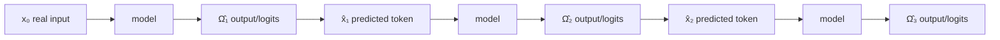
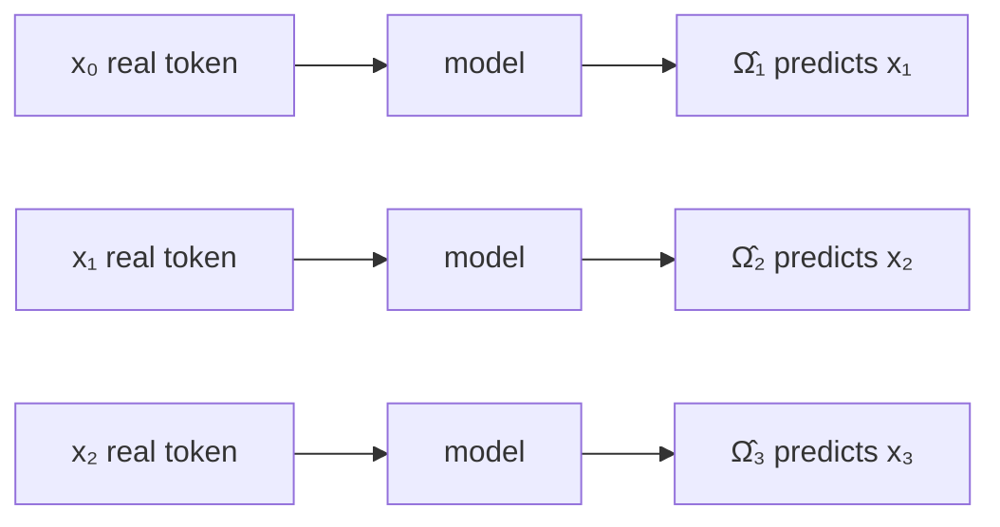

​Fine-tuning is a supervised process that optimizes the initially trained GPT ​model for specific tasks like QA classification.

Reinforcement learning from human feedback, or RLHF, ​represents a fine tuning approach that enhances model performance ​on specific tasks, proving particularly effective in chatbot development.

Decoder - designed to mimic human-like text prediction, ​sequentially predicting each new word in a chain given the context ​of the preceding words.
- principal distinction between encoders and decoders in ​transformer architectures lies in the use of masked self-attention for decoders
- leverage an attention mechanism, ​which at its core involves matrix multiplication.
- during training, the entire sequence is fed into the model
- masking is a critical technique that ensures the model only attends to previous ​tokens in the sequence when making predictions, ​facilitating autoregressive generation
  
masking is employed during inference or prediction as ​well, acting as an intermediary step to preserve the autoregressive property.

## Training Decoder Models

**Without teacher forcing**, the model feeds its **own predicted token** back into itself.

**With teacher forcing**, the model is given the **correct real token** from the training data as the next input, even if its previous prediction was wrong.

---

#### 1. The "no teacher forcing" version

The transcript says:

> initial input `x_0` produces output `Ω̂_1`, which generates predicted token `x̂_1`. This predicted token is then used to generate the following token...

That means the chain looks like this:


So if the model makes a mistake early, the next step receives the mistake as input.

Example target sentence:

```
The cat sat
```

Training sequence:

```
x₀ = Thex₁ = catx₂ = sat
```

Suppose the model sees `The` and predicts:

```
x̂₁ = dog
```

Without teacher forcing, the next input becomes:

```
dog
```

So now the model is trying to continue from:

```
The dog ...
```

even though the real training sequence was:

```
The cat sat
```

The model has drifted away from the correct path.

---

#### 2. The teacher forcing version

With teacher forcing, the model does **not** use its predicted token as the next input during training.

Instead, it uses the actual next token from the training data.



Using the same example:

```
Target: The cat sat
```

Step 1:

```
Input: The
Model predicts: dog
Correct answer: cat
Loss is calculated
```

Step 2 with teacher forcing:

```
Input: cat
Model predicts: ...
Correct answer: sat
Loss is calculated
```

Even though the model incorrectly predicted `dog`, the next input is still the correct token `cat`.

That is the main difference.

---

#### 3. Why teacher forcing helps

Teacher forcing keeps the model aligned with the real sequence.

Without teacher forcing:

```
The → model predicts dog → model continues from dog
```

With teacher forcing:

```
The → model predicts dog → loss is calculated → next input is cat anyway
```

So teacher forcing says:

> I will judge your prediction, but I will not let your mistake corrupt the next training step.

That makes training more stable and efficient.

---

#### 4. Important correction for decoder-only transformers

For modern decoder-only transformers, this is often handled in parallel, not literally one token at a time.

Given:

```
The cat sat
```

The model receives something like:

```
Input:  The cat
Target: cat sat
```

Or more generally:

```
Input:  x₀ x₁ x₂ x₃
Target: x₁ x₂ x₃ x₄
```

The model predicts the next token at every position:

```
x₀ → predict x₁
x₁ → predict x₂
x₂ → predict x₃
x₃ → predict x₄
```

This is teacher forcing because the model is conditioned on the **real previous tokens**, not tokens it generated itself.

---

#### 5. Training vs inference

This is the cleanest way to separate the two ideas:

|Phase|Next input comes from|
|---|---|
|**Training with teacher forcing**|The real previous token from the dataset|
|**Inference / generation**|The model’s own previous prediction|

During training:

```
The cat sat
```

The model gets the real prefix:

```
The cat
```

and learns to predict:

```
cat sat
```

During inference:

```
The
```

The model predicts:

```
cat
```

Then that prediction becomes the next input:

```
The cat
```

Then it predicts:

```
sat
```

So generation really does feed predictions back in. Training usually does not.

---

#### 6. The simplest summary

Teacher forcing changes this:

```
model prediction → next model input
```

into this:

```
real training token → next model input
```

The model still makes predictions.  
The loss is still computed from those predictions.  
But the next input during training comes from the correct sequence, not from the model’s possibly-wrong guess.

### Causal Attention Masking
(course is lacking, actually skips a significant section while discussing)

