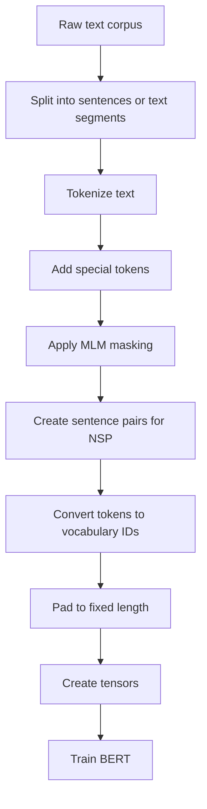
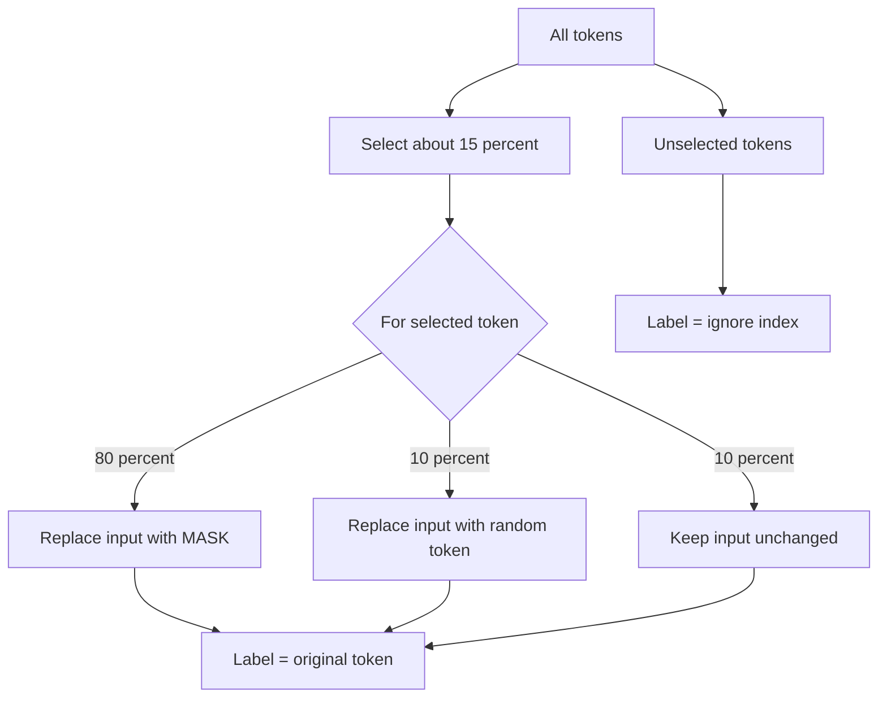
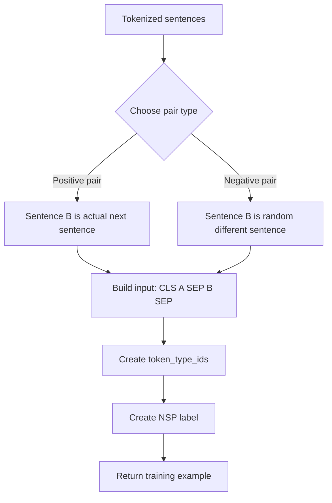
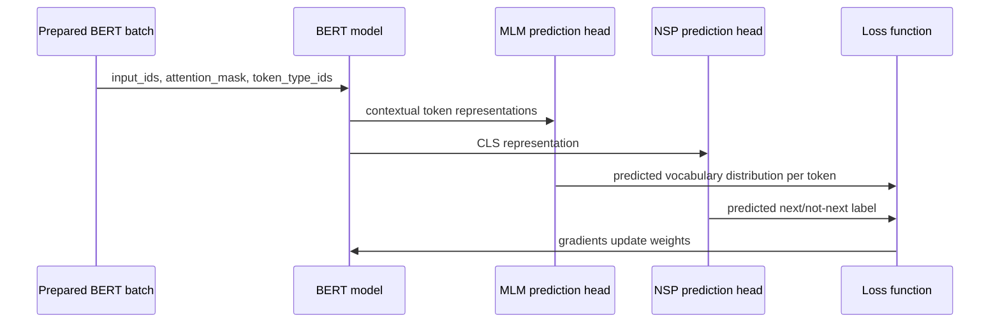

# Beginner Notes: Preparing Data for BERT with PyTorch

Source transcript: `subtitle.txt`

## 1. What this lesson is about

This transcript explains how text is turned into training examples for **BERT**.

BERT is usually trained with two pretraining tasks:

1. **Masked Language Modeling (MLM)**  
   Hide some tokens and ask the model to predict the original hidden tokens.

2. **Next Sentence Prediction (NSP)**  
   Give BERT two sentence-like segments and ask whether the second segment really follows the first.

In plain English:

> BERT learns by reading text with some words hidden and by checking whether two pieces of text belong together.

---

## 2. Corrected transcript terminology

The transcript is understandable, but a few parts need correction or clarification.

| Transcript wording / issue | Better wording | Why it matters |
|---|---|---|
| “PyTorch pipeline with two nodes” | Probably “PyTorch pipeline with two steps” | The process is tokenization, vocabulary/numericalization, masking, pairing, padding, and tensor conversion. |
| “basic English model” tokenizer | `basic_english` tokenizer | This is a simple tokenizer, not the real BERT tokenizer. |
| “actual BERT uses word piece tokenization” | Actual BERT uses **WordPiece tokenization** | BERT breaks uncommon words into subword pieces. |
| `CLS`, `SEP`, `MASK`, etc. | `[CLS]`, `[SEP]`, `[MASK]`, `[PAD]`, `[UNK]` | BERT special tokens are usually written with brackets. |
| “pad label” for unchanged MLM tokens | Use an **ignore label**, often `-100` in PyTorch | Loss should only be computed for selected masked-token positions. |
| “50% chance for each option” | Original BERT MLM uses **80 / 10 / 10** after selecting 15% of tokens | This is the standard BERT masking strategy. |
| “label is set to a random token” | Label should be the **original token**, even if input is replaced by a random token | The model must predict what was originally there. |
| “PyTorch sensors” | **PyTorch tensors** | A tensor is the numeric array object PyTorch trains on. |
| Segment labels `1` and `2` | Common BERT `token_type_ids` use `0` and `1` | Segment IDs tell BERT which sentence/segment each token belongs to. |
| Missing mention of attention masks | Add **attention_mask** | BERT needs to know which tokens are real and which are padding. |

---

## 3. Big picture: how raw text becomes BERT training data

Imagine we start with raw text:

```text
The sun sets behind the distant mountains.
The sky turns orange.
People walk home.
```

BERT cannot train directly on raw text. It needs numbers.

The pipeline is roughly:



Layman’s version:

> Raw text is like a book. BERT needs the book chopped into pieces, some words covered up, and every word converted into a number.

---

## 4. Tokenization

### What tokenization means

**Tokenization** means splitting text into smaller pieces called **tokens**.

Simple tokenizer example:

```text
"The sun sets."
```

might become:

```text
["the", "sun", "sets", "."]
```

Actual BERT uses **WordPiece**, so a word might be split into subwords:

```text
"unhappiness"
```

could become something like:

```text
["un", "##happiness"]
```

The exact split depends on the tokenizer vocabulary.

### Why WordPiece exists

WordPiece helps BERT handle rare words.

Instead of needing every possible word in the vocabulary, BERT can build unusual words from smaller pieces.

Analogy:

> WordPiece is like using LEGO blocks. You do not need a separate toy for every object; you can build many objects from reusable pieces.

---

## 5. Vocabulary and numericalization

A **vocabulary** maps tokens to integer IDs.

Example:

| Token | ID |
|---|---:|
| `[PAD]` | 0 |
| `[CLS]` | 1 |
| `[SEP]` | 2 |
| `[MASK]` | 3 |
| `[UNK]` | 4 |
| `the` | 5 |
| `sun` | 6 |
| `sets` | 7 |

So this token sequence:

```text
["[CLS]", "the", "sun", "sets", ".", "[SEP]"]
```

might become:

```text
[1, 5, 6, 7, 8, 2]
```

BERT trains on numbers, not strings.

---

## 6. Special tokens

BERT uses special tokens to structure the input.

| Special token | Meaning |
|---|---|
| `[PAD]` | Padding token used to make sequences the same length |
| `[CLS]` | Classification token placed at the beginning |
| `[SEP]` | Separator between segments or at the end of a segment |
| `[MASK]` | Token used to hide a word for MLM |
| `[UNK]` | Unknown token for text not found in the vocabulary |

Example sentence pair:

```text
[CLS] the sun sets . [SEP] the sky turns orange . [SEP]
```

---

## 7. Masked Language Modeling, or MLM

### What MLM does

In MLM, BERT sees a sentence with some tokens changed and must predict the original tokens.

Example original sentence:

```text
the sun sets behind the mountains
```

BERT input:

```text
the sun [MASK] behind the mountains
```

Target label:

```text
sets
```

BERT learns:

> Given the surrounding words, the missing word is probably “sets.”

---

## 8. Correct BERT MLM masking strategy

The original BERT strategy is:

1. Select about **15% of tokens** for prediction.
2. For those selected tokens:
   - 80% become `[MASK]`
   - 10% become a random token
   - 10% stay unchanged
3. The label is always the **original token** for selected positions.
4. Non-selected positions are ignored by the MLM loss.



### Why not mask every word?

If every word were masked, BERT would have almost no context.

Bad:

```text
[MASK] [MASK] [MASK] [MASK]
```

Good:

```text
the [MASK] sets behind the mountains
```

BERT needs surrounding words to learn meaning.

---

## 9. MLM example

Original tokens:

```text
["the", "sun", "sets", "behind", "the", "distant", "mountains", "."]
```

Suppose BERT selects `sets` and `distant`.

One possible MLM result:

| Position | Original token | BERT input token | MLM label |
|---:|---|---|---|
| 0 | the | the | ignore |
| 1 | sun | sun | ignore |
| 2 | sets | `[MASK]` | sets |
| 3 | behind | behind | ignore |
| 4 | the | the | ignore |
| 5 | distant | random token, e.g. `human` | distant |
| 6 | mountains | mountains | ignore |
| 7 | . | . | ignore |

Important correction:

> Even if `distant` is replaced by random token `human`, the label should still be `distant`, because BERT is trying to recover the original token.

In PyTorch, the ignore label is often `-100`, because `torch.nn.CrossEntropyLoss` ignores targets with `ignore_index=-100`.

---

## 10. PyTorch-shaped pseudocode for MLM

This is not production code. It is intentionally shaped like PyTorch code to show the idea.

```python
import random
import torch

PAD_ID = 0
CLS_ID = 1
SEP_ID = 2
MASK_ID = 3
UNK_ID = 4
IGNORE_INDEX = -100

def apply_mlm_masking(input_ids, vocab_size, mask_prob=0.15):
    """
    input_ids: list[int]
    returns:
        masked_input_ids: list[int]
        mlm_labels: list[int]
    """
    masked_input_ids = input_ids.copy()
    mlm_labels = [IGNORE_INDEX] * len(input_ids)

    special_ids = {PAD_ID, CLS_ID, SEP_ID}

    for i, token_id in enumerate(input_ids):
        if token_id in special_ids:
            continue

        if random.random() < mask_prob:
            # Always predict the original token.
            mlm_labels[i] = token_id

            r = random.random()

            if r < 0.80:
                masked_input_ids[i] = MASK_ID
            elif r < 0.90:
                masked_input_ids[i] = random.randint(0, vocab_size - 1)
            else:
                # Keep unchanged.
                masked_input_ids[i] = token_id

    return masked_input_ids, mlm_labels
```

---

## 11. Next Sentence Prediction, or NSP

### What NSP does

NSP gives BERT two text segments:

```text
Sentence A: the sun sets behind the mountains.
Sentence B: the sky turns orange.
```

Then BERT predicts:

```text
Is Sentence B the real next sentence after Sentence A?
```

The label is usually:

| Label | Meaning |
|---:|---|
| `1` | Sentence B follows Sentence A |
| `0` | Sentence B does not follow Sentence A |

### NSP example

Positive example:

```text
A: the sun sets behind the mountains.
B: the sky turns orange.
label: 1
```

Negative example:

```text
A: the sun sets behind the mountains.
B: a programmer fixed a bug.
label: 0
```

---

## 12. BERT input format for sentence pairs

For NSP, BERT receives both segments in one sequence.

```text
[CLS] sentence A tokens [SEP] sentence B tokens [SEP]
```

Example:

```text
[CLS] the sun sets . [SEP] the sky turns orange . [SEP]
```

BERT also receives `token_type_ids`, sometimes called segment IDs.

Typical segment IDs:

```text
tokens:         [CLS] the sun sets . [SEP] the sky turns orange . [SEP]
token_type_ids:   0   0   0    0  0   0    1   1    1     1     1   1
```

Meaning:

| Segment ID | Meaning |
|---:|---|
| `0` | Token belongs to sentence/segment A |
| `1` | Token belongs to sentence/segment B |

Some teaching examples use `1` and `2`; however, common Hugging Face / BERT convention is `0` and `1`.

---

## 13. NSP preparation diagram



---

## 14. PyTorch-shaped pseudocode for NSP

```python
def make_nsp_example(sentences, i):
    """
    sentences: list[list[int]]
    i: index of sentence A

    returns:
        tokens: list[int]
        token_type_ids: list[int]
        is_next: int
    """
    sentence_a = sentences[i]

    if random.random() < 0.5 and i + 1 < len(sentences):
        # Positive example.
        sentence_b = sentences[i + 1]
        is_next = 1
    else:
        # Negative example.
        random_index = random.randrange(len(sentences))
        while random_index == i or random_index == i + 1:
            random_index = random.randrange(len(sentences))

        sentence_b = sentences[random_index]
        is_next = 0

    tokens = (
        [CLS_ID]
        + sentence_a
        + [SEP_ID]
        + sentence_b
        + [SEP_ID]
    )

    token_type_ids = (
        [0] * (1 + len(sentence_a) + 1)
        + [1] * (len(sentence_b) + 1)
    )

    return tokens, token_type_ids, is_next
```

---

## 15. Padding

Neural networks usually train in batches.

A batch requires same-shaped tensors. That means all examples in the batch need the same length.

Example before padding:

```text
Example 1: [CLS] he runs [SEP]
Example 2: [CLS] the sun sets [SEP]
```

Different lengths:

```text
Example 1 length = 4
Example 2 length = 5
```

After padding to length 6:

```text
Example 1: [CLS] he runs [SEP] [PAD] [PAD]
Example 2: [CLS] the sun sets [SEP] [PAD]
```

Numerically:

```text
Example 1: [1, 33, 45, 2, 0, 0]
Example 2: [1, 5, 6, 7, 2, 0]
```

---

## 16. Attention masks

The transcript discusses padding but does not emphasize **attention masks**.

An attention mask tells BERT which positions are real tokens and which are padding.

Example:

```text
input_ids:      [1, 33, 45, 2, 0, 0]
attention_mask: [1,  1,  1, 1, 0, 0]
```

Meaning:

| Attention mask value | Meaning |
|---:|---|
| `1` | Real token |
| `0` | Padding token; ignore it |

Without an attention mask, BERT may accidentally pay attention to padding tokens.

---

## 17. Final BERT training fields

A BERT training example usually includes these fields:

| Field | What it contains |
|---|---|
| `input_ids` | Token IDs, including `[CLS]`, `[SEP]`, `[MASK]`, and `[PAD]` |
| `attention_mask` | `1` for real tokens, `0` for padding |
| `token_type_ids` | Segment IDs: `0` for sentence A, `1` for sentence B |
| `mlm_labels` | Original token IDs for selected MLM positions, ignore index elsewhere |
| `next_sentence_label` | `1` if B follows A, `0` otherwise |

---

## 18. Full example

Original text:

```text
Sentence A: the sun sets.
Sentence B: the sky glows.
```

Tokenized:

```text
A = ["the", "sun", "sets", "."]
B = ["the", "sky", "glows", "."]
```

Add special tokens:

```text
[CLS] the sun sets . [SEP] the sky glows . [SEP]
```

Suppose MLM masks `sets`:

```text
input tokens:
[CLS] the sun [MASK] . [SEP] the sky glows . [SEP]
```

MLM labels:

```text
ignore ignore ignore sets ignore ignore ignore ignore ignore ignore ignore
```

Token type IDs:

```text
0      0   0   0      0 0     1   1   1     1 1
```

Attention mask:

```text
1      1   1   1      1 1     1   1   1     1 1
```

NSP label:

```text
1
```

Because sentence B really follows sentence A.

---

## 19. Final preparation diagram


---

## 20. BERT data example as tensors

Conceptual tensor batch:

```python
batch = {
    "input_ids": torch.tensor([
        [1, 5, 6, 3, 8, 2, 5, 9, 10, 8, 2, 0]
    ]),

    "attention_mask": torch.tensor([
        [1, 1, 1, 1, 1, 1, 1, 1,  1, 1, 1, 0]
    ]),

    "token_type_ids": torch.tensor([
        [0, 0, 0, 0, 0, 0, 1, 1,  1, 1, 1, 0]
    ]),

    "mlm_labels": torch.tensor([
        [-100, -100, -100, 7, -100, -100, -100, -100, -100, -100, -100, -100]
    ]),

    "next_sentence_label": torch.tensor([1])
}
```

Notice:

- `input_ids` contains `[MASK]` ID `3`.
- `mlm_labels` contains the original token ID only at the masked position.
- Padding appears as `0`.
- The attention mask ignores padding.
- The NSP label says whether sentence B follows sentence A.

---

## 21. Comparison: simplified transcript version vs standard BERT version

| Topic | Simplified transcript idea | Standard BERT idea |
|---|---|---|
| Tokenizer | Basic English tokenizer | WordPiece tokenizer |
| MLM selection rate | Not clearly stated | Select 15% of tokens |
| MLM replacement strategy | Described as multiple random choices | 80% `[MASK]`, 10% random token, 10% unchanged |
| MLM target for random replacement | Transcript implies random token can become label | Label should be the original token |
| Non-masked labels | PAD label | Ignore index, often `-100` |
| Segment labels | `1`, `2`, and `0` for padding | Usually `0`, `1`, and attention mask handles padding |
| Final object | “sensors” | tensors |

---

## 22. Why BERT needs all these pieces

Think of BERT training like a worksheet.

| BERT data piece | Worksheet analogy |
|---|---|
| `input_ids` | The worksheet text |
| `[MASK]` | A blank space to fill in |
| `mlm_labels` | The answer key for blanks |
| `token_type_ids` | Labels showing paragraph A vs paragraph B |
| `attention_mask` | Marks which parts of the page are real text |
| `next_sentence_label` | Answer key for “does paragraph B follow paragraph A?” |

---

## 23. Common beginner confusion

### “Are labels created for every token?”

Technically yes, there is usually a label position for every input token.

But most positions are ignored.

Example:

```text
input:      the sun [MASK] behind mountains
labels:     -100 -100 sets -100   -100
```

Only the `[MASK]` position contributes to MLM loss.

---

### “Why keep 10% of selected tokens unchanged?”

This prevents BERT from assuming that prediction is only needed when it sees `[MASK]`.

Sometimes BERT must predict a token even though the token still appears in the input.

This makes pretraining less artificial.

---

### “Why replace 10% with a random token?”

This teaches BERT to handle corrupted or unexpected tokens and still infer the original meaning from context.

Example:

```text
the sun pizza behind the mountains
```

BERT should learn that `pizza` probably does not fit there.

---

### “Does NSP always exist in modern BERT-style models?”

No.

Original BERT used NSP, but later models and training recipes sometimes remove it or replace it with other objectives.

For this transcript, though, NSP is part of the lesson.

---

## 24. Mini implementation sketch

Here is the simplified shape of a custom dataset.

```python
from torch.utils.data import Dataset

class BertPretrainingDataset(Dataset):
    def __init__(self, tokenized_sentences, vocab_size, max_length):
        self.sentences = tokenized_sentences
        self.vocab_size = vocab_size
        self.max_length = max_length

    def __len__(self):
        return len(self.sentences) - 1

    def __getitem__(self, index):
        input_ids, token_type_ids, is_next = make_nsp_example(
            self.sentences,
            index
        )

        input_ids, mlm_labels = apply_mlm_masking(
            input_ids,
            vocab_size=self.vocab_size
        )

        attention_mask = [1] * len(input_ids)

        input_ids = pad_to_length(input_ids, self.max_length, PAD_ID)
        token_type_ids = pad_to_length(token_type_ids, self.max_length, 0)
        attention_mask = pad_to_length(attention_mask, self.max_length, 0)
        mlm_labels = pad_to_length(mlm_labels, self.max_length, IGNORE_INDEX)

        return {
            "input_ids": torch.tensor(input_ids),
            "attention_mask": torch.tensor(attention_mask),
            "token_type_ids": torch.tensor(token_type_ids),
            "mlm_labels": torch.tensor(mlm_labels),
            "next_sentence_label": torch.tensor(is_next),
        }
```

Helper function:

```python
def pad_to_length(values, max_length, pad_value):
    values = values[:max_length]
    padding_needed = max_length - len(values)
    return values + [pad_value] * padding_needed
```

---

## 25. What happens during training



BERT makes two kinds of predictions:

1. Predict masked tokens.
2. Predict whether sentence B follows sentence A.

The two losses can be combined during training.

---

## 26. Simple mental model

BERT data preparation answers five questions:

1. **What are the tokens?**  
   `input_ids`

2. **Which tokens are real?**  
   `attention_mask`

3. **Which segment does each token belong to?**  
   `token_type_ids`

4. **Which hidden words should BERT predict?**  
   `mlm_labels`

5. **Do these two segments belong together?**  
   `next_sentence_label`

---

## 27. Self-check questions

### Basic

1. What does tokenization do?
2. What does `[MASK]` mean?
3. Why does BERT need `[CLS]`?
4. What is `[SEP]` used for?
5. Why do batches need padding?

### Intermediate

6. In standard BERT MLM, what percentage of tokens are selected for prediction?
7. Of the selected tokens, what percentage are replaced with `[MASK]`?
8. If a token is replaced by a random token, what should the MLM label be?
9. Why do unselected tokens usually use an ignore label like `-100`?
10. What does `attention_mask` do?

### Applied

11. Given this input:

    ```text
    [CLS] the dog [MASK] fast [SEP]
    ```

    and the original sentence was:

    ```text
    the dog runs fast
    ```

    What should the MLM label be at the `[MASK]` position?

12. For this pair:

    ```text
    A: The coffee spilled.
    B: I wiped the table.
    ```

    Is this likely a positive NSP example or a negative NSP example?

13. For this pair:

    ```text
    A: The coffee spilled.
    B: The moon has craters.
    ```

    Is this likely a positive NSP example or a negative NSP example?

14. Why is this attention mask wrong?

    ```text
    input_ids:      [1, 5, 6, 2, 0, 0]
    attention_mask: [1, 1, 1, 1, 1, 1]
    ```

15. Why might real BERT tokenization produce more tokens than a simple whitespace tokenizer?

---

## 28. Answer key

1. Tokenization splits text into tokens.
2. `[MASK]` marks a token BERT should predict.
3. `[CLS]` gives BERT a special starting token whose final representation can be used for classification tasks.
4. `[SEP]` separates segments or marks the end of a segment.
5. Padding makes all examples in a batch the same length.
6. About 15%.
7. 80%.
8. The original token, not the random replacement.
9. Because the MLM loss should only train on selected prediction positions.
10. It tells BERT which positions are real tokens and which are padding.
11. `runs`.
12. Likely positive.
13. Likely negative.
14. Padding positions should have attention mask value `0`, not `1`.
15. WordPiece can split one word into multiple subword tokens.

---

## 29. Key takeaway

BERT data preparation is not just “turn text into numbers.”

It creates a structured training puzzle:

```text
Input text + hidden tokens + segment IDs + padding masks + answer labels
```

The model learns by solving that puzzle millions or billions of times.
