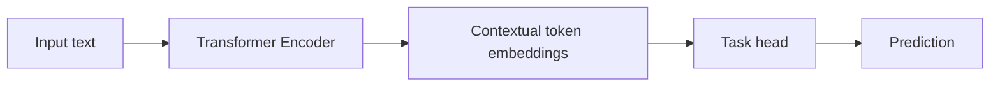
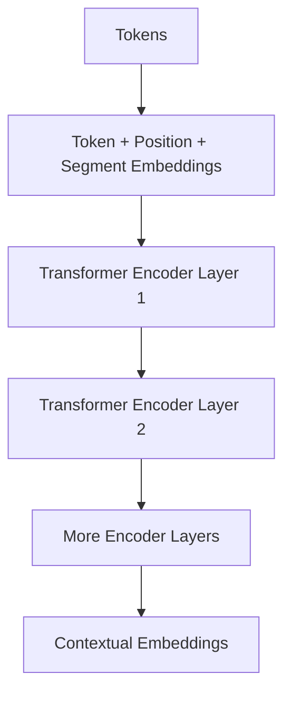
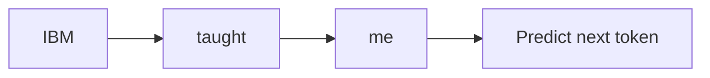
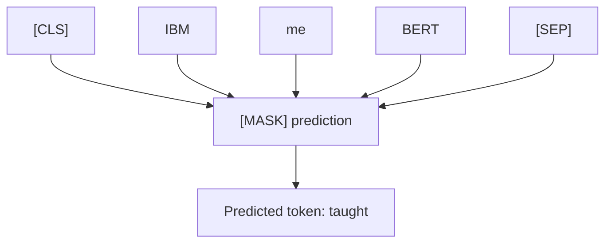
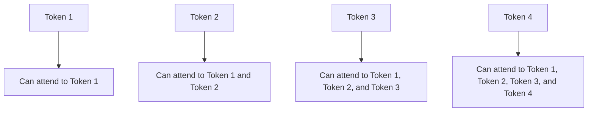
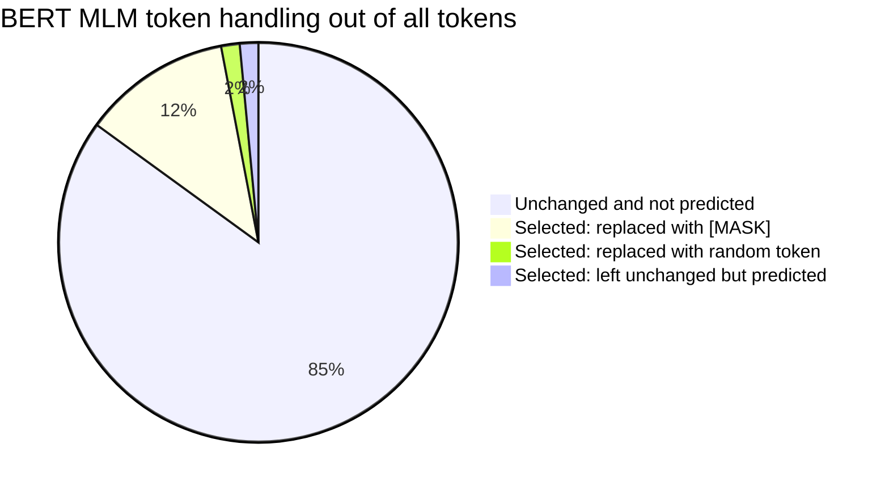
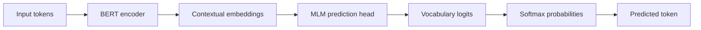
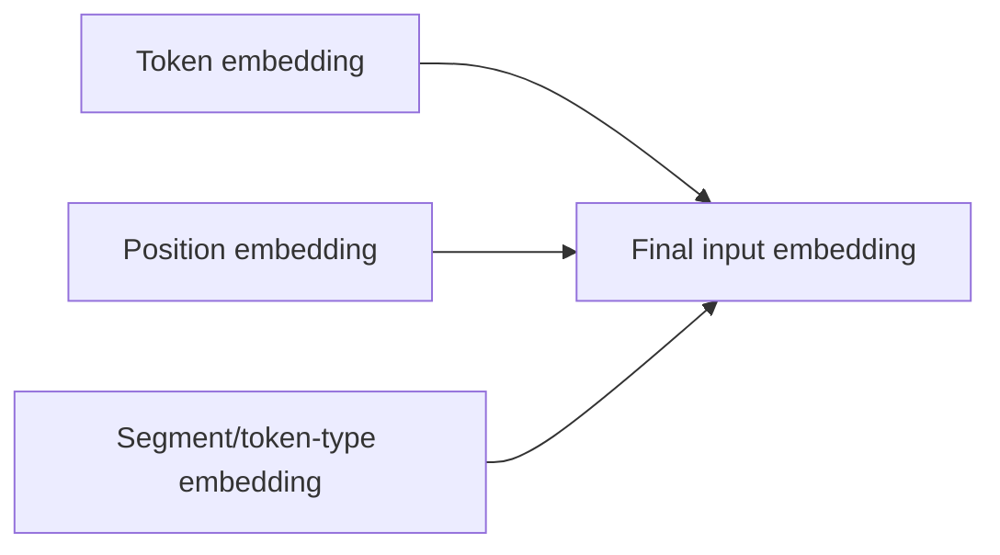
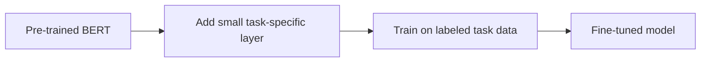

# BERT Encoder Models and Masked Language Modeling — Beginner-Friendly Notes

## 1. Big picture

This transcript explains **BERT**, an **encoder-only Transformer model**, and how it is trained using **Masked Language Modeling**, usually shortened to **MLM**.

In simple terms:

> BERT learns by reading a sentence with some words hidden and trying to guess the missing words using the words on both the left and right side.

Example:

```text
The farmers cultivate the [MASK] to grow crops.
```

BERT can look at the whole sentence:

```text
The farmers cultivate the ____ to grow crops.
```

A likely prediction is:

```text
land
```

That is different from GPT-style decoder models, which usually predict the next token using only the previous tokens.

---

## 2. Corrected transcript terminology

The transcript is mostly correct, but a few phrases need cleanup.

| Transcript phrase | Better wording | Why |
|---|---|---|
| “Bert” | **BERT** | BERT is usually written in all caps. |
| “Pre training” | **pre-training** | Standard spelling. |
| “CL's” | **`[CLS]` token** | BERT uses a special classification token called `[CLS]`. |
| “SEP” | **`[SEP]` token** | BERT uses `[SEP]` to separate sequences. |
| “MASK” | **`[MASK]` token** | BERT uses `[MASK]` for masked language modeling. |
| “known word denoted by token MASK” | **hidden or masked word represented by `[MASK]`** | The model is trying to recover the original word. |
| “taut” | likely **taught** | In the example “IBM [MASK] me BERT,” the intended word is probably “taught.” |
| “BERTS architecture” | **BERT’s architecture** | Possessive form. |
| “And decoder models like GPT causal attention…” | **In decoder models like GPT, causal attention…** | Grammar correction. |
| “OS for active attention units” | **O’s for visible/allowed attention positions** | Usually diagrams mark allowed attention with `O` and blocked attention with `X`. |
| “15% of input words” | **15% of input tokens** | Models operate on tokens, not always whole words. |

---

## 3. What is BERT?

**BERT** stands for:

```text
Bidirectional Encoder Representations from Transformers
```

Break it down:

| Part | Meaning |
|---|---|
| **Bidirectional** | It reads context from both the left and right side. |
| **Encoder** | It uses the encoder part of the Transformer architecture. |
| **Representations** | It creates useful vector meanings for tokens. |
| **Transformers** | It is built from Transformer layers using attention. |

Layman’s explanation:

> BERT is like a reader who sees the whole sentence at once and builds an understanding of every word based on the full surrounding context.

---

## 4. Encoder-only architecture

The original Transformer has two major parts:



BERT uses only the **encoder** side:



Each output vector is a **contextual embedding**.

That means the vector for a word changes depending on the sentence.

Example:

```text
I deposited money at the bank.
I sat near the river bank.
```

The word `bank` has different meanings in those two sentences. BERT creates different contextual embeddings for each case.

---

## 5. Why BERT is not usually used like GPT

BERT and GPT are both Transformer-based, but they are trained differently.

| Feature | BERT-style encoder model | GPT-style decoder model |
|---|---|---|
| Main training style | Masked Language Modeling | Next-token prediction |
| Attention direction | Looks left and right | Looks left only during generation |
| Common use | Understanding text | Generating text |
| Example tasks | Classification, search, question answering, sentiment analysis | Chat, completion, story writing, code generation |
| Can see future tokens during training? | Yes, for unmasked tokens | No, causal mask blocks future tokens |

Simple analogy:

> GPT is like someone writing one word at a time, only seeing what they already wrote.  
> BERT is like someone reading a whole sentence with a blank in the middle and filling in the blank.

---

## 6. Autoregressive prediction vs BERT prediction

### GPT-style autoregressive model

Given:

```text
IBM taught me
```

GPT predicts the next token after seeing only the previous tokens:



It cannot look ahead at future tokens while predicting the next token.

### BERT-style masked prediction

Given:

```text
[CLS] IBM [MASK] me BERT [SEP]
```

BERT can use both sides:



BERT sees:

```text
IBM ____ me BERT
```

So it can infer:

```text
IBM taught me BERT
```

---

## 7. What does “bidirectional” mean?

**Bidirectional** means BERT uses context from both directions.

For this sentence:

```text
The farmers cultivate the [MASK] to grow crops.
```

BERT can use the left context:

```text
The farmers cultivate the
```

And the right context:

```text
to grow crops
```

Together, these suggest the missing word might be:

```text
land
soil
field
```

A decoder model like GPT would normally only see:

```text
The farmers cultivate the
```

So it has less context for that exact prediction.

---

## 8. Attention masking: BERT vs GPT

### GPT: causal attention

GPT uses **causal attention**, meaning each token can only attend to previous tokens and itself.



Matrix view:

| Predicting token | Token 1 | Token 2 | Token 3 | Token 4 |
|---|---:|---:|---:|---:|
| Token 1 | O | X | X | X |
| Token 2 | O | O | X | X |
| Token 3 | O | O | O | X |
| Token 4 | O | O | O | O |

`O` means attention is allowed.  
`X` means attention is blocked.

### BERT: bidirectional attention

BERT generally allows every token to attend to every other token.

| Predicting token | Token 1 | Token 2 | Token 3 | Token 4 |
|---|---:|---:|---:|---:|
| Token 1 | O | O | O | O |
| Token 2 | O | O | O | O |
| Token 3 | O | O | O | O |
| Token 4 | O | O | O | O |

That is why BERT is strong at understanding full context.

---

## 9. Masked Language Modeling

**Masked Language Modeling** is the training task where BERT sees a sentence with some tokens hidden and learns to predict the original hidden tokens.

Example original sentence:

```text
The farmers cultivate the land to grow crops.
```

Training version:

```text
The farmers cultivate the [MASK] to grow crops.
```

Target answer:

```text
land
```

BERT does not need to reconstruct every token. It only calculates the main MLM loss on the selected masked-token positions.


---

## 10. The 15% masking rule

In the original BERT training setup, about **15% of token positions** are selected for prediction.

For those selected positions:

| What happens to selected token? | Percentage of selected tokens | Example |
|---|---:|---|
| Replace with `[MASK]` | 80% | `land` → `[MASK]` |
| Replace with random token | 10% | `land` → `the` |
| Leave unchanged | 10% | `land` stays `land` |

Important:

> This does not mean 80% of all tokens become `[MASK]`.  
> It means 80% of the selected 15% become `[MASK]`.

So out of 100 tokens:

| Category | Approximate count |
|---|---:|
| Not selected for MLM prediction | 85 |
| Selected and replaced with `[MASK]` | 12 |
| Selected and replaced with random token | 1 or 2 |
| Selected and left unchanged | 1 or 2 |

Diagram:



---

## 11. Why not always use `[MASK]`?

If BERT always saw `[MASK]` during pre-training, it could become too dependent on a token that does not usually appear during real downstream tasks.

During fine-tuning, input text usually looks normal:

```text
The farmers cultivate the land to grow crops.
```

Not like this:

```text
The farmers cultivate the [MASK] to grow crops.
```

So BERT training uses a mix:

```text
[MASK] sometimes
random token sometimes
unchanged token sometimes
```

This reduces the mismatch between pre-training and fine-tuning.

---

## 12. From encoder output to logits

The transcript says BERT’s prediction method is similar to decoder models like GPT. That is broadly true at the final prediction step.

The rough process is:



A **logit** is a raw score before converting to probabilities.

Example vocabulary scores for `[MASK]`:

| Token | Logit |
|---|---:|
| land | 8.1 |
| tractor | 3.4 |
| water | 2.9 |
| apple | -1.2 |

The highest score is `land`, so BERT predicts:

```text
land
```

---

## 13. PyTorch-shaped pseudocode

This is not full working training code. It is shaped like PyTorch so you can understand the flow.

```python
import torch
import torch.nn as nn

class TinyBertForMLM(nn.Module):
    def __init__(self, vocab_size, hidden_size):
        super().__init__()

        self.token_embedding = nn.Embedding(vocab_size, hidden_size)
        self.position_embedding = nn.Embedding(512, hidden_size)

        encoder_layer = nn.TransformerEncoderLayer(
            d_model=hidden_size,
            nhead=8,
            batch_first=True,
        )

        self.encoder = nn.TransformerEncoder(
            encoder_layer,
            num_layers=6,
        )

        # Converts hidden vectors back into vocabulary-sized logits
        self.mlm_head = nn.Linear(hidden_size, vocab_size)

    def forward(self, input_ids):
        batch_size, seq_len = input_ids.shape

        positions = torch.arange(seq_len, device=input_ids.device)
        positions = positions.unsqueeze(0).expand(batch_size, seq_len)

        x = self.token_embedding(input_ids) + self.position_embedding(positions)

        hidden_states = self.encoder(x)

        logits = self.mlm_head(hidden_states)

        return logits
```

Training idea:

```python
# input_ids contains corrupted tokens:
# Example: "The farmers cultivate the [MASK] to grow crops"

logits = model(input_ids)

# labels contains original token IDs only at selected MLM positions.
# Non-MLM positions are usually ignored with -100.
loss_fn = nn.CrossEntropyLoss(ignore_index=-100)

loss = loss_fn(
    logits.view(-1, vocab_size),
    labels.view(-1),
)

loss.backward()
optimizer.step()
```

Key point:

```python
ignore_index=-100
```

means:

> Do not calculate loss for tokens that were not selected for MLM prediction.

---

## 14. Simple MLM data example

Original tokens:

```text
[CLS] the farmers cultivate the land to grow crops [SEP]
```

Suppose `land` and `cultivate` are selected for MLM prediction.

Possible corrupted input:

```text
[CLS] the farmers [MASK] the land to grow crops [SEP]
```

Labels:

| Position | Input token | Label |
|---:|---|---|
| 0 | `[CLS]` | ignore |
| 1 | `the` | ignore |
| 2 | `farmers` | ignore |
| 3 | `[MASK]` | `cultivate` |
| 4 | `the` | ignore |
| 5 | `land` | `land` |
| 6 | `to` | ignore |
| 7 | `grow` | ignore |
| 8 | `crops` | ignore |
| 9 | `[SEP]` | ignore |

Notice that `land` was selected but left unchanged. BERT still has to predict it.

This is one of the 10% unchanged cases.

---

## 15. Segment embeddings

The transcript mentions **segment embeddings**.

BERT input embeddings are usually built from three pieces:



### Token embedding

Represents the token identity.

Example:

```text
farmers
cultivate
land
```

### Position embedding

Represents token position.

Example:

```text
Token 0, Token 1, Token 2, ...
```

### Segment embedding

Represents which sentence or segment a token belongs to.

This matters for sentence-pair tasks.

Example:

```text
[CLS] Sentence A [SEP] Sentence B [SEP]
```

Segment IDs:

```text
0 0 0 0 0 1 1 1 1
```

Simple explanation:

> Segment embeddings help BERT know whether a token belongs to the first text or the second text.

---

## 16. Next Sentence Prediction note

The transcript says BERT was pre-trained with:

1. Masked Language Modeling
2. Next Sentence Prediction

That is true for the original BERT.

**Next Sentence Prediction**, or **NSP**, asks whether one sentence naturally follows another.

Example:

```text
Sentence A: The farmer planted seeds.
Sentence B: The crops grew in spring.
```

Likely answer:

```text
IsNext
```

Different example:

```text
Sentence A: The farmer planted seeds.
Sentence B: My laptop battery is low.
```

Likely answer:

```text
NotNext
```

Modern BERT-like models may use different pre-training objectives, but for classic BERT, MLM + NSP is the key idea.

---

## 17. BERT fine-tuning

After pre-training, BERT can be adapted to specific tasks.

Examples:

| Task | How BERT helps |
|---|---|
| Sentiment analysis | Understands whether text is positive or negative |
| Question answering | Finds answer spans in a passage |
| Text classification | Classifies documents or sentences |
| Named entity recognition | Finds names, places, organizations, dates |
| Semantic search | Creates meaning-aware representations |

Example fine-tuning flow:



Layman’s explanation:

> Pre-training gives BERT general language understanding. Fine-tuning teaches it a specific job.

---

## 18. BERT vs GPT: beginner comparison

| Question | BERT | GPT |
|---|---|---|
| Does it read both directions? | Yes | Usually no during generation |
| Is it mainly for understanding or generating? | Understanding | Generating |
| Common training objective | Fill in masked tokens | Predict next token |
| Uses causal mask? | No, not in the same way GPT does | Yes |
| Good at completing long text? | Not naturally | Yes |
| Good at classifying text? | Yes | Also possible, but BERT was designed for this style |

Important nuance:

> BERT can predict masked words, but that is not the same as generating text left-to-right like GPT.

---

## 19. Beginner mental model

Imagine a sentence as a puzzle:

```text
The dog chased the [MASK] across the yard.
```

BERT sees the whole puzzle:

```text
The dog chased the ____ across the yard.
```

It uses both sides:

Left side:

```text
The dog chased the
```

Right side:

```text
across the yard
```

Likely guesses:

```text
ball
cat
squirrel
```

BERT chooses the token with the highest probability.

---

## 20. Key takeaways

1. **BERT is an encoder-only Transformer model.**
2. **BERT is bidirectional**, meaning it can use both left and right context.
3. **MLM hides some tokens and trains BERT to predict the originals.**
4. **Only selected MLM positions contribute to the MLM loss.**
5. **15% of token positions are selected for prediction.**
6. Of that selected 15%:
   - 80% become `[MASK]`
   - 10% become random tokens
   - 10% stay unchanged
7. **BERT is usually better suited for understanding tasks than open-ended generation.**
8. **GPT-style models are usually better suited for left-to-right text generation.**

---

## 21. Self-check questions

### Concept questions

1. What does BERT stand for?
2. Why is BERT called an encoder-only model?
3. What does bidirectional mean?
4. Why can BERT use both left and right context?
5. What is Masked Language Modeling?
6. Why does BERT not always replace selected tokens with `[MASK]`?
7. What is a logit?
8. What is the difference between a token embedding and a contextual embedding?
9. What are segment embeddings used for?
10. Why is BERT usually not used the same way as GPT for text generation?

### Practice questions

Given this sentence:

```text
The chef baked a [MASK] for dessert.
```

1. What left context can BERT use?
2. What right context can BERT use?
3. Give three likely predictions for `[MASK]`.

Given this sentence:

```text
The programmer fixed the [MASK] in the code.
```

1. What would BERT probably predict?
2. Why would right-side context help?
3. Would GPT have access to “in the code” when predicting `[MASK]` in a strict left-to-right setup?

---

## 22. Answers to selected self-check questions

### What does bidirectional mean?

It means BERT can use tokens before and after the token it is trying to understand or predict.

### Why not always use `[MASK]`?

Because `[MASK]` appears during pre-training but usually not during fine-tuning or real-world use. Mixing in random and unchanged tokens helps reduce that mismatch.

### What is the main difference between BERT and GPT?

BERT is mainly trained to understand text by filling in masked tokens using full context. GPT is mainly trained to generate text by predicting the next token from previous tokens.

---

## 23. One-sentence summary

> BERT is an encoder-only Transformer trained to understand text by hiding some tokens and learning to predict them from both left and right context.
