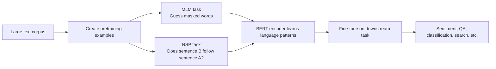
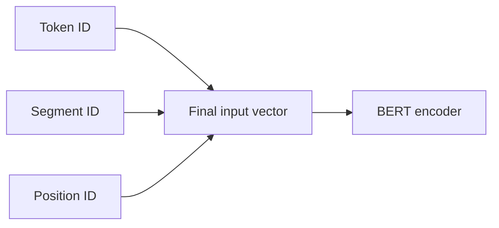
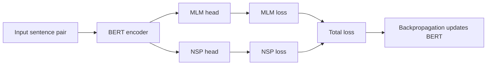
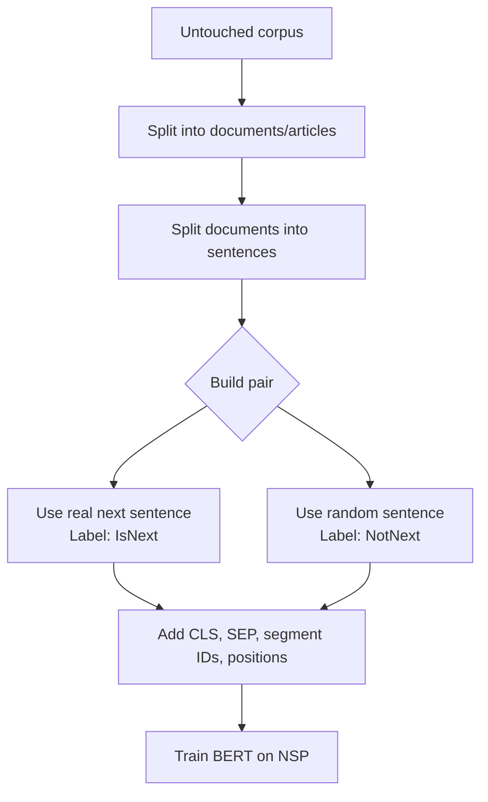
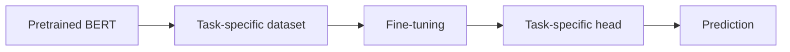
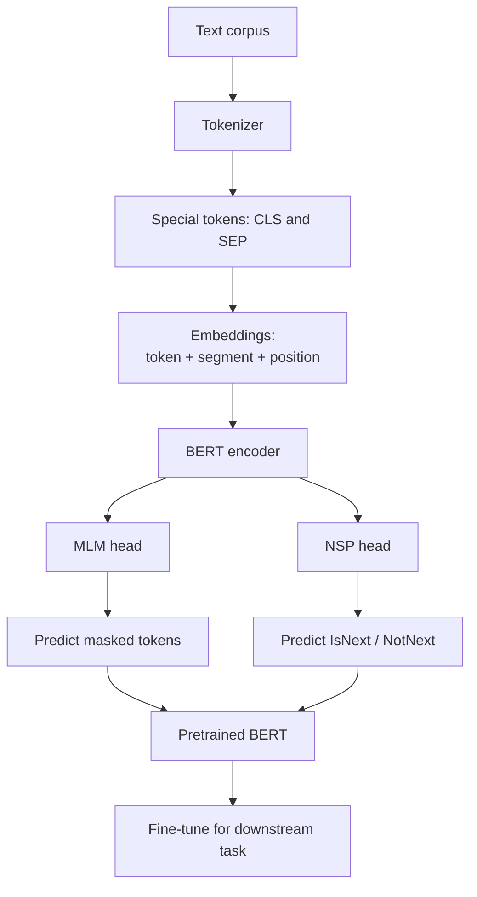

# Encoder Models with BERT: Pretraining Using NSP

Beginner-friendly notes based on the transcript: **“Encoder Models with BERT, pretraining using NSP.”**

## 1. Big Picture

BERT is an **encoder-only Transformer model**. It is trained to understand text by looking at context from both directions: left and right.

BERT is commonly described as being pretrained with two self-supervised tasks:

1. **Masked Language Modeling**, usually abbreviated **MLM**
2. **Next Sentence Prediction**, usually abbreviated **NSP**

> Corrected transcript terminology: the transcript says “mass language modeling,” but the standard term is **masked language modeling**.

### Layman’s explanation

Imagine BERT is a student reading a huge number of books and articles. During pretraining, we give it practice games:

- **MLM game:** Hide some words and ask BERT to guess them.
- **NSP game:** Show BERT two sentences and ask whether the second sentence really follows the first.

These games force BERT to learn useful language patterns before it is trained on a specific task like sentiment analysis or question answering.



---

## 2. What NSP Means

**Next Sentence Prediction** asks BERT:

> Given sentence A and sentence B, does sentence B logically follow sentence A?

This is a **binary classification task**.

The model predicts one of two classes:

| Label | Meaning | Example |
|---:|---|---|
| `1` | `IsNext` | Sentence B really follows sentence A |
| `0` | `NotNext` | Sentence B is random or does not follow sentence A |

### Example: IsNext

Sentence A:

> My dog is cute.

Sentence B:

> He likes playing.

This could reasonably follow, so the label is:

```text
y = 1  # IsNext
```

### Example: NotNext

Sentence A:

> My dog is cute.

Sentence B:

> He likes studying medicine.

This probably does not logically follow, so the label is:

```text
y = 0  # NotNext
```

### Layman’s explanation

NSP is like asking:

> “Do these two sentences belong next to each other in the same paragraph, or did someone randomly paste the second one from somewhere else?”

---

## 3. How BERT Formats Sentence Pairs

For NSP, BERT needs to receive **two sentences together** as one input sequence.

BERT uses special tokens:

| Token | Meaning |
|---|---|
| `[CLS]` | Classification token placed at the beginning of the whole input |
| `[SEP]` | Separator token placed after each sentence |
| `[PAD]` | Padding token used to make sequences the same length |

### Sentence pair format

```text
[CLS] Sentence A [SEP] Sentence B [SEP]
```

Example:

```text
[CLS] My dog is cute [SEP] He likes playing [SEP]
```

### Why `[CLS]` matters

The final hidden vector for `[CLS]` is treated like a summary representation of the full sentence pair. For NSP, that `[CLS]` representation is passed into a small classification head.

```mermaid
flowchart TD
    A[Input tokens:<br/>[CLS] My dog is cute [SEP] He likes playing [SEP]] --> B[BERT encoder]
    B --> C[Contextual embedding for each token]
    C --> D[[CLS] contextual embedding]
    D --> E[NSP classification head]
    E --> F[Logits: IsNext vs NotNext]
```

---

## 4. Token Embeddings, Segment Embeddings, and Position Embeddings

BERT does not feed raw words directly into the Transformer. Each token gets represented by a vector.

For each token, BERT combines three kinds of embeddings:

1. **Token embedding**: what the token is
2. **Segment embedding**: which sentence the token belongs to
3. **Position embedding**: where the token appears in the sequence



A more precise mental model:

```text
input_embedding = token_embedding + segment_embedding + position_embedding
```

### 4.1 Token embeddings

Token embeddings represent the actual tokens.

Example tokens:

```text
[CLS], My, dog, is, cute, [SEP], He, likes, playing, [SEP]
```

Each token is converted into an integer ID, then looked up in an embedding table.

### 4.2 Segment embeddings

Segment embeddings tell BERT which tokens belong to sentence A and which belong to sentence B.

In many BERT implementations, segment IDs are:

- `0` for sentence A
- `1` for sentence B

> Corrected transcript terminology: the transcript describes using `1` for the first sentence and `2` for the second sentence. Conceptually this means “sentence A” and “sentence B,” but in standard BERT-style implementations these are usually represented as `0` and `1`.

Example:

| Token | `[CLS]` | My | dog | is | cute | `[SEP]` | He | likes | playing | `[SEP]` |
|---|---:|---:|---:|---:|---:|---:|---:|---:|---:|---:|
| Segment ID | 0 | 0 | 0 | 0 | 0 | 0 | 1 | 1 | 1 | 1 |

### 4.3 Position embeddings

Transformers do not automatically know the order of tokens. Position embeddings tell BERT where each token appears.

Example:

| Token | `[CLS]` | My | dog | is | cute | `[SEP]` | He | likes | playing | `[SEP]` |
|---|---:|---:|---:|---:|---:|---:|---:|---:|---:|---:|
| Position ID | 0 | 1 | 2 | 3 | 4 | 5 | 6 | 7 | 8 | 9 |

### Layman’s explanation

For every token, BERT wants to know three things:

```text
What word/token is this?
Which sentence is it from?
Where is it in the sequence?
```

---

## 5. Full Input Example

Sentence A:

```text
My dog is cute
```

Sentence B:

```text
He likes playing
```

Combined BERT input:

```text
[CLS] My dog is cute [SEP] He likes playing [SEP]
```

Full table:

| Field | Values |
|---|---|
| Tokens | `[CLS]`, `My`, `dog`, `is`, `cute`, `[SEP]`, `He`, `likes`, `playing`, `[SEP]` |
| Token IDs | IDs from tokenizer vocabulary |
| Segment IDs | `0, 0, 0, 0, 0, 0, 1, 1, 1, 1` |
| Position IDs | `0, 1, 2, 3, 4, 5, 6, 7, 8, 9` |
| NSP label | `1`, meaning `IsNext` |


---

## 6. Padding

Neural networks usually process data in batches. For batching, sequences need to be the same length.

If one sequence is shorter than the required length, we add `[PAD]` tokens.

Example with max length `12`:

```text
[CLS] My dog is cute [SEP] He likes playing [SEP] [PAD] [PAD]
```

Attention masks are usually used so the model knows which tokens are real and which are padding.

| Token | `[CLS]` | My | dog | is | cute | `[SEP]` | He | likes | playing | `[SEP]` | `[PAD]` | `[PAD]` |
|---|---:|---:|---:|---:|---:|---:|---:|---:|---:|---:|---:|---:|
| Attention mask | 1 | 1 | 1 | 1 | 1 | 1 | 1 | 1 | 1 | 1 | 0 | 0 |

### Layman’s explanation

Padding is like adding blank spaces to make every row in a spreadsheet the same width. The model still needs to know which cells are real words and which are just blank fillers.

---

## 7. NSP as Classification

NSP is a two-class classification problem.

The model outputs **logits**, which are raw scores before converting them into probabilities.

Example logits:

```text
logits = [2.4, -0.8]
```

Depending on the class order, this may mean the model gives a higher score to one class than the other.

A classification head maps the `[CLS]` embedding to two output scores:

```text
[CLS] embedding -> linear layer -> 2 logits
```

```mermaid
flowchart TD
    A[[CLS] contextual vector] --> B[Linear layer]
    B --> C[Two logits]
    C --> D{Higher score?}
    D --> E[IsNext]
    D --> F[NotNext]
```

---

## 8. MLM and NSP Losses

During pretraining, BERT can be trained with both tasks at the same time.

The total loss is commonly described as:

```text
total_loss = mlm_loss + nsp_loss
```

### MLM loss

Measures how well BERT predicts masked tokens.

Example:

```text
Input:  The dog is [MASK]
Target: cute
```

### NSP loss

Measures how well BERT predicts whether sentence B follows sentence A.

Example:

```text
Sentence A: My dog is cute.
Sentence B: He likes playing.
Target: IsNext
```



---

## 9. PyTorch-Shaped Pseudocode

This is not full production code. It is shaped like PyTorch to show the moving parts.

```python
import torch
import torch.nn as nn

class BertForPretraining(nn.Module):
    def __init__(self, bert_encoder, hidden_size, vocab_size):
        super().__init__()
        self.bert = bert_encoder

        # Predict masked tokens for MLM.
        self.mlm_head = nn.Linear(hidden_size, vocab_size)

        # Predict IsNext vs NotNext for NSP.
        self.nsp_head = nn.Linear(hidden_size, 2)

    def forward(self, input_ids, token_type_ids, attention_mask):
        outputs = self.bert(
            input_ids=input_ids,
            token_type_ids=token_type_ids,
            attention_mask=attention_mask,
        )

        # Shape: [batch_size, seq_len, hidden_size]
        sequence_output = outputs.last_hidden_state

        # The [CLS] token is at position 0.
        # Shape: [batch_size, hidden_size]
        cls_output = sequence_output[:, 0, :]

        # Shape: [batch_size, seq_len, vocab_size]
        mlm_logits = self.mlm_head(sequence_output)

        # Shape: [batch_size, 2]
        nsp_logits = self.nsp_head(cls_output)

        return mlm_logits, nsp_logits
```

Training step pseudocode:

```python
loss_fn_mlm = nn.CrossEntropyLoss(ignore_index=-100)
loss_fn_nsp = nn.CrossEntropyLoss()

mlm_logits, nsp_logits = model(
    input_ids=input_ids,
    token_type_ids=token_type_ids,
    attention_mask=attention_mask,
)

# MLM labels usually use -100 for tokens that should not contribute to loss.
mlm_loss = loss_fn_mlm(
    mlm_logits.view(-1, vocab_size),
    mlm_labels.view(-1),
)

# NSP labels are usually 0 or 1.
nsp_loss = loss_fn_nsp(nsp_logits, nsp_labels)

total_loss = mlm_loss + nsp_loss

total_loss.backward()
optimizer.step()
optimizer.zero_grad()
```

---

## 10. Creating NSP Training Examples

Suppose the untouched corpus is made of documents, articles, or paragraphs.

Example document:

```text
My dog is cute. He likes playing. I take him to the park.
```

Positive NSP example:

```text
Sentence A: My dog is cute.
Sentence B: He likes playing.
Label: IsNext
```

Negative NSP example:

```text
Sentence A: My dog is cute.
Sentence B: Toronto is the capital of Ontario.
Label: NotNext
```

> Note: The transcript example says “Toronto is the Capital of Ontario.” Correct wording is usually lowercase “capital” unless it is part of a title.



---

## 11. Fine-Tuning After Pretraining

After pretraining, BERT has learned general language representations. Then it can be fine-tuned on a smaller, task-specific dataset.

Examples:

| Task | Input | Output |
|---|---|---|
| Sentiment analysis | “This movie was great.” | Positive |
| Question answering | Question + passage | Answer span |
| Text classification | Support ticket text | Category |
| Search / retrieval | Query or document text | Embedding / ranking signal |

For sentiment analysis, the model may use the `[CLS]` representation again:

```text
[CLS] embedding -> classification head -> positive / neutral / negative
```



### Layman’s explanation

Pretraining is like general education.

Fine-tuning is like job training.

BERT first learns broad language patterns from a huge corpus. Then it specializes for a particular job, such as classifying sentiment or answering questions.

---

## 12. Comparison: Pretraining vs Fine-Tuning

| Concept | Pretraining | Fine-tuning |
|---|---|---|
| Goal | Learn general language patterns | Adapt to a specific task |
| Data | Huge unlabeled or automatically labeled text corpus | Smaller task-specific labeled dataset |
| Example task | MLM, NSP | Sentiment, QA, classification |
| Output head | MLM head, NSP head | Task-specific head |
| What changes? | BERT learns broad representations | BERT adapts those representations |

---

## 13. Comparison: MLM vs NSP

| Concept | MLM | NSP |
|---|---|---|
| Full name | Masked Language Modeling | Next Sentence Prediction |
| Main question | “What token belongs here?” | “Does sentence B follow sentence A?” |
| Input | A sequence with masked tokens | A pair of sentences |
| Output | Vocabulary prediction for masked positions | Binary classification |
| Uses `[CLS]`? | Not mainly | Yes, for classification |
| Uses token-level output? | Yes | No, mostly `[CLS]` output |

---

## 14. Corrected Transcript Terms

| Transcript wording | Better wording | Why |
|---|---|---|
| “mass language modeling” | **masked language modeling** | Standard BERT pretraining task |
| “word piece tokenization” | **WordPiece tokenization** | Proper name of BERT’s tokenizer style |
| “Segment embedding serve” | **Segment embeddings serve** | Grammar correction |
| Segment IDs as `1` and `2` | Often `0` and `1` | Standard BERT implementations use token type IDs `0` and `1` |
| “Capital of Ontario” | “capital of Ontario” | Common noun usage unless in a title |
| “sentiment extraction” | Usually **sentiment classification** or **sentiment analysis** | More common phrasing |

---

## 15. Simple Mental Model

Think of BERT pretraining like this:

```text
Huge text corpus
    -> create sentence pairs and masked-token examples
    -> convert text into token IDs, segment IDs, position IDs
    -> feed into BERT encoder
    -> train with MLM loss and NSP loss
    -> fine-tune for real downstream tasks
```

One compact diagram:



---

## 16. Self-Check Questions

### Basic recall

1. What does NSP stand for?
2. What does MLM stand for?
3. What is the purpose of the `[CLS]` token?
4. What is the purpose of the `[SEP]` token?
5. Why do we need padding?

### Understanding

1. Why is NSP a classification problem?
2. Why does BERT need segment embeddings for sentence-pair tasks?
3. Why does BERT need position embeddings?
4. What does the `[CLS]` output represent in NSP?
5. What is the difference between logits and probabilities?

### Application

Given this pair:

```text
Sentence A: I opened my laptop.
Sentence B: I started writing code.
```

Question:

```text
Should this likely be labeled IsNext or NotNext?
```

Likely answer:

```text
IsNext
```

Given this pair:

```text
Sentence A: I opened my laptop.
Sentence B: The giraffe lives in the savanna.
```

Question:

```text
Should this likely be labeled IsNext or NotNext?
```

Likely answer:

```text
NotNext
```

---

## 17. Mini Practice Exercise

Create the BERT input fields for this sentence pair:

```text
Sentence A: My name is Dave.
Sentence B: I live in Toronto.
```

Expected structure:

```text
Tokens:
[CLS] My name is Dave [SEP] I live in Toronto [SEP]

Segment IDs:
0 0 0 0 0 0 1 1 1 1 1

Position IDs:
0 1 2 3 4 5 6 7 8 9 10

NSP label:
1  # IsNext
```

---

## 18. Key Takeaways

- BERT is an **encoder-only Transformer**.
- BERT pretraining commonly uses **MLM** and **NSP**.
- **MLM** teaches BERT to predict missing tokens from context.
- **NSP** teaches BERT to classify whether one sentence follows another.
- `[CLS]` is used as the classification representation for sentence-level tasks.
- `[SEP]` separates sentences.
- Segment embeddings identify sentence A vs sentence B.
- Position embeddings identify token order.
- Pretraining teaches general language patterns.
- Fine-tuning adapts BERT to specific downstream tasks.

