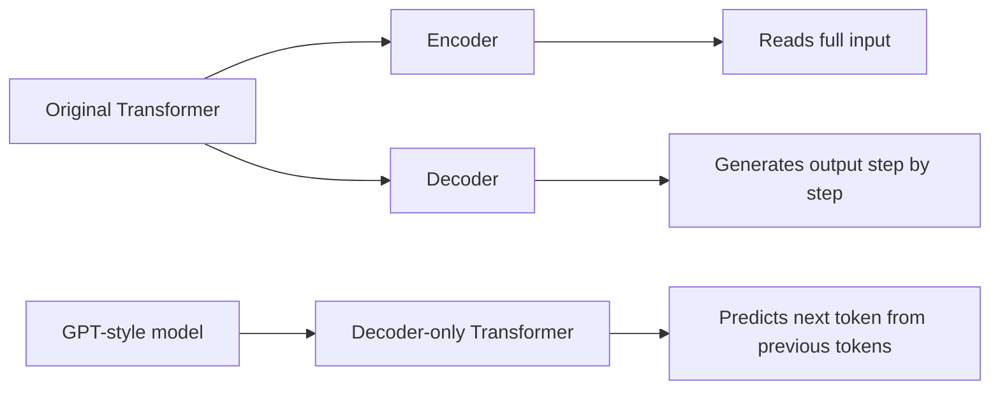
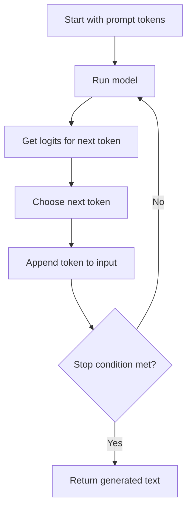
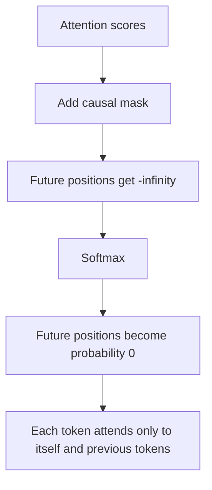
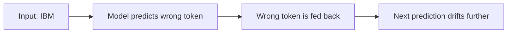
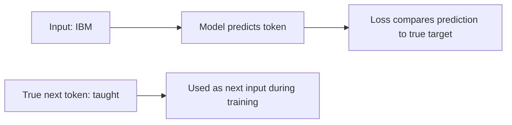
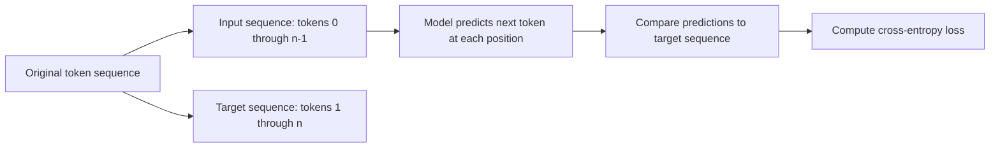
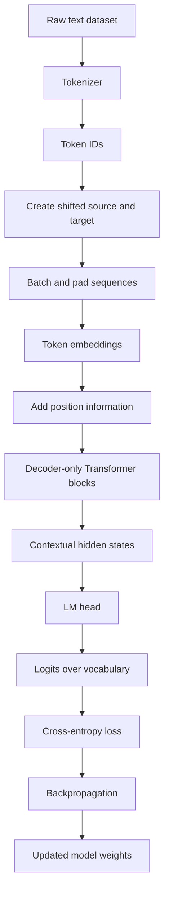
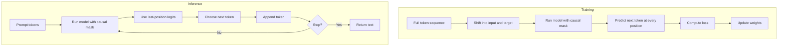
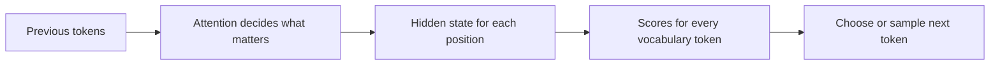

```mermaid
flowchart LR
    A[Text: How are you?] --> B[Tokens]
    B --> C[Token IDs]
    C --> D[Token Embeddings]
    D --> E[Add Positional Encoding]
    E --> F[Decoder Blocks]
    F --> G[Contextual Hidden States]
    G --> H[Linear LM Head]
    H --> I[Logits over Vocabulary]
    I --> J[Choose Next Token]
```

          # Decoder Models and GPT-Like Language Models — Beginner-Friendly Notes


## 1. Big Picture

A **decoder model** is a type of Transformer model commonly used for **text generation**.

Examples of decoder-style language models include:

- GPT-style models
- LLaMA-style models
- Granite-style models

The core job of a decoder language model is simple:

> Given the tokens so far, predict the next token.

For example:

```text
Input so far:   How are you?
Next token:     good
Updated input:  How are you? good
Next token:     thanks
```

This repeated next-token prediction is called **autoregressive generation**.

---

## 2. Corrected Transcript Terminology

Some transcript wording was understandable but slightly misleading. Here are the corrected terms.

| Transcript phrase                                                    | Better wording                                                                               | Why it matters                                                                                                                                           |
| -------------------------------------------------------------------- | -------------------------------------------------------------------------------------------- | -------------------------------------------------------------------------------------------------------------------------------------------------------- |
| “Decoders and GPT-like models”                                       | **Decoder-only Transformer language models**                                                 | GPT-style models usually use only the decoder side of the original Transformer architecture.                                                             |
| “Predict the subsequent token or word”                               | **Predict the next token**                                                                   | Models usually operate on tokens, not always whole words. A word may be split into multiple tokens.                                                      |
| “Word embeddings”                                                    | **Token embeddings**                                                                         | The model embeds token IDs, not necessarily whole words.                                                                                                 |
| “The decoder predicts future words”                                  | **The decoder predicts the next token using previous tokens**                                | It does not see true future tokens during generation.                                                                                                    |
| “Context vector”                                                     | **Sequence of token embeddings / hidden states**                                             | Transformer decoders process a sequence, not one fixed context vector like older simple models.                                                          |
| “Contextual embeddings can be likened to logits from a hidden layer” | **Contextual embeddings are hidden states; logits are produced after a final linear layer**  | Hidden states and logits are different tensors with different meanings.                                                                                  |
| “Use an encoder as a decoder if you add a mask”                      | **A Transformer encoder block can be used in a decoder-like way if causal masking is added** | PyTorch examples sometimes use `TransformerEncoder` blocks with a causal mask to build a GPT-like model. Architecturally, that is decoder-only behavior. |
| “Generates translation using the decoder model”                      | **Generates text using a decoder-only language model**                                       | Translation often uses encoder-decoder models, while GPT-style generation is decoder-only.                                                               |
| “PyTorch generates_square_subsequent_mask”                           | **`generate_square_subsequent_mask`**                                                        | Correct function name uses `generate`, not `generates`.                                                                                                  |
| “dimmentioned”                                                       | **dimensioned**                                                                              | The causal mask is dimensioned as sequence length by sequence length.                                                                                    |
| “Class 1 and Class 2 logits”                                         | **Vocabulary logits**                                                                        | For language modeling, logits usually have one score per vocabulary token, not just two classes.                                                         |

---

## 3. Encoder vs Decoder vs Decoder-Only GPT

The original Transformer architecture had two major parts:

1. **Encoder**: reads an input sequence.
2. **Decoder**: generates an output sequence.

That design is useful for tasks like translation:

```text
English input:  I like cats.
French output:  J'aime les chats.
```

A GPT-like model usually does not use a separate encoder. It only uses decoder-style blocks.

### Simple comparison

| Model type | What it sees | Common use |
|---|---|---|
| Encoder-only | Full input all at once | Classification, embeddings, search, understanding tasks |
| Encoder-decoder | Input sequence + generated output sequence | Translation, summarization, sequence-to-sequence tasks |
| Decoder-only | Previous tokens only | Text generation, chat, completion |

### Mermaid diagram



---

## 4. What “Autoregressive” Means

**Autoregressive** means the model generates one token at a time, and each new token becomes part of the next input.

Layman’s version:

> The model writes one piece, then reads what it has written so far before choosing the next piece.

Example:

```text
Step 1 input:  <BOS>
Step 1 output: IBM

Step 2 input:  <BOS> IBM
Step 2 output: taught

Step 3 input:  <BOS> IBM taught
Step 3 output: me
```

`<BOS>` means **beginning of sequence**. Some models use it; some do not.

`<EOS>` means **end of sequence**. The model may stop when it generates this token.

### Generation loop



Stop conditions usually include:

- Model generates an `<EOS>` token.
- Model reaches `max_new_tokens`.
- Application-specific rule stops generation.

---

## 5. Tokens, Token IDs, Embeddings, Hidden States, and Logits

These terms are easy to mix up.

### The sequence of transformations

```text
Text
→ Tokens
→ Token IDs
→ Token embeddings
→ Positional information added
→ Transformer decoder blocks
→ Contextual hidden states
→ Final linear layer
→ Logits over vocabulary
→ Chosen next token
```

### Layman’s explanation

Imagine the model as a factory:

| Stage | What happens | Analogy |
|---|---|---|
| Text | Human-readable words | A sentence on paper |
| Tokens | Text split into model-readable chunks | Cut the sentence into pieces |
| Token IDs | Each token becomes a number | Give each piece a barcode |
| Embeddings | IDs become vectors | Turn barcodes into meaning-rich coordinates |
| Positional encoding | Add order information | Tell the model where each piece appears |
| Hidden states | Context-aware token representations | Each token now understands nearby context |
| Logits | Raw scores for possible next tokens | Scoreboard of possible next words/pieces |
| Softmax / argmax / sampling | Pick the next token | Choose from the scoreboard |

### Mermaid diagram



---

## 6. Static Embeddings vs Contextual Embeddings

A **static embedding** means the token gets the same vector regardless of context.

A **contextual embedding**, better called a **hidden state**, changes depending on surrounding tokens.

Example with the word “bank”:

```text
Sentence 1: I deposited money at the bank.
Sentence 2: I sat near the river bank.
```

The token may start with the same embedding, but after attention layers, its hidden state should become different because the context is different.

| Representation | Changes with sentence context? | Example |
|---|---:|---|
| Token embedding | No | Initial vector for `bank` |
| Contextual hidden state | Yes | `bank` as finance vs river edge |
| Logits | Yes | Scores for possible next tokens |

---

## 7. Why Positional Encoding Is Needed

A Transformer attention layer does not naturally know token order just from the embeddings.

Without position information, this could look too similar:

```text
The dog chased the cat.
The cat chased the dog.
```

Same words. Different order. Different meaning.

So the model needs position information.

### Simple idea

Token embedding says:

> What token is this?

Position encoding says:

> Where is this token in the sequence?

Together:

> What token is this, and where does it appear?

---

## 8. What Masked Self-Attention Does

Decoder-only models use **causal masking**.

Causal masking prevents a token from looking at future tokens.

For next-token prediction, this matters because the model should not cheat.

Example training sentence:

```text
IBM taught me AI
```

When predicting `taught`, the model can use:

```text
IBM
```

But it must not use:

```text
me AI
```

Those are future tokens relative to the prediction.

### Causal attention visibility

```text
Token position:      0      1      2      3
Tokens:            IBM   taught   me     AI

Position 0 sees:   IBM
Position 1 sees:   IBM   taught
Position 2 sees:   IBM   taught   me
Position 3 sees:   IBM   taught   me     AI
```

### Causal mask matrix

A causal mask usually blocks the upper-right triangle of the attention matrix.

`0` means allowed. `-inf` means blocked before softmax.

```text
          Key positions
          0      1      2      3
Query 0   0    -inf   -inf   -inf
Query 1   0      0    -inf   -inf
Query 2   0      0      0    -inf
Query 3   0      0      0      0
```

After softmax, `-inf` becomes effectively zero probability.

### Mermaid diagram



---

## 9. Training vs Inference

Training and inference are related but not the same.

### Inference

During inference, the model generates one new token at a time.

```text
Prompt: how are you
Model predicts: good
New prompt: how are you good
Model predicts: thanks
```

Only the **last position’s logits** are usually used to choose the next generated token.

### Training

During training, the model receives a whole sequence at once.

Input and target are shifted by one token.

```text
Input:   how   are   you   good
Target:  are   you   good  thanks
```

The model predicts the next token at every position in parallel.

```text
how   -> are
are   -> you
you   -> good
good  -> thanks
```

The causal mask ensures each position cannot see future tokens.

### Comparison table

| Topic | Training | Inference |
|---|---|---|
| Input | Full training sequence | Prompt plus generated tokens so far |
| Target available? | Yes | No |
| Uses true previous tokens? | Usually yes, via teacher forcing | No, uses generated tokens |
| Positions used for loss | All non-padding positions | Usually no loss, just generation |
| Mask needed? | Yes | Yes |
| Main output used | Logits at every position | Logits at final position |

---

## 10. Teacher Forcing

**Teacher forcing** means that during training, the model receives the real previous tokens instead of its own generated guesses.

Example target sentence:

```text
IBM taught me AI
```

During training, even if the model incorrectly predicts something after `IBM`, the next input position still receives the true token `taught`.

Layman’s version:

> The teacher keeps the student on the correct path while practicing, instead of letting one mistake throw off the whole sentence.

### Without teacher forcing



### With teacher forcing



Important nuance:

> Teacher forcing is mostly a training technique. During real generation, the model does not have the true future tokens, so it must use its own generated tokens.

---

## 11. How the Training Data Is Built

For causal language modeling, the source and target are usually the same text shifted by one token.

Example:

```text
Original tokens:
[BOS, how, are, you, good, thanks, EOS]

Source/input:
[BOS, how, are, you, good, thanks]

Target/output:
[how, are, you, good, thanks, EOS]
```

The model learns:

```text
BOS    -> how
how    -> are
are    -> you
you    -> good
good   -> thanks
thanks -> EOS
```

### Mermaid diagram



---

## 12. Special Tokens

Common special tokens:

| Token | Meaning | Used for |
|---|---|---|
| `<BOS>` | Beginning of sequence | Marks the start of generation, if the model uses it |
| `<EOS>` | End of sequence | Tells the model or app when to stop |
| `<PAD>` | Padding | Makes sequences in a batch the same length |
| `<UNK>` | Unknown token | Represents text not in vocabulary, depending on tokenizer |

Modern subword tokenizers often reduce the need for `<UNK>`, but the concept is still useful.

---

## 13. Context Length / Block Size

A decoder model has a maximum number of tokens it can consider at one time. This is called:

- **context length**
- **block size**
- **sequence length**

Example:

```text
block_size = 10
```

The model sees at most 10 tokens at a time during that training sample.

If the text is longer than the block size, training usually samples chunks.

Example:

```text
Long text tokens:
[0, 1, 2, 3, 4, 5, 6, 7, 8, 9, 10, 11, 12]

Random chunk source, block_size=5:
[3, 4, 5, 6, 7]

Target shifted by one:
[4, 5, 6, 7, 8]
```

---

## 14. PyTorch-Shaped Pseudocode: Dataset Sampling

This is not full production code. It is shaped like PyTorch to make the tensor flow easier to understand.

```python
import random
import torch

block_size = 10

def get_sample(token_ids: list[int]) -> tuple[torch.Tensor, torch.Tensor]:
    """
    Create one causal language modeling sample.

    source = tokens from position i to i + block_size - 1
    target = same text shifted one token forward
    """
    max_start = len(token_ids) - block_size - 1
    start = random.randint(0, max_start)

    source = token_ids[start : start + block_size]
    target = token_ids[start + 1 : start + block_size + 1]

    return torch.tensor(source), torch.tensor(target)
```

Example:

```text
token_ids = [10, 20, 30, 40, 50, 60]
block_size = 3

source = [20, 30, 40]
target = [30, 40, 50]
```

---

## 15. PyTorch-Shaped Pseudocode: Collate Function

A **collate function** combines multiple samples into a batch.

It can also pad examples to the same length.

```python
from torch.nn.utils.rnn import pad_sequence

PAD_ID = 0

def collate_fn(samples):
    """
    samples is a list of (source, target) pairs.
    """
    sources, targets = zip(*samples)

    source_batch = pad_sequence(
        sources,
        batch_first=False,
        padding_value=PAD_ID,
    )

    target_batch = pad_sequence(
        targets,
        batch_first=False,
        padding_value=PAD_ID,
    )

    # Shape: [seq_len, batch_size]
    return source_batch, target_batch
```

Many modern PyTorch examples use `batch_first=True`, giving shape:

```text
[batch_size, seq_len]
```

The transcript’s examples use the older/common Transformer convention:

```text
[seq_len, batch_size]
```

Both are valid if the model is written consistently.

---

## 16. PyTorch-Shaped Pseudocode: Causal Mask

```python
import torch


def causal_mask(seq_len: int) -> torch.Tensor:
    """
    Returns a [seq_len, seq_len] mask.
    Future positions are blocked with -inf.
    """
    mask = torch.triu(
        torch.full((seq_len, seq_len), float("-inf")),
        diagonal=1,
    )
    return mask
```

Example for `seq_len = 4`:

```text
[[0,   -inf, -inf, -inf],
 [0,    0,   -inf, -inf],
 [0,    0,    0,   -inf],
 [0,    0,    0,    0  ]]
```

PyTorch also has Transformer utilities that can generate this kind of mask, depending on which module you are using.

---

## 17. PyTorch-Shaped Pseudocode: GPT-Like Model

The transcript describes a custom GPT-like model built from:

1. Token embedding layer
2. Positional encoding or positional embedding
3. Transformer blocks with causal masking
4. Final linear layer, often called `lm_head`

A simplified version:

```python
import torch
import torch.nn as nn

class TinyGPTLikeModel(nn.Module):
    def __init__(self, vocab_size, embed_size, num_heads, num_layers, max_seq_len):
        super().__init__()

        self.token_embedding = nn.Embedding(vocab_size, embed_size)
        self.position_embedding = nn.Embedding(max_seq_len, embed_size)

        encoder_layer = nn.TransformerEncoderLayer(
            d_model=embed_size,
            nhead=num_heads,
        )

        # With a causal mask, this behaves like a decoder-only stack.
        self.blocks = nn.TransformerEncoder(
            encoder_layer,
            num_layers=num_layers,
        )

        self.lm_head = nn.Linear(embed_size, vocab_size)

    def forward(self, token_ids, padding_mask=None):
        """
        token_ids shape: [seq_len, batch_size]
        output logits shape: [seq_len, batch_size, vocab_size]
        """
        seq_len, batch_size = token_ids.shape

        positions = torch.arange(seq_len, device=token_ids.device)
        positions = positions.unsqueeze(1).expand(seq_len, batch_size)

        x = self.token_embedding(token_ids)
        x = x + self.position_embedding(positions)

        src_mask = causal_mask(seq_len).to(token_ids.device)

        hidden_states = self.blocks(
            x,
            mask=src_mask,
            src_key_padding_mask=padding_mask,
        )

        logits = self.lm_head(hidden_states)
        return logits
```

Important clarification:

> This uses `TransformerEncoder` as an implementation shortcut. Conceptually, with causal masking, it is being used as a decoder-only language model stack.

---

## 18. Tensor Shapes During Training

Assume:

```text
seq_len = 10
batch_size = 32
vocab_size = 5000
```

Then:

```text
source shape:  [10, 32]
target shape:  [10, 32]
logits shape:  [10, 32, 5000]
```

Each position in each batch item produces a full vocabulary-sized score vector.

To compute cross-entropy loss, we usually flatten sequence and batch dimensions.

```python
loss_fn = nn.CrossEntropyLoss(ignore_index=PAD_ID)

logits = model(source)  # [seq_len, batch_size, vocab_size]

loss = loss_fn(
    logits.reshape(-1, vocab_size),  # [(seq_len * batch_size), vocab_size]
    target.reshape(-1),              # [(seq_len * batch_size)]
)
```

Layman’s version:

> Every token position makes a guess. The loss checks every guess against the correct next token.

---

## 19. PyTorch-Shaped Pseudocode: Training Loop

```python
model.train()

for source, target in train_loader:
    source = source.to(device)
    target = target.to(device)

    optimizer.zero_grad()

    logits = model(source)

    loss = loss_fn(
        logits.reshape(-1, vocab_size),
        target.reshape(-1),
    )

    loss.backward()
    optimizer.step()
```

Training is similar to other neural networks:

1. Forward pass
2. Compute loss
3. Backpropagation
4. Optimizer update
5. Repeat

The language-model-specific part is the shifted source/target setup and causal mask.

---

## 20. PyTorch-Shaped Pseudocode: Evaluation

```python
@torch.no_grad()
def evaluate(model, val_loader):
    model.eval()
    total_loss = 0.0
    total_batches = 0

    for source, target in val_loader:
        source = source.to(device)
        target = target.to(device)

        logits = model(source)

        loss = loss_fn(
            logits.reshape(-1, vocab_size),
            target.reshape(-1),
        )

        total_loss += loss.item()
        total_batches += 1

    model.train()
    return total_loss / total_batches
```

Evaluation measures how well the model predicts the next token on validation data.

---

## 21. PyTorch-Shaped Pseudocode: Autoregressive Generation

```python
@torch.no_grad()
def generate(model, prompt_ids, max_new_tokens, eos_id=None):
    """
    prompt_ids shape: [seq_len]
    returns generated token IDs
    """
    model.eval()

    generated = prompt_ids.clone()

    for _ in range(max_new_tokens):
        # Keep only the last block_size tokens if needed.
        context = generated[-block_size:]

        # Convert to [seq_len, batch_size]
        x = context.unsqueeze(1)

        logits = model(x)

        # Use the final time step to predict the next token.
        final_logits = logits[-1, 0, :]

        # Greedy decoding: choose the highest-scoring token.
        next_id = torch.argmax(final_logits, dim=-1)

        generated = torch.cat([generated, next_id.view(1)])

        if eos_id is not None and next_id.item() == eos_id:
            break

    return generated
```

This uses **greedy decoding** because it chooses the highest-scoring token using `argmax`.

Real models often use sampling methods such as:

- temperature sampling
- top-k sampling
- top-p / nucleus sampling
- beam search in some tasks

But `argmax` is the simplest place to start.

---

## 22. Argmax vs Sampling

The transcript focuses on `argmax`.

`argmax` means:

> Pick the token with the highest score.

Example logits:

| Token | Logit score |
|---|---:|
| good | 8.1 |
| okay | 5.4 |
| bad | 1.2 |

`argmax` chooses:

```text
good
```

This is simple and deterministic, but it can make text repetitive or less creative.

Sampling allows the model to sometimes choose other likely tokens.

| Method | Behavior |
|---|---|
| Argmax / greedy | Always picks highest score |
| Sampling | Picks based on probabilities |
| Temperature | Controls randomness |
| Top-k | Samples only from top k tokens |
| Top-p | Samples from the smallest group whose probability mass reaches p |

---

## 23. The Full Decoder Language Model Flow



---

## 24. Training Flow vs Generation Flow



---

## 25. Common Beginner Misunderstandings

### Misunderstanding 1: “The model predicts a word.”

Better:

> The model predicts a token.

A token might be a word, part of a word, punctuation, or whitespace-like unit depending on the tokenizer.

---

### Misunderstanding 2: “The embedding is the output.”

Better:

> The embedding is an internal representation. The final output used for prediction is logits over the vocabulary.

---

### Misunderstanding 3: “The model sees the future during training because the full sequence is passed in.”

Better:

> The full sequence is passed in for efficiency, but the causal mask prevents each position from attending to future positions.

---

### Misunderstanding 4: “A decoder always needs an encoder.”

Better:

> In encoder-decoder translation models, the decoder uses encoder output. In GPT-like text generation, the model is decoder-only and does not need an encoder.

---

### Misunderstanding 5: “The model trains exactly the same way it generates.”

Better:

> Training predicts all next-token positions in parallel using true previous tokens. Generation predicts one token at a time using its own generated tokens.

---

## 26. Small Concrete Example

Suppose the vocabulary is:

```text
0 = <PAD>
1 = <BOS>
2 = how
3 = are
4 = you
5 = good
6 = thanks
7 = <EOS>
```

Original sequence:

```text
<BOS> how are you good thanks <EOS>
```

Token IDs:

```text
[1, 2, 3, 4, 5, 6, 7]
```

Training source:

```text
[1, 2, 3, 4, 5, 6]
```

Training target:

```text
[2, 3, 4, 5, 6, 7]
```

Training pairs:

| Input context position | Target next token |
|---|---|
| `<BOS>` | `how` |
| `how` | `are` |
| `are` | `you` |
| `you` | `good` |
| `good` | `thanks` |
| `thanks` | `<EOS>` |

During generation:

```text
Prompt: [2, 3, 4]
Text:   how are you

Model predicts: 5 → good
Updated: [2, 3, 4, 5]

Model predicts: 6 → thanks
Updated: [2, 3, 4, 5, 6]
```

---

## 27. Key Formulas and Concepts

### Next-token probability

A decoder language model estimates:

```text
P(next token | previous tokens)
```

For a sequence:

```text
x1, x2, x3, ..., xn
```

The model learns:

```text
P(x2 | x1)
P(x3 | x1, x2)
P(x4 | x1, x2, x3)
...
P(xn | x1, ..., x(n-1))
```

### Cross-entropy loss

At each position, the model outputs logits over the vocabulary.

Cross-entropy compares:

```text
model's predicted distribution
vs
correct next token
```

Layman’s version:

> The model gets penalized when it gives low probability to the actual next token.

---

## 28. Mental Model

Think of the decoder model as a very advanced autocomplete system.

But instead of only looking at the last word, it uses attention to decide which previous tokens matter most.



The causal mask enforces the rule:

> You can look backward, but not forward.

---

## 29. Practical Checklist for Building a Tiny Decoder LM

1. Choose a text dataset.
2. Build or load a tokenizer.
3. Convert text to token IDs.
4. Choose special token IDs: `<PAD>`, `<EOS>`, maybe `<BOS>`.
5. Pick a `block_size` / context length.
6. Build shifted source-target samples.
7. Batch and pad examples.
8. Build the model:
   - token embedding
   - position embedding
   - Transformer blocks
   - causal mask
   - LM head
9. Compute logits.
10. Flatten logits and targets.
11. Compute cross-entropy loss.
12. Train with backpropagation.
13. Evaluate validation loss.
14. Generate text autoregressively.

---

## 30. Self-Check Questions

### Concept questions

1. What does “autoregressive” mean in a decoder language model?
2. Why does a decoder-only model need a causal mask?
3. What is the difference between a token embedding and a contextual hidden state?
4. Why are the input and target sequences shifted during training?
5. During inference, why do we usually use only the final position’s logits?
6. What is teacher forcing?
7. Why can passing the whole sequence during training still be valid if the model should not see future tokens?
8. What is the difference between logits and probabilities?
9. What does the LM head do?
10. What is the difference between `block_size` and vocabulary size?

### Applied questions

1. Given this sequence:

   ```text
   [BOS, I, like, AI, EOS]
   ```

   What are the source and target sequences for training?

2. If logits have shape:

   ```text
   [seq_len, batch_size, vocab_size]
   ```

   and targets have shape:

   ```text
   [seq_len, batch_size]
   ```

   Why do we reshape them before cross-entropy loss?

3. If a model is generating text and predicts `<EOS>`, what should usually happen?

4. Why might greedy `argmax` generation be less creative than sampling?

5. What would go wrong if a training-time decoder had no causal mask?

---

## 31. Self-Check Answer Key

1. **Autoregressive** means the model predicts one token at a time, using previous tokens as context.
2. A **causal mask** prevents the model from looking at future tokens.
3. A **token embedding** is the initial learned vector for a token ID. A **contextual hidden state** is the transformed vector after the model considers surrounding previous tokens.
4. Inputs and targets are shifted so the model learns to predict the next token at each position.
5. During inference, the final position represents the model’s prediction for the next token after the whole current prompt.
6. **Teacher forcing** means using the true previous tokens during training instead of feeding the model’s own generated predictions back in.
7. The whole sequence can be processed efficiently in parallel because the causal mask blocks future-token attention.
8. **Logits** are raw scores. **Probabilities** are normalized scores, usually after softmax.
9. The **LM head** maps hidden states to vocabulary-sized logits.
10. **Block size** is how many tokens the model can read at once. **Vocabulary size** is how many possible tokens the model can choose from.

Applied:

1. Source:

   ```text
   [BOS, I, like, AI]
   ```

   Target:

   ```text
   [I, like, AI, EOS]
   ```

2. Cross-entropy expects one row of logits per target label, so sequence and batch dimensions are flattened into one token-prediction dimension.
3. Generation should usually stop.
4. Greedy argmax always chooses the highest-scoring token, while sampling can choose from multiple likely options.
5. Without a causal mask, the model could cheat by attending to future tokens, making training loss misleadingly low and harming real generation behavior.

---

## 32. Final Summary

A GPT-like decoder language model is trained to predict the next token.

During training:

- The model receives full token chunks.
- Inputs and targets are shifted by one token.
- A causal mask prevents looking ahead.
- The model predicts the next token at every position.
- Cross-entropy loss trains the model.

During inference:

- The model starts with a prompt.
- It predicts one next token.
- That token is appended to the prompt.
- The process repeats until stopping.

The most important idea:

> Decoder-only language models are next-token predictors that use masked self-attention so each token can learn from the past without seeing the future.
