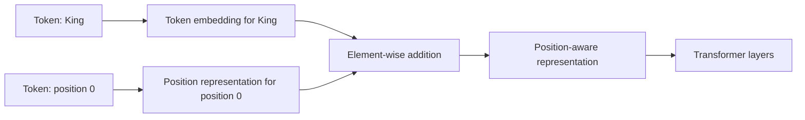
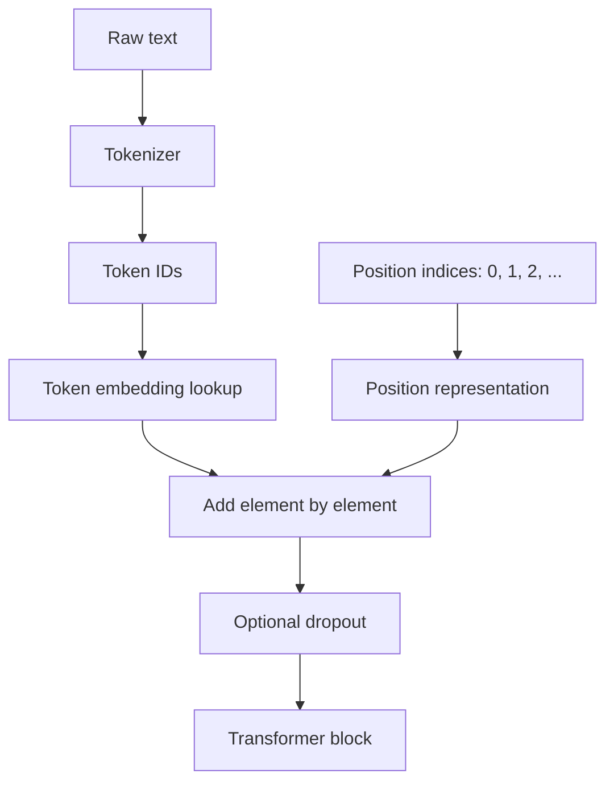
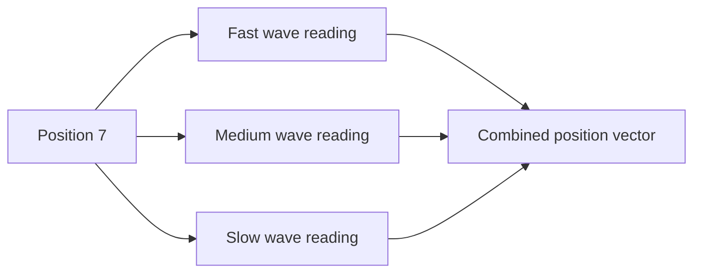
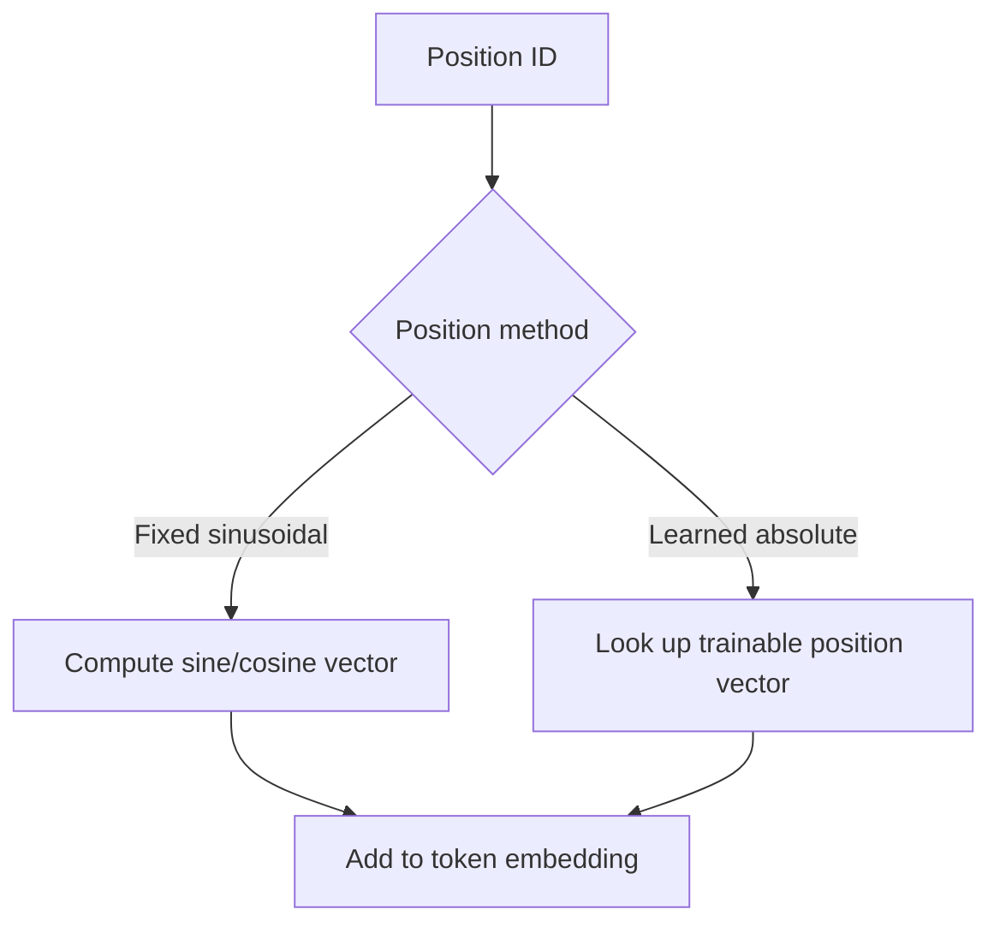
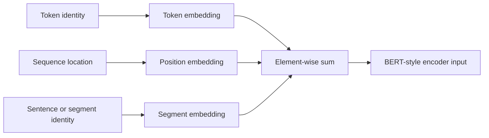
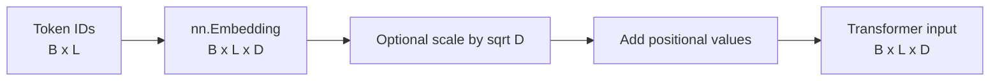
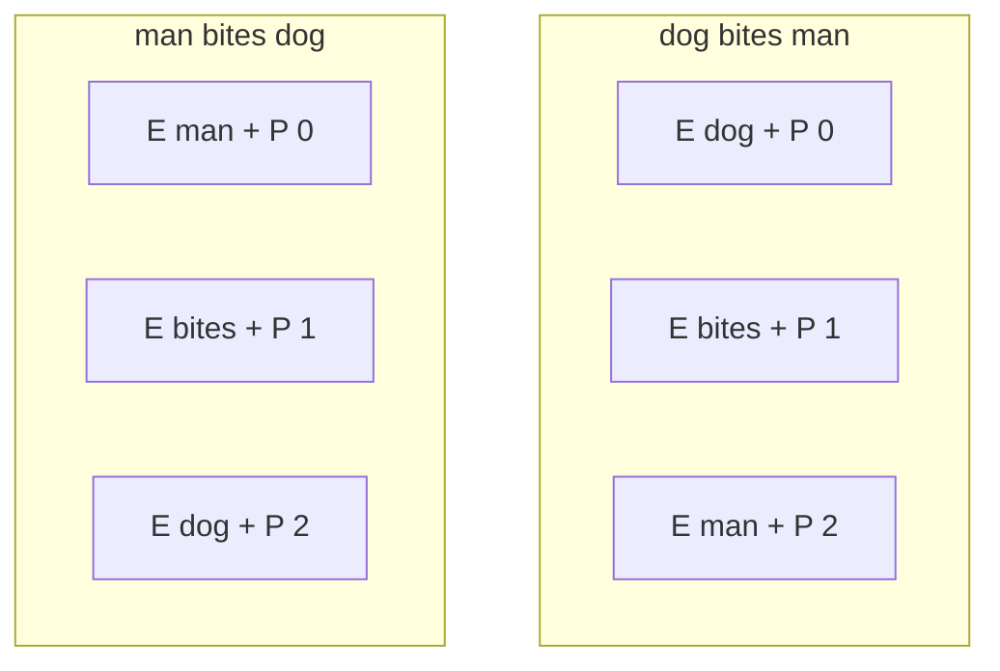
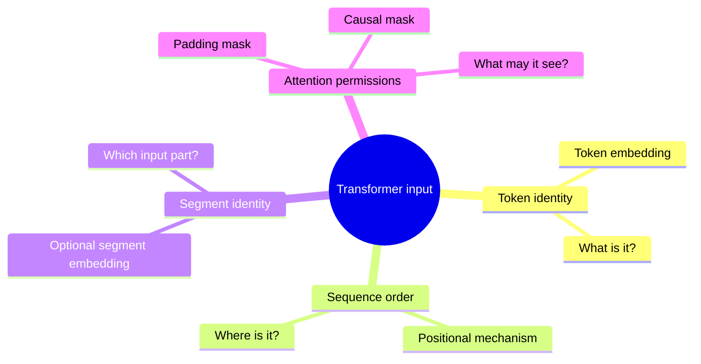

# Positional Encoding — Beginner-Friendly Notes

> Based on the transcript **`01-positional-encoding.txt`**. These notes simplify the ideas, correct misleading statements, and add examples and implementation guidance.

## Learning goals

By the end of these notes, you should be able to explain:

- why a Transformer needs position information;
- how token embeddings and positional information are combined;
- how sinusoidal positional encoding works at a conceptual and mathematical level;
- how learned positional embeddings differ from fixed sinusoidal encodings;
- how segment embeddings differ from positional encodings;
- what tensor shapes are involved in a PyTorch implementation; and
- what common positional-encoding mistakes to avoid.

---

## 1. The core idea in one sentence

A **token embedding tells the model what a token is**, while a **positional encoding tells the model where that token appears in the sequence**.

```text
final input representation = token embedding + position representation
```

A useful analogy is a classroom:

- a student's **name badge** identifies who the student is;
- the student's **seat number** identifies where the student is sitting.

The name badge and seat number describe different facts, but the teacher needs both.

---

## 2. Why Transformers need position information

Consider these sentences:

1. `King and Queen are awesome.`
2. `Queen and King are awesome.`

They contain the same tokens, but the tokens appear in different positions.

A token-embedding lookup gives a word the same base vector wherever it appears:

```text
embedding("King")  -> the same learned token vector
embedding("Queen") -> the same learned token vector
```

Without position information, a self-attention layer has no built-in concept of:

- first;
- second;
- before;
- after;
- three tokens away; or
- the original order of a sequence.

This is because self-attention examines all tokens together rather than stepping through them one at a time like a traditional recurrent neural network.

### More precise correction to the transcript

The transcript says that the embedding representation of the two sentences is “identical.” A more precise statement is:

> The two sentences contain the same collection of token embeddings, only arranged in a different order. Without positional information, the Transformer has no built-in signal explaining what that order means.

The token matrix may have different row order, but the model needs an explicit mechanism to interpret those row positions.



---

## 3. What is actually added together?

Suppose one token embedding has four numbers:

```text
Token embedding for "King":
[0.20, -0.10, 0.40, 0.70]
```

Suppose the representation of position 1 is:

```text
Position representation for position 1:
[0.84, 0.54, 0.01, 1.00]
```

The model adds corresponding elements:

```text
[0.20, -0.10, 0.40, 0.70]
[0.84,  0.54, 0.01, 1.00]
-------------------------------- +
[1.04,  0.44, 0.41, 1.70]
```

The result contains information about both:

- the token's identity; and
- the token's location.

The position does **not** replace the token embedding. It modifies it.

### Tensor shapes

A typical batch-first implementation uses these shapes:

| Item | Shape | Meaning |
|---|---:|---|
| Token IDs | `[batch_size, sequence_length]` | Integer vocabulary indices |
| Token embeddings | `[batch_size, sequence_length, d_model]` | Dense token vectors |
| Positional values | `[1, sequence_length, d_model]` | One position vector per sequence slot |
| Combined representations | `[batch_size, sequence_length, d_model]` | Input to the Transformer |

`d_model` is the width of every token representation used by the Transformer.

### Why addition works

Addition is possible because the token embedding and position representation have the same width:

```text
[token meaning vector]   shape: [d_model]
[position vector]        shape: [d_model]
[result]                 shape: [d_model]
```

The Transformer can learn how to interpret the combined values.

---

## 4. A full input pipeline



For the text:

```text
Transformers are awesome
```

the position IDs might be:

| Token | Token ID | Position ID |
|---|---:|---:|
| `Transformers` | 8127 | 0 |
| `are` | 389 | 1 |
| `awesome` | 10677 | 2 |

The token IDs depend on the tokenizer. The position IDs simply describe sequence slots.

---

## 5. Sinusoidal positional encoding

The original Transformer introduced a fixed positional encoding built from sine and cosine functions.

It does not learn one arbitrary vector for every position. Instead, it computes position values using a formula.

For an even-numbered embedding dimension:

```math
PE(pos, 2i) = sin(pos / 10000^(2i / d_model))
```

For the neighboring odd-numbered dimension:

```math
PE(pos, 2i + 1) = cos(pos / 10000^(2i / d_model))
```

### Meaning of the symbols

| Symbol | Meaning |
|---|---|
| `pos` | A token's position in the sequence: `0, 1, 2, ...` |
| `i` | The index of a sine/cosine frequency pair |
| `d_model` | The embedding width |
| `2i` | An even dimension receiving sine |
| `2i + 1` | The neighboring odd dimension receiving cosine |

### Important correction

It is not quite accurate to say that every individual dimension receives a completely unrelated wave.

A better explanation is:

> Dimensions are organized into sine/cosine pairs. Each pair uses the same frequency, with one dimension holding the sine value and the other holding the cosine value. Different pairs use different frequencies.

---

## 6. The “many clocks” analogy

Imagine recording time with several clocks:

- one hand moves quickly;
- another moves more slowly;
- another moves extremely slowly.

At any position, the combined readings form a recognizable pattern.



No single wave needs to identify the position by itself. The **combination across dimensions** supplies the useful pattern.

This resembles representing a date using several units:

```text
year + month + day + hour + minute
```

Each unit contributes different-scale information.

---

## 7. Small numerical example

Let:

```text
d_model = 4
positions = 0, 1, 2
```

The four dimensions use two sine/cosine frequency pairs.

Approximate sinusoidal values are:

| Position | Dimension 0 | Dimension 1 | Dimension 2 | Dimension 3 |
|---:|---:|---:|---:|---:|
| 0 | `0.0000` | `1.0000` | `0.0000` | `1.0000` |
| 1 | `0.8415` | `0.5403` | `0.0100` | `0.9999` |
| 2 | `0.9093` | `-0.4161` | `0.0200` | `0.9998` |

Notice:

- position 0 is not represented as four zeros;
- nearby positions have related but different vectors;
- early dimensions change faster;
- later dimensions change more slowly.

### Combining one row with an embedding

```text
Token embedding at position 2:
[ 0.20, -0.10, 0.40, 0.70]

Positional encoding at position 2:
[ 0.91, -0.42, 0.02, 1.00]

Combined representation:
[ 1.11, -0.52, 0.42, 1.70]
```

In a real model, `d_model` is usually much larger than 4.

---

## 8. Why sine and cosine are useful

Sinusoidal positional encoding has several practical properties.

### 8.1 It is deterministic

The values are calculated from the position. They do not need to be learned from data.

### 8.2 It is bounded

Sine and cosine values stay between `-1` and `1`.

This keeps the raw positional signal numerically controlled, although it does **not** automatically guarantee that position values can never dominate token embeddings. The model's embedding scale and architecture still matter.

### 8.3 It uses several spatial scales

Some dimensions change quickly across nearby positions. Others change slowly over longer ranges.

### 8.4 Relative offsets can be represented systematically

Because sine and cosine values change according to consistent mathematical relationships, a model can more easily learn patterns involving relative distances.

For example:

```text
position 8 relative to position 5 -> offset of 3
position 20 relative to position 17 -> offset of 3
```

The exact vectors differ, but the same offset creates mathematically related changes.

### 8.5 It has no trainable positional parameters

The model does not need a learned lookup table for these values.

---

## 9. Corrections to misleading sinusoidal claims

### Claim: “The cosine waves never intersect at the same points.”

This is not reliable. Individual sine and cosine waves can repeat or intersect.

The useful idea is:

> A position is represented by the combined values across many dimensions and frequencies, not by one wave being globally unique.

### Claim: “The maximum sequence size can be aligned with vocabulary size.”

Maximum sequence length and vocabulary size describe different things:

| Quantity | Describes |
|---|---|
| Vocabulary size | How many token IDs the tokenizer can produce |
| Maximum sequence length | How many token positions the model can accept at once |

There is normally no reason to make them equal.

Example:

```text
vocabulary_size = 50,000 tokens
max_sequence_length = 2,048 positions
```

These are independent design choices.

### Claim: Positional encodings are “rotated” to align these sizes

Transposing or rotating a positional-encoding image may make a visualization easier to read, but it does not change the model's conceptual requirements. A visualization's orientation is not part of the encoding algorithm.

---

## 10. Fixed versus learned position representations

There are two beginner-level categories worth distinguishing.

### Fixed sinusoidal positional encoding

- computed from a formula;
- not updated by gradient descent;
- contains no learned position table;
- can be generated for positions without training a separate vector for each one.

### Learned absolute positional embedding

- stores one trainable vector per allowed position;
- starts with initialized parameter values;
- is updated during training;
- usually has a fixed configured maximum position count.



### Comparison

| Property | Fixed sinusoidal | Learned absolute |
|---|---|---|
| Trainable | No | Yes |
| Extra learned position parameters | No | Yes |
| Position vector source | Formula | Lookup table |
| Behavior beyond trained positions | Can be calculated, though model quality is not guaranteed | Usually unavailable without adaptation |
| Flexibility | Structured mathematical pattern | Model can learn task-specific vectors |

### Correction about GPT

The transcript broadly says that GPT uses learned positional parameters. That is true for some well-known GPT-style architectures, but it is not a universal rule for every GPT-like model.

Modern Transformer systems may use:

- learned absolute position embeddings;
- fixed sinusoidal encodings;
- relative position biases;
- rotary position embeddings, often called **RoPE**; or
- other position mechanisms.

The general lesson is not “GPT always uses one method.” It is:

> Transformer architectures must introduce position or relative-order information somehow, but different models use different mechanisms.

---

## 11. Absolute and relative position methods

### Absolute position

Answers:

```text
Where is this token in the sequence?
```

Example:

```text
The token is at position 12.
```

Sinusoidal encodings and learned absolute position embeddings belong to this broad category.

### Relative position

Answers:

```text
How far apart are these two tokens?
```

Example:

```text
The key token is three positions before the query token.
```

Relative position mechanisms often modify attention scores directly instead of simply adding a vector to each token embedding.

### Rotary position embeddings — high-level view

RoPE applies a position-dependent rotation to parts of query and key vectors. This lets their attention interaction reflect relative offsets.

You do not need the rotation mathematics yet. The key comparison is:

| Method | High-level action |
|---|---|
| Sinusoidal absolute | Add a fixed position vector to each token representation |
| Learned absolute | Add a learned position vector to each token representation |
| Relative bias | Modify attention scores based on token distance |
| RoPE | Rotate query/key features according to position |

---

## 12. Segment embeddings are not positional encodings

Some models accept multiple text segments together.

Example:

```text
[CLS] What is photosynthesis? [SEP] It is the process ... [SEP]
```

A segment or token-type embedding can mark whether a token belongs to:

- segment A; or
- segment B.

A position representation answers:

```text
Where is this token?
```

A segment embedding answers:

```text
Which input segment does this token belong to?
```

These are separate signals.

For a BERT-style input, the combined representation may be described as:

```text
input = token embedding + position embedding + segment embedding
```



### Correction to the transcript

Segment embeddings do not provide “additional positional information.” They provide **segment identity**. They may be added alongside position embeddings, but their purpose differs.

---

## 13. Positional encoding is not an attention mask

These concepts are easy to mix up.

| Mechanism | Purpose |
|---|---|
| Positional encoding | Tells the model about order or distance |
| Padding mask | Prevents attention to padding tokens |
| Causal mask | Prevents a token from seeing future tokens |
| Segment embedding | Identifies which segment a token belongs to |

A causal language model generally needs both:

- position information; and
- a causal attention mask.

The mask controls **what may be attended to**. Position information helps explain **where tokens are located**.

---

## 14. PyTorch-shaped pseudocode: fixed sinusoidal encoding

The following is close to runnable PyTorch. It assumes batch-first input:

```text
[batch_size, sequence_length, d_model]
```

```python
import math

import torch
from torch import nn


class SinusoidalPositionalEncoding(nn.Module):
    """Add fixed sine/cosine position values to batch-first embeddings."""

    def __init__(
        self,
        d_model: int,
        max_length: int = 2048,
        dropout: float = 0.1,
    ) -> None:
        super().__init__()

        if d_model <= 0:
            raise ValueError("d_model must be positive")
        if d_model % 2 != 0:
            raise ValueError("This simplified implementation requires even d_model")
        if max_length <= 0:
            raise ValueError("max_length must be positive")

        # One row per position: [max_length, 1]
        position = torch.arange(max_length, dtype=torch.float32).unsqueeze(1)

        # One frequency per sine/cosine pair: [d_model / 2]
        frequency_scale = torch.exp(
            torch.arange(0, d_model, 2, dtype=torch.float32)
            * (-math.log(10_000.0) / d_model)
        )

        encoding = torch.zeros(max_length, d_model)
        encoding[:, 0::2] = torch.sin(position * frequency_scale)
        encoding[:, 1::2] = torch.cos(position * frequency_scale)

        # Shape becomes [1, max_length, d_model] for batch broadcasting.
        encoding = encoding.unsqueeze(0)

        # A buffer moves with the module but is not optimized as a parameter.
        self.register_buffer("encoding", encoding, persistent=False)
        self.dropout = nn.Dropout(dropout)

    def forward(self, embeddings: torch.Tensor) -> torch.Tensor:
        if embeddings.ndim != 3:
            raise ValueError(
                "Expected embeddings with shape "
                "[batch_size, sequence_length, d_model]"
            )

        sequence_length = embeddings.size(1)
        if sequence_length > self.encoding.size(1):
            raise ValueError("Sequence exceeds configured max_length")

        position_values = self.encoding[:, :sequence_length]
        return self.dropout(embeddings + position_values)
```

### What `register_buffer` means

The sinusoidal matrix should:

- move to the GPU with the model;
- appear as part of the module's state when desired; but
- not be updated by the optimizer.

A registered buffer is appropriate for such a tensor.

### Shape walkthrough

```text
embeddings:       [batch_size, sequence_length, d_model]
position_values:  [1,          sequence_length, d_model]
result:           [batch_size, sequence_length, d_model]
```

PyTorch broadcasts the single positional matrix across all items in the batch.

Every sequence in the batch uses the same position-0 vector, position-1 vector, and so on.

---

## 15. PyTorch-shaped pseudocode: learned position embeddings

```python
import torch
from torch import nn


class LearnedPositionalEmbedding(nn.Module):
    """Add a trainable vector for each absolute position."""

    def __init__(
        self,
        d_model: int,
        max_length: int = 2048,
        dropout: float = 0.1,
    ) -> None:
        super().__init__()
        self.position_embedding = nn.Embedding(max_length, d_model)
        self.dropout = nn.Dropout(dropout)

    def forward(self, embeddings: torch.Tensor) -> torch.Tensor:
        batch_size, sequence_length, _ = embeddings.shape

        if sequence_length > self.position_embedding.num_embeddings:
            raise ValueError("Sequence exceeds configured max_length")

        position_ids = torch.arange(
            sequence_length,
            device=embeddings.device,
        )

        # [sequence_length, d_model]
        position_values = self.position_embedding(position_ids)

        # [1, sequence_length, d_model], then broadcast over the batch
        position_values = position_values.unsqueeze(0)

        return self.dropout(embeddings + position_values)
```

The key distinction is this line:

```python
self.position_embedding = nn.Embedding(max_length, d_model)
```

Its values are parameters and are updated during training.

---

## 16. Combining token and position embeddings

```python
import math

import torch
from torch import nn


class TransformerInputEmbedding(nn.Module):
    def __init__(
        self,
        vocabulary_size: int,
        d_model: int,
        max_length: int,
        padding_id: int,
        dropout: float = 0.1,
    ) -> None:
        super().__init__()
        self.d_model = d_model
        self.token_embedding = nn.Embedding(
            vocabulary_size,
            d_model,
            padding_idx=padding_id,
        )
        self.position_encoding = SinusoidalPositionalEncoding(
            d_model=d_model,
            max_length=max_length,
            dropout=dropout,
        )

    def forward(self, token_ids: torch.Tensor) -> torch.Tensor:
        # token_ids: [batch_size, sequence_length]
        token_vectors = self.token_embedding(token_ids)

        # Scaling is used in the original Transformer design. It is an
        # architectural choice rather than a universal requirement.
        token_vectors = token_vectors * math.sqrt(self.d_model)

        return self.position_encoding(token_vectors)
```

### Data flow



Where:

- `B` = batch size;
- `L` = sequence length; and
- `D` = `d_model`.

---

## 17. Dropout's role

Dropout randomly zeros some elements during training.

Its purpose is regularization: reducing the chance that the model depends too strongly on particular internal features.

It is common to apply dropout after combining token and position representations:

```text
output = dropout(token_embedding + position_representation)
```

Important distinction:

- dropout is active during training;
- dropout is disabled when the module is in evaluation mode;
- positional encoding itself is still used during inference.

---

## 18. Maximum sequence length

For precomputed or learned absolute positions, the module normally has a configured maximum:

```python
max_length = 2048
```

This means the position component is prepared to represent positions:

```text
0 through 2047
```

### Fixed sinusoidal method

You can calculate additional rows if you need a larger range. However, simply calculating them does not guarantee the trained model will generalize perfectly to much longer sequences.

### Learned absolute method

A learned table has only the rows that were configured:

```text
[max_length, d_model]
```

A sequence beyond this length requires an architectural or model-adaptation decision. It cannot simply index a nonexistent row.

---

## 19. Padding and position IDs

Suppose two sequences are padded:

```text
Sequence A: [The, cat, sleeps, PAD, PAD]
Sequence B: [A, dog, runs, very, quickly]
```

A simple position sequence may still be:

```text
[0, 1, 2, 3, 4]
```

The padding mask prevents useful attention from being paid to the padding slots.

Different model implementations may assign or handle padded position IDs differently, so follow the model's expected convention.

Core rule:

> Positional values do not make padding safe by themselves. Padding still needs masking.

---

## 20. Common misconceptions

### Misconception 1: “Token embeddings already know order.”

A token embedding primarily represents token identity and learned meaning. It is normally reused wherever the token appears.

Order must be supplied separately or encoded by another architectural mechanism.

### Misconception 2: “Each position is represented by one number.”

A position is usually represented by a full vector of width `d_model` or by a mechanism that modifies attention.

### Misconception 3: “Position encoding changes the tensor's shape.”

Adding positional values normally preserves the shape:

```text
[B, L, D] + [1, L, D] -> [B, L, D]
```

### Misconception 4: “A position vector uniquely owns a word.”

Position vectors are independent of token identity.

At position 3, the same position representation can be added to:

- `cat` in one sequence;
- `server` in another; and
- `blue` in another.

### Misconception 5: “Learned position embeddings are generated by a formula.”

They are looked up from a trainable table. Sinusoidal encodings are generated by a formula.

### Misconception 6: “Segment embeddings tell the model token order.”

They mark segment membership, not sequence order.

### Misconception 7: “Position information alone prevents future-token leakage.”

It does not. Autoregressive models use a causal mask for that purpose.

---

## 21. Side-by-side example

Consider:

```text
Sentence A: dog bites man
Sentence B: man bites dog
```

### Token embeddings only

The model receives the same three token vectors as a collection:

```text
E(dog), E(bites), E(man)
```

The row order changes, but there is no explicit feature saying:

```text
this row is first
this row is second
this row is third
```

### Token plus position

Sentence A:

```text
E(dog)   + P(0)
E(bites) + P(1)
E(man)   + P(2)
```

Sentence B:

```text
E(man)   + P(0)
E(bites) + P(1)
E(dog)   + P(2)
```

Now `dog` has a different combined representation when it moves from position 0 to position 2.



---

## 22. What the Transformer learns from the combination

The model is not usually given a human-written rule such as:

```text
subject comes before verb
```

Instead, training examples allow the model to discover useful interactions between:

- token meaning;
- token position;
- attention relationships; and
- the prediction objective.

A model might learn that:

- tokens near one another often form phrases;
- an earlier noun may be the subject of a later verb;
- nearby punctuation changes phrase boundaries; or
- in a causal model, previous tokens help predict the next one.

The positional mechanism provides the raw order-related signal from which such patterns can be learned.

---

## 23. A practical debugging checklist

When implementing position handling, check these items:

1. **Shape agreement**

   ```text
   token embeddings width == position values width == d_model
   ```

2. **Sequence limit**

   ```text
   current sequence length <= configured max_length
   ```

3. **Device agreement**

   Token embeddings and position tensors must be on the same device.

4. **Data type agreement**

   The tensors being added should use compatible floating-point types.

5. **Batch convention**

   Know whether the model expects:

   ```text
   [batch, sequence, features]
   ```

   or:

   ```text
   [sequence, batch, features]
   ```

6. **Padding mask**

   Do not assume positional values hide padding.

7. **Causal mask**

   For next-token generation, verify that future positions are masked.

8. **Train/eval mode**

   Dropout behavior changes between `model.train()` and `model.eval()`.

9. **Parameter versus buffer**

   - learned positions: `nn.Parameter` or `nn.Embedding`;
   - fixed sinusoidal values: commonly a registered buffer.

---

## 24. Transcript terminology corrections

| Transcript wording or implication | Beginner-friendly correction |
|---|---|
| Tokens are processed “independently” | Self-attention processes positions in parallel, but tokens interact through attention. The important point is that recurrence does not automatically supply order. |
| The two reordered sentences have identical embeddings | They contain the same base token embeddings in a different arrangement. Without position information, there is no built-in interpretation of that arrangement. |
| Every dimension gets its own unrelated sine or cosine wave | Dimensions form sine/cosine pairs; each pair shares a frequency, and different pairs use different frequencies. |
| The maximum sequence size may match vocabulary size | These are independent quantities and normally do not match. |
| Positional encodings are rotated to align sizes | Transposing a visualization is not an encoding requirement. |
| Cosine waves never intersect at the same points | Individual waves can intersect or repeat. The multi-dimensional pattern is what matters. |
| Values between -1 and 1 prevent positional encodings from overshadowing embeddings | Bounded values help numerical control, but relative scale still depends on the architecture and embedding magnitudes. |
| GPT positional encodings are learnable | Some GPT-style models use learned absolute positions; others use different mechanisms such as RoPE. |
| Segment embeddings add positional information | Segment embeddings identify segment membership, not position. |
| `nn.Parameter` is how positional encoding is defined | That applies to learned positional parameters. Fixed sinusoidal encodings are commonly stored as a non-trainable buffer. |

---

## 25. Compact comparison sheet

| Concept | Question answered | Usually trainable? | Typical operation |
|---|---|---:|---|
| Token embedding | “What token is this?” | Yes | Vocabulary lookup |
| Sinusoidal position | “Where is it?” | No | Add formula-generated vector |
| Learned absolute position | “Where is it?” | Yes | Add learned lookup vector |
| Relative position bias | “How far apart are these tokens?” | Often | Adjust attention score |
| RoPE | “How should query/key interaction reflect position?” | Base rotation is structured | Rotate query/key features |
| Segment embedding | “Which segment is this from?” | Yes | Add segment lookup vector |
| Padding mask | “Is this a real token?” | No | Block attention to padding |
| Causal mask | “Is this token in the future?” | No | Block future attention |

---

## 26. Summary mental model



Remember:

```text
meaning alone is not order
position alone is not meaning
masking is not position
segment identity is not position
```

A basic absolute-position Transformer input can be summarized as:

```text
Transformer input = token embedding + position representation
```

A BERT-style input may add another signal:

```text
Transformer input = token embedding
                  + position embedding
                  + segment embedding
```

---

# Self-check questions

## Conceptual questions

1. Why does a Transformer need an explicit source of position information?
2. What different questions do token embeddings and positional encodings answer?
3. Why is `dog bites man` different from `man bites dog` even though both use the same tokens?
4. Does positional encoding replace the token embedding?
5. Does adding positional encoding usually change the tensor shape?
6. In sinusoidal encoding, which dimensions receive sine values and which receive cosine values?
7. Why are multiple frequencies used?
8. Are sinusoidal positional values updated by the optimizer?
9. Are learned positional embeddings updated by the optimizer?
10. Why are maximum sequence length and vocabulary size independent?
11. What is the difference between absolute and relative position information?
12. What does a segment embedding describe?
13. What does a padding mask do that positional encoding does not?
14. What does a causal mask do that positional encoding does not?
15. Why is `register_buffer` suitable for fixed sinusoidal values?

## Shape questions

Assume:

```text
batch_size = 8
sequence_length = 64
d_model = 512
```

16. What is the shape of the token ID tensor?
17. What is the shape of the token embedding tensor?
18. What shape can the positional tensor use so that PyTorch broadcasts it across the batch?
19. What is the output shape after addition?
20. What error should be detected if the input sequence has length 3,000 but `max_length` is 2,048?

## Implementation questions

21. Why must learned position IDs be created on the same device as the embeddings?
22. Why does the fixed implementation slice `encoding[:, :sequence_length]`?
23. Why should fixed sinusoidal values normally not be placed in `nn.Parameter`?
24. When is dropout active?
25. Why must padding still be masked even after positional values are added?

---

# Answers

<details>
<summary>Reveal answers</summary>

1. Self-attention does not inherently interpret token order; the model needs a position or relative-order signal.
2. Token embeddings answer “what token is this?” Positional encodings answer “where is it?”
3. The tokens occupy different positions and therefore express different relationships and meaning.
4. No. It is usually added to or otherwise combined with the token representation.
5. No. `[B, L, D]` normally remains `[B, L, D]`.
6. Even dimensions receive sine; neighboring odd dimensions receive cosine.
7. They provide position patterns at several scales, from quickly changing to slowly changing.
8. No.
9. Yes.
10. Vocabulary size counts available token IDs; maximum sequence length counts sequence slots.
11. Absolute position identifies a sequence location. Relative position describes distance or offset between positions.
12. Which text segment or input part a token belongs to.
13. It blocks attention to non-content padding slots.
14. It prevents a token from attending to later, future tokens.
15. A buffer moves and saves with the module as configured but is not optimized.
16. `[8, 64]`
17. `[8, 64, 512]`
18. `[1, 64, 512]`
19. `[8, 64, 512]`
20. Raise an error or apply an explicitly designed length-handling strategy before indexing beyond the configured range.
21. PyTorch operations require participating tensors to be on compatible devices.
22. Only the rows needed for the current sequence should be added.
23. `nn.Parameter` tells the optimizer that the values should be trained, which fixed encodings should not be.
24. During training mode, unless configured otherwise.
25. Position values describe location; they do not tell attention to ignore padding.

</details>

---

## Final takeaway

A Transformer needs more than token meaning. It also needs a way to understand order.

The simplest beginner model is:

```text
what the token is + where the token is
```

Sinusoidal positional encoding supplies the “where” using fixed waves. Learned positional embeddings supply it using trainable vectors. Other architectures encode position through attention biases or rotations, but all solve the same fundamental problem: **sequence order must be represented somewhere**.
