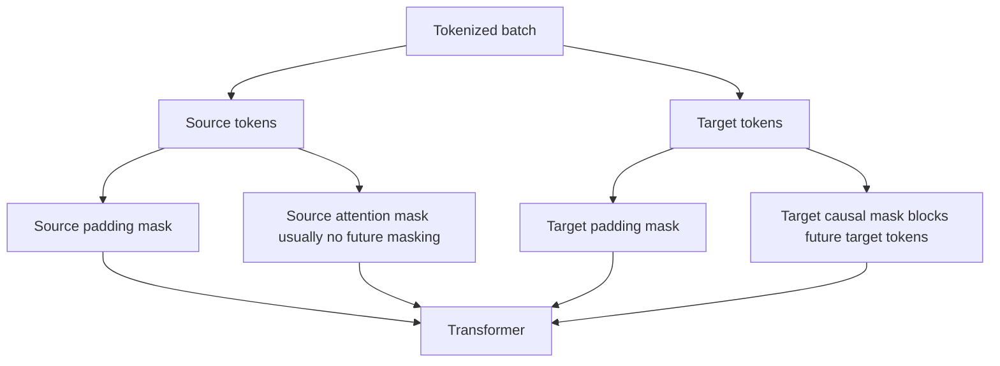
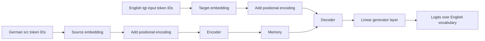
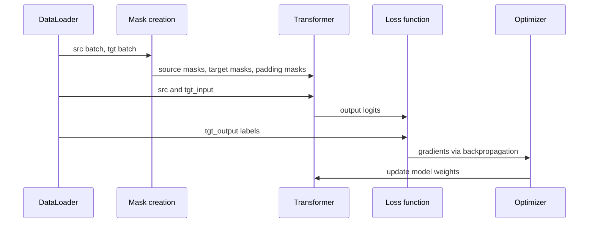
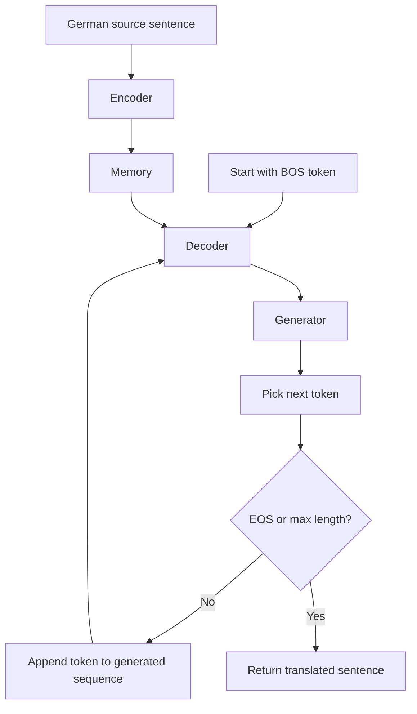

# Transformer Architecture for Translation — Beginner-Friendly Notes

Source transcript: `subtitle.txt`

## 1. Big Picture

This lesson explains how to build a **Transformer encoder-decoder model** in PyTorch for a translation task:

> German sentence → English sentence

Example:

```text
Source / src / German:  Eine Katze sitzt auf der Matte.
Target / tgt / English: A cat sits on the mat.
```

A translation Transformer has two main parts:

| Part | Job | Simple analogy |
|---|---|---|
| **Encoder** | Reads the full source sentence and builds a useful representation called **memory** | A reader who understands the German sentence |
| **Decoder** | Generates the target sentence one token at a time using the encoder memory | A writer who produces English while looking at the reader's notes |
| **Generator / Linear output layer** | Converts decoder hidden vectors into vocabulary logits | A classifier choosing the next English word |

---

## 2. Corrected Transcript Terminology

| Transcript wording | Better wording | Why |
|---|---|---|
| “encoder decoder model” | **encoder-decoder model** | Standard hyphenated term |
| “functions composition” | **function composition / model components** | The lesson is showing how functions/modules fit together |
| “invoke the square mask from before” | **create a square subsequent/causal mask** | The target mask prevents attention to future target tokens |
| “array of Boolean values initialized to false” | **source attention mask can be all False / no blocking** | Source tokens can usually attend to all source tokens |
| “EOS tag” | **EOS token** | EOS is a special token, not usually called a tag |
| “predicted words index” | **predicted word’s index** | Grammar correction |
| “primitive model” | Likely **pretrained model** or **trained model** | “Primitive model” is probably a transcript error |
| “learning rates and momentums” | **learning rate and optimizer hyperparameters** | Adam uses betas, not classic SGD-style momentum wording |
| “target output is target input shifted forward” | **target output is the target sequence shifted one step ahead** | More precise |

---

## 3. Vocabulary: The Core Objects

### Source and Target

In translation, each training example is a pair:

```text
src = German sentence
tgt = English sentence
```

For example:

```text
src: "Ich liebe maschinelles Lernen."
tgt: "I love machine learning."
```

After tokenization, each sentence becomes a list of token IDs:

```text
src_tokens = [BOS, ich, liebe, maschinelles, lernen, EOS]
tgt_tokens = [BOS, i, love, machine, learning, EOS]
```

### Important special tokens

| Token | Meaning |
|---|---|
| `BOS` / `SOS` | Beginning/start of sentence |
| `EOS` | End of sentence |
| `PAD` | Padding token used to make sequences in a batch the same length |
| `UNK` | Unknown token, used when a token is not in the vocabulary |

---

## 4. What the DataLoader Does

The transcript mentions loading a dataset with a **batch size of 100**.

A **DataLoader** takes individual examples and groups them into batches.

Instead of sending one sentence pair at a time:

```text
Example 1: German sentence → English sentence
Example 2: German sentence → English sentence
Example 3: German sentence → English sentence
```

The DataLoader gives the model many examples at once:

```text
Batch of 100 German sentences
Batch of 100 English sentences
```

This improves training efficiency because GPUs are good at processing many examples in parallel.

### Why padding is needed

Sentences have different lengths:

```text
"I run."                  → short
"I enjoy learning PyTorch." → longer
```

A batch must usually be shaped like a rectangle/tensor, so shorter sentences are padded:

```text
Sentence A: [BOS, i, run, EOS, PAD, PAD]
Sentence B: [BOS, i, enjoy, learning, pytorch, EOS]
```

The model should ignore `PAD`, so we create **padding masks**.

---

## 5. The Three Main Masks

Transformers use masks to control what tokens the model can “see.”

### 5.1 Source mask

The source sentence is fully known from the beginning.

For translation:

```text
German: Ich liebe maschinelles Lernen.
```

The encoder can look at every German token at once.

So the source mask is often empty or all `False`, meaning:

> Do not block any real source tokens.

### 5.2 Target causal mask

The decoder must not cheat by looking at future English tokens.

During training, the full target sentence is known:

```text
Target: [BOS, I, love, machine, learning, EOS]
```

But when predicting `love`, the decoder should only see:

```text
[BOS, I]
```

It should not see:

```text
[machine, learning, EOS]
```

That is why we create a **causal mask**, also called a **look-ahead mask** or **subsequent mask**.

### 5.3 Padding masks

Padding tokens are fake tokens added only for batching.

The model should ignore them.

```text
[BOS, I, run, EOS, PAD, PAD]
```

The padding mask marks `PAD` positions as `True`, meaning:

> Ignore these positions.

---

## 6. Mask Diagram



---

## 7. Causal Mask Example

Suppose the target input has 5 tokens:

```text
[BOS, I, love, machine, learning]
```

The decoder can attend like this:

| Predicting at position | Can see tokens |
|---|---|
| 0 | `BOS` |
| 1 | `BOS, I` |
| 2 | `BOS, I, love` |
| 3 | `BOS, I, love, machine` |
| 4 | `BOS, I, love, machine, learning` |

A causal mask blocks future positions:

```text
Allowed attention matrix

          BOS   I   love   machine   learning
BOS        ✓    ✗     ✗       ✗          ✗
I          ✓    ✓     ✗       ✗          ✗
love       ✓    ✓     ✓       ✗          ✗
machine    ✓    ✓     ✓       ✓          ✗
learning   ✓    ✓     ✓       ✓          ✓
```

---

## 8. Embeddings and Positional Encoding

Transformers do not directly understand words. They understand vectors.

### Token embedding

A token embedding turns token IDs into learned vectors.

```text
token ID 42 → [0.12, -0.08, 0.44, ...]
```

For translation, we usually have:

| Embedding layer | Used for |
|---|---|
| Source embedding | German token IDs |
| Target embedding | English token IDs |

### Positional encoding

Self-attention by itself does not know token order.

Without position information, these could look too similar:

```text
dog bites man
man bites dog
```

Same words, different order, different meaning.

**Positional encoding** injects information about where each token appears in the sequence.

```text
token embedding + positional encoding = position-aware token vector
```

---

## 9. Model Architecture

The transcript describes building an encoder-decoder Transformer with these pieces:

1. Source token embedding
2. Target token embedding
3. Positional encoding
4. Transformer encoder-decoder
5. Generator / linear layer



---

## 10. What “Memory” Means

The transcript says the encoder produces an encoded vector called **memory**.

This does **not** mean memory like RAM.

In a Transformer translation model, **memory** means:

> The encoder’s contextual representation of the source sentence.

Example:

```text
German source:
"Ich liebe maschinelles Lernen."

Encoder memory:
A set of vectors representing the meaning and context of the German sentence.
```

The decoder uses this memory while producing English.

---

## 11. Forward Pass

The model’s `forward` method usually does this:

```text
source token IDs
→ source embedding
→ positional encoding
→ encoder

target input token IDs
→ target embedding
→ positional encoding
→ decoder, using encoder memory

decoder output
→ linear generator layer
→ logits over vocabulary
```

### What are logits?

**Logits** are raw scores before softmax.

If the English vocabulary has 10,000 tokens, then for each predicted position the model outputs 10,000 scores.

Example:

```text
Position 3 logits:
cat: 2.1
dog: 1.7
machine: 5.4
banana: -1.2
...
```

The highest score is the model’s strongest prediction.

---

## 12. Training: Teacher Forcing

The transcript says the target input is the target sequence with the last token removed.

That is standard for training sequence-to-sequence Transformers.

Suppose the correct target sentence is:

```text
[BOS, I, love, machine, learning, EOS]
```

We split it into:

```text
target input:
[BOS, I, love, machine, learning]

target output / labels:
[I, love, machine, learning, EOS]
```

The model receives the target input and learns to predict the next token at each position.

| Given to decoder | Model should predict |
|---|---|
| `BOS` | `I` |
| `BOS, I` | `love` |
| `BOS, I, love` | `machine` |
| `BOS, I, love, machine` | `learning` |
| `BOS, I, love, machine, learning` | `EOS` |

This is called **teacher forcing** because during training the decoder receives the correct previous target tokens, not its own mistaken predictions.

---

## 13. Training Flow Diagram



---

## 14. PyTorch-Shaped Pseudocode: Mask Creation

This is not exact runnable code, but it shows the shape of the idea.

```python
def generate_square_subsequent_mask(size):
    # True means "block attention"
    mask = torch.triu(torch.ones(size, size), diagonal=1).bool()
    return mask


def create_mask(src, tgt, pad_idx):
    src_seq_len = src.shape[0]
    tgt_seq_len = tgt.shape[0]

    # Encoder can usually see the full source sequence.
    src_mask = torch.zeros((src_seq_len, src_seq_len)).bool()

    # Decoder cannot see future target tokens.
    tgt_mask = generate_square_subsequent_mask(tgt_seq_len)

    # Padding masks mark PAD positions so the model can ignore them.
    src_padding_mask = (src == pad_idx).transpose(0, 1)
    tgt_padding_mask = (tgt == pad_idx).transpose(0, 1)

    return src_mask, tgt_mask, src_padding_mask, tgt_padding_mask
```

### Shape intuition

Common PyTorch Transformer examples use sequence-first tensors:

```text
src shape: [src_seq_len, batch_size]
tgt shape: [tgt_seq_len, batch_size]
```

Some newer code uses batch-first tensors:

```text
src shape: [batch_size, src_seq_len]
tgt shape: [batch_size, tgt_seq_len]
```

Always check whether your model uses `batch_first=True`.

---

## 15. PyTorch-Shaped Pseudocode: Model

```python
class Seq2SeqTransformer(nn.Module):
    def __init__(
        self,
        num_encoder_layers,
        num_decoder_layers,
        emb_size,
        nhead,
        src_vocab_size,
        tgt_vocab_size,
        dim_feedforward,
        dropout
    ):
        super().__init__()

        self.src_tok_emb = TokenEmbedding(src_vocab_size, emb_size)
        self.tgt_tok_emb = TokenEmbedding(tgt_vocab_size, emb_size)
        self.positional_encoding = PositionalEncoding(emb_size, dropout)

        self.transformer = nn.Transformer(
            d_model=emb_size,
            nhead=nhead,
            num_encoder_layers=num_encoder_layers,
            num_decoder_layers=num_decoder_layers,
            dim_feedforward=dim_feedforward,
            dropout=dropout
        )

        # Converts decoder hidden vectors into vocabulary scores.
        self.generator = nn.Linear(emb_size, tgt_vocab_size)

    def forward(
        self,
        src,
        tgt,
        src_mask,
        tgt_mask,
        src_padding_mask,
        tgt_padding_mask,
        memory_key_padding_mask
    ):
        src_emb = self.positional_encoding(self.src_tok_emb(src))
        tgt_emb = self.positional_encoding(self.tgt_tok_emb(tgt))

        transformer_output = self.transformer(
            src_emb,
            tgt_emb,
            src_mask=src_mask,
            tgt_mask=tgt_mask,
            src_key_padding_mask=src_padding_mask,
            tgt_key_padding_mask=tgt_padding_mask,
            memory_key_padding_mask=memory_key_padding_mask
        )

        return self.generator(transformer_output)
```

---

## 16. PyTorch-Shaped Pseudocode: Training Loop

```python
def train_epoch(model, dataloader, optimizer, loss_fn, pad_idx):
    model.train()
    total_loss = 0

    for src, tgt in dataloader:
        # Example:
        # tgt = [BOS, I, love, machine, learning, EOS]

        tgt_input = tgt[:-1, :]   # remove EOS
        tgt_output = tgt[1:, :]   # remove BOS

        masks = create_mask(src, tgt_input, pad_idx)
        src_mask, tgt_mask, src_padding_mask, tgt_padding_mask = masks

        logits = model(
            src,
            tgt_input,
            src_mask,
            tgt_mask,
            src_padding_mask,
            tgt_padding_mask,
            src_padding_mask
        )

        optimizer.zero_grad()

        # Flatten so CrossEntropyLoss compares:
        # [all token predictions] vs [all correct next tokens]
        loss = loss_fn(
            logits.reshape(-1, logits.shape[-1]),
            tgt_output.reshape(-1)
        )

        loss.backward()
        optimizer.step()

        total_loss += loss.item()

    return total_loss / len(dataloader)
```

---

## 17. Validation / Evaluation

Validation is similar to training, but without weight updates.

```python
def evaluate(model, dataloader, loss_fn, pad_idx):
    model.eval()
    total_loss = 0

    with torch.no_grad():
        for src, tgt in dataloader:
            tgt_input = tgt[:-1, :]
            tgt_output = tgt[1:, :]

            masks = create_mask(src, tgt_input, pad_idx)
            src_mask, tgt_mask, src_padding_mask, tgt_padding_mask = masks

            logits = model(
                src,
                tgt_input,
                src_mask,
                tgt_mask,
                src_padding_mask,
                tgt_padding_mask,
                src_padding_mask
            )

            loss = loss_fn(
                logits.reshape(-1, logits.shape[-1]),
                tgt_output.reshape(-1)
            )

            total_loss += loss.item()

    return total_loss / len(dataloader)
```

### Training vs validation

| Phase | Uses gradients? | Updates weights? | Purpose |
|---|---:|---:|---|
| Training | Yes | Yes | Learn from data |
| Validation | No | No | Estimate performance on unseen examples |

---

## 18. Inference / Translation

During inference, the model does not have the correct English sentence.

It only has the German source sentence.

So it generates English one token at a time:

```text
Step 1: [BOS] → predict "I"
Step 2: [BOS, I] → predict "love"
Step 3: [BOS, I, love] → predict "machine"
Step 4: [BOS, I, love, machine] → predict "learning"
Step 5: [BOS, I, love, machine, learning] → predict EOS
```



---

## 19. PyTorch-Shaped Pseudocode: Greedy Decoding

This is called **greedy decoding** because it picks the highest-scoring token at each step.

```python
def greedy_decode(model, src, src_mask, max_len, start_symbol, eos_symbol):
    model.eval()

    memory = model.encode(src, src_mask)

    # Start generated sequence with BOS.
    ys = torch.ones(1, 1).fill_(start_symbol).long()

    for _ in range(max_len - 1):
        tgt_mask = generate_square_subsequent_mask(ys.size(0))

        out = model.decode(ys, memory, tgt_mask)

        # Take the decoder output at the latest position.
        latest_hidden = out[-1]

        logits = model.generator(latest_hidden)

        # Choose the token with the highest score.
        next_token = torch.argmax(logits, dim=-1).item()

        ys = torch.cat([
            ys,
            torch.ones(1, 1).fill_(next_token).long()
        ])

        if next_token == eos_symbol:
            break

    return ys
```

---

## 20. Training vs Inference

| Concept | Training | Inference |
|---|---|---|
| Source sentence available? | Yes | Yes |
| Correct target sentence available? | Yes | No |
| Decoder input | Correct previous target tokens | Previously generated tokens |
| Mask needed? | Yes, target causal mask | Yes, target causal mask |
| Main goal | Learn parameters | Generate translation |
| Uses loss? | Yes | Usually no |
| Updates model? | Yes | No |

---

## 21. Important Clarification: “The Transformer Relies on Its Own Previous Outputs”

The transcript says training is similar to inference because the Transformer relies on previous outputs.

A more precise explanation:

During **training**, the decoder usually receives the correct previous target tokens.

```text
Correct previous tokens:
[BOS, I, love]
```

During **inference**, the decoder receives its own generated previous tokens.

```text
Model-generated previous tokens:
[BOS, I, like]
```

So:

| Statement | Accurate? |
|---|---|
| “Training uses the model’s own previous predictions as inputs.” | Usually no, not with teacher forcing |
| “Inference uses the model’s own previous predictions as inputs.” | Yes |
| “The causal mask makes training behave like left-to-right prediction.” | Yes |
| “The model predicts next tokens during training and inference.” | Yes |

This distinction matters because a model can train well with teacher forcing but still make mistakes during inference if an early generated token is wrong.

---

## 22. Simple End-to-End Example

Imagine this training pair:

```text
src German:
"Ich esse Brot."

tgt English:
"I eat bread."
```

After tokenization:

```text
src:
[BOS, ich, esse, brot, EOS]

tgt:
[BOS, i, eat, bread, EOS]
```

Training split:

```text
tgt_input:
[BOS, i, eat, bread]

tgt_output:
[i, eat, bread, EOS]
```

The model learns:

```text
Given German memory + BOS → predict i
Given German memory + BOS i → predict eat
Given German memory + BOS i eat → predict bread
Given German memory + BOS i eat bread → predict EOS
```

---

## 23. Loss Function Intuition

For each output position, the model produces scores over the full English vocabulary.

If the target vocabulary has 30,000 tokens, then each position gets 30,000 logits.

Example:

```text
Correct next token: bread

Model scores:
bread: 8.2
apple: 4.1
dog: -0.5
the: 1.8
...
```

The loss function rewards the model when the correct token gets a high score and penalizes it when the correct token gets a low score.

Usually this is done with **cross-entropy loss**.

---

## 24. Hyperparameters Mentioned

The transcript mentions configuring hyperparameters and training settings.

Common Transformer hyperparameters include:

| Hyperparameter | Meaning |
|---|---|
| `batch_size` | Number of examples processed together |
| `emb_size` / `d_model` | Size of token vectors inside the Transformer |
| `nhead` | Number of attention heads |
| `num_encoder_layers` | Number of encoder blocks |
| `num_decoder_layers` | Number of decoder blocks |
| `dim_feedforward` | Size of the feed-forward layer inside each Transformer block |
| `dropout` | Randomly disables parts of the model during training to reduce overfitting |
| `learning_rate` | How large each optimizer update is |
| `max_len` | Maximum generated translation length |

---

## 25. Common Beginner Confusions

### Is the generator the same as the decoder?

No.

The **decoder** produces hidden vectors.

The **generator / linear layer** converts those hidden vectors into vocabulary-sized logits.

```text
Decoder output vector size: d_model
Generator output size: target vocabulary size
```

Example:

```text
d_model = 512
target vocabulary size = 30,000

decoder output: [512 numbers]
generator output: [30,000 scores]
```

### Why does the encoder not need a causal mask?

Because the full source sentence is already known.

The encoder is not generating the German sentence. It is reading it.

### Why does the decoder need a causal mask during training?

Because the full English sentence is available during training, but the model should learn to generate left-to-right.

Without the causal mask, it could cheat by looking ahead.

### Does the model output words directly?

No.

It outputs logits over token IDs.

Then those token IDs are mapped back into words or subword pieces using the vocabulary.

---

## 26. Mental Model

Think of translation as a two-person workflow:


The encoder reads.

The decoder writes.

The generator chooses the next word/token.

---

## 27. Minimal Glossary

| Term | Simple meaning |
|---|---|
| Transformer | Neural network architecture based on attention |
| Encoder | Reads the input sequence |
| Decoder | Generates the output sequence |
| Attention | Mechanism for deciding which tokens matter to each other |
| Mask | Blocks attention to certain positions |
| Causal mask | Blocks future target tokens |
| Padding mask | Blocks fake padding tokens |
| Embedding | Learned vector representation of a token |
| Positional encoding | Adds token order information |
| Memory | Encoder output used by decoder |
| Logits | Raw prediction scores before softmax |
| Greedy decoding | Always pick the highest-scoring next token |
| Teacher forcing | Training with correct previous target tokens |

---

## 28. Self-Check Questions

### Concept questions

1. In German-to-English translation, which language is usually `src`?
2. Which language is usually `tgt`?
3. Why does the encoder usually not need a causal mask?
4. Why does the decoder need a causal mask?
5. What is the purpose of a padding mask?
6. What is the difference between token embeddings and positional encoding?
7. What does the encoder’s “memory” represent?
8. What does the generator layer do?
9. During training, what is the difference between `tgt_input` and `tgt_output`?
10. During inference, why does the decoder use its own previous predictions?

### Practical questions

1. If the target sentence is `[BOS, I, like, cats, EOS]`, what is `tgt_input`?
2. For the same sentence, what is `tgt_output`?
3. If the target vocabulary has 20,000 tokens, how many logits are produced per target position?
4. Why should `PAD` tokens not contribute to attention?
5. What might happen if the decoder sees future target tokens during training?

### Answers

1. `src` is usually German in this lesson.
2. `tgt` is usually English.
3. The encoder reads the full source sentence at once; it is not generating future source tokens.
4. The decoder must learn to generate left-to-right without seeing future target tokens.
5. Padding masks tell the model to ignore fake `PAD` positions.
6. Token embeddings represent token identity; positional encoding represents token order.
7. Memory is the encoder’s contextual representation of the source sentence.
8. The generator maps decoder vectors to vocabulary logits.
9. `tgt_input` removes the final token; `tgt_output` removes the first token.
10. During inference there is no correct target sentence available, so the model feeds generated tokens back into itself.

Practical answers:

1. `tgt_input = [BOS, I, like, cats]`
2. `tgt_output = [I, like, cats, EOS]`
3. 20,000 logits per target position.
4. `PAD` tokens are not real content and can confuse attention.
5. The model could cheat and appear better during training than it really is during generation.

---

## 29. One-Sentence Summary

A Transformer translation model uses an **encoder** to understand the source sentence, a **decoder** to generate the target sentence one token at a time, **masks** to prevent cheating and ignore padding, and a **linear generator layer** to choose vocabulary tokens.
