# Fine-Tuning with PyTorch — Beginner-Friendly Notes

## 1. Big Picture

This lesson explains how to **fine-tune a transformer-based text classification model in PyTorch**.

The main idea:

> Start with a model that already learned useful language patterns from one dataset, then adapt it to a new task with a different dataset.

In the transcript, the model is first trained or assumed to be trained on **AG News**, then adapted to **IMDB movie review sentiment classification**.

---

## 2. Corrected Transcript Terminology

Some transcript words were likely auto-caption errors. Here are the important corrections.

| Transcript phrase | Correct term | Meaning |
|---|---|---|
| `pre train model` | **pre-trained model** | A model already trained before this task |
| `glove and beddings` | **GloVe embeddings** | Pre-trained word vectors from GloVe |
| `state dick` | **`state_dict`** | PyTorch dictionary of model parameters |
| `test classifier` | **text classifier** | A model that classifies text into categories |
| `loss criteria` / `lost criterion` | **loss criterion** | The loss function used for training |
| `epoch` | **epochs** | Full passes over the training dataset |
| `pre processes` | **preprocesses** | Cleans/converts raw text before modeling |
| `find tuned` | **fine-tuned** | Adapted a pre-trained model to a new task |
| `move your reviews` | **movie reviews** | The IMDB task uses movie reviews |

---

## 3. What Is Fine-Tuning?

**Fine-tuning** means taking a model that already knows something useful and training it more on a new, usually smaller or more specific dataset.

Layman's version:

> Fine-tuning is like hiring someone who already knows English and then training them to do a specific job, like classifying movie reviews as positive or negative.

Instead of starting from zero, you reuse what the model has already learned.

---

## 4. Datasets Used in the Lesson

### IMDB Dataset

The **IMDB dataset** contains movie reviews labeled as either positive or negative.

| Feature | Value |
|---|---|
| Task | Sentiment classification |
| Number of samples | About 50,000 movie reviews |
| Classes | 2 |
| Labels | Negative, Positive |

Example:

| Review | Label |
|---|---|
| `This movie was boring and predictable.` | Negative |
| `The acting was excellent and the story was moving.` | Positive |

In the transcript:

- `0` means negative / bad review
- `1` means positive / good review

### AG News Dataset

The **AG News dataset** contains short news articles classified into four topics.

| Feature | Value |
|---|---|
| Task | Topic classification |
| Training samples | About 120,000 |
| Test samples | About 7,600 |
| Classes | 4 |
| Labels | World, Sports, Business, Science/Technology |

Example:

| News text | Label |
|---|---|
| `The team won the championship after overtime.` | Sports |
| `Stocks rose after strong earnings reports.` | Business |

---

## 5. Why Train on AG News First, Then Fine-Tune on IMDB?

The lesson uses this flow:

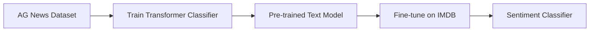

The reason is transfer learning.

The AG News task teaches the model general text patterns, such as:

- word relationships
- sentence structure
- topic clues
- how text maps to labels

Then IMDB fine-tuning specializes the model for sentiment:

- positive tone
- negative tone
- emotional wording
- review-specific language

Important note:

> AG News and IMDB are different tasks. AG News predicts news topic. IMDB predicts sentiment.

So the final output layer must change.

---

## 6. The Full Pipeline

The transcript describes a typical PyTorch text-classification pipeline.

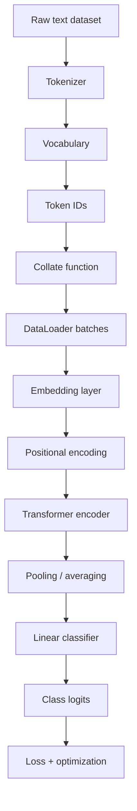

In plain English:

1. Start with raw text.
2. Break the text into tokens.
3. Convert tokens into numbers.
4. Group examples into batches.
5. Convert token IDs into vectors.
6. Add position information.
7. Pass the sequence through a transformer encoder.
8. Summarize the sequence.
9. Predict a class.
10. Compare prediction to the true label and update the model.

---

## 7. Tokenizer, Vocabulary, and Embeddings

### Tokenizer

A **tokenizer** breaks text into smaller pieces.

Example:

```text
"This movie was great!"
```

Might become:

```text
["this", "movie", "was", "great", "!"]
```

### Vocabulary

A **vocabulary** maps tokens to integer IDs.

Example:

| Token | ID |
|---|---:|
| `this` | 42 |
| `movie` | 817 |
| `great` | 233 |
| `<unk>` | 0 |

So this:

```text
["this", "movie", "was", "great"]
```

Becomes this:

```text
[42, 817, 91, 233]
```

### GloVe Embeddings

**GloVe embeddings** are pre-trained word vectors.

Layman's version:

> GloVe gives each word a starting meaning-vector before your model begins training.

For example, words like `good`, `great`, and `excellent` may start with vectors that are already somewhat close to each other.

This helps the model because it does not have to learn all word meanings from scratch.

---

## 8. Map-Style Dataset vs Iterator-Style Dataset

The transcript mentions converting the dataset into a **map-style dataset**.

A map-style dataset behaves like a list:

```python
example = dataset[10]
```

It supports random access by index.

This is useful because PyTorch can:

- shuffle examples
- split into training and validation sets
- load batches efficiently

Comparison:

| Dataset style | How it behaves | Simple analogy |
|---|---|---|
| Iterable dataset | Stream of examples | Reading a conveyor belt |
| Map-style dataset | Indexable collection | Looking up a page number in a book |

---

## 9. Training, Validation, and Test Splits

The transcript describes loading train/test data and creating a validation split.

Typical setup:

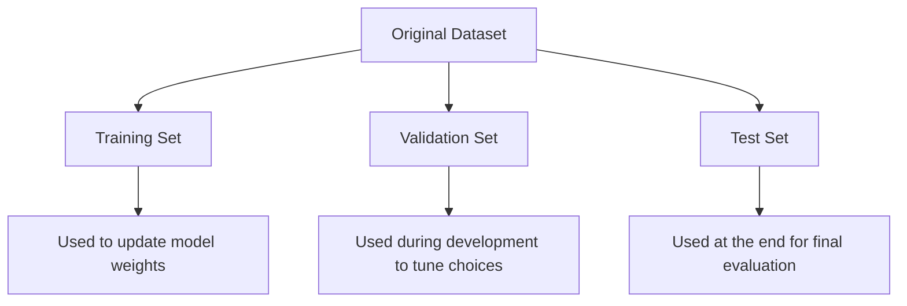

| Split | Used for | Does it update the model? |
|---|---|---|
| Training set | Learning parameters | Yes |
| Validation set | Checking progress and tuning decisions | No |
| Test set | Final unbiased evaluation | No |

Beginner warning:

> Do not repeatedly tune your model using the test set. The test set should represent unseen data.

---

## 10. What Does the Collate Function Do?

A **collate function** tells the DataLoader how to combine individual examples into one batch.

The transcript says the collate function:

- tokenizes the text
- converts tokens to token IDs
- converts IDs and labels into tensors
- prepares batches for the model

Layman's version:

> The collate function is the packing station. It takes loose examples and packs them into a batch the model can process.

### Example Before Collate

```text
Example 1: ("Great movie", 1)
Example 2: ("Bad acting", 0)
```

### Example After Tokenization

```text
Example 1 tokens: ["great", "movie"]
Example 2 tokens: ["bad", "acting"]
```

### Example After Vocabulary Lookup

```text
Example 1 IDs: [233, 817]
Example 2 IDs: [91, 502]
```

### Example Batch Tensors

```text
text_batch  = tensor([[233, 817],
                      [ 91, 502]])
label_batch = tensor([1, 0])
```

### Collate Function Diagram

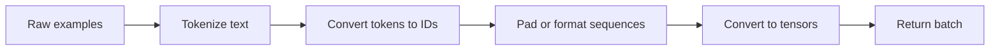

---

## 11. What Does the DataLoader Do?

A **DataLoader** repeatedly produces batches for training or evaluation.

Layman's version:

> The DataLoader is the delivery truck. The collate function packs the boxes, and the DataLoader delivers them to the model batch by batch.

The DataLoader can handle:

- batching
- shuffling
- parallel loading
- applying the collate function

Simple relationship:

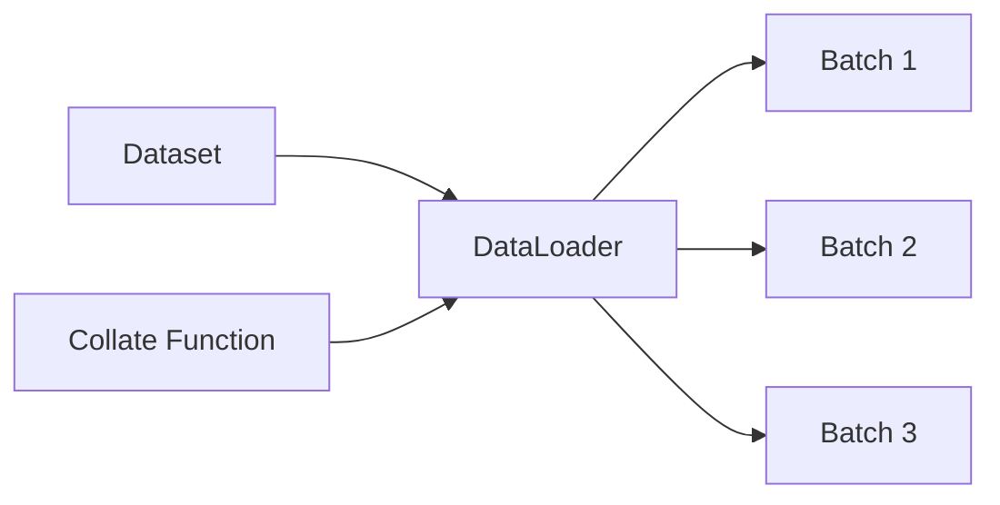

---

## 12. Transformer-Based Text Classifier

The transcript describes an **encoder model class for classification in PyTorch**.

The model contains:

1. Embedding layer
2. Positional encoding
3. Transformer encoder
4. Pooling / averaging step
5. Linear classifier

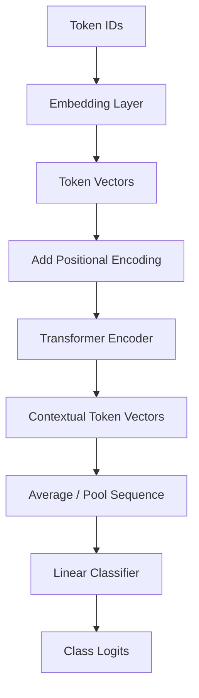

---

## 13. Embedding Layer

The embedding layer converts token IDs into dense vectors.

Example:

```text
Token ID: 817
```

Becomes something like:

```text
[0.12, -0.44, 0.09, ..., 0.31]
```

The model cannot understand raw words directly. It works with numbers.

---

## 14. Positional Encoding

A transformer does not naturally know word order from attention alone.

So positional encoding tells the model where each token appears in the sequence.

Example:

```text
"dog bites man"
```

is different from:

```text
"man bites dog"
```

They use the same words, but the order changes the meaning.

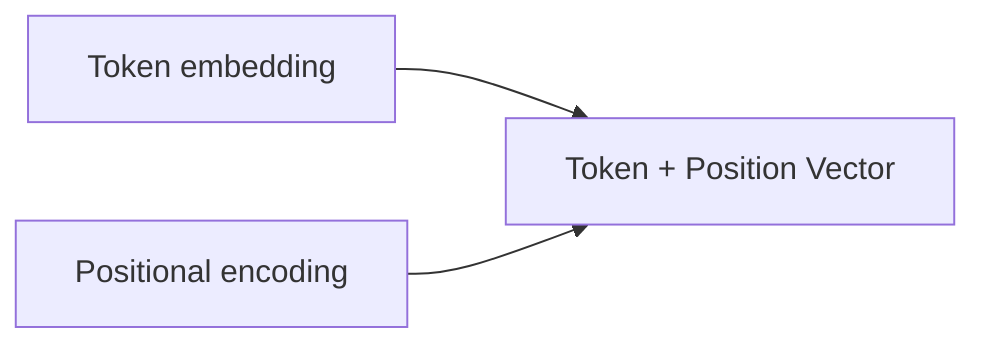

Layman's version:

> Token embeddings say what the words are. Positional encodings say where the words are.

---

## 15. Transformer Encoder

A **transformer encoder** reads the whole input sequence and creates context-aware token vectors.

Before context:

```text
"bank" could mean river bank or financial bank
```

After context:

```text
"I deposited money at the bank"
```

The model can infer that `bank` probably means a financial institution.

The encoder uses attention to let each token look at other tokens.

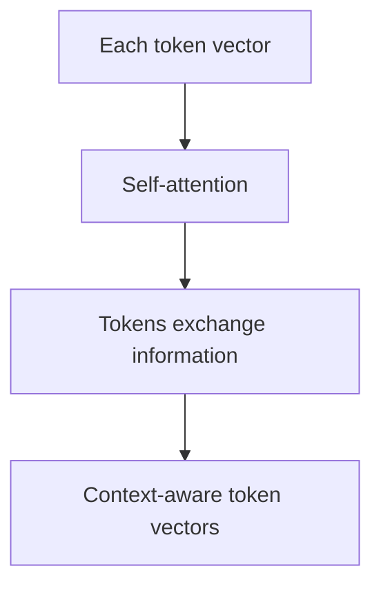

---

## 16. Pooling / Averaging the Sequence

The transcript says the model averages along the first dimension before classification.

For text classification, the model needs one final vector representing the whole input.

If each token has a vector, the model may average them:

```text
token_1_vector
 token_2_vector
 token_3_vector
       ↓ average
single_review_vector
```

Then the classifier predicts the label from that single vector.

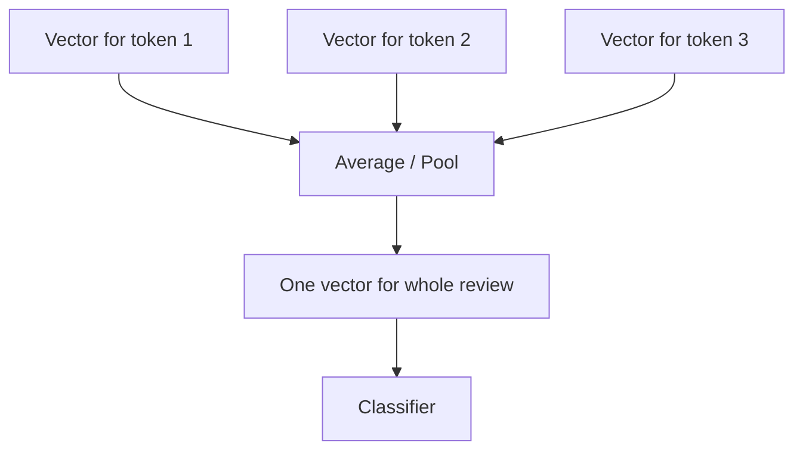

---

## 17. Linear Classifier and Output Classes

The final layer maps the model's learned representation to class scores.

These scores are called **logits**.

For AG News, there are 4 classes:

```text
World, Sports, Business, Science/Technology
```

So the output layer has 4 output neurons.

For IMDB, there are 2 classes:

```text
Negative, Positive
```

So the output layer has 2 output neurons.

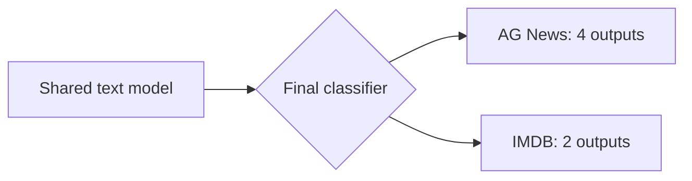

Key rule:

> The number of output neurons must match the number of target classes.

---

## 18. Why Change the Final Layer from 4 to 2?

The model trained on AG News originally predicted 4 categories.

But IMDB only has 2 categories.

So this output layer:

```text
[World, Sports, Business, Science/Technology]
```

must become this:

```text
[Negative, Positive]
```

That means the final classifier must be replaced or redefined.

PyTorch-shaped idea:

```python
# AG News model: 4 classes
model.classifier = nn.Linear(hidden_dim, 4)

# IMDB fine-tuning: 2 classes
model.classifier = nn.Linear(hidden_dim, 2)
```

---

## 19. What Is `state_dict`?

The transcript says `load state dick`, but the correct PyTorch term is:

```python
load_state_dict
```

A model's **`state_dict`** is a dictionary containing learned parameters.

Layman's version:

> `state_dict` is the saved memory of what the model learned.

Example:

```python
model.load_state_dict(torch.load("ag_news_model.pt"))
```

This loads the weights from the AG News-trained model into the current model.

Important caveat:

> If the final layer shape changed from 4 outputs to 2 outputs, you usually cannot load that final layer directly without handling the mismatch.

Common approach:

```python
# 1. Build model with AG News output size
model = TextClassifier(num_classes=4)
model.load_state_dict(torch.load("ag_news_model.pt"))

# 2. Replace final layer for IMDB
model.classifier = nn.Linear(hidden_dim, 2)
```

---

## 20. Two Fine-Tuning Strategies

The transcript compares two approaches.

### Strategy A: Fine-Tune the Complete Model

All model parameters are trainable.

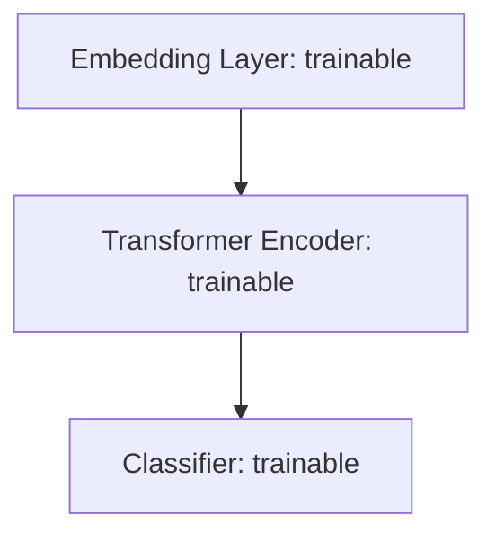

Pros:

- usually better performance
- model can deeply adapt to the new task

Cons:

- slower
- more compute required
- greater risk of overfitting if dataset is small

The transcript says this approach achieved about **90% validation accuracy**.

### Strategy B: Fine-Tune Only the Final Layer

Most of the model is frozen. Only the classifier is trained.

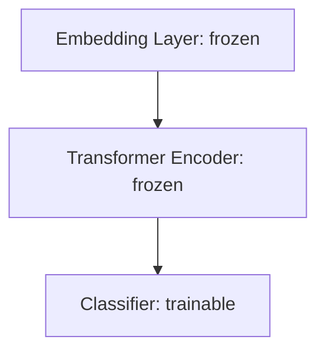

Pros:

- faster
- cheaper
- less memory/computation

Cons:

- often worse performance
- model cannot deeply adapt to the new task

The transcript says this was much faster but significantly worse.

---

## 21. What Does Freezing Layers Mean?

Freezing a layer means its parameters are not updated during training.

In PyTorch, this is done by setting:

```python
param.requires_grad = False
```

Example:

```python
for param in model.parameters():
    param.requires_grad = False

# Unfreeze only the final classifier
for param in model.classifier.parameters():
    param.requires_grad = True
```

Layman's version:

> Freezing says: keep this part of the model's knowledge fixed. Only train the part I leave unfrozen.

---

## 22. Full Fine-Tuning vs Final-Layer Fine-Tuning

| Feature | Full model fine-tuning | Final-layer-only fine-tuning |
|---|---|---|
| What changes? | All weights | Only classifier weights |
| Speed | Slower | Faster |
| Compute cost | Higher | Lower |
| Adaptability | Stronger | Weaker |
| Performance | Usually better | Usually worse |
| Risk | More overfitting possible | Less adaptation possible |

Simple analogy:

> Full fine-tuning retrains the whole worker for a new job. Final-layer fine-tuning keeps the worker's habits fixed and only changes the final decision rule.

---

## 23. Training Loop: What Happens During Training?

A training loop usually does this:

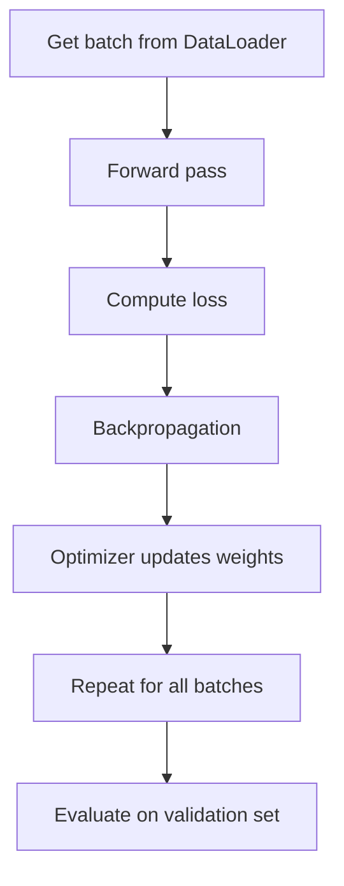

PyTorch-shaped pseudocode:

```python
for epoch in range(num_epochs):
    model.train()

    for text_batch, label_batch in train_loader:
        # 1. Move data to CPU/GPU
        text_batch = text_batch.to(device)
        label_batch = label_batch.to(device)

        # 2. Clear old gradients
        optimizer.zero_grad()

        # 3. Forward pass
        logits = model(text_batch)

        # 4. Compute loss
        loss = criterion(logits, label_batch)

        # 5. Backpropagation
        loss.backward()

        # 6. Update parameters
        optimizer.step()

    # 7. Check validation accuracy after each epoch
    val_accuracy = evaluate(model, validation_loader)
```

---

## 24. Loss Function, Optimizer, and Scheduler

The transcript mentions defining:

- loss function
- optimizer
- scheduler

### Loss Function

The loss function measures how wrong the model is.

For classification, a common choice is:

```python
criterion = nn.CrossEntropyLoss()
```

Layman's version:

> Loss is the model's mistake score. Lower is better.

### Optimizer

The optimizer updates the model weights.

Example:

```python
optimizer = torch.optim.Adam(model.parameters(), lr=1e-4)
```

Layman's version:

> The optimizer is the rule for how the model learns from mistakes.

### Scheduler

A scheduler changes the learning rate over time.

Example:

```python
scheduler.step()
```

Layman's version:

> The scheduler controls how big or small the learning steps are as training progresses.

---

## 25. Prediction Function

The transcript describes a `predict` function.

A prediction function usually:

1. Takes raw text.
2. Applies the text pipeline.
3. Converts text into token IDs/tensors.
4. Runs the model.
5. Chooses the class with the highest logit.

PyTorch-shaped pseudocode:

```python
def predict(text: str, model, text_pipeline):
    model.eval()

    with torch.no_grad():
        token_ids = text_pipeline(text)
        tensor = torch.tensor(token_ids).unsqueeze(0).to(device)
        logits = model(tensor)
        predicted_class = logits.argmax(dim=1).item()

    return predicted_class
```

Example:

```python
predict("This movie was surprisingly beautiful.", model, text_pipeline)
# returns 1, meaning positive
```

---

## 26. Evaluation Function

An evaluation function checks model accuracy on a dataset.

Accuracy means:

```text
number of correct predictions / total predictions
```

Example:

```text
90 correct out of 100 = 90% accuracy
```

PyTorch-shaped pseudocode:

```python
def evaluate(model, data_loader):
    model.eval()
    correct = 0
    total = 0

    with torch.no_grad():
        for text_batch, label_batch in data_loader:
            text_batch = text_batch.to(device)
            label_batch = label_batch.to(device)

            logits = model(text_batch)
            predictions = logits.argmax(dim=1)

            correct += (predictions == label_batch).sum().item()
            total += label_batch.size(0)

    return correct / total
```

---

## 27. Simple End-to-End Pseudocode

This is not exact runnable code. It is shaped like PyTorch to show the main ideas.

```python
# 1. Load datasets
ag_news_train, ag_news_test = load_ag_news()
imdb_train, imdb_test = load_imdb()

# 2. Build tokenizer and vocabulary
vocab = build_vocab_from_glove()

# 3. Create collate function
def collate_batch(batch):
    texts = []
    labels = []

    for label, text in batch:
        tokens = tokenizer(text)
        token_ids = vocab(tokens)
        texts.append(torch.tensor(token_ids))
        labels.append(label)

    text_tensor = pad_sequence(texts, batch_first=True)
    label_tensor = torch.tensor(labels)

    return text_tensor, label_tensor

# 4. Create DataLoaders
train_loader = DataLoader(imdb_train, batch_size=32, collate_fn=collate_batch)
valid_loader = DataLoader(imdb_valid, batch_size=32, collate_fn=collate_batch)

# 5. Load pre-trained AG News model
model = TextClassifier(num_classes=4)
model.load_state_dict(torch.load("ag_news_model.pt"))

# 6. Replace classifier for IMDB
model.classifier = nn.Linear(hidden_dim, 2)

# 7. Fine-tune on IMDB
criterion = nn.CrossEntropyLoss()
optimizer = torch.optim.Adam(model.parameters(), lr=1e-4)

train_model(model, train_loader, valid_loader, criterion, optimizer)
```

---

## 28. Important Beginner Mental Model

Think of the model as two parts:

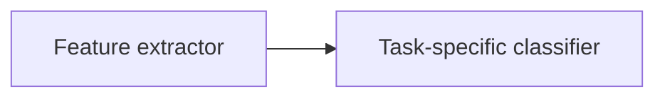

The feature extractor learns useful patterns from text.

The classifier maps those patterns to task labels.

For AG News:

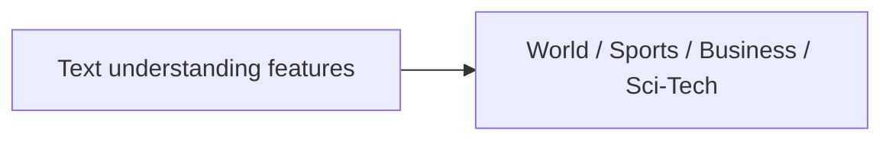

For IMDB:

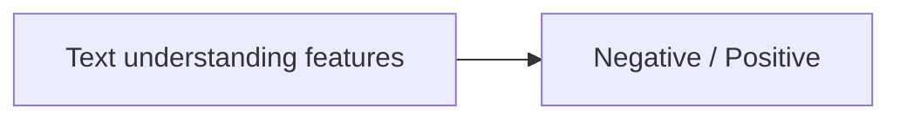

Fine-tuning changes the model so the learned text features become useful for the new task.

---

## 29. Common Beginner Confusions

### Confusion 1: Is AG News pre-training the same as language-model pretraining?

Not exactly.

AG News classification training is **supervised pre-training for transfer** in this lesson.

A large language model is usually pre-trained with objectives like next-token prediction or masked language modeling.

So in this lesson, “pre-trained on AG News” means:

> The model was trained on one classification task before being adapted to another classification task.

### Confusion 2: Why does the final layer need to change?

Because the number of classes changed.

AG News has 4 labels.

IMDB has 2 labels.

A classifier cannot use a 4-class output layer for a 2-class task unless you redefine how outputs are interpreted. The normal solution is to replace the final layer.

### Confusion 3: Does freezing mean the model stops working?

No.

Frozen layers still run during the forward pass.

They just do not learn new weights during backpropagation.

### Confusion 4: Why is final-layer-only fine-tuning worse?

Because the model's earlier layers stay adapted to the old task.

Only the final decision layer changes.

That may not be enough when the new task is meaningfully different.

---

## 30. Practical Engineering Notes

### Use full fine-tuning when:

- you need better accuracy
- you have enough compute
- the new task differs from the old task
- the dataset is large enough to avoid severe overfitting

### Use final-layer fine-tuning when:

- you need fast training
- compute is limited
- the new task is very similar to the old task
- you want a quick baseline

### Good workflow:

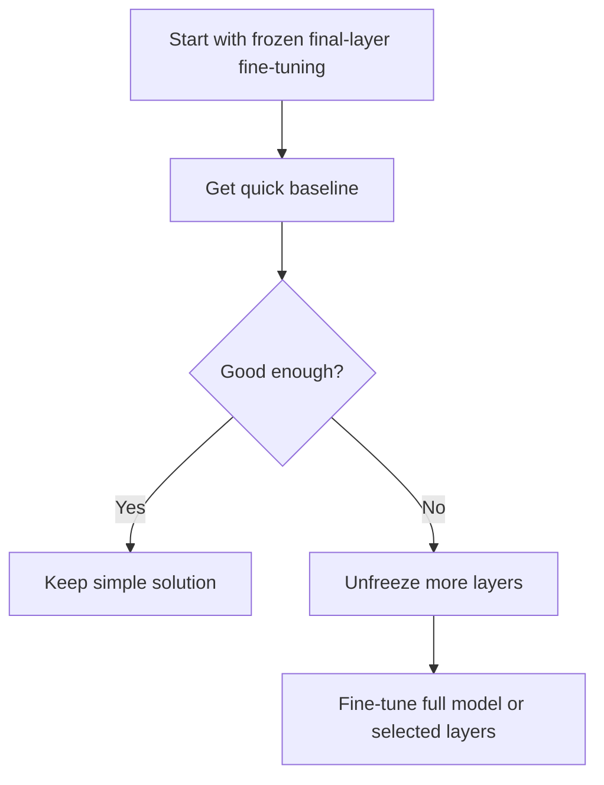

---

## 31. Mini Glossary

| Term | Simple meaning |
|---|---|
| Fine-tuning | Training a pre-trained model more on a new task |
| Tokenizer | Converts text into tokens |
| Vocabulary | Maps tokens to IDs |
| Embedding | Vector representation of a token |
| GloVe | Pre-trained word embeddings |
| DataLoader | Produces batches from a dataset |
| Collate function | Converts raw examples into model-ready batches |
| Transformer encoder | Reads text and creates context-aware token vectors |
| Positional encoding | Adds word-order information |
| Logits | Raw class scores before probabilities |
| Loss | Mistake score |
| Optimizer | Updates weights to reduce loss |
| Scheduler | Adjusts learning rate over time |
| `state_dict` | Saved model weights |
| Freezing | Preventing parameters from being updated |
| `requires_grad` | PyTorch flag controlling whether gradients are computed |

---

## 32. Self-Check Questions

### Concept Questions

1. What does fine-tuning mean?
2. Why might a model trained on AG News help with IMDB classification?
3. What is the difference between AG News and IMDB as classification tasks?
4. Why does the final layer change from 4 outputs to 2 outputs?
5. What does it mean to freeze a layer?
6. Why is final-layer-only fine-tuning faster?
7. Why might final-layer-only fine-tuning perform worse?
8. What does the collate function do?
9. What does the DataLoader do?
10. What is stored inside a PyTorch `state_dict`?

### Applied Questions

1. If a dataset has 10 categories, how many output neurons should the final classifier have?
2. If you freeze every layer, including the classifier, will the model learn? Why or why not?
3. If your validation accuracy is improving but test accuracy is poor, what might be happening?
4. If your new dataset is very small, why might full fine-tuning be risky?
5. If your new task is very different from the old task, why might final-layer-only fine-tuning be too limited?

---

## 33. Answers to Self-Check Questions

### Concept Answers

1. Fine-tuning means adapting a pre-trained model to a new task or dataset.
2. AG News can teach general text patterns that may transfer to other text tasks.
3. AG News predicts news topic; IMDB predicts positive or negative sentiment.
4. AG News has 4 classes, while IMDB has 2 classes.
5. Freezing means the layer still runs but its weights are not updated.
6. It trains fewer parameters, so there is less computation.
7. The frozen layers may not adapt enough to the new task.
8. It turns individual raw examples into batched tensors.
9. It repeatedly provides batches to the training or evaluation loop.
10. It stores the model's learned parameters.

### Applied Answers

1. The final classifier should have 10 output neurons.
2. No. If all layers are frozen, no trainable parameters can update.
3. The model may be overfitting to the validation-driven development process or the test distribution may differ.
4. Full fine-tuning may memorize the small dataset instead of learning general patterns.
5. The old features may not fit the new task well enough unless earlier layers can adapt.

---

## 34. Key Takeaways

- Fine-tuning adapts a pre-trained model to a new task.
- AG News has 4 classes; IMDB has 2 classes.
- The final classifier must match the number of target classes.
- `load_state_dict` loads saved PyTorch model parameters.
- The collate function prepares raw examples into tensors.
- The DataLoader supplies batches to the model.
- Full fine-tuning is slower but often better.
- Final-layer-only fine-tuning is faster but often less accurate.
- Freezing layers prevents their weights from changing.
- Validation accuracy helps monitor progress during training.

