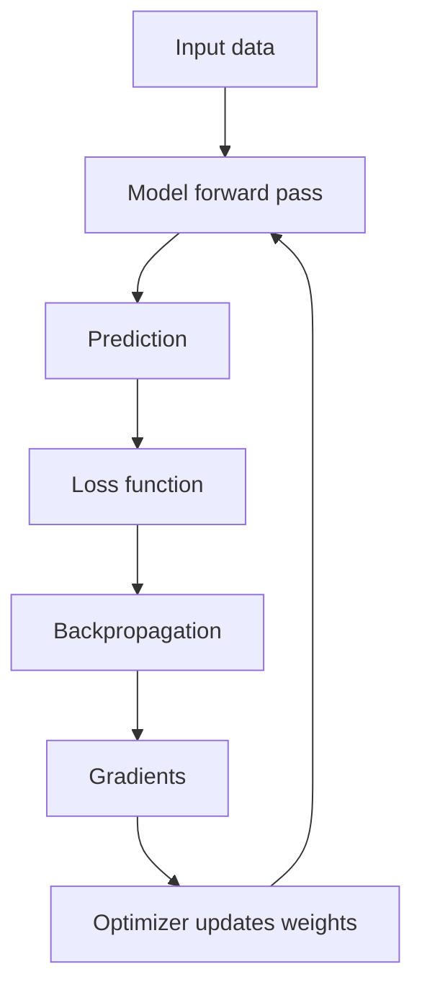
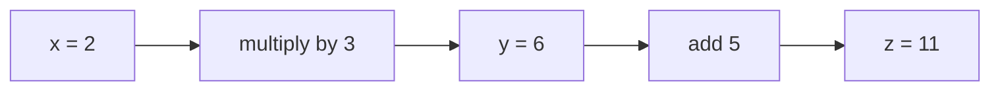
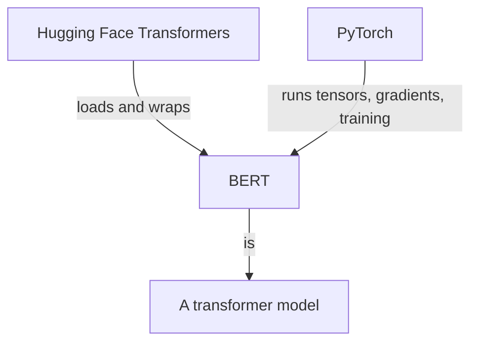
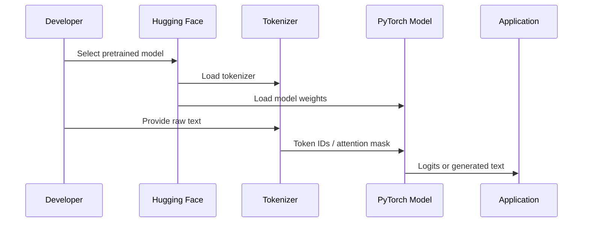
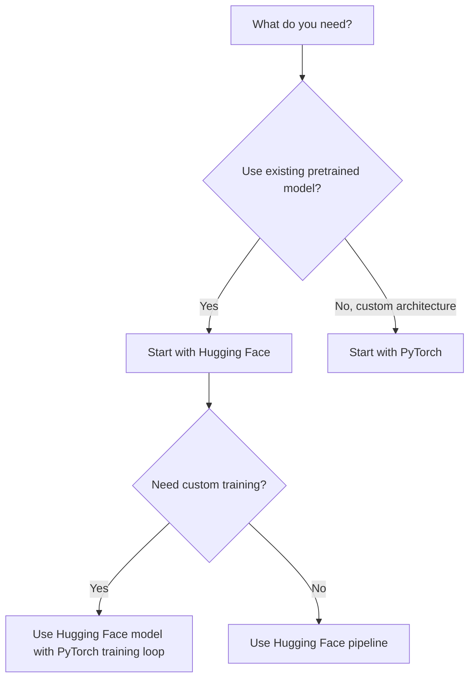
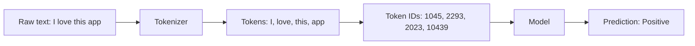
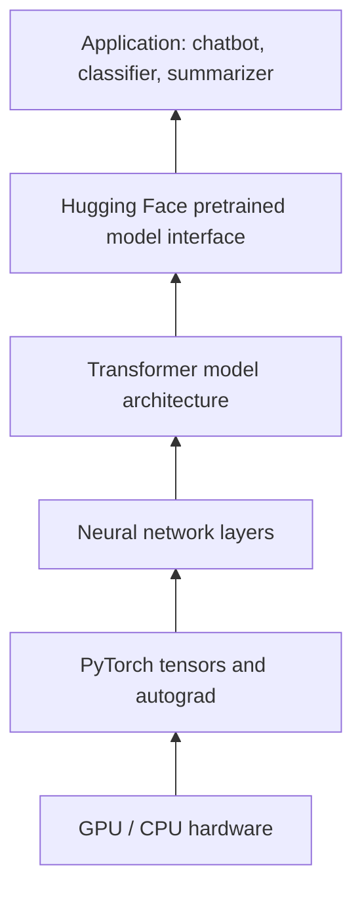

# Hugging Face vs. PyTorch — Beginner-Friendly Notes

## What this lesson is about

Compares **Hugging Face** and **PyTorch** in AI development, especially for **natural language processing (NLP)**.

A simple way to think about them:

| Tool | Layman’s explanation | Main role |
|---|---|---|
| **PyTorch** | The workshop where you build and train neural networks | Deep learning framework |
| **Hugging Face** | A model marketplace + toolbox that makes using existing models easier | Platform, community, and libraries for ML/NLP |

They are not really competitors in the strict sense. In practice, they often work together.

---

## Corrected transcript terminology

The transcript is mostly clear, but a few terms should be cleaned up.

| Transcript wording | Better wording | Why |
|---|---|---|
| “Hugging Face versus PyTorch” | “Hugging Face and PyTorch” or “Hugging Face vs. PyTorch” | They are different kinds of tools and are often used together. |
| “NLP models such as Hugging Face and PyTorch” | “NLP models can be built or used with tools such as Hugging Face and PyTorch” | Hugging Face and PyTorch are not NLP models themselves. |
| “Hugging Face Framework” | “Hugging Face ecosystem” or “Hugging Face platform/libraries” | Hugging Face is broader than one framework. |
| “transformer library” | “Transformers library” | The official library is commonly referred to as **Hugging Face Transformers**. |
| “Bert” | “BERT” | BERT is an acronym: Bidirectional Encoder Representations from Transformers. |
| “Facebook AI research now Meta” | “Facebook AI Research, now Meta AI” | PyTorch originated at Facebook AI Research; Facebook is now Meta. |
| “Torches machine learning library” | “Torch machine learning library” | PyTorch is connected historically to Torch. |
| “preconfigured, and even pre-trained models” | “prebuilt tools and pretrained models” | Cleaner phrasing. |
| “ML and MT” | “mBART, MarianMT, M2M100, or other machine translation models” | “ML and MT” sounds like a transcript error. MT means machine translation. |
| “As developer” | “As a developer” | Grammar correction. |
| “Hugging Face as transformers” | “Hugging Face Transformers” | Refers to the Transformers library. |

---

## Big picture

### Hugging Face

**Hugging Face** is a platform and ecosystem for machine learning. It is known for:

- pretrained models
- datasets
- model hosting
- demos
- community sharing
- easy-to-use libraries, especially for NLP

It is often called the **GitHub of machine learning** because people can share, download, test, and collaborate around models and datasets.

### PyTorch

**PyTorch** is an open-source deep learning framework used to build and train neural networks.

It gives you lower-level control over:

- tensors
- neural network layers
- training loops
- gradients
- GPUs
- custom model architecture

PyTorch is especially popular in research because it is flexible and Python-friendly.

---

## Layman’s analogy

Imagine you want to build a smart text assistant.

### PyTorch is like a machine shop

PyTorch gives you metal, tools, motors, wiring, and measuring instruments.

You can build almost anything, but you need to understand more of the engineering.

### Hugging Face is like a parts catalog and instruction kit

Hugging Face gives you ready-made engines, batteries, and example blueprints.

You can use a pretrained model quickly without building everything from scratch.

### Together

You might get a pretrained model from Hugging Face, then fine-tune it using PyTorch.


---

## What is Hugging Face?

Hugging Face started as a chatbot company, but it became a major machine learning platform and community.

Its ecosystem helps developers:

- find pretrained models
- use datasets
- train models
- deploy models
- share models with others
- create demos

### Key Hugging Face components

| Component | What it does |
|---|---|
| **Transformers** | Provides pretrained transformer models like BERT, GPT-style models, T5, etc. |
| **Datasets** | Helps load and process datasets. |
| **Tokenizers** | Fast tools for turning text into tokens. |
| **Hub** | Online platform for sharing models, datasets, and demos. |
| **Spaces** | Lets users host demos and apps. |
| **Evaluate** | Helps evaluate model performance. |

---

## What is PyTorch?

PyTorch is a deep learning framework.

It helps you define and train neural networks using Python.

At the center of PyTorch are **tensors**.

A tensor is like a general-purpose array of numbers.

Examples:

| Data | Possible tensor shape |
|---|---|
| One token embedding | `[768]` |
| One sentence of 128 token embeddings | `[128, 768]` |
| Batch of 32 sentences | `[32, 128, 768]` |
| Image batch | `[batch, channels, height, width]` |

---

## PyTorch’s core idea: tensors + gradients

In deep learning, the model makes predictions, compares them to the correct answers, then updates itself.

PyTorch tracks the calculations so it can compute gradients automatically.



### Layman’s explanation

Imagine a student taking practice quizzes.

1. The student answers.
2. The answer is compared with the correct answer.
3. The student sees what was wrong.
4. The student adjusts their understanding.
5. The process repeats.

That is roughly what training does.

---

## Dynamic computation graph

The transcript mentions PyTorch’s **dynamic computation graph**.

This is one of PyTorch’s most important features.

### What is a computation graph?

A computation graph records the operations used to produce an output.

Example:

```text
x = 2
y = x * 3
z = y + 5
```

The graph is:



In neural networks, the graph can be much larger.

### What does “dynamic” mean?

A **dynamic computation graph** is built as the code runs.

That means PyTorch can handle flexible model behavior more naturally.

For example, the model can use different paths depending on input length, conditions, or debugging experiments.

---

## Hugging Face vs. PyTorch

### Main comparison

| Question | Hugging Face | PyTorch |
|---|---|---|
| What is it? | Platform, model hub, and libraries | Deep learning framework |
| Best known for | Pretrained models and easy NLP workflows | Building and training neural networks |
| Level of abstraction | Higher-level | Lower-level |
| Common use | Use or fine-tune existing models | Build custom models and training loops |
| Beginner experience | Often easier for pretrained NLP models | More flexible but requires more ML knowledge |
| Typical workflow | `pipeline()`, `AutoModel`, `AutoTokenizer` | `torch.Tensor`, `nn.Module`, training loop |
| Works with GPUs? | Yes, often through PyTorch/TensorFlow/JAX backend | Yes, directly |
| Replaces the other? | No | No |

---

## Important distinction: library vs. model vs. framework

A common beginner confusion is mixing up the tool with the model.

### Example

**BERT** is a model architecture/model family.

**Hugging Face Transformers** is a library that can load BERT.

**PyTorch** is a framework that can run and train BERT.



---

## How Hugging Face and PyTorch work together

A common workflow is:

1. Choose a pretrained model from Hugging Face.
2. Load its tokenizer.
3. Load the model.
4. Convert text into tokens.
5. Run the model with PyTorch.
6. Fine-tune or use predictions.



---

## Simple example: sentiment analysis

Sentiment analysis classifies text as positive, negative, or neutral.

Example input:

```text
"The product was easy to use and worked well."
```

Possible output:

```text
Positive
```

### Hugging Face-style pseudocode

```python
# High-level Hugging Face-style workflow

from transformers import pipeline

classifier = pipeline("sentiment-analysis")

result = classifier("The product was easy to use and worked well.")

print(result)
```

This hides many details.

Under the hood, the pipeline handles:

- tokenizer loading
- model loading
- text preprocessing
- inference
- output formatting

---

## PyTorch-shaped pseudocode

This is not meant to be exact production code. It is shaped like a PyTorch training loop so you can understand the moving parts.

```python
# PyTorch-shaped pseudocode for text classification

import torch
from torch import nn
from torch.optim import AdamW

model = TextClassifier()
optimizer = AdamW(model.parameters(), lr=1e-5)
loss_fn = nn.CrossEntropyLoss()

for batch in dataloader:
    input_ids = batch["input_ids"]          # token IDs
    attention_mask = batch["attention_mask"]
    labels = batch["labels"]               # correct class IDs

    logits = model(input_ids, attention_mask)

    loss = loss_fn(logits, labels)

    optimizer.zero_grad()
    loss.backward()
    optimizer.step()
```

### What each piece means

| Code piece | Meaning |
|---|---|
| `model` | The neural network |
| `dataloader` | Feeds batches of examples |
| `input_ids` | Tokenized text represented as integer IDs |
| `attention_mask` | Tells the model which tokens are real and which are padding |
| `labels` | Correct answers |
| `logits` | Raw model scores before probabilities |
| `loss` | How wrong the model is |
| `loss.backward()` | Computes gradients |
| `optimizer.step()` | Updates model weights |

---

## Hugging Face + PyTorch fine-tuning pseudocode

This shows the relationship more clearly.

```python
# Hugging Face + PyTorch-shaped pseudocode

from transformers import AutoTokenizer, AutoModelForSequenceClassification
from torch.optim import AdamW

model_name = "distilbert-base-uncased"

tokenizer = AutoTokenizer.from_pretrained(model_name)
model = AutoModelForSequenceClassification.from_pretrained(
    model_name,
    num_labels=2
)

optimizer = AdamW(model.parameters(), lr=2e-5)

for batch in dataloader:
    # batch contains raw text and labels
    encoded = tokenizer(
        batch["text"],
        padding=True,
        truncation=True,
        return_tensors="pt"
    )

    logits = model(
        input_ids=encoded["input_ids"],
        attention_mask=encoded["attention_mask"]
    ).logits

    loss = cross_entropy(logits, batch["labels"])

    optimizer.zero_grad()
    loss.backward()
    optimizer.step()
```

### What Hugging Face handles here

- loading the pretrained tokenizer
- loading the pretrained model architecture
- loading pretrained weights
- formatting model inputs
- giving a standard interface

### What PyTorch handles here

- tensors
- forward pass execution
- loss calculation
- gradient tracking
- optimization
- GPU acceleration

---

## Common applications

The transcript lists several real-world NLP tasks.

### 1. Sentiment analysis

Classify whether text expresses a positive, negative, or neutral opinion.

Examples:

| Input | Output |
|---|---|
| “The app crashes every time I open it.” | Negative |
| “The service was fast and helpful.” | Positive |
| “The package arrived yesterday.” | Neutral |

Used in:

- customer reviews
- social media monitoring
- support ticket triage

---

### 2. Language translation

Convert text from one language to another.

Example:

```text
English: I need help with my account.
Spanish: Necesito ayuda con mi cuenta.
```

Common model families include translation-focused transformer models such as MarianMT, mBART, M2M100, and T5-style models.

---

### 3. Question answering

The model answers a question using a provided context.

Example:

```text
Context:
PyTorch is an open-source deep learning framework.

Question:
What is PyTorch?

Answer:
An open-source deep learning framework.
```

This is useful for:

- document search
- help center assistants
- study tools
- enterprise knowledge bases

---

### 4. Text summarization

The model condenses long text into a shorter version.

Example:

```text
Long text:
A customer wrote a three-paragraph complaint explaining that their order was delayed,
the tracking number did not update, and customer support did not respond.

Summary:
The customer is upset about a delayed order, missing tracking updates, and poor support.
```

Useful for:

- legal documents
- medical notes
- support tickets
- research papers
- meeting transcripts

---

## Beginner mental model

### If you want speed and convenience

Use **Hugging Face**.

Example:

> “I want to classify text using a model that already exists.”

### If you want control

Use **PyTorch**.

Example:

> “I want to build a custom architecture and control the training loop.”

### If you want both

Use **Hugging Face + PyTorch**.

Example:

> “I want to start with BERT from Hugging Face and fine-tune it using PyTorch.”



---

## Practical comparison example

Suppose your task is:

> Build a system that detects whether customer reviews are positive or negative.

### Hugging Face approach

You might use an existing pretrained sentiment model.

Pros:

- fast to prototype
- fewer lines of code
- good default models
- easier for beginners

Cons:

- less control
- may not match your exact domain
- still needs evaluation

### PyTorch approach

You might build a custom classifier.

Pros:

- full control
- can experiment deeply
- good for research and custom architectures

Cons:

- more code
- more ML knowledge required
- easier to make mistakes

### Combined approach

You might load a pretrained model from Hugging Face and fine-tune it using PyTorch.

Pros:

- practical
- powerful
- common in real projects
- balances convenience and control

Cons:

- still requires understanding tokenization, batches, loss, evaluation, and overfitting

---

## Key ideas to remember

1. **Hugging Face is not a model.**  
   It is a platform and ecosystem that provides access to models, datasets, and tools.

2. **PyTorch is not just for NLP.**  
   It is a general deep learning framework used for text, images, audio, reinforcement learning, and more.

3. **Hugging Face often uses PyTorch underneath.**  
   Many Hugging Face models can run with PyTorch as the backend.

4. **Pretrained models save time.**  
   Instead of training a language model from scratch, you can start from one that already learned patterns from massive datasets.

5. **Fine-tuning adapts a general model to a specific task.**  
   Example: take BERT and fine-tune it for support ticket classification.

---

## Simple vocabulary

| Term | Beginner meaning |
|---|---|
| **NLP** | AI that works with human language |
| **Model** | A trained system that makes predictions |
| **Pretrained model** | A model already trained on a large dataset |
| **Fine-tuning** | Training a pretrained model more on your specific task |
| **Tokenizer** | Converts text into tokens/numbers the model can process |
| **Tensor** | A structured array of numbers |
| **Gradient** | Direction for how to change weights to reduce error |
| **Optimizer** | Algorithm that updates model weights |
| **GPU** | Hardware that speeds up large numerical computations |
| **Inference** | Using a trained model to make predictions |
| **Training** | Updating model weights using data and loss |
| **Logits** | Raw model scores before converting to probabilities |

---

## Common beginner confusion

### “Is Hugging Face like PyTorch?”

Not exactly.

Hugging Face is more like an ecosystem that gives you ready-to-use models and tools.

PyTorch is the engine/framework for building and training neural networks.

### “Can I use Hugging Face without PyTorch?”

Usually yes, depending on the model and backend. Hugging Face supports multiple backends, including PyTorch, TensorFlow, and JAX for many workflows.

But in many tutorials and projects, Hugging Face models are loaded as PyTorch models.

### “Do I need to learn PyTorch if Hugging Face is easier?”

For basic usage, maybe not immediately.

For serious model training, debugging, architecture changes, memory optimization, and deeper understanding, learning PyTorch is very useful.

---

## Mini example: what happens to text?

Raw text cannot go directly into a neural network. It must become numbers.



---

## Conceptual stack



Read this from bottom to top as a stack:

- hardware runs computations
- PyTorch manages tensors and gradients
- neural network layers form architectures
- transformer architectures power modern NLP
- Hugging Face packages pretrained models
- applications use those models for real tasks

---

## Self-check questions

### Basic recall

1. Is Hugging Face a model, a framework, or an ecosystem?
2. What is PyTorch mainly used for?
3. Why is Hugging Face sometimes called the “GitHub of machine learning”?
4. What is the name of Hugging Face’s popular library for pretrained transformer models?
5. What PyTorch feature allows graphs to be built during runtime?

### Understanding

6. Why might a beginner use Hugging Face before writing a custom PyTorch model?
7. Why might a researcher prefer PyTorch?
8. How can Hugging Face and PyTorch be used together?
9. What does a tokenizer do?
10. Why are pretrained models useful?

### Applied thinking

11. You need to summarize customer support tickets quickly. Would you start with Hugging Face, PyTorch, or both? Why?
12. You want to invent a new neural network architecture. Would Hugging Face alone be enough?
13. You have a pretrained BERT model but need it to classify internal company documents. What process would you use?
14. A model works well on movie reviews but badly on medical notes. What might be the issue?
15. Why is evaluation still necessary even when using a pretrained model?

---

## Answers to self-check questions

1. Hugging Face is an ecosystem/platform with libraries, models, datasets, and community tools.
2. PyTorch is mainly used to build and train deep learning models.
3. Because users can share, download, test, and collaborate around machine learning models and datasets.
4. The **Transformers** library.
5. The **dynamic computation graph**.
6. Hugging Face provides easy access to pretrained models and high-level APIs.
7. PyTorch gives more control and flexibility over model architecture and training.
8. Load a pretrained model with Hugging Face and train or run it using PyTorch.
9. A tokenizer turns raw text into tokens and token IDs.
10. They save time because they already learned useful patterns from large datasets.
11. Usually Hugging Face first, because summarization models already exist. Use PyTorch if fine-tuning is needed.
12. No. You would likely need PyTorch or another deep learning framework for custom architecture work.
13. Fine-tuning.
14. Domain mismatch. The training data or pretrained model may not match the target use case.
15. Because pretrained does not guarantee good performance on your specific task, data, users, or domain.

---

## Final takeaway

Hugging Face and PyTorch solve different layers of the AI development problem.

**PyTorch** gives you the machinery to build and train neural networks.

**Hugging Face** gives you easier access to pretrained models, datasets, and workflows.

For many real NLP projects, the best answer is not “Hugging Face or PyTorch.”

It is:

> Use Hugging Face to start quickly, and use PyTorch when you need deeper control.
