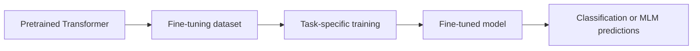
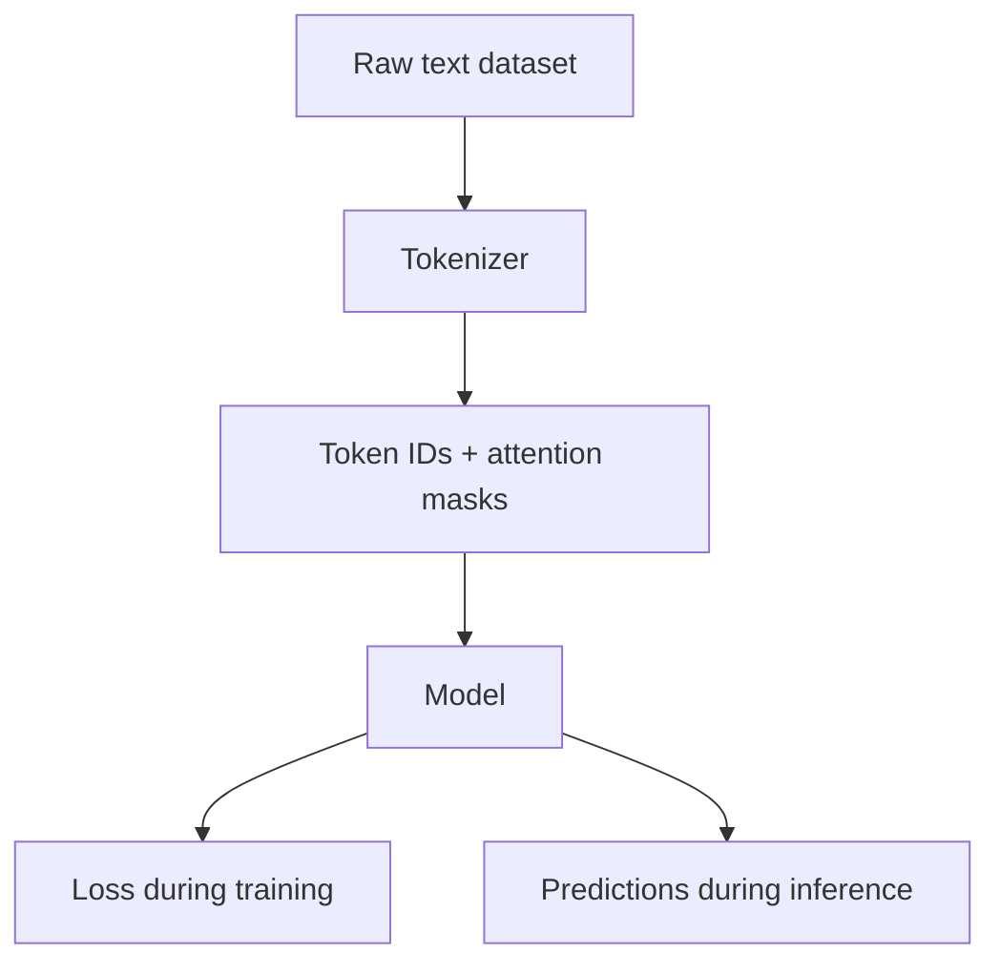
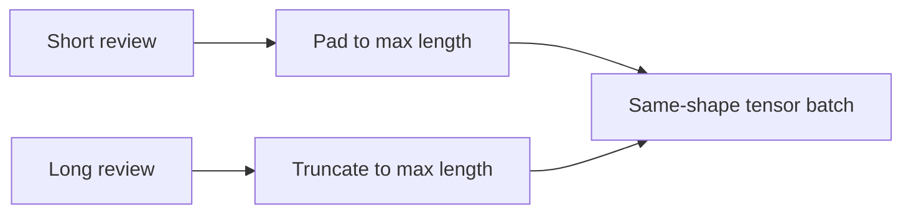
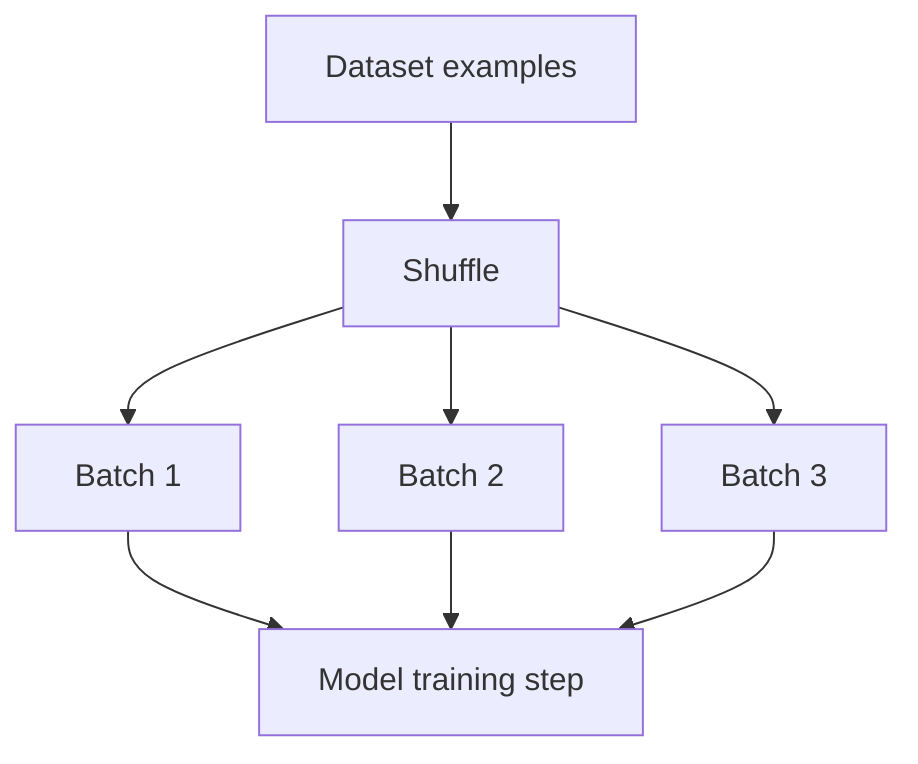
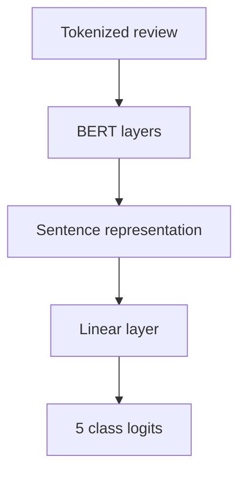
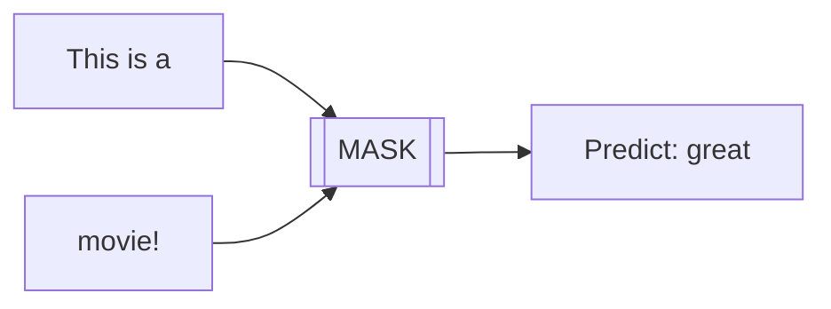
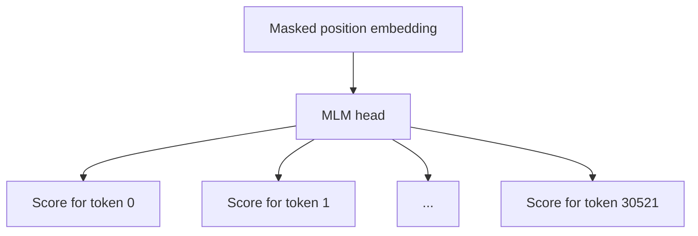
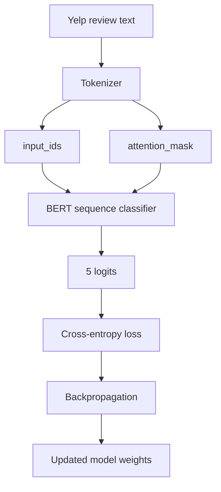
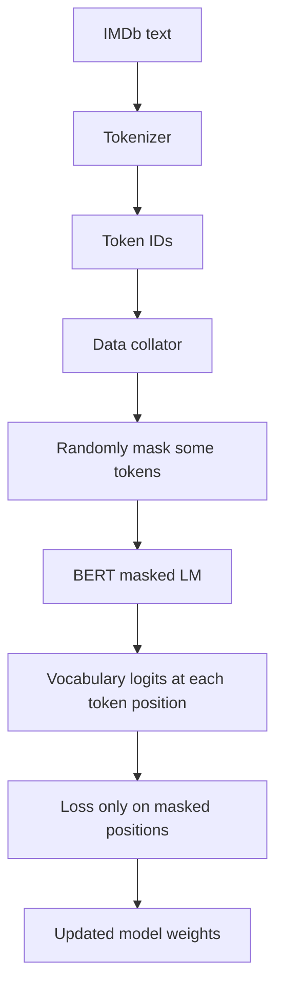

# Fine-Tuning with Hugging Face — Beginner-Friendly Notes

> Source: transcript from a video titled **“Fine-tuning with Hugging Face”**.
>
> Goal: understand how Hugging Face, PyTorch, tokenizers, datasets, classification fine-tuning, and masked language modeling fit together.

---

## 1. Big Picture

The transcript explains how to fine-tune pretrained Transformer models using Hugging Face and PyTorch.

There are two major workflows discussed:

1. **Text classification fine-tuning**
   - Example: Yelp reviews
   - Input: a review like `"The food was amazing"`
   - Output: one of several rating classes, such as 1–5 stars

2. **Masked language modeling**, or **MLM**
   - Example: `"This is a [MASK] movie!"`
   - Input: a sentence with a missing token
   - Output: likely words for the mask, such as `great`, `bad`, or `funny`

A pretrained model already knows general language patterns. Fine-tuning teaches it to perform a more specific task.



### Layman’s explanation

Think of a pretrained model like someone who already understands English from reading a huge library. Fine-tuning is like giving that person a specific job:

- “Classify restaurant reviews by star rating.”
- “Guess the missing word in this sentence.”

The person does not start from zero. They adapt what they already know.

---

## 2. Corrected Transcript Terminology

The transcript is understandable, but a few terms need cleaning up.

| Transcript wording | Better wording | Why it matters |
|---|---|---|
| `BERTtokenizer` | `BERT tokenizer` or `AutoTokenizer.from_pretrained("bert-base-uncased")` | The tokenizer is a separate object used to convert text into token IDs. |
| `input ids` | `input_ids` | Hugging Face uses the key name `input_ids`. |
| `attention mask` | `attention_mask` | Hugging Face uses the key name `attention_mask`. |
| `token type ids` | `token_type_ids` | Used by BERT to mark sentence A vs sentence B. Often not needed for single-sentence tasks. |
| `num labels` | `num_labels` | Hugging Face model configuration parameter. |
| `token STR` | `token_str` | Pipeline output key containing the predicted token text. |
| `Lets` | `Let's` | Grammar correction. |
| `the specific field key you would like to the train on` | `the dataset text field used for training` | The original wording is grammatically incorrect. |
| “SFTTrainer for masked language modeling” | Usually `Trainer` + `DataCollatorForLanguageModeling` for MLM | `SFTTrainer` is mainly used for supervised fine-tuning language models, especially instruction/chat-style LLMs. MLM with BERT is usually handled with the regular Hugging Face `Trainer`. |

---

## 3. What Hugging Face Provides

Hugging Face is an ecosystem for machine learning, especially NLP.

Important pieces:

| Component | What it does |
|---|---|
| `transformers` | Provides pretrained Transformer models such as BERT, GPT-style models, RoBERTa, DistilBERT, etc. |
| `datasets` | Loads and processes datasets such as Yelp, IMDb, GLUE, and custom datasets. |
| `tokenizers` | Converts raw text into model-ready token IDs. Usually used through `AutoTokenizer`. |
| `Trainer` | High-level training loop for PyTorch models. |
| `pipeline` | Simple interface for inference, such as sentiment analysis or fill-mask prediction. |
| `trl.SFTTrainer` | Supervised fine-tuning trainer, commonly used for instruction tuning / chat fine-tuning of language models. |



---

## 4. What Fine-Tuning Means

Fine-tuning means taking a pretrained model and continuing training it on a smaller, task-specific dataset.

### Pretraining vs fine-tuning

| Stage | Dataset | Goal | Example |
|---|---|---|---|
| Pretraining | Huge general text corpus | Learn general language patterns | BERT learns by predicting masked words. |
| Fine-tuning | Smaller labeled or task-specific dataset | Adapt to one task | BERT learns to classify Yelp reviews into 5 star classes. |

### Simple analogy

Pretraining is like learning English.

Fine-tuning is like learning how to grade restaurant reviews.

---

## 5. Dataset Example: Yelp Reviews

The transcript uses the Yelp review dataset.

A single dataset example may look like this:

```python
{
    "text": "The food was excellent and the service was fast.",
    "label": 4
}
```

Depending on the dataset, labels may be zero-indexed:

```text
0 = 1 star
1 = 2 stars
2 = 3 stars
3 = 4 stars
4 = 5 stars
```

So even though there are **five classes**, they may be represented internally as labels `0` through `4`.

---

## 6. Tokenization

Models do not directly understand raw text. They understand numbers.

Tokenization converts text into tokens, then token IDs.

Example:

```text
Raw text:
"This movie was great!"

Tokens:
["this", "movie", "was", "great", "!"]

Token IDs:
[2023, 3185, 2001, 2307, 999]
```

A BERT-style tokenizer usually returns several fields:

```python
{
    "input_ids": [...],
    "attention_mask": [...],
    "token_type_ids": [...]
}
```

### What each field means

| Field | Meaning | Layman’s explanation |
|---|---|---|
| `input_ids` | Numeric IDs for tokens | The model’s version of the sentence. |
| `attention_mask` | Marks real tokens vs padding | Tells the model what to pay attention to. |
| `token_type_ids` | Marks sentence A vs sentence B for BERT | Helps BERT distinguish two segments in paired inputs. |
| `labels` | Correct answer during training | What the model is supposed to predict. |

---

## 7. Padding and Truncation

Text examples have different lengths. Neural network batches usually need equal-length tensors.

So tokenizers often use:

- **Padding**: add fake tokens so shorter examples match the same length.
- **Truncation**: cut off examples that are too long.



Example:

```text
max_length = 8

Review A tokens:
[101, 2023, 2003, 2307, 102]

After padding:
[101, 2023, 2003, 2307, 102, 0, 0, 0]

attention_mask:
[1, 1, 1, 1, 1, 0, 0, 0]
```

The zeros in the `attention_mask` tell the model:

> “Ignore those padding positions.”

---

## 8. Mapping a Tokenizer Over a Dataset

The transcript says the tokenizer function is mapped to the dataset.

That means applying the same tokenization function to every example.

```python
def tokenize_fn(example):
    return tokenizer(
        example["text"],
        padding="max_length",
        truncation=True,
        max_length=128,
    )

tokenized_dataset = raw_dataset.map(tokenize_fn, batched=True)
```

Before tokenization:

```python
{
    "text": "The food was great.",
    "label": 4
}
```

After tokenization:

```python
{
    "text": "The food was great.",
    "label": 4,
    "input_ids": [101, 1996, 2833, 2001, 2307, 1012, 102, ...],
    "attention_mask": [1, 1, 1, 1, 1, 1, 1, ...],
    "token_type_ids": [0, 0, 0, 0, 0, 0, 0, ...]
}
```

Then you often remove the raw text because the model does not use it directly.

```python
tokenized_dataset = tokenized_dataset.remove_columns(["text"])
```

---

## 9. Why Rename `label` to `labels`?

Hugging Face models commonly expect the training target to be named `labels`.

So this:

```python
{"label": 4}
```

is often renamed to this:

```python
{"labels": 4}
```

Why?

Because when you pass `labels` into a Hugging Face model, the model can automatically compute the loss.

```python
outputs = model(
    input_ids=batch["input_ids"],
    attention_mask=batch["attention_mask"],
    labels=batch["labels"],
)

loss = outputs.loss
```

---

## 10. DataLoader

A `DataLoader` takes individual examples and groups them into batches.

Instead of training on one review at a time, you train on many reviews at once.



### Layman’s explanation

A dataset is like a stack of flashcards.

A dataloader is like a person who:

1. Shuffles the flashcards.
2. Hands you a small pile at a time.
3. Repeats until all cards are used.

### PyTorch-shaped pseudocode

```python
from torch.utils.data import DataLoader

train_loader = DataLoader(
    tokenized_train_dataset,
    batch_size=16,
    shuffle=True,
)

for batch in train_loader:
    input_ids = batch["input_ids"]
    attention_mask = batch["attention_mask"]
    labels = batch["labels"]
```

---

## 11. Sequence Classification with BERT

For Yelp review classification, the transcript loads a pretrained BERT classification model with five classes.

Conceptually:

```python
model = AutoModelForSequenceClassification.from_pretrained(
    "bert-base-uncased",
    num_labels=5,
)
```

`num_labels=5` means the output layer has **five logits**.

One logit per class:

```text
Class 0: 1 star
Class 1: 2 stars
Class 2: 3 stars
Class 3: 4 stars
Class 4: 5 stars
```

### What is a logit?

A logit is a raw score before converting to probabilities.

Example model output:

```python
logits = [-1.2, 0.1, 0.5, 1.7, 3.2]
```

The largest score is class `4`, so the model predicts 5 stars.


---

## 12. What Is the Classification Head?

BERT produces contextual embeddings. For classification, Hugging Face adds a small task-specific output layer on top.

```text
BERT base model
+ classification head
= sequence classification model
```

The classification head maps BERT’s representation into class scores.



### Beginner mental model

BERT reads the whole review and produces a summary-like representation. The classification head asks:

> “Given this representation, which rating class is most likely?”

---

## 13. Training Loop

A low-level PyTorch training loop usually follows this pattern:

```python
model.train()

for epoch in range(num_epochs):
    for batch in train_loader:
        batch = move_to_device(batch, device)

        outputs = model(
            input_ids=batch["input_ids"],
            attention_mask=batch["attention_mask"],
            labels=batch["labels"],
        )

        loss = outputs.loss

        loss.backward()
        optimizer.step()
        scheduler.step()
        optimizer.zero_grad()
```

### What happens in one training step?

```mermaid
sequenceDiagram
    participant Data as Batch
    participant Model as BERT Classifier
    participant Loss as Loss Function
    participant Opt as Optimizer

    Data->>Model: input_ids, attention_mask, labels
    Model->>Loss: logits + labels
    Loss->>Model: loss.backward()
    Model->>Opt: gradients
    Opt->>Model: update weights
```

### Simple explanation

1. The model makes a prediction.
2. The loss measures how wrong it was.
3. Backpropagation calculates how to adjust the model.
4. The optimizer updates the weights.
5. Repeat many times.

---

## 14. Optimizer and Learning Rate Scheduler

The transcript mentions `AdamW` and a learning rate scheduler.

| Tool | Purpose |
|---|---|
| Optimizer | Updates model weights using gradients. |
| Learning rate | Controls how big each update is. |
| Scheduler | Changes the learning rate during training. |

### Layman’s explanation

Imagine walking downhill while blindfolded.

- The **gradient** tells you the downhill direction.
- The **learning rate** is your step size.
- The **optimizer** decides how to step.
- The **scheduler** may make your steps smaller as you get closer to the bottom.

---

## 15. Evaluation Function

Evaluation means checking how well the model performs on data it is not currently training on.

A simple evaluation loop:

```python
model.eval()
correct = 0
total = 0

with torch.no_grad():
    for batch in eval_loader:
        outputs = model(
            input_ids=batch["input_ids"],
            attention_mask=batch["attention_mask"],
        )

        predictions = outputs.logits.argmax(dim=-1)
        correct += (predictions == batch["labels"]).sum().item()
        total += len(batch["labels"])

accuracy = correct / total
```

### Important difference

| Mode | Used for | Updates weights? |
|---|---|---|
| Training | Learning from data | Yes |
| Evaluation | Measuring performance | No |

---

## 16. Hugging Face `Trainer` vs Manual PyTorch Training

The transcript contrasts direct PyTorch training with a higher-level trainer.

| Approach | Pros | Cons |
|---|---|---|
| Manual PyTorch loop | Maximum control; good for learning | More code; easier to make mistakes |
| Hugging Face `Trainer` | Less boilerplate; handles many common training details | Less transparent at first |
| TRL `SFTTrainer` | Useful for supervised fine-tuning of language models | Not the standard choice for BERT-style MLM |

### Practical rule of thumb

Use:

- `Trainer` for common Hugging Face fine-tuning tasks like classification and masked language modeling.
- `SFTTrainer` for supervised fine-tuning of generative language models on prompt/response or instruction-style datasets.

---

## 17. Corrected View of SFTTrainer

The transcript says SFTTrainer simplifies training. That is broadly true, but the use case matters.

### What SFTTrainer is usually for

SFT means **supervised fine-tuning**.

It is commonly used when you have examples like:

```python
{
    "prompt": "Explain gradient descent simply.",
    "response": "Gradient descent is a way to improve a model by..."
}
```

or chat-style examples:

```python
[
    {"role": "user", "content": "Explain BERT."},
    {"role": "assistant", "content": "BERT is an encoder-only Transformer..."}
]
```

The model learns to generate the desired answer.

### Why this is different from MLM

Masked language modeling is not usually prompt-response supervised fine-tuning.

MLM trains a model to fill masked tokens:

```text
Input:  This is a [MASK] movie!
Target: great
```

So for BERT-style MLM, the usual Hugging Face setup is:

```python
AutoModelForMaskedLM
DataCollatorForLanguageModeling
Trainer
```

not necessarily `SFTTrainer`.

---

## 18. Masked Language Modeling, or MLM

Masked language modeling trains a model to predict missing tokens.

Example:

```text
Original sentence:
This is a great movie!

Masked input:
This is a [MASK] movie!

Target:
great
```

BERT can look both left and right:

```text
Left context:  This is a
Mask:          [MASK]
Right context: movie!
```

Because BERT is bidirectional, it can use both sides of the missing word.



---

## 19. MLM Training vs Fill-Mask Inference

These are related but not identical.

| Stage | What happens |
|---|---|
| MLM training | Random tokens are masked, and the model learns to predict the original tokens. |
| Fill-mask inference | You manually provide `[MASK]`, and the model predicts likely replacements. |

During training, the data collator may randomly mask tokens on the fly.

Example:

```text
Epoch 1:
This is a [MASK] movie!

Epoch 2:
This is a great [MASK]!

Epoch 3:
[MASK] is a great movie!
```

The same sentence can be masked differently across training passes.

---

## 20. MLM with Hugging Face — PyTorch-Shaped Pseudocode

A modern BERT-style MLM flow looks like this:

```python
from datasets import load_dataset
from transformers import (
    AutoTokenizer,
    AutoModelForMaskedLM,
    DataCollatorForLanguageModeling,
    Trainer,
    TrainingArguments,
)

# 1. Load raw text dataset
raw_dataset = load_dataset("imdb")

# 2. Load tokenizer and model
tokenizer = AutoTokenizer.from_pretrained("bert-base-uncased")
model = AutoModelForMaskedLM.from_pretrained("bert-base-uncased")

# 3. Tokenize text
def tokenize_fn(batch):
    return tokenizer(
        batch["text"],
        truncation=True,
        max_length=128,
    )

tokenized = raw_dataset.map(tokenize_fn, batched=True, remove_columns=["text"])

# 4. Create a data collator that dynamically masks tokens
collator = DataCollatorForLanguageModeling(
    tokenizer=tokenizer,
    mlm=True,
    mlm_probability=0.15,
)

# 5. Configure training
args = TrainingArguments(
    output_dir="bert-mlm-imdb",
    learning_rate=2e-5,
    num_train_epochs=1,
    per_device_train_batch_size=16,
)

# 6. Train
trainer = Trainer(
    model=model,
    args=args,
    train_dataset=tokenized["train"],
    data_collator=collator,
)

trainer.train()
```

### Important detail

For MLM, labels are often created by the data collator.

The collator masks some tokens and creates labels only for the masked positions. Non-masked positions are usually ignored in the loss.

---

## 21. What Does `mlm_probability=0.15` Mean?

`mlm_probability=0.15` means about 15% of tokens are selected for the MLM prediction task.

Example sentence:

```text
This movie was surprisingly good and very funny.
```

Possible selected tokens:

```text
This movie was [MASK] good and very [MASK].
```

The model learns to recover:

```text
surprisingly
funny
```

### Simple explanation

The model is not asked to predict every word. It is asked to predict a sampled subset of hidden words.

---

## 22. Fill-Mask Pipeline

After fine-tuning an MLM model, you can use a pipeline for prediction.

```python
from transformers import pipeline

mask_filler = pipeline(
    task="fill-mask",
    model=model,
    tokenizer=tokenizer,
)

results = mask_filler("This is a [MASK] movie!")
```

Possible output:

```python
[
    {"token_str": "great", "score": 0.42},
    {"token_str": "good", "score": 0.18},
    {"token_str": "bad", "score": 0.07},
]
```

| Output key | Meaning |
|---|---|
| `token_str` | The predicted token as readable text. |
| `score` | The model’s confidence-like probability score. |

The transcript says `great` may be the most likely token for:

```text
This is a [MASK] movie!
```

That makes sense because `great movie` is a common phrase.

---

## 23. Classification vs MLM

These two tasks look similar because both use Transformers, but their outputs are very different.

| Feature | Text classification | Masked language modeling |
|---|---|---|
| Example input | `"The food was terrible."` | `"This is a [MASK] movie."` |
| Example output | `1 star` | `great`, `bad`, `funny`, etc. |
| Model class | `AutoModelForSequenceClassification` | `AutoModelForMaskedLM` |
| Output layer size | Number of classes | Vocabulary size |
| Loss target | One class label per example | Original token IDs at masked positions |
| Common trainer | `Trainer` | `Trainer` |

### Key intuition

Classification asks:

> “Which category does this whole text belong to?”

MLM asks:

> “Which vocabulary token belongs in this missing position?”

---

## 24. Output Layer Size: Classification vs MLM

For Yelp review classification with five classes:

```text
Output layer size = 5
```

For BERT masked language modeling:

```text
Output layer size = vocabulary size
```

If the vocabulary has 30,522 tokens, then at each masked position the MLM head produces 30,522 scores.



So:

- Classification output classes are task labels.
- MLM output classes are vocabulary tokens.

---

## 25. What Is `token_type_ids`?

For BERT, `token_type_ids` are also called **segment IDs**.

They tell BERT which tokens belong to sentence A and which belong to sentence B.

Example sentence pair:

```text
Sentence A: The food was great.
Sentence B: The service was slow.
```

BERT input:

```text
[CLS] The food was great. [SEP] The service was slow. [SEP]
```

Segment IDs:

```text
0     0   0    0    0      0     1   1       1   1     1
```

### Do you need `token_type_ids` for MLM?

For single-sentence MLM, segment IDs are usually not conceptually important. They may still appear because BERT’s tokenizer/model supports them.

For sentence-pair tasks, they matter more.

Examples:

- Next sentence prediction
- Question answering with question + passage
- Sentence-pair classification

---

## 26. End-to-End Classification Flow



---

## 27. End-to-End MLM Flow



---

## 28. Beginner-Friendly Mental Models

### Tokenizer

A tokenizer is like a translator from human-readable text to model-readable numbers.

### Model

The model is the pattern learner. It turns token IDs into predictions.

### Loss

Loss is the model’s error score.

Low loss means:

> “The model’s predictions are closer to the correct answers.”

High loss means:

> “The model is still very wrong.”

### Optimizer

The optimizer is the mechanism that updates the model to reduce loss.

### Trainer

The trainer is a convenience engine that runs the repetitive training process for you.

---

## 29. Minimal Classification Pseudocode

```python
from datasets import load_dataset
from transformers import AutoTokenizer, AutoModelForSequenceClassification
from torch.utils.data import DataLoader
import torch

raw = load_dataset("yelp_review_full")

tokenizer = AutoTokenizer.from_pretrained("bert-base-uncased")
model = AutoModelForSequenceClassification.from_pretrained(
    "bert-base-uncased",
    num_labels=5,
)

def tokenize_fn(batch):
    return tokenizer(
        batch["text"],
        padding="max_length",
        truncation=True,
        max_length=128,
    )

tokenized = raw.map(tokenize_fn, batched=True)
tokenized = tokenized.rename_column("label", "labels")
tokenized = tokenized.remove_columns(["text"])
tokenized.set_format("torch")

train_loader = DataLoader(tokenized["train"], batch_size=16, shuffle=True)

optimizer = torch.optim.AdamW(model.parameters(), lr=2e-5)

model.train()
for batch in train_loader:
    outputs = model(**batch)
    loss = outputs.loss

    loss.backward()
    optimizer.step()
    optimizer.zero_grad()
```

---

## 30. Minimal Classification with Hugging Face `Trainer`

```python
from transformers import Trainer, TrainingArguments

args = TrainingArguments(
    output_dir="bert-yelp-classifier",
    learning_rate=2e-5,
    num_train_epochs=1,
    per_device_train_batch_size=16,
    per_device_eval_batch_size=16,
    eval_strategy="epoch",
)

trainer = Trainer(
    model=model,
    args=args,
    train_dataset=tokenized["train"],
    eval_dataset=tokenized["test"],
    tokenizer=tokenizer,
)

trainer.train()
trainer.evaluate()
```

The `Trainer` hides much of the boilerplate:

- batching
- forward pass
- loss calculation
- backward pass
- optimizer stepping
- evaluation loop
- logging
- checkpointing

---

## 31. Common Beginner Confusions

### “Does the model need the original text after tokenization?”

Usually no.

The model uses `input_ids`, not raw text.

The raw text is useful for humans, debugging, and preprocessing, but not for the forward pass.

### “Why do we need an attention mask?”

Because padded tokens are not real words.

The attention mask tells the model:

```text
1 = real token
0 = padding token
```

### “What does `num_labels=5` do?”

It creates a classification output layer with five scores.

### “Is `score` the same as truth?”

No.

In a pipeline output, `score` is the model’s estimated likelihood. It can be wrong.

### “Is fine-tuning the same as training from scratch?”

No.

Fine-tuning starts from a pretrained model. Training from scratch starts from random weights.

---

## 32. Practical Comparison: Yelp vs IMDb in the Transcript

| Dataset | Used for in transcript | Typical task |
|---|---|---|
| Yelp reviews | Review rating classification | Predict star rating from review text. |
| IMDb reviews | Masked language model fine-tuning example | Adapt BERT-style MLM to movie-review text. |

Important nuance:

IMDb is often used for sentiment classification, but it can also provide raw text for language-model fine-tuning.

The task depends on how you set up the model and labels.

---

## 33. Cleaned-Up Transcript Summary

The video introduces Hugging Face as an open-source machine learning platform with libraries for NLP. It shows how datasets can be loaded with `load_dataset`, how raw text can be tokenized into `input_ids`, `attention_mask`, and sometimes `token_type_ids`, and how labels can be prepared for training.

For Yelp review classification, a pretrained BERT sequence classification model can be loaded with `num_labels=5`, meaning the model predicts one of five review-rating classes. A training loop or Hugging Face `Trainer` can then fine-tune the model using an optimizer such as `AdamW` and a learning rate scheduler.

The video also discusses masked language modeling, where the goal is to predict masked words such as in `"This is a [MASK] movie!"`. The corrected modern framing is that BERT-style masked language modeling is commonly done with `AutoModelForMaskedLM`, `DataCollatorForLanguageModeling`, and `Trainer`. A `fill-mask` pipeline can then be used to generate predictions, where `token_str` contains the predicted token and `score` contains the model’s likelihood estimate.

---

## 34. Self-Check Questions

### Concept checks

1. What is the difference between pretraining and fine-tuning?
2. Why does a tokenizer convert text into token IDs?
3. What is the purpose of `attention_mask`?
4. Why might we remove the raw `text` column after tokenization?
5. What does `num_labels=5` mean for a Yelp review classifier?
6. What is the difference between logits and probabilities?
7. What does a `DataLoader` do?
8. What is the difference between training mode and evaluation mode?
9. What does masked language modeling ask the model to do?
10. Why is the MLM output layer usually vocabulary-sized?

### Practical checks

1. If a dataset has labels `0`, `1`, and `2`, what should `num_labels` probably be?
2. If your batch contains padded tokens, which field tells BERT to ignore them?
3. If your input is `"The meal was [MASK]."`, what Hugging Face pipeline task would you use?
4. If you are classifying movie reviews as positive or negative, should the output layer have 2 classes or vocabulary-size classes?
5. If you are doing BERT-style MLM, is `SFTTrainer` usually the first tool you should reach for?

---

## 35. Answers to Self-Check Questions

### Concept checks

1. **Pretraining** teaches general language patterns from large data. **Fine-tuning** adapts the model to a specific task.
2. Neural networks operate on numbers, not raw text.
3. `attention_mask` tells the model which tokens are real and which are padding.
4. The model does not use raw text directly after tokenization.
5. The model has five output scores, one for each class.
6. Logits are raw scores. Probabilities are normalized scores, usually after softmax.
7. A `DataLoader` groups examples into batches and can shuffle them.
8. Training mode updates model weights. Evaluation mode measures performance without updating weights.
9. MLM asks the model to predict hidden or masked tokens.
10. Because the model chooses among all possible vocabulary tokens for the masked position.

### Practical checks

1. `num_labels=3`.
2. `attention_mask`.
3. `fill-mask`.
4. 2 classes.
5. Usually no. For BERT-style MLM, use `Trainer` with `DataCollatorForLanguageModeling`.

---

## 36. Transferable Engineering Pattern

Most Hugging Face fine-tuning workflows follow the same pattern:


The main thing that changes is the model head:

| Task | Model head |
|---|---|
| Text classification | Sequence classification head |
| Token classification | Token classification head |
| Masked language modeling | MLM head |
| Causal language modeling | Causal LM head |
| Question answering | QA span prediction head |

Once you understand the pattern, new tasks become much easier to learn.

---

## 37. References

- Hugging Face Transformers documentation: Masked language modeling.
- Hugging Face Transformers documentation: Text classification / sequence classification.
- Hugging Face Transformers documentation: Trainer API.
- Hugging Face TRL documentation: SFTTrainer.
- Source transcript: `subtitle.txt`.
