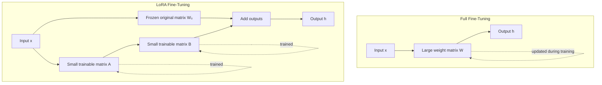
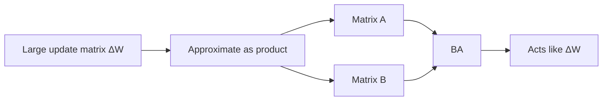
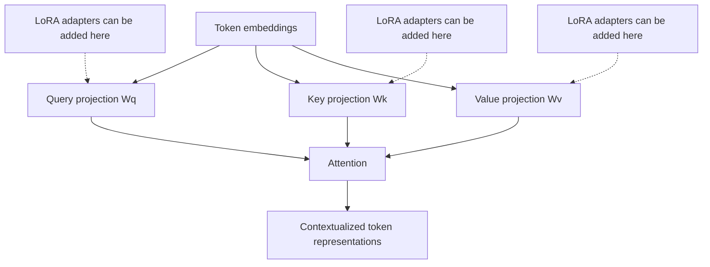
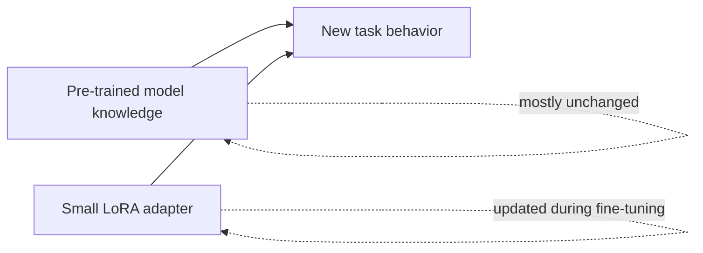

# LoRA (Low-Rank Adaptation) — Beginner-Friendly Notes

## 1. Big Idea

**LoRA** stands for **Low-Rank Adaptation**.

LoRA is a way to fine-tune a large pre-trained model without updating all of its original weights. Instead of changing the huge model directly, LoRA adds small trainable “adapter” matrices beside selected layers.

A simple way to think about it:

> The original model is a large machine that already knows a lot. LoRA adds small adjustable knobs to that machine instead of rebuilding the whole thing.

During fine-tuning:

- the original model weights stay **frozen**;
- only the small LoRA matrices are trained;
- this greatly reduces trainable parameters, memory use, and storage cost.

---

## 2. Corrected Transcript Terminology

The transcript is mostly about LoRA, but a few phrases need cleanup.

| Transcript wording | Better wording | Why |
|---|---|---|
| “input directions of ten and eight neurons” | input dimension 10 and output dimension 8 | A layer maps from input features to output features. |
| “third layer of the network” | an example linear layer | The exact layer number is not important. |
| “result in parameter is d * k” | number of parameters is d × k | A dense weight matrix has input dimension times output dimension parameters. |
| “LoRa” | LoRA | Standard capitalization. |
| “A is R x R” | A is r × k or k × r depending on convention | The transcript likely has a notation error. |
| “key query and value parameters” | query, key, and value projection weights | In attention, these are usually called Q, K, and V projections. |
| “omega represents the tokens” | omega, often written ω, may represent tokens in the paper’s notation | Symbols vary by paper. |

---

## 3. Why Fine-Tuning All Parameters Is Expensive

A neural network layer often contains a weight matrix.

For a simple linear layer:

```text
input vector x → weight matrix W → output vector h
```

If the input dimension is `d` and the output dimension is `k`, the full weight matrix has:

```text
d × k parameters
```

For example:

```text
d = 10
k = 8

full parameters = 10 × 8 = 80
```

That may sound small, but modern transformer models have many huge matrices. Fine-tuning all of them can require a lot of GPU memory.

---

## 4. The LoRA Trick

LoRA says:

> Instead of learning a full weight update ΔW, learn two smaller matrices whose product behaves like ΔW.

The original layer normally does:

```text
h = W₀x
```

Where:

- `W₀` is the original pre-trained weight matrix;
- `x` is the input vector;
- `h` is the layer output.

LoRA changes the layer to:

```text
h = W₀x + ΔWx
```

But instead of directly training the large `ΔW`, LoRA decomposes it:

```text
ΔW = BA
```

So the forward pass becomes:

```text
h = W₀x + BAx
```

The original matrix `W₀` stays frozen. Only `A` and `B` are trained.

---

## 5. Mermaid Diagram: Full Fine-Tuning vs LoRA



---

## 6. Parameter Count Example

Suppose the original layer maps from 10 inputs to 8 outputs.

Full matrix:

```text
10 × 8 = 80 parameters
```

Now choose a LoRA rank of `r = 3`.

LoRA uses two smaller matrices:

```text
A: 10 × 3 = 30 parameters
B: 3 × 8 = 24 parameters
```

Total LoRA trainable parameters:

```text
30 + 24 = 54 parameters
```

So instead of training 80 parameters, LoRA trains 54.

For this tiny example, the savings are modest. But for real transformer layers, the savings can be very large.

Example with a much larger layer:

```text
d = 4096
k = 4096
r = 8

Full update:
4096 × 4096 = 16,777,216 parameters

LoRA update:
4096 × 8 + 8 × 4096 = 65,536 parameters
```

That is a huge reduction.

---

## 7. What Does “Low-Rank” Mean?

The **rank** controls how much expressive power the LoRA update has.

A layman’s explanation:

> A full matrix can describe many complex changes. A low-rank update describes a smaller, simpler kind of change. LoRA bets that fine-tuning often does not need to change the model in every possible direction.

The rank is usually written as `r`.

- Smaller `r` means fewer trainable parameters and cheaper training.
- Larger `r` means more capacity, but more parameters.

LoRA works because many useful fine-tuning changes can be approximated with a lower-rank update.

---

## 8. Mermaid Diagram: Low-Rank Decomposition



---

## 9. Scaling Factor: α / r

LoRA often applies a scaling factor:

```text
LoRA output = W₀x + (α / r)BAx
```

Where:

- `α` is alpha, a hyperparameter;
- `r` is the LoRA rank;
- `α / r` controls the strength of the LoRA update.

Layman’s explanation:

> The LoRA matrices learn the direction of the adjustment. The scaling factor controls how loudly that adjustment speaks compared with the original model.

---

## 10. What Gets Frozen and What Gets Trained?

During LoRA fine-tuning:

| Component | Frozen or trained? | Meaning |
|---|---:|---|
| Original model weights `W₀` | Frozen | They do not change. |
| LoRA matrix `A` | Trained | Learns part of the update. |
| LoRA matrix `B` | Trained | Learns part of the update. |
| Bias terms | Often ignored or optionally trained | The transcript ignores bias for simplicity. |

This is why LoRA is called **parameter-efficient fine-tuning**.

---

## 11. Where LoRA Is Used in Transformers

Transformers contain many linear projection matrices. LoRA is commonly applied to attention projections such as:

- query projection, usually `Wq`;
- key projection, usually `Wk`;
- value projection, usually `Wv`;
- sometimes output projection, feed-forward layers, or other linear layers.

In attention, the model creates query, key, and value vectors from token embeddings.



LoRA can be used with:

- encoder-only models, such as BERT-style models;
- decoder-only models, such as GPT-style models;
- encoder-decoder models, such as T5-style models.

The loss function depends on the task. It does not have to be only cross-entropy, although cross-entropy is common for language modeling and classification.

---

## 12. Simple Analogy

Imagine a large factory machine.

Full fine-tuning means opening up the entire machine and changing many internal parts.

LoRA means attaching a small control module to the machine. The original machine stays the same, but the control module slightly redirects how the machine behaves for a specific job.

That is why LoRA is useful when you want to adapt a large model to a new task without storing a full copy of the model for every task.

---

## 13. PyTorch-Shaped Pseudocode

This is not production-ready code. It is shaped like PyTorch to show the idea.

```python
import torch
import torch.nn as nn

class LoRALinear(nn.Module):
    def __init__(self, in_features, out_features, rank=8, alpha=16):
        super().__init__()

        # Original pre-trained layer.
        self.base = nn.Linear(in_features, out_features, bias=False)

        # Freeze original weights.
        for param in self.base.parameters():
            param.requires_grad = False

        # LoRA matrices.
        # A projects down to a smaller rank.
        self.A = nn.Linear(in_features, rank, bias=False)

        # B projects back up to the output size.
        self.B = nn.Linear(rank, out_features, bias=False)

        self.scale = alpha / rank

        # Common LoRA initialization pattern:
        # A gets random values, B starts near zero so the adapter begins with little effect.
        nn.init.normal_(self.A.weight, mean=0.0, std=0.01)
        nn.init.zeros_(self.B.weight)

    def forward(self, x):
        base_output = self.base(x)              # W₀x
        lora_output = self.B(self.A(x))         # BAx
        return base_output + self.scale * lora_output
```

Training loop shape:

```python
model = LoRALinear(in_features=4096, out_features=4096, rank=8, alpha=16)
optimizer = torch.optim.AdamW(
    [p for p in model.parameters() if p.requires_grad],
    lr=1e-4,
)

for batch in dataloader:
    x, y = batch

    prediction = model(x)
    loss = loss_fn(prediction, y)

    optimizer.zero_grad()
    loss.backward()
    optimizer.step()
```

Important detail:

```python
[p for p in model.parameters() if p.requires_grad]
```

This means the optimizer only updates the trainable LoRA parameters, not the frozen base model.

---

## 14. Comparison: Full Fine-Tuning, Feature Extraction, and LoRA

| Method | What changes during training? | Pros | Cons |
|---|---|---|---|
| Full fine-tuning | All or most model weights | Very flexible | Expensive; stores many changed weights |
| Feature extraction | Only a small task head | Cheap and simple | May not adapt deeply enough |
| LoRA | Small low-rank adapter matrices | Efficient and flexible | Rank and target layers must be chosen well |

LoRA sits between the extremes:

- more adaptable than training only a final classifier head;
- much cheaper than full fine-tuning.

---

## 15. Common Beginner Confusions

### Confusion 1: Is LoRA replacing the original model?

No. LoRA does not replace the original model. It adds a trainable update path beside selected original weights.

### Confusion 2: Is ΔW stored as a full matrix?

Usually no. LoRA stores `A` and `B`, not the full `ΔW`. The product `BA` acts like the update.

### Confusion 3: Why does the product size stay the same?

Because matrix multiplication can project down and then back up.

Example:

```text
A maps: 10 → 3
B maps: 3 → 8

Combined effect: 10 → 8
```

So the final input-output shape matches the original layer.

### Confusion 4: Why not always use rank 1?

Rank 1 is very cheap, but it may be too limited. Higher rank gives the adapter more ways to change the model.

---

## 16. Mini Worked Example

Suppose we have a sentence classifier.

The base model already understands language generally. We want it to classify support tickets into categories:

- billing;
- login issue;
- bug report;
- feature request.

Full fine-tuning would update many model weights.

LoRA would:

1. freeze the original model;
2. add small adapter matrices to selected transformer layers;
3. train only those adapters on support-ticket examples;
4. save only the adapter weights.

At inference time, the model uses:

```text
base model + LoRA adapter
```

For a different task, you could use:

```text
base model + different LoRA adapter
```

That is one reason LoRA is popular for adapting large models to many tasks.

---

## 17. Mental Model

A full weight matrix can be thought of as a big map from one vector space to another.

LoRA does not redraw the whole map. It learns a small correction layer.



---

## 18. Key Formulas

Original layer:

```text
h = W₀x
```

LoRA layer:

```text
h = W₀x + ΔWx
```

Low-rank update:

```text
ΔW = BA
```

LoRA layer with scaling:

```text
h = W₀x + (α / r)BAx
```

Full trainable parameter count:

```text
d × k
```

LoRA trainable parameter count:

```text
d × r + r × k
```

When `r` is much smaller than `d` and `k`, LoRA is much cheaper.

---

## 19. Self-Check Questions

1. What does LoRA stand for?
2. During LoRA fine-tuning, what happens to the original model weights?
3. What two matrices are trained in LoRA?
4. Why is `r` called the rank?
5. What happens when `r` increases?
6. Why is LoRA cheaper than full fine-tuning?
7. In a transformer, where is LoRA commonly applied?
8. What does the scaling factor `α / r` do?
9. Why does LoRA save storage when adapting one base model to many tasks?
10. What is the difference between `W₀` and `ΔW`?

---

## 20. Answers

1. **Low-Rank Adaptation.**
2. They stay **frozen**.
3. The smaller matrices usually called **A** and **B**.
4. It controls the size of the low-dimensional bottleneck used to approximate the update.
5. More parameters and more capacity, but higher memory and compute cost.
6. It trains only small adapter matrices instead of the full weight matrix.
7. Often in attention projection layers, such as query, key, and value projections.
8. It controls the strength of the LoRA update.
9. You can keep one base model and store small adapters for different tasks.
10. `W₀` is the original frozen weight matrix; `ΔW` is the learned update represented by LoRA.

---

## 21. One-Sentence Summary

LoRA fine-tunes large models efficiently by freezing the original weights and learning small low-rank update matrices that adapt selected layers to a new task.
