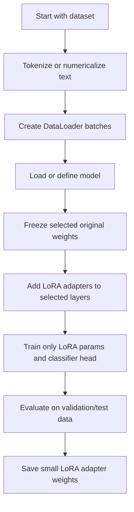
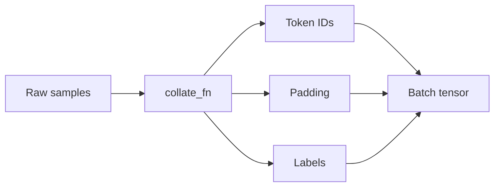
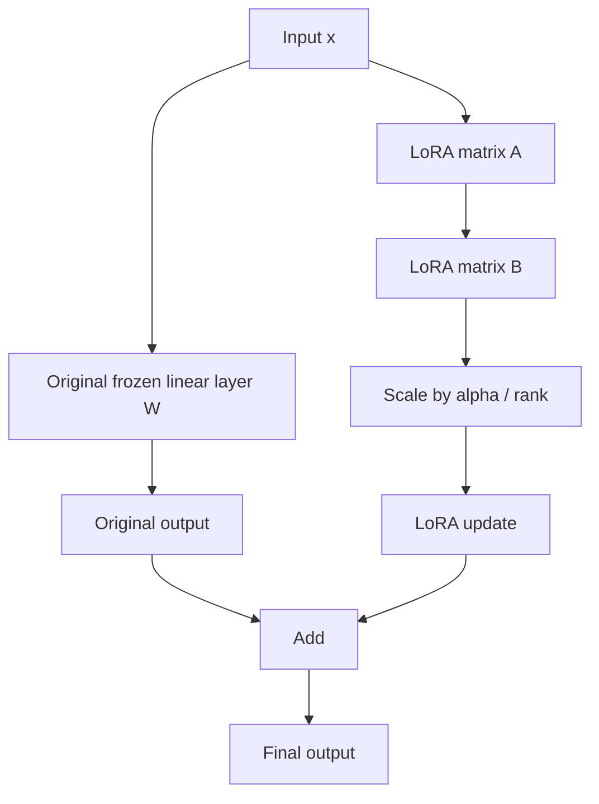
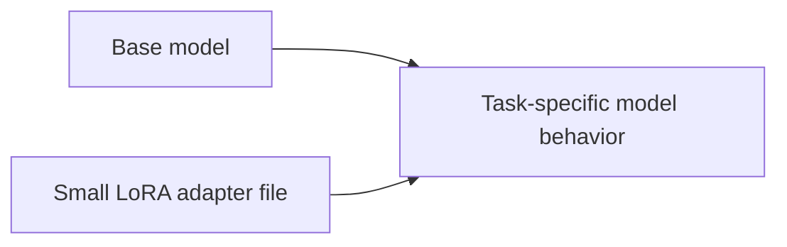
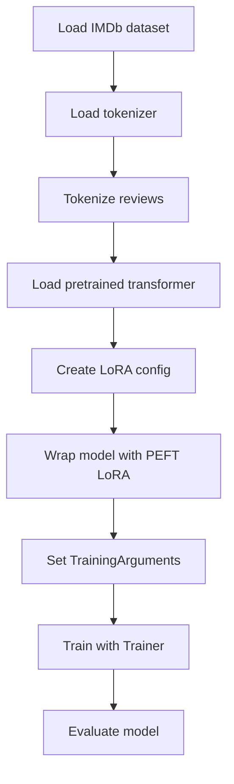
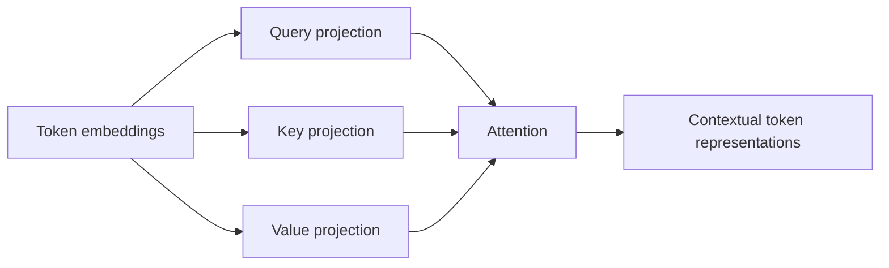
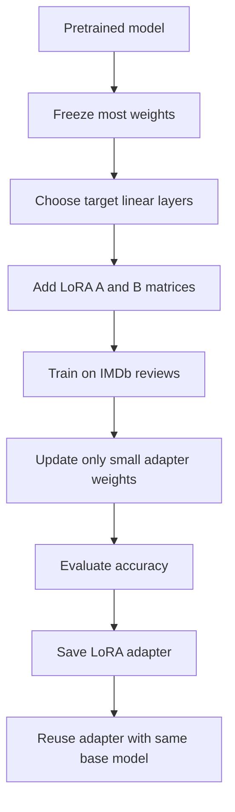

# LoRA with PyTorch and Hugging Face — Beginner-Friendly Notes

> Source: notes created from the provided transcript about LoRA, PyTorch, Hugging Face, IMDb sentiment classification, AG News pretraining, and PEFT-style fine-tuning.

## 1. Big Picture

**LoRA** stands for **Low-Rank Adaptation**.

It is a fine-tuning technique that lets you adapt a large pretrained model without updating all of its original weights.

Instead of changing the whole model, LoRA freezes most of the original model and trains a small number of new weights.

### Layman’s explanation

Imagine you have a huge printed textbook.

Traditional fine-tuning is like rewriting many pages of the textbook.

LoRA is like adding a small set of sticky notes that slightly change how the textbook is used for a new task.

The original textbook stays the same, but the sticky notes help it behave differently.

---

## 2. Why LoRA Exists

Large models can have millions or billions of parameters. Updating all of them is expensive.

LoRA helps by:

- reducing the number of trainable parameters
- reducing memory usage during fine-tuning
- making saved adapters much smaller
- allowing one base model to support many task-specific adapters

### Comparison

| Approach | What gets trained? | Storage cost | Memory cost | Use case |
|---|---:|---:|---:|---|
| Full fine-tuning | Most or all model weights | Large | High | Maximum flexibility, expensive |
| Feature extraction | Only final classifier layer | Small | Low | Simple adaptation |
| LoRA | Small adapter matrices plus maybe classifier head | Small | Moderate-low | Efficient fine-tuning |

---

## 3. Corrected Transcript Terminology

The transcript is understandable, but a few phrases need correction or clarification.

| Transcript phrase | Better wording | Why |
|---|---|---|
| “LoRA inserts new small weights into the model to train them” | LoRA adds small trainable adapter matrices to selected layers | LoRA usually does not replace the original layer; it adds a low-rank update path. |
| “A and B have approximately 450 parameters” | The number of LoRA parameters depends on input size, output size, and rank | LoRA parameter count is not fixed. |
| “A×BX” | Usually written as `B(Ax)` or `x A B`, depending on tensor layout | Matrix order depends on implementation. Conceptually, LoRA computes a low-rank update. |
| “updates the low rank matrix by adding it to the original output” | Adds the LoRA update to the original layer output | The original output is modified by adding a learned low-rank delta. |
| “pre-trains the LoRA module” | fine-tunes or trains the LoRA adapter | LoRA adapters are usually trained during fine-tuning, not pretraining. |
| “bidirectional representation for transformers” | **Bidirectional Encoder Representations from Transformers** | This is the expansion of BERT. |
| “train the arguments” | configure training arguments | `TrainingArguments` stores training configuration. |
| “trainers help the model to train the Trainer class” | the `Trainer` class handles the training loop | The model does not train the Trainer; the Trainer trains/evaluates the model. |
| “HuggingFace” | Hugging Face | The company/library name is usually written as two words. |

---

## 4. The Learning Scenario in the Transcript

The transcript describes two related workflows:

1. **LoRA with plain PyTorch**
   - Start with a simple text classifier.
   - Train or load a pretrained model.
   - Replace a hidden linear layer with a LoRA-enhanced linear layer.
   - Fine-tune only the LoRA parameters and classifier head.

2. **LoRA with Hugging Face / PEFT**
   - Load the IMDb dataset.
   - Tokenize text with a transformer tokenizer.
   - Load a pretrained transformer model.
   - Configure LoRA using PEFT.
   - Train using Hugging Face `Trainer`.

---

## 5. Dataset: IMDb vs AG News

The transcript mentions both **IMDb** and **AG News**.

### IMDb

IMDb contains movie reviews labeled by sentiment.

Usually it is used for **binary sentiment classification**:

| Review | Label |
|---|---|
| “This movie was excellent.” | Positive |
| “The plot was boring.” | Negative |

So the classifier output has **2 classes**.

```text
class 0 = negative
class 1 = positive
```

### AG News

AG News is a news classification dataset.

It usually has **4 classes**:

```text
class 0 = World
class 1 = Sports
class 2 = Business
class 3 = Sci/Tech
```

The transcript describes loading a model pretrained or previously trained on AG News, then adapting it to IMDb.

That means the model’s final classification layer must change from:

```text
4 outputs → 2 outputs
```

because AG News has 4 classes and IMDb has 2.

---

## 6. Overall Workflow



---

## 7. What the DataLoader Does

A **DataLoader** is the object that feeds training examples to the model in batches.

Instead of giving the model one review at a time, it gives the model a group of reviews.

Example:

```text
Batch size = 4

Batch:
1. "This movie was great."      → positive
2. "Very boring and slow."      → negative
3. "Loved the acting."          → positive
4. "Not worth watching."        → negative
```

The DataLoader commonly handles:

- batching
- shuffling
- padding
- converting raw examples into tensors
- moving through the dataset efficiently

---

## 8. What `collate_batch` / `collate_fn` Does

The **collate function** tells the DataLoader how to combine individual examples into one batch.

This matters because text examples usually have different lengths.

Example:

```text
Review 1: "great movie"
Review 2: "this movie was surprisingly good"
```

After tokenization:

```text
Review 1: [15, 92]
Review 2: [8, 92, 41, 701, 64]
```

The model needs rectangular tensors, so the shorter sequence may be padded:

```text
Review 1: [15, 92, 0, 0, 0]
Review 2: [8, 92, 41, 701, 64]
```

A collate function may return:

```text
input_ids
attention_mask
labels
```

### Simple diagram



---

## 9. Simple Text Classifier Before LoRA

The transcript describes a simple classifier with:

1. an embedding layer
2. a hidden linear layer
3. a ReLU activation
4. an output linear layer

Conceptually:


### Layman’s explanation

The model does this:

1. Turns words/tokens into vectors.
2. Combines those vectors into learned features.
3. Uses those features to predict a class.

For IMDb, the final output might be:

```text
logits = [1.2, 3.8]
```

The second value is larger, so the model predicts class `1`, which may mean **positive**.

---

## 10. What Is a Linear Layer?

A linear layer is usually:

```text
output = xW + b
```

Where:

- `x` is the input
- `W` is the weight matrix
- `b` is the bias
- `output` is the transformed vector

In PyTorch, this is commonly represented as:

```python
nn.Linear(input_dim, output_dim)
```

---

## 11. The Core LoRA Idea

LoRA says:

> Do not directly update the large original weight matrix. Freeze it and learn a small low-rank update instead.

Original linear layer:

```text
output = xW
```

LoRA-enhanced layer:

```text
output = xW + LoRA_update
```

The LoRA update is created using two smaller matrices, often called `A` and `B`.

```text
LoRA_update = scaling * xAB
```

Depending on tensor layout, you may also see it written as:

```text
LoRA_update = scaling * B(Ax)
```

The key idea is the same:

```text
large update ≈ small matrix A + small matrix B
```

---

## 12. Why “Low-Rank” Matters

Suppose a full linear layer has this shape:

```text
input_dim = 768
output_dim = 768
```

A full weight update would need:

```text
768 × 768 = 589,824 parameters
```

With LoRA rank `r = 8`, the adapter has:

```text
A: 768 × 8
B: 8 × 768
```

Total LoRA parameters:

```text
768 × 8 + 8 × 768 = 12,288 parameters
```

That is much smaller.

### Formula

```text
Full update parameters:
input_dim × output_dim

LoRA parameters:
(input_dim × rank) + (rank × output_dim)
```

### Example comparison

| Method | Parameter count |
|---|---:|
| Full update | 589,824 |
| LoRA rank 8 update | 12,288 |

LoRA uses about:

```text
12,288 / 589,824 ≈ 2.1%
```

of the parameters of the full update.

---

## 13. LoRA Layer Diagram



The original layer still contributes to the output, but LoRA adds a small learned correction.

---

## 14. What Gets Trained?

In a LoRA setup, commonly:

| Parameter group | Trained? |
|---|---|
| Original pretrained model weights | Usually frozen |
| LoRA matrix A | Yes |
| LoRA matrix B | Yes |
| Final classifier layer | Often yes |
| Layer norms / biases | Sometimes, depending on setup |

The transcript’s main point is:

> Train `A` and `B`, not the entire original model.

---

## 15. PyTorch-Shaped Pseudocode: LoRA Layer

This is simplified pseudocode. It is shaped like PyTorch, but it is written for understanding rather than direct copy-paste use.

```python
import torch
import torch.nn as nn

class LoRALayer(nn.Module):
    def __init__(self, in_features, out_features, rank=4, alpha=1.0):
        super().__init__()

        self.rank = rank
        self.alpha = alpha
        self.scaling = alpha / rank

        # A projects from the original input size down to a small rank.
        self.A = nn.Parameter(torch.randn(in_features, rank) * 0.01)

        # B projects from the small rank back to the output size.
        self.B = nn.Parameter(torch.zeros(rank, out_features))

    def forward(self, x):
        # x shape: [batch_size, in_features]
        lora_update = x @ self.A @ self.B
        return self.scaling * lora_update
```

Why initialize `B` to zeros?

Because at the beginning, the LoRA path produces approximately no change. The model starts with the original pretrained behavior and gradually learns an adapter.

---

## 16. PyTorch-Shaped Pseudocode: Linear Layer with LoRA

```python
class LinearWithLoRA(nn.Module):
    def __init__(self, original_linear, rank=4, alpha=1.0):
        super().__init__()

        self.original_linear = original_linear

        # Freeze original linear layer.
        for param in self.original_linear.parameters():
            param.requires_grad = False

        self.lora = LoRALayer(
            in_features=original_linear.in_features,
            out_features=original_linear.out_features,
            rank=rank,
            alpha=alpha,
        )

    def forward(self, x):
        original_output = self.original_linear(x)
        lora_output = self.lora(x)
        return original_output + lora_output
```

This matches the core transcript idea:

```text
final output = original linear output + LoRA output
```

---

## 17. PyTorch-Shaped Pseudocode: Simple Text Classifier

```python
class TextClassifier(nn.Module):
    def __init__(self, vocab_size, embed_dim, hidden_dim, num_classes):
        super().__init__()

        self.embedding = nn.Embedding(vocab_size, embed_dim)
        self.fc1 = nn.Linear(embed_dim, hidden_dim)
        self.relu = nn.ReLU()
        self.fc2 = nn.Linear(hidden_dim, num_classes)

    def forward(self, input_ids):
        # input_ids shape: [batch_size, sequence_length]
        embedded = self.embedding(input_ids)

        # Simple pooling: average token embeddings.
        pooled = embedded.mean(dim=1)

        hidden = self.relu(self.fc1(pooled))
        logits = self.fc2(hidden)

        return logits
```

Then convert the hidden layer to LoRA:

```python
model.fc1 = LinearWithLoRA(model.fc1, rank=4, alpha=8.0)
```

---

## 18. Fine-Tuning Loop in Plain PyTorch

```python
def train_model(model, train_loader, val_loader, epochs=3):
    criterion = nn.CrossEntropyLoss()

    trainable_params = [
        param for param in model.parameters()
        if param.requires_grad
    ]

    optimizer = torch.optim.SGD(trainable_params, lr=1.0)

    scheduler = torch.optim.lr_scheduler.StepLR(
        optimizer,
        step_size=1,
        gamma=0.1,
    )

    for epoch in range(epochs):
        model.train()

        for batch in train_loader:
            input_ids = batch["input_ids"]
            labels = batch["labels"]

            logits = model(input_ids)
            loss = criterion(logits, labels)

            optimizer.zero_grad()
            loss.backward()
            optimizer.step()

        scheduler.step()

        val_accuracy = evaluate(model, val_loader)
        print(f"epoch={epoch}, val_accuracy={val_accuracy:.3f}")
```

### Important beginner note

A learning rate of `1.0` can be high for many models. It may be used in simple examples, but real transformer fine-tuning often uses much smaller learning rates, such as:

```text
1e-5, 2e-5, 5e-5
```

For simple linear models with SGD, larger learning rates may sometimes work.

---

## 19. Evaluation

Evaluation means checking the model on data it did not train on.

Common metrics:

| Metric | Meaning |
|---|---|
| Loss | How wrong the model is on average |
| Accuracy | Percentage of correct predictions |
| Validation accuracy | Accuracy on validation data during training |
| Test accuracy | Final accuracy on held-out test data |

The transcript says the model reached about **69% accuracy** on test data.

That means:

```text
Out of 100 movie reviews, the model classified about 69 correctly.
```

---

## 20. Saving LoRA Parameters

One advantage of LoRA is that you can save only the adapter parameters instead of the whole model.

For example:

```python
adapter_state = {
    "A": model.fc1.lora.A,
    "B": model.fc1.lora.B,
    "alpha": model.fc1.lora.alpha,
}
```

Then later:

```python
# Load the base model.
model = TextClassifier(...)

# Add the same LoRA structure.
model.fc1 = LinearWithLoRA(model.fc1, rank=4, alpha=8.0)

# Load saved A and B into the LoRA adapter.
model.fc1.lora.A.data = saved_A
model.fc1.lora.B.data = saved_B
```

### Mental model



The base model is large, but the adapter is small.

---

## 21. Hugging Face Version

The transcript then describes using Hugging Face tools to simplify the same idea.

The general flow is:



---

## 22. Tokenizer: What It Does

A tokenizer converts text into model-readable numbers.

Example:

```text
Text:
"I loved the movie"

Token IDs:
[101, 1045, 3866, 1996, 3185, 102]
```

For BERT-like models, tokenized input often includes:

| Field | Meaning |
|---|---|
| `input_ids` | Token numbers |
| `attention_mask` | Which tokens are real and which are padding |
| `labels` | Correct class labels |

### Attention mask example

```text
input_ids:       [101, 1045, 3866, 102, 0, 0]
attention_mask:  [1,   1,    1,    1,   0, 0]
```

The zeros in the attention mask tell the model:

```text
Ignore these padding tokens.
```

---

## 23. DistilBERT / BERT-Like Model

The transcript mentions loading a BERT-like model from the Hugging Face `transformers` library.

For IMDb sentiment classification, you might use:

```python
AutoModelForSequenceClassification.from_pretrained(
    "distilbert-base-uncased",
    num_labels=2,
)
```

### Why `num_labels=2`?

IMDb has two sentiment classes:

```text
negative
positive
```

So the classifier head needs two output logits.

---

## 24. Hugging Face PEFT LoRA Configuration

In Hugging Face PEFT, LoRA is usually configured with something like:

```python
from peft import LoraConfig, TaskType

lora_config = LoraConfig(
    task_type=TaskType.SEQ_CLS,
    r=8,
    lora_alpha=16,
    lora_dropout=0.1,
    target_modules=["q_lin", "v_lin"],
)
```

### What these parameters mean

| Parameter | Meaning |
|---|---|
| `task_type` | The kind of task, such as sequence classification |
| `r` | LoRA rank |
| `lora_alpha` | Scaling factor |
| `lora_dropout` | Dropout applied in LoRA path |
| `target_modules` | Which model layers get LoRA adapters |

---

## 25. What Are `target_modules`?

`target_modules` tells PEFT where to insert LoRA adapters.

In transformer models, LoRA is often applied to attention projection layers.

For example:

```text
query projection
value projection
key projection
output projection
```

For DistilBERT, target module names may look like:

```python
target_modules=["q_lin", "v_lin"]
```

For other BERT-like models, names may differ, such as:

```python
target_modules=["query", "value"]
```

### Practical warning

The correct target module names depend on the model architecture.

A name that works for DistilBERT may not work for BERT, RoBERTa, LLaMA, or GPT-style models.

---

## 26. Why Use LoRA on Attention Layers?

Transformer models use attention to decide which tokens should influence each other.

LoRA is often applied to attention projection matrices because small changes there can strongly affect model behavior.



LoRA can be attached to some of these projection layers.

---

## 27. Hugging Face Trainer

The `Trainer` class handles much of the training loop for you.

Instead of manually writing:

```python
for epoch in epochs:
    for batch in dataloader:
        loss.backward()
        optimizer.step()
```

You configure a `Trainer`.

```python
from transformers import Trainer, TrainingArguments

training_args = TrainingArguments(
    output_dir="./results",
    learning_rate=2e-5,
    per_device_train_batch_size=16,
    per_device_eval_batch_size=16,
    num_train_epochs=3,
    evaluation_strategy="epoch",
    save_strategy="epoch",
)

trainer = Trainer(
    model=model,
    args=training_args,
    train_dataset=train_dataset,
    eval_dataset=eval_dataset,
    tokenizer=tokenizer,
)

trainer.train()
```

The Trainer handles:

- training loop
- evaluation loop
- logging
- checkpoint saving
- batching integration
- moving tensors to the device

---

## 28. Plain PyTorch vs Hugging Face PEFT

| Topic | Plain PyTorch | Hugging Face + PEFT |
|---|---|---|
| Control | Very high | Medium-high |
| Boilerplate | More code | Less code |
| Beginner friendliness | Good for learning internals | Good for practical fine-tuning |
| LoRA implementation | You write it yourself | PEFT inserts adapters |
| Best use | Understanding LoRA mechanics | Real-world transformer fine-tuning |

### Simple analogy

Plain PyTorch is like building a bicycle from parts.

Hugging Face PEFT is like adjusting a professional bike that already exists.

Both are useful. One teaches the mechanics; the other gets you moving faster.

---

## 29. Common Beginner Confusions

### Confusion 1: Is LoRA a new model?

Not exactly.

LoRA is usually an **adapter** added to an existing model.

The base model remains mostly unchanged.

---

### Confusion 2: Does LoRA replace the original layer?

Usually no.

LoRA adds an extra low-rank update path beside the original layer.

```text
original output + LoRA update
```

---

### Confusion 3: Are A and B the only trained parameters?

Often yes, but not always.

In classification, the final classification head is often also trained.

---

### Confusion 4: Is LoRA only for LLMs?

No.

LoRA is common in LLMs, but the idea can apply to many neural network layers, especially linear layers.

---

### Confusion 5: Is the saved LoRA adapter enough by itself?

Usually no.

The adapter needs the original base model architecture and weights.

```text
base model + LoRA adapter = adapted model
```

---

## 30. End-to-End Conceptual Example

Suppose you have a model that already understands general English.

You want it to classify movie reviews.

Instead of retraining the whole model, you do this:

```text
1. Load pretrained model.
2. Freeze most original weights.
3. Add LoRA adapters to selected layers.
4. Replace classifier head with 2-output layer.
5. Train on IMDb reviews.
6. Save only the small LoRA adapter and classifier head.
```

---

## 31. Mini Example: Classifying One Review

Input:

```text
"The movie was surprisingly good."
```

Tokenizer output:

```text
input_ids = [101, 1996, 3185, 2001, 10889, 2204, 102]
attention_mask = [1, 1, 1, 1, 1, 1, 1]
```

Model output logits:

```text
negative logit = 0.4
positive logit = 2.1
```

Prediction:

```text
positive
```

Why?

Because `2.1` is larger than `0.4`.

---

## 32. Important Shape Intuition

For sequence classification:

```text
batch_size = 16
sequence_length = 128
hidden_size = 768
num_classes = 2
```

Common tensor shapes:

| Tensor | Shape |
|---|---|
| `input_ids` | `[16, 128]` |
| token embeddings | `[16, 128, 768]` |
| pooled representation | `[16, 768]` |
| logits | `[16, 2]` |

The model produces one classification result per input sequence.

---

## 33. LoRA Parameter Count Example

Assume a linear layer:

```text
in_features = 128
out_features = 100
rank = 4
```

Full layer parameters:

```text
128 × 100 = 12,800
```

LoRA parameters:

```text
A = 128 × 4 = 512
B = 4 × 100 = 400
Total = 912
```

So LoRA is much smaller than training a full 12,800-parameter update.

The transcript’s “approximately 450 parameters” may refer to a specific example with smaller dimensions, but the general formula is:

```text
LoRA params = rank × (in_features + out_features)
```

---

## 34. Practical Training Notes

### Learning rate

- Simple PyTorch classifiers may use larger learning rates.
- Transformer fine-tuning usually uses smaller learning rates.

### Batch size

A larger batch size can be faster but uses more memory.

### Dropout

Dropout randomly disables some activations during training.

It helps prevent the model from memorizing the training data too closely.

### Validation

Validation data helps you check whether the model is improving on examples it did not directly train on.

---

## 35. Mermaid Summary: Full Story



---

## 36. Key Takeaways

- LoRA means **Low-Rank Adaptation**.
- It makes fine-tuning cheaper by training small adapter matrices.
- The original model weights are usually frozen.
- LoRA adds a learned update to existing layer outputs.
- In PyTorch, you can manually implement LoRA around a linear layer.
- In Hugging Face, PEFT can insert LoRA adapters for you.
- IMDb sentiment classification usually has 2 output classes.
- AG News classification usually has 4 output classes.
- The final classifier layer must match the number of classes in the target dataset.
- LoRA adapters are small and easier to save/share than full model checkpoints.

---

## 37. Self-Check Questions

### Concept questions

1. What does LoRA stand for?
2. Why does LoRA reduce the number of trainable parameters?
3. Does LoRA usually replace the original model weights or add to them?
4. Why might you freeze the original model weights?
5. Why does IMDb sentiment classification need 2 output classes?
6. Why would an AG News classifier need 4 output classes?
7. What does the DataLoader do?
8. Why is a collate function useful for text data?
9. What are `input_ids`?
10. What does an `attention_mask` tell the model?

### Shape questions

1. If batch size is 32 and sequence length is 128, what shape are `input_ids`?
2. If a classifier has 2 output classes and batch size is 32, what shape are the logits?
3. If a linear layer has `in_features=768`, `out_features=768`, and LoRA rank `8`, how many LoRA parameters are there?

### Applied questions

1. You load a model trained on AG News but want to fine-tune on IMDb. What layer likely needs replacing?
2. You save only the LoRA adapter. What else do you need later to use it?
3. Why might Hugging Face PEFT be easier than implementing LoRA manually?
4. What could go wrong if you use the wrong `target_modules`?
5. Why might LoRA be useful when storage and GPU memory are limited?

---

## 38. Answers to Selected Self-Check Questions

### Why does LoRA reduce parameters?

Because it replaces a large trainable update matrix with two smaller matrices.

```text
Large update:
input_dim × output_dim

LoRA update:
input_dim × rank + rank × output_dim
```

When `rank` is small, the LoRA update is much cheaper.

---

### What shape are `input_ids`?

If:

```text
batch_size = 32
sequence_length = 128
```

Then:

```text
input_ids shape = [32, 128]
```

---

### What shape are logits for IMDb?

If:

```text
batch_size = 32
num_classes = 2
```

Then:

```text
logits shape = [32, 2]
```

Each row contains the model’s raw scores for negative vs positive.

---

### What do you need to use a saved LoRA adapter?

You need:

```text
1. The same compatible base model
2. The LoRA adapter weights
3. The same or compatible model architecture/configuration
```

The adapter alone is usually not a complete model.

---

## 39. Compact Mental Model

```text
Base model = general knowledge
LoRA adapter = small task-specific adjustment
Classifier head = maps learned representation to labels
```

For IMDb:

```text
review text → transformer/text model → LoRA-adjusted features → positive/negative logits
```

