# Beginner-Friendly Notes: Parameter-Efficient Fine-Tuning, PEFT

> Source: transcript on **Parameter-Efficient Fine-Tuning (PEFT)**.  
> Goal: explain PEFT, why it matters, and how common PEFT methods such as adapters, soft prompts, and LoRA reduce training cost.

---

## 1. Big Picture

Large language models already contain a lot of general knowledge because they were pretrained on huge amounts of text.

When we want the model to do a more specific job, such as medical Q&A, legal summarization, customer-support chat, or code review, we usually **fine-tune** it.

There are two broad approaches:

| Approach | What changes during training? | Cost | Main risk |
|---|---:|---:|---|
| **Full fine-tuning** | Most or all model weights | High | Expensive, can overfit, can forget old knowledge |
| **PEFT** | Only a small number of extra or selected parameters | Lower | May be less flexible than full fine-tuning |

**PEFT** means **Parameter-Efficient Fine-Tuning**.

In plain English:

> PEFT adapts a large pretrained model to a new task by training only a small number of parameters instead of updating the whole model.

---

## 2. Corrected Transcript Terminology

The transcript is mostly accurate, but a few phrases are clearer with corrected terminology.

| Transcript wording | Better wording | Why |
|---|---|---|
| “learning parameters, layers and neurons” | **model parameters / weights** | In neural networks, we usually say we update **weights** or **parameters**, not neurons themselves. |
| “SFT ... involves acquiring the knowledge ... from previous training” | **SFT adapts a pretrained model using labeled examples** | The model already acquired knowledge during pretraining; SFT teaches it a more specific behavior. |
| “selective fine-tuning ... works for other networks” | **selective fine-tuning can work, but is often less effective for large transformers** | Freezing most of a transformer may limit adaptation because useful behavior is distributed across many layers. |
| “rank is essentially what you commonly think of as a dimension” | **rank is the number of independent directions needed to represent a matrix transformation** | Rank is related to dimension, but it specifically describes independent directions in linear algebra. |
| “LoRA layers are added to the original layer” | **LoRA adds small trainable low-rank matrices alongside frozen original weights** | LoRA usually keeps the base weight frozen and learns a small update. |
| “DoRA adjusts the rank...” | **DoRA decomposes weight updates into magnitude and direction components** | DoRA is not simply “rank adjustment”; it separates direction learning from magnitude learning. |

---

## 3. Why Full Fine-Tuning Is Expensive

Imagine a pretrained LLM as a huge factory with billions of knobs.

Full fine-tuning says:

> “Turn almost all the knobs so the factory specializes in one new task.”

That can work, but it has problems:

1. **Memory cost**: you must store gradients and optimizer states for many parameters.
2. **Compute cost**: updating billions of parameters is expensive.
3. **Storage cost**: each fine-tuned model copy can be huge.
4. **Overfitting risk**: the model can memorize a small task dataset.
5. **Catastrophic forgetting**: the model may lose some general ability learned during pretraining.

### Catastrophic forgetting, in plain English

If a model was good at general writing, coding, and reasoning, then you fine-tune it heavily on a narrow medical dataset, it may become better at medical answers but worse at general tasks.

It is like taking a general-purpose employee and training them so intensely for one department that they forget how the rest of the company works.

---

## 4. PEFT Mental Model

PEFT usually does this:

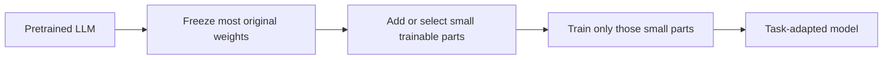

The core idea:

> Keep the expensive general model mostly unchanged. Train a small “steering mechanism” that adapts it to the new task.

---

## 5. Three Main PEFT Families

The transcript names three broad PEFT families:

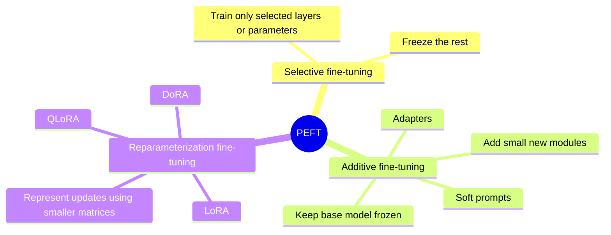

---

# 6. Selective Fine-Tuning

## What it means

Selective fine-tuning updates only some parts of the model.

For example:

- train only the last few layers
- train only attention layers
- train only the classification head
- freeze embeddings and early layers

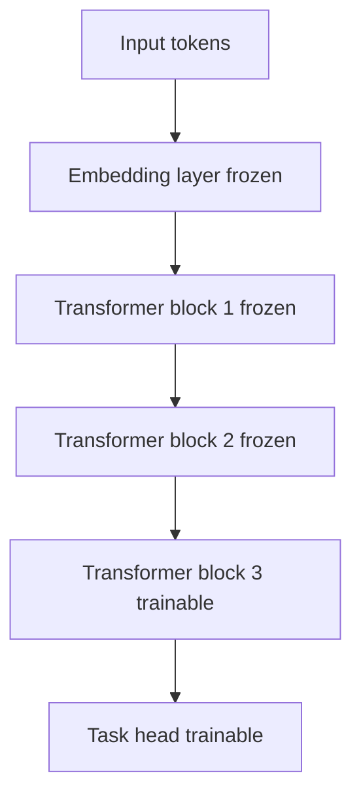

## Simple example

Suppose a model has 12 transformer layers.

Selective fine-tuning might train only layers 10, 11, and 12.

```text
Frozen:    layers 1-9
Trainable: layers 10-12 + output head
```

## Why it can be limited for transformers

Transformers often spread knowledge across many layers and components. If you only update a small subset, the model may not adapt enough.

That does not mean selective fine-tuning is useless. It means it is often less powerful than methods like LoRA or adapters for modern LLM adaptation.

---

# 7. Additive Fine-Tuning

## What it means

Additive fine-tuning keeps the original model mostly frozen and **adds new trainable components**.

The base model stays the same. The new components learn the task.

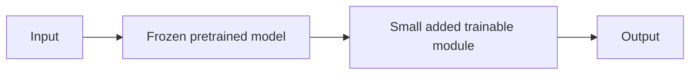

This is useful because you can store only the added components instead of storing a full new model.

---

## 7.1 Adapters

Adapters are small neural network modules inserted into transformer blocks.

Usually, they do something like this:

1. Take a large hidden vector.
2. Project it down to a smaller dimension.
3. Apply a nonlinearity.
4. Project it back up to the original dimension.
5. Add it back into the model flow.

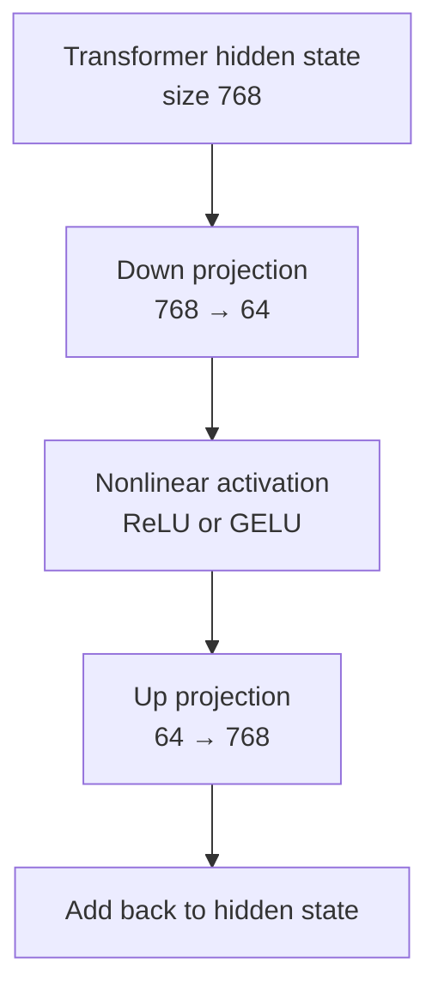

## Adapter intuition

Think of the base model as a powerful general-purpose engine.

The adapter is a small detachable tool that changes how the engine behaves for a specific task.

| Part | Analogy |
|---|---|
| Base model | General-purpose engine |
| Adapter | Detachable task-specific attachment |
| Fine-tuning | Training the attachment, not rebuilding the engine |

---

## Adapter PyTorch-shaped pseudocode

This is not exact production code. It is shaped like PyTorch to show the idea.

```python
import torch
import torch.nn as nn

class Adapter(nn.Module):
    def __init__(self, hidden_size: int, bottleneck_size: int):
        super().__init__()
        self.down = nn.Linear(hidden_size, bottleneck_size)
        self.activation = nn.GELU()
        self.up = nn.Linear(bottleneck_size, hidden_size)

    def forward(self, hidden_states):
        # Learn a small task-specific correction.
        update = self.down(hidden_states)
        update = self.activation(update)
        update = self.up(update)

        # Residual-style addition keeps original representation available.
        return hidden_states + update
```

---

# 8. Soft Prompts

## What soft prompts are

A normal text prompt uses actual tokens:

```text
"Answer this medical question:"
```

A **soft prompt** uses trainable vectors instead of human-readable words.

These vectors are prepended or inserted near the input embeddings.

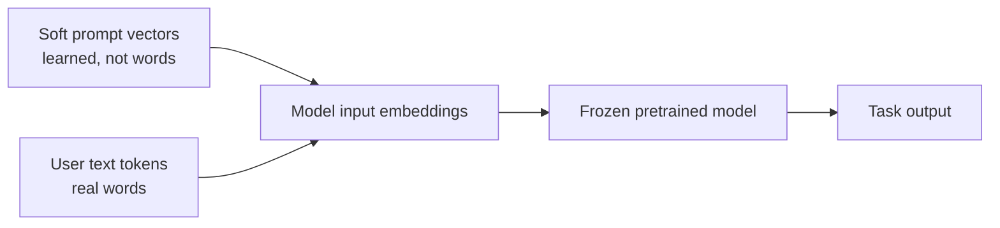

## Plain-English explanation

A soft prompt is like giving the model a learned “mood” or “instruction signal” before it reads the actual input.

But unlike a normal prompt, the soft prompt may not correspond to readable words.

The model learns vectors such as:

```text
[soft_vector_1, soft_vector_2, soft_vector_3, ...]
```

These are optimized during training.

---

## Hard prompt vs soft prompt

| Type | Example | Human-readable? | Trainable? |
|---|---|---:|---:|
| **Hard prompt** | “Summarize this in simple terms.” | Yes | Usually no |
| **Soft prompt** | Learned embedding vectors | No | Yes |

---

## Soft prompt PyTorch-shaped pseudocode

```python
class SoftPromptedModel(nn.Module):
    def __init__(self, base_model, prompt_length: int, hidden_size: int):
        super().__init__()
        self.base_model = base_model

        # These are learned vectors, not vocabulary token IDs.
        self.soft_prompt = nn.Parameter(
            torch.randn(prompt_length, hidden_size)
        )

        # Freeze the base model.
        for param in self.base_model.parameters():
            param.requires_grad = False

    def forward(self, input_embeddings):
        batch_size = input_embeddings.shape[0]

        prompt = self.soft_prompt.unsqueeze(0).expand(batch_size, -1, -1)

        # Concatenate learned prompt vectors before input embeddings.
        prompted_embeddings = torch.cat([prompt, input_embeddings], dim=1)

        return self.base_model(inputs_embeds=prompted_embeddings)
```

---

# 9. Prefix Tuning

Prefix tuning is related to soft prompts, but it is often applied more deeply inside the transformer.

Instead of only adding learned vectors to the input embedding, prefix tuning can add learned vectors to the key/value states used by attention.

## Simple intuition

A normal prompt gives the model text instructions.

A prefix gives the model learned hidden context that influences attention.

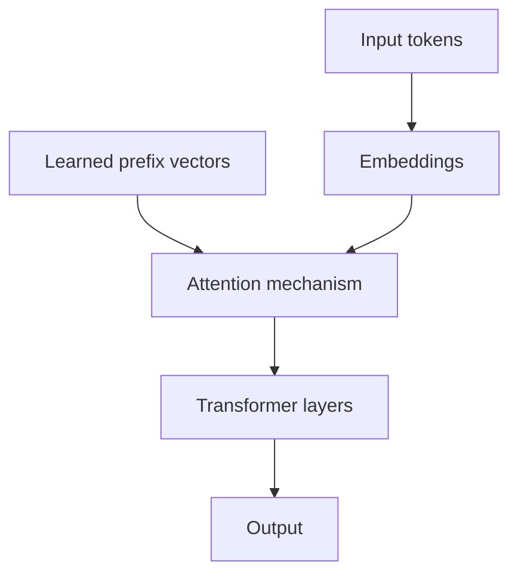

## Example use case

You have a general chatbot and want to adapt it into a medical chatbot.

Full fine-tuning:

```text
Update the whole chatbot model.
```

Prefix tuning:

```text
Freeze the chatbot.
Train small prefix vectors that steer it toward medical-chat behavior.
```

---

# 10. Rank: The Core Math Idea Behind LoRA

The transcript says rank is the minimum number of vectors needed to span a space.

That is a useful beginner definition.

More precisely:

> Rank measures how many independent directions a matrix transformation really uses.

## Layman’s example

Imagine directions on a flat sheet of paper.

If you have two independent directions:

- left/right
- up/down

You can reach any point on the paper.

That is rank 2.

Now imagine the paper is floating in 3D space. Even though the paper exists inside 3D space, movement on the paper still only needs two directions.

So the rank is still 2.

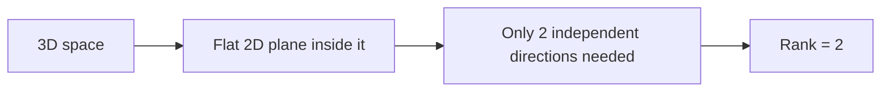

## Why rank matters for neural networks

A huge weight matrix might be shaped like this:

```text
4096 × 4096
```

That has:

```text
4096 * 4096 = 16,777,216 parameters
```

LoRA says:

> Instead of learning a full giant update matrix, learn two smaller matrices whose product acts like a low-rank update.

---

# 11. LoRA: Low-Rank Adaptation

## What LoRA does

In normal fine-tuning, a layer has a weight matrix:

```text
W
```

Full fine-tuning updates `W` directly.

LoRA freezes `W` and learns a small update:

```text
W + ΔW
```

But instead of learning a full-size `ΔW`, LoRA represents it as:

```text
ΔW = B @ A
```

Where:

- `A` is a small down-projection matrix
- `B` is a small up-projection matrix
- the rank `r` is much smaller than the full hidden size

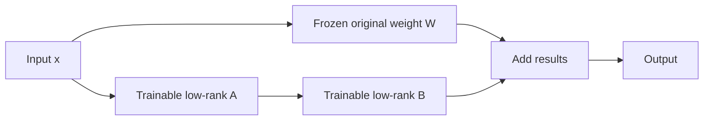

## Simple formula

```text
output = xW + xBA
```

Depending on notation, you may see:

```text
output = xW + xAB
```

The important idea is the same:

> The original weight is frozen, and LoRA learns a small low-rank correction.

---

## Why LoRA saves parameters

Suppose the original matrix is:

```text
4096 × 4096 = 16,777,216 parameters
```

If LoRA uses rank `r = 8`, it learns two matrices:

```text
A: 4096 × 8
B: 8 × 4096
```

Total LoRA parameters:

```text
4096*8 + 8*4096 = 65,536 parameters
```

Comparison:

| Method | Trainable parameters for this layer |
|---|---:|
| Full fine-tuning | 16,777,216 |
| LoRA with rank 8 | 65,536 |

That is about **256× fewer trainable parameters** for that layer.

---

## LoRA PyTorch-shaped pseudocode

```python
class LoRALinear(nn.Module):
    def __init__(self, frozen_linear: nn.Linear, rank: int, alpha: float):
        super().__init__()
        self.frozen_linear = frozen_linear

        # Freeze the original pretrained weights.
        for param in self.frozen_linear.parameters():
            param.requires_grad = False

        in_features = frozen_linear.in_features
        out_features = frozen_linear.out_features

        # Low-rank trainable matrices.
        self.A = nn.Linear(in_features, rank, bias=False)
        self.B = nn.Linear(rank, out_features, bias=False)

        # Scaling helps control update strength.
        self.scale = alpha / rank

    def forward(self, x):
        base_output = self.frozen_linear(x)
        lora_update = self.B(self.A(x)) * self.scale
        return base_output + lora_update
```

---

# 12. QLoRA and DoRA

## QLoRA

**QLoRA** means **Quantized Low-Rank Adaptation**.

It combines:

1. **Quantization**: store the base model weights in lower precision, such as 4-bit.
2. **LoRA**: train small low-rank adapter matrices.

Plain-English version:

> QLoRA makes the frozen base model cheaper to store in memory, while LoRA keeps the trainable part small.

This is especially useful when fine-tuning large models on limited GPU memory.

---

## DoRA

**DoRA** means **Weight-Decomposed Low-Rank Adaptation**.

DoRA improves on LoRA by separating the update into:

- **direction**
- **magnitude**

Plain-English version:

> LoRA learns a small directional correction. DoRA also pays special attention to how strong that correction should be.

---

# 13. PEFT Method Comparison

| Method | Main idea | What is trainable? | Good for |
|---|---|---|---|
| Selective fine-tuning | Train only selected original parts | Some original layers/weights | Simple adaptation, smaller models |
| Adapters | Add small modules inside model | Adapter layers | Multi-task setups, modular storage |
| Soft prompt tuning | Add learned input vectors | Prompt embeddings | Lightweight task steering |
| Prefix tuning | Add learned prefix context to attention | Prefix vectors | Generation tasks, decoder models |
| LoRA | Learn low-rank weight updates | Small low-rank matrices | Common LLM fine-tuning |
| QLoRA | Quantize base model + train LoRA | LoRA matrices | Low-memory fine-tuning |
| DoRA | Decompose magnitude and direction | Low-rank direction + magnitude info | Better adaptation in some settings |

---

# 14. One Practical Example

Suppose you want to adapt a general LLM into a support chatbot for your company.

## Full fine-tuning approach

```text
Train most/all model weights on company support tickets.
```

Problems:

- expensive
- high GPU memory usage
- must store a full model copy
- higher forgetting risk

## PEFT approach

```text
Freeze the base LLM.
Train a small LoRA adapter on company support tickets.
```

Benefits:

- cheaper training
- smaller storage
- easier to swap task adapters
- base model remains intact

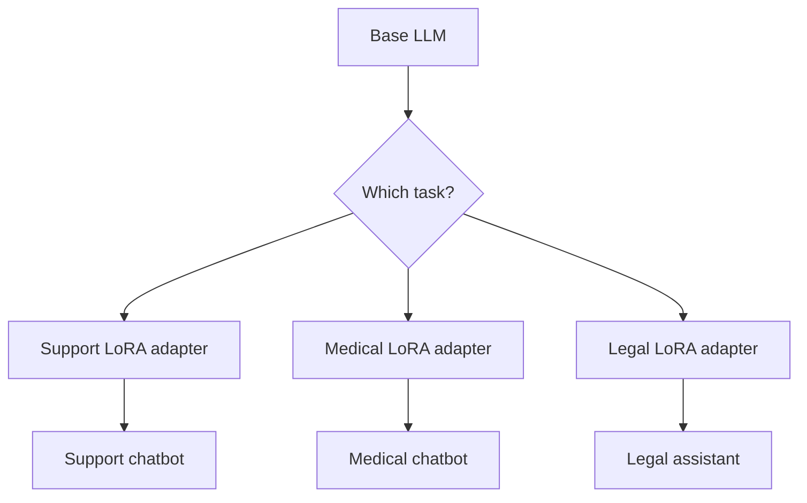

---

# 15. How PEFT Fits Into the Training Pipeline

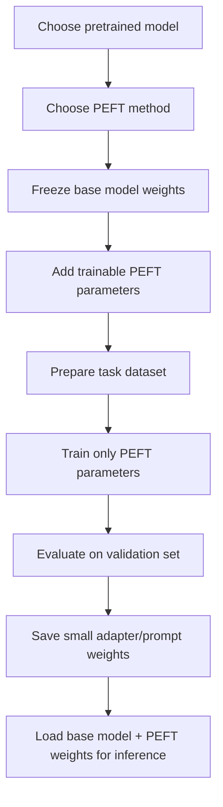

---

# 16. Common Beginner Confusions

## “If the base model is frozen, how does it learn?”

The base model does not learn new weights directly.

Instead, the PEFT parameters learn how to steer the frozen model.

Think of the frozen model as a powerful machine. PEFT does not rebuild the machine; it learns a control panel for the machine.

---

## “Are adapters and LoRA the same?”

No.

They are similar because both avoid updating the full base model, but they work differently.

| Adapters | LoRA |
|---|---|
| Add small neural modules | Add low-rank weight updates |
| Usually inserted between model components | Usually attached to linear layers |
| Extra forward-pass modules remain visible | LoRA updates can often be merged into weights for inference |

---

## “Are soft prompts normal words?”

No.

Soft prompts are learned vectors. They may influence the model like a prompt, but they are not readable text.

---

## “Does PEFT always beat full fine-tuning?”

No.

PEFT is usually cheaper and often very effective, but full fine-tuning can be more flexible when you have:

- enough data
- enough compute
- a strong reason to deeply change model behavior

The trade-off is:

```text
Full fine-tuning = more flexible, more expensive
PEFT = less expensive, often good enough
```

---

# 17. Minimal Training Loop: PyTorch-Shaped Pseudocode

```python
model = load_pretrained_model("some-llm")

# Attach LoRA, adapters, or soft prompts.
model = add_peft_modules(model, method="lora", rank=8)

# Freeze base model, train only PEFT parameters.
for name, param in model.named_parameters():
    if "lora" in name or "adapter" in name or "soft_prompt" in name:
        param.requires_grad = True
    else:
        param.requires_grad = False

optimizer = torch.optim.AdamW(
    [p for p in model.parameters() if p.requires_grad],
    lr=2e-4
)

for batch in train_loader:
    outputs = model(
        input_ids=batch["input_ids"],
        attention_mask=batch["attention_mask"],
        labels=batch["labels"]
    )

    loss = outputs.loss

    loss.backward()
    optimizer.step()
    optimizer.zero_grad()
```

## What this loop means

1. Load a pretrained model.
2. Add small PEFT components.
3. Freeze most parameters.
4. Train only the PEFT parameters.
5. Save the small PEFT weights.

---

# 18. Simple Memory Hooks

| Concept | Memory hook |
|---|---|
| Full fine-tuning | Rebuild the whole engine |
| PEFT | Add a small steering system |
| Adapter | Add a small task module |
| Soft prompt | Learned invisible prompt |
| Prefix tuning | Learned context for attention |
| Rank | Number of independent directions |
| LoRA | Small low-rank correction to frozen weights |
| QLoRA | LoRA plus compressed base model |
| DoRA | LoRA-style update with magnitude/direction split |

---

# 19. Self-Check Questions

## Basic

1. What does PEFT stand for?
2. Why can full fine-tuning be expensive?
3. What does it mean to freeze model weights?
4. What is catastrophic forgetting?
5. What is the difference between a hard prompt and a soft prompt?

## Intermediate

6. Why might selective fine-tuning be less effective for large transformers?
7. How do adapters modify a pretrained transformer?
8. What does rank mean in the context of LoRA?
9. Why does LoRA use two smaller matrices instead of one full update matrix?
10. What is the difference between LoRA and QLoRA?

## Applied

11. If you had a 7B-parameter model and only one consumer GPU, which PEFT method might you consider first?
12. Why might storing LoRA adapters be useful if you need one base model to support many tasks?
13. What could go wrong if your task dataset is tiny but you full fine-tune the entire model?
14. When might full fine-tuning still be better than PEFT?
15. Explain PEFT to a non-technical person using an analogy.

---

# 20. Answer Key

1. **Parameter-Efficient Fine-Tuning**.
2. It updates many parameters, requiring lots of memory, compute, storage, and data.
3. Frozen weights are not updated during training.
4. Catastrophic forgetting is when a model loses previously learned ability after training on new data.
5. A hard prompt is readable text; a soft prompt is learned vector embeddings.
6. Transformer knowledge is distributed across many parameters, so updating only a few original parts may not adapt enough.
7. Adapters add small trainable modules, often with down-projection and up-projection layers.
8. Rank is the number of independent directions needed to represent a transformation.
9. Two smaller matrices can represent a low-rank update with far fewer trainable parameters.
10. QLoRA uses quantization to reduce memory while training LoRA adapters.
11. Often QLoRA or LoRA, depending on memory and model size.
12. You can reuse one base model and swap small task-specific adapters.
13. The model may overfit or forget useful general knowledge.
14. When you have enough compute/data and need deeper behavior change.
15. Example: PEFT is like training a small steering wheel for a powerful car instead of rebuilding the whole car.

---

# 21. Key Takeaway

PEFT is about **efficient specialization**.

Instead of retraining a giant model from top to bottom, PEFT keeps the pretrained model mostly frozen and trains a small number of parameters that steer the model toward a new task.

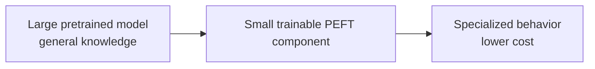
