# Using Pre-Trained Transformers and Fine-Tuning — Beginner-Friendly Notes

> Topic: pre-trained transformer models, fine-tuning, supervised fine-tuning, RLHF, DPO, and PEFT.

---

## 1. Big Idea

Modern transformer models such as **BERT**, **GPT**, and **Llama** are usually not trained from scratch for every new task.

Instead, the common workflow is:

1. **Pre-train** a large model on a huge amount of general text.
2. **Fine-tune** that model on a smaller, more specific dataset.
3. Use the adapted model for a specific task, domain, or behavior.

In plain English:

> Pre-training gives the model general language knowledge. Fine-tuning teaches it how to use that knowledge for a specific job.

---

## 2. Corrected Transcript Terminology

| Transcript wording | Corrected / clearer wording | Why |
|---|---|---|
| `GPU's` | **GPUs** | Plural acronym does not need an apostrophe. |
| `GPOs` | **GPUs** | Obvious transcript error. GPUs are graphics processing units. |
| `faster conversions` | **faster convergence** | In ML, convergence means training reaches a useful/stable point. |
| `self supervised` | **self-supervised** | Standard hyphenated term. |
| `Fine-tuning LLMs adapt` | **Fine-tuning adapts LLMs** | Grammar correction. |
| `novel cost functions` | **specialized training objectives / loss functions** | More precise ML wording. |
| `BERT that understands language to produce a single output` | **a reward model, often encoder-based, can score responses** | BERT itself is not magically a scorer; it can be fine-tuned as one. |

---

## 3. Why Pre-Trained Transformers Matter

Transformer models use **attention** to let each token look at other tokens in the sequence.

For example, in this sentence:

> The mechanic fixed the car because **it** would not start.

The word **it** probably refers to **the car**, not the mechanic. Attention helps the model learn relationships like that.

### Pre-training

During **pre-training**, the model sees a massive amount of text and learns general patterns:

- grammar
- word meanings
- factual associations
- writing styles
- context clues
- common reasoning patterns

It does not usually learn one narrow task only. It learns a broad language foundation.

### Simple analogy

Think of pre-training like going through general school.

Fine-tuning is like job-specific training after school.

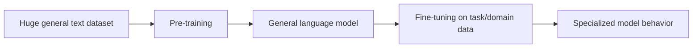

---

## 4. Why Not Train From Scratch?

Training a large language model from scratch is expensive because it needs:

- huge datasets
- powerful GPUs
- long training runs
- distributed systems infrastructure
- careful optimization
- repeated experiments

A frontier-scale model may take weeks or months to train and can cost a lot of money.

Fine-tuning is cheaper because the model has already learned many useful language patterns.

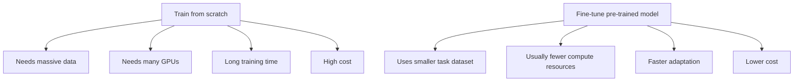

---

## 5. What Is Fine-Tuning?

**Fine-tuning** means taking a pre-trained model and continuing training it on a more specific dataset.

The goal is not to teach language from zero. The goal is to adjust the model toward a specific use.

Examples:

| Goal | Fine-tuning data might look like |
|---|---|
| Sentiment classifier | Movie reviews labeled positive/negative |
| Medical chatbot | Medical Q&A examples and safety guidelines |
| Legal document summarizer | Legal documents paired with summaries |
| Car Q&A bot | Questions and answers about cars |
| Support assistant | Customer tickets and good support replies |

### Layman’s explanation

A pre-trained model already knows English pretty well.

Fine-tuning says:

> “Now answer like a customer support agent.”  
> “Now classify these reviews.”  
> “Now follow this company’s tone.”  
> “Now specialize in this domain.”

---

## 6. Transfer Learning

Fine-tuning is a form of **transfer learning**.

Transfer learning means knowledge learned from one broad task is reused for another task.

For example:

1. The model learns general language from books, websites, and articles.
2. You fine-tune it on car repair Q&A.
3. It uses its general language knowledge plus car-specific examples.

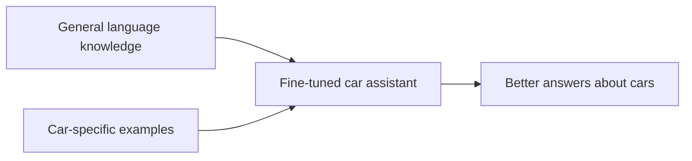

---

## 7. Main Benefits of Fine-Tuning

| Benefit | Meaning |
|---|---|
| Saves compute | You avoid training everything from scratch. |
| Saves time | You start from an already capable model. |
| Works with less labeled data | You may not need millions of examples. |
| Task specialization | The model becomes better at a target task. |
| Domain adaptation | The model learns field-specific language. |
| Response alignment | The model can be shaped toward preferred behavior. |

---

## 8. Common Fine-Tuning Problems

Fine-tuning is useful, but it can go wrong.

### 8.1 Overfitting

**Overfitting** means the model memorizes the training data too closely and performs poorly on new examples.

Example:

A model trained on only 100 customer support examples may memorize those exact answers instead of learning the general support style.

Signs of overfitting:

- training loss keeps improving
- validation performance stops improving or gets worse
- model handles known examples well but fails on new ones

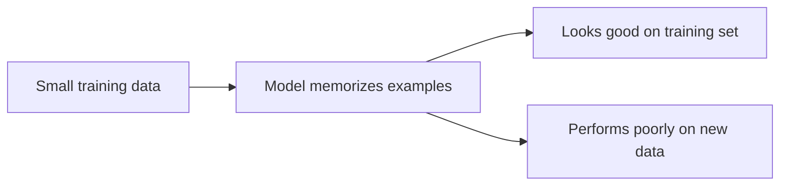

### 8.2 Underfitting

**Underfitting** means the model did not learn enough from the data.

Possible causes:

- too little training
- learning rate too low
- model too constrained
- poor dataset quality
- wrong training objective

Simple example:

If you only study one page before a difficult exam, you probably underfit the subject.

### 8.3 Catastrophic Forgetting

**Catastrophic forgetting** means fine-tuning makes the model lose some of its general ability.

Example:

A general chatbot is fine-tuned too aggressively on car manuals. Afterward, it may become worse at general conversation or unrelated tasks.

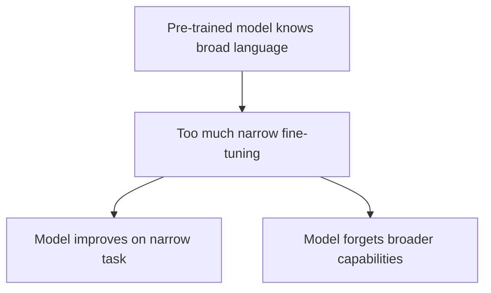

### 8.4 Data Leakage

**Data leakage** means information from the validation/test set accidentally appears in training.

This makes metrics look better than they really are.

Example:

If the exact same Q&A pair appears in both training and validation, the model may seem accurate because it has already seen the answer.

Correct split:

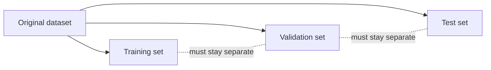

---

## 9. Three Main Approaches to Fine-Tuning

The transcript describes three broad approaches:

1. **Self-supervised fine-tuning**
2. **Supervised fine-tuning**
3. **Reinforcement learning from human feedback**, or **RLHF**

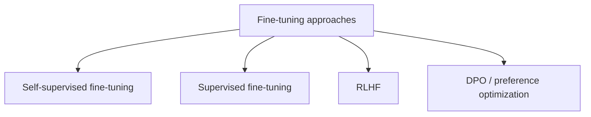

Note: **DPO** is often discussed as an alternative to parts of the RLHF pipeline, especially the reward-model-plus-RL step.

---

## 10. Self-Supervised Fine-Tuning

In **self-supervised learning**, the dataset does not need human labels like `positive`, `negative`, `spam`, or `not spam`.

Instead, the model creates a learning signal from the text itself.

### Examples

| Model type | Common objective | Example |
|---|---|---|
| Decoder-only model, like GPT-style models | Predict the next token | `The car would not ____` → `start` |
| Encoder model, like BERT | Predict masked tokens | `The car would not [MASK]` → `start` |

### Layman’s explanation

Self-supervised learning is like covering up part of a sentence and asking the model to guess what belongs there.

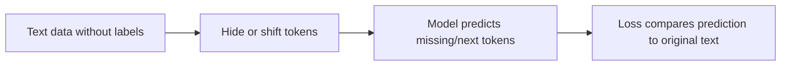

### PyTorch-shaped pseudocode: masked language modeling

```python
# Pseudocode, not complete production code

batch = tokenizer(texts, padding=True, truncation=True, return_tensors="pt")
input_ids = batch["input_ids"]

masked_input_ids, labels = mask_some_tokens(input_ids)

outputs = model(input_ids=masked_input_ids)
logits = outputs.logits

# Cross-entropy only applies where labels are not ignored.
loss = cross_entropy(
    logits.view(-1, vocab_size),
    labels.view(-1)
)

loss.backward()
optimizer.step()
```

---

## 11. Supervised Fine-Tuning, or SFT

**Supervised fine-tuning** uses labeled examples.

The label might be:

- a class
- a score
- a correct answer
- a preferred response
- an instruction-following completion

### Example: sentiment classification

| Text | Label |
|---|---|
| “This movie was excellent.” | Positive |
| “The app crashes constantly.” | Negative |

### Example: instruction tuning

| Instruction | Desired answer |
|---|---|
| “Summarize this paragraph.” | A good summary |
| “Explain photosynthesis simply.” | A beginner-friendly explanation |
| “Write a polite support reply.” | A polished customer support response |

### PyTorch-shaped pseudocode: classification SFT

```python
# Pseudocode for fine-tuning an encoder model for classification

batch = tokenizer(texts, padding=True, truncation=True, return_tensors="pt")
labels = torch.tensor([1, 0, 1, 0])  # example class IDs

outputs = model(**batch)
logits = outputs.logits  # shape: [batch_size, num_classes]

loss = cross_entropy(logits, labels)

loss.backward()
optimizer.step()
```

### PyTorch-shaped pseudocode: instruction SFT for decoder model

```python
# Pseudocode for instruction-response fine-tuning

examples = [
    {
        "prompt": "Explain what fine-tuning is.",
        "response": "Fine-tuning adapts a pre-trained model to a specific task."
    }
]

text = format_as_prompt_response(examples)
batch = tokenizer(text, return_tensors="pt", padding=True, truncation=True)

# In decoder training, labels are often the same token sequence shifted internally.
outputs = model(input_ids=batch["input_ids"], labels=batch["input_ids"])
loss = outputs.loss

loss.backward()
optimizer.step()
```

---

## 12. Fine-Tuning Decoder Models Can Be Harder Than It Looks

The transcript says fine-tuning causal decoder models can seem straightforward: just make a task-specific dataset and train.

For example:

> Build a car Q&A assistant by training on car Q&A examples.

That part is true, but real systems often require more than basic next-token training.

Why?

Because a language model response can be judged in many ways:

- Is it correct?
- Is it helpful?
- Is it safe?
- Is it concise?
- Is it honest about uncertainty?
- Does it follow the requested style?
- Does it avoid hallucinating?

These qualities are hard to capture with one simple label.

---

## 13. Response Evaluation: Why Scoring Is Difficult

Humans are usually better at comparing two responses than assigning an exact score.

Question:

> Which country owns Antarctica?

Response A:

> Antarctica is not owned by one country. It is governed under the Antarctic Treaty System.

Response B:

> Our penguin overlords run the show down there.

Most people can tell Response A is better. But assigning exact numeric scores like `9.2` versus `2.7` is harder and less consistent.

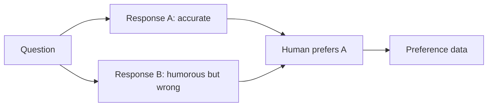

---

## 14. Reward Modeling

A **reward model** is trained to score model outputs.

It usually takes something like:

```text
Prompt + Response → Score
```

or compares two responses:

```text
Prompt + Response A + Response B → Which is better?
```

The reward model is then used to guide another model toward better responses.

### Important clarification

The transcript mentions using an LLM such as BERT to produce a single output similar to regression. A clearer version is:

> An encoder-style model, such as BERT, can be fine-tuned as a reward model that assigns a scalar score to a response.

That score is not the final answer. It is a training signal.

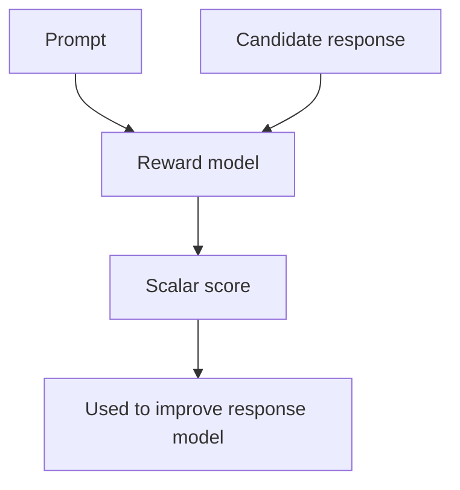

### PyTorch-shaped pseudocode: reward model

```python
# Pseudocode for a reward model that scores responses

text = [prompt + "\n" + response for prompt, response in pairs]
batch = tokenizer(text, padding=True, truncation=True, return_tensors="pt")

scores = reward_model(**batch).logits.squeeze(-1)  # shape: [batch_size]

# Example: train scores to match human-provided numeric ratings
loss = mse_loss(scores, human_scores)

loss.backward()
optimizer.step()
```

---

## 15. RLHF: Reinforcement Learning from Human Feedback

**RLHF** means the model is improved using human preference feedback.

A simplified RLHF pipeline:

1. Start with a pre-trained model.
2. Perform supervised fine-tuning on good instruction-response examples.
3. Collect human preferences between model responses.
4. Train a reward model from those preferences.
5. Use reinforcement learning to update the language model toward higher reward.

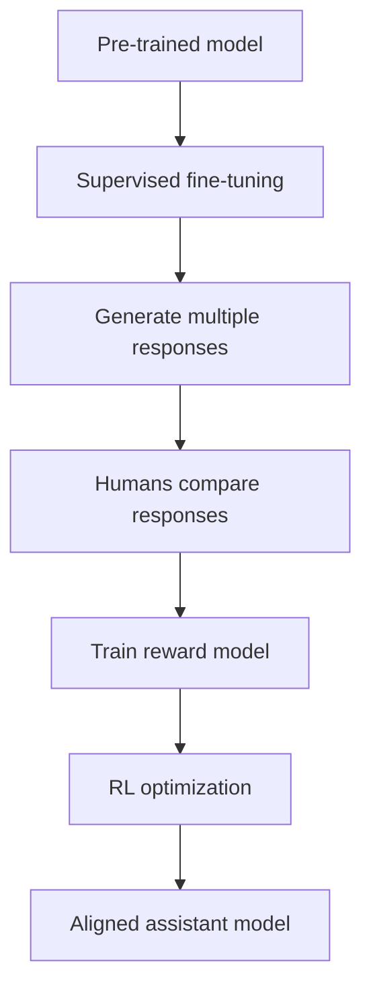

### Layman’s explanation

RLHF is like this:

1. The model gives a few possible answers.
2. Humans say which answer is better.
3. A reward model learns those preferences.
4. The language model is trained to produce answers that the reward model scores highly.

---

## 16. DPO: Direct Preference Optimization

**DPO**, or **Direct Preference Optimization**, trains directly from preference pairs.

Instead of training a separate reward model and then using reinforcement learning, DPO uses preferred/rejected examples more directly.

A DPO training example often looks like this:

| Prompt | Chosen response | Rejected response |
|---|---|---|
| “Explain fine-tuning simply.” | “Fine-tuning adapts a pre-trained model to a specific task.” | “Fine-tuning is when computers become conscious.” |

### Why DPO is popular

| Feature | Meaning |
|---|---|
| Simpler than RLHF | Avoids some reinforcement learning complexity. |
| Preference-based | Uses human or AI preference pairs. |
| No separate reward model required | DPO can optimize directly from chosen/rejected data. |
| Often more stable | It can be easier to implement and tune than RL-based methods. |

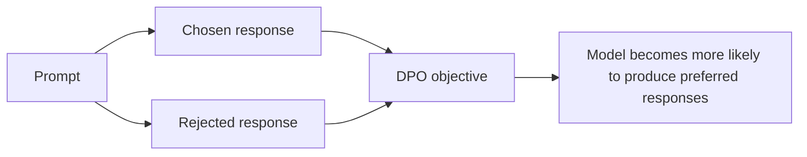

### PyTorch-shaped pseudocode: DPO-style preference training

```python
# Very simplified pseudocode for intuition only

chosen_logprob = model.logprob(prompt, chosen_response)
rejected_logprob = model.logprob(prompt, rejected_response)

reference_chosen_logprob = reference_model.logprob(prompt, chosen_response)
reference_rejected_logprob = reference_model.logprob(prompt, rejected_response)

# DPO encourages the policy model to prefer chosen over rejected,
# while staying related to the reference model.
preference_margin = (
    chosen_logprob - rejected_logprob
    - reference_chosen_logprob + reference_rejected_logprob
)

loss = -log_sigmoid(beta * preference_margin)

loss.backward()
optimizer.step()
```

---

## 17. Full Fine-Tuning vs PEFT

The transcript ends by comparing two supervised fine-tuning strategies:

1. **Full fine-tuning**
2. **Parameter-efficient fine-tuning**, or **PEFT**

### Full fine-tuning

In **full fine-tuning**, most or all model parameters are updated.

This can produce strong adaptation, but it is expensive and can increase the risk of catastrophic forgetting.

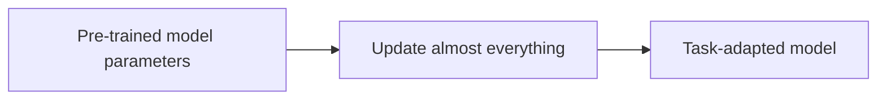

### PEFT

In **PEFT**, most of the original model stays frozen. Only a small number of added or selected parameters are trained.

Common PEFT methods include:

- adapters
- prefix tuning
- prompt tuning
- LoRA, or Low-Rank Adaptation

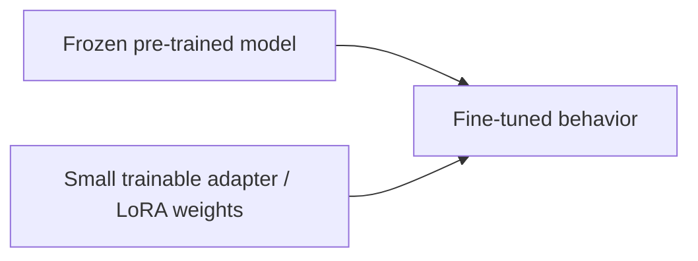

### Full fine-tuning vs PEFT comparison

| Category | Full fine-tuning | PEFT |
|---|---|---|
| Parameters updated | Most/all | Small subset |
| Compute cost | Higher | Lower |
| Storage cost per task | High | Lower |
| Risk of forgetting | Higher | Usually lower |
| Flexibility | Strong adaptation | Efficient adaptation |
| Common use | When maximum task performance is needed and resources allow | When adapting large models cheaply |

---

## 18. Putting It All Together

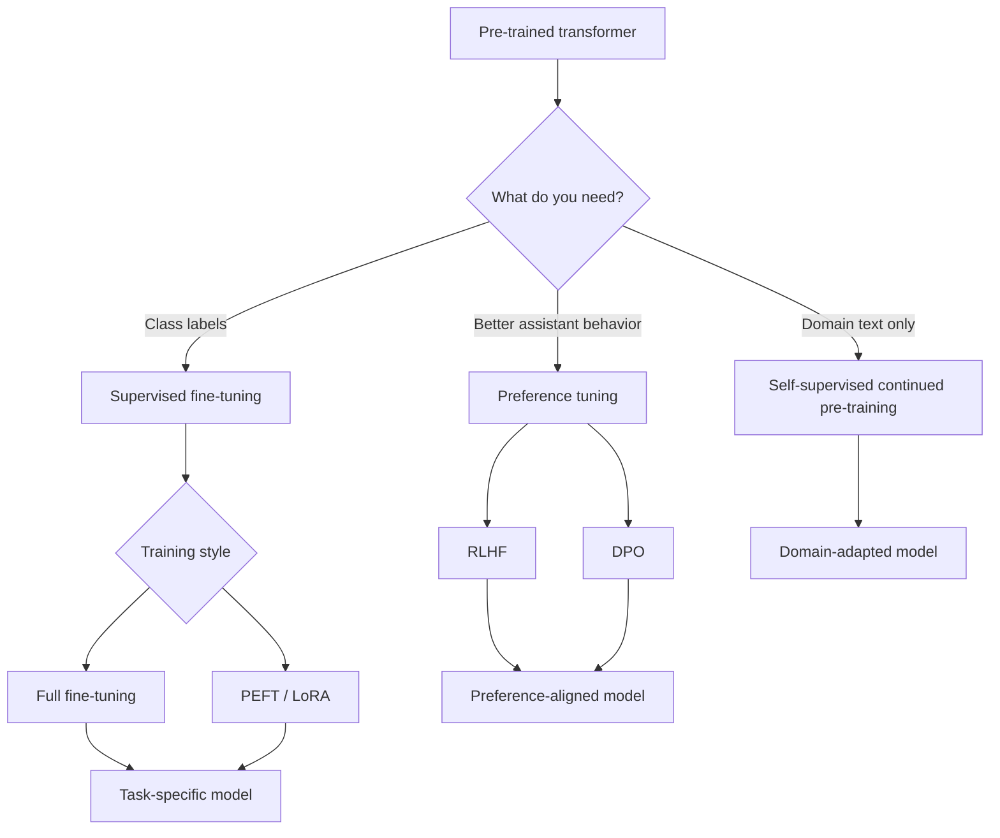

---

## 19. Concrete Example: Building a Car Q&A Assistant

Suppose you want an assistant that answers questions about cars.

### Step 1: Start with a pre-trained model

The model already knows general language.

### Step 2: Prepare domain data

Examples:

- car manuals
- repair guides
- troubleshooting Q&A
- safety documentation
- mechanic-written explanations

### Step 3: Choose the fine-tuning approach

| Desired result | Possible approach |
|---|---|
| Better knowledge of car vocabulary | Self-supervised continued pre-training on car text |
| Better Q&A behavior | Supervised fine-tuning on car question-answer pairs |
| Better answer helpfulness | Preference tuning with chosen/rejected responses |
| Cheaper training | PEFT / LoRA |

### Step 4: Evaluate carefully

Check whether the model:

- answers correctly
- admits uncertainty
- avoids unsafe repair advice
- handles new questions
- does not merely memorize training examples

---

## 20. Beginner Mental Model

Think of a pre-trained model as a smart generalist.

Fine-tuning turns it into a specialist.

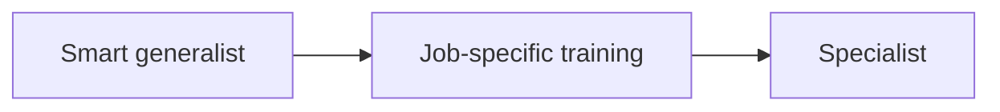

Examples:

| Pre-trained model | Fine-tuned model |
|---|---|
| Knows general language | Answers company support tickets |
| Knows broad writing patterns | Writes in a legal style |
| Knows general facts and grammar | Classifies product reviews |
| Can produce generic answers | Follows human preferences better |

---

## 21. Key Takeaways

- Transformer models can be pre-trained on large unlabeled text datasets.
- Pre-training gives models broad language ability.
- Fine-tuning adapts a pre-trained model to a task, domain, or behavior.
- Fine-tuning is usually cheaper than training from scratch.
- Common risks include overfitting, underfitting, catastrophic forgetting, and data leakage.
- Self-supervised fine-tuning uses the text itself as the training signal.
- Supervised fine-tuning uses labeled or desired-output examples.
- RLHF uses human preference feedback and a reward model.
- DPO optimizes directly from preference pairs and avoids a separate reward model.
- Full fine-tuning updates most or all model parameters.
- PEFT updates only a small number of parameters, making adaptation cheaper.

---

## 22. Self-Check Questions

### Concept questions

1. What is the difference between pre-training and fine-tuning?
2. Why is fine-tuning usually cheaper than training from scratch?
3. What does transfer learning mean?
4. What is overfitting?
5. What is underfitting?
6. What is catastrophic forgetting?
7. Why is data leakage dangerous?
8. What is the difference between supervised and self-supervised fine-tuning?
9. Why can response evaluation be difficult for LLMs?
10. What problem does a reward model try to solve?
11. How is DPO different from RLHF?
12. Why might someone use PEFT instead of full fine-tuning?

### Applied questions

1. You have 5,000 labeled customer support examples. Which fine-tuning approach might you start with?
2. You have 10 GB of unlabeled legal documents. What kind of fine-tuning could help adapt the model to legal language?
3. Your model performs great on training examples but poorly on new examples. What problem might this be?
4. Your validation examples accidentally appear in the training set. What issue is this?
5. You want to fine-tune a huge model cheaply. Which method family should you consider?

---

## 23. Answer Key

1. **Pre-training** learns broad language patterns from large data; **fine-tuning** adapts that model to a specific task or domain.
2. Fine-tuning starts from an already capable model and usually needs less data and compute.
3. Transfer learning means reusing knowledge from one training process for another task.
4. Overfitting means the model memorizes the training data too closely and fails on new data.
5. Underfitting means the model has not learned enough from the training data.
6. Catastrophic forgetting means the model loses useful general knowledge during narrow fine-tuning.
7. Data leakage makes evaluation misleading because the model has already seen information it should not have seen.
8. Supervised fine-tuning uses labels or target answers; self-supervised fine-tuning creates labels from the text itself.
9. LLM responses have many quality dimensions, and humans often compare answers more easily than assigning exact numeric scores.
10. A reward model learns to score or rank responses according to preferences.
11. RLHF often trains a reward model and then uses reinforcement learning; DPO trains directly from chosen/rejected preference pairs.
12. PEFT is cheaper because it updates only a small subset of parameters.

---

## 24. Minimal Vocabulary

| Term | Simple meaning |
|---|---|
| Transformer | Neural network architecture based heavily on attention. |
| Attention | Mechanism that lets tokens use information from other tokens. |
| Pre-training | Initial broad training on large datasets. |
| Fine-tuning | Further training for a specific task or domain. |
| LLM | Large language model. |
| Loss function | A training signal that measures how wrong the model is. |
| Epoch | One pass through the training dataset. |
| Validation set | Data used to check performance during development. |
| Test set | Data used for final evaluation. |
| RLHF | Training from human preference feedback using reinforcement learning. |
| DPO | Preference optimization without a separate reward model. |
| PEFT | Fine-tuning only a small number of parameters. |
| LoRA | A common PEFT method that adds small trainable low-rank matrices. |
