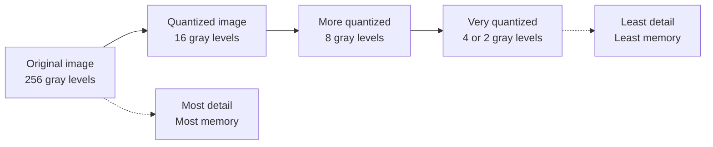
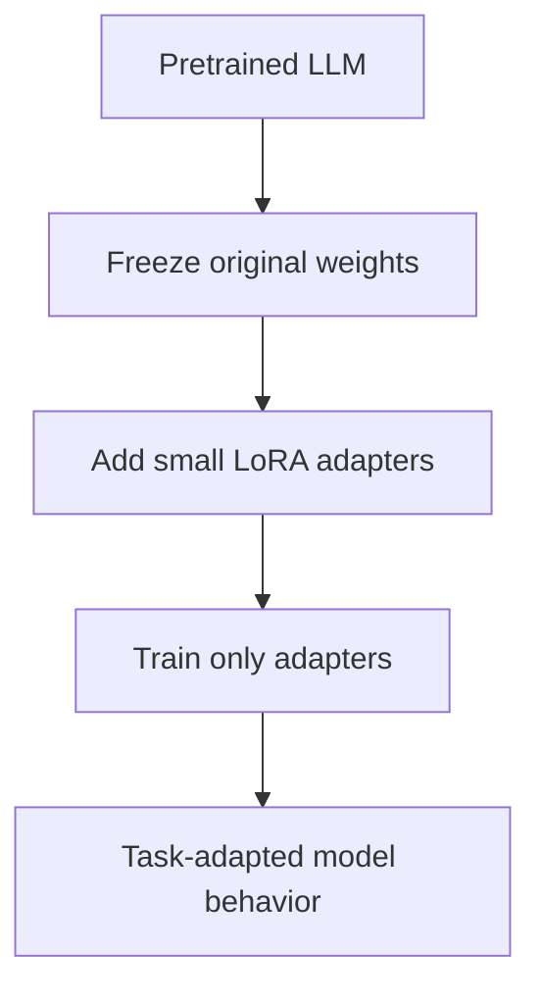
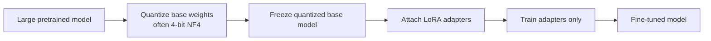
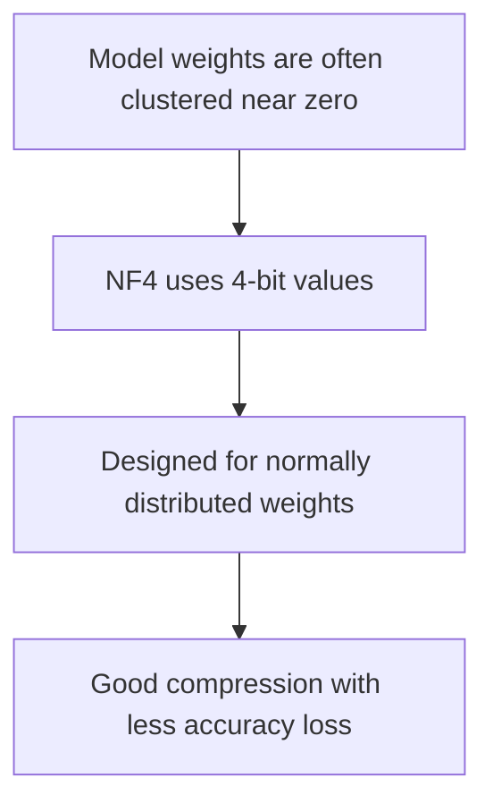
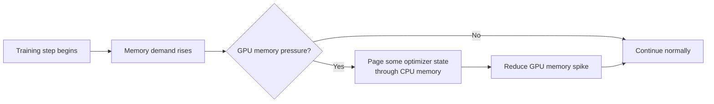
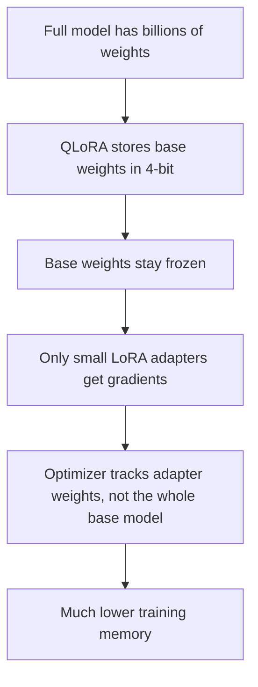
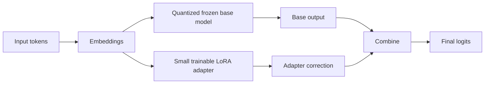

# From Quantization to QLoRA — Beginner-Friendly Notes

## Source

These notes are based on the uploaded transcript `subtitle.txt`. The transcript introduces **quantization**, **LoRA**, and **QLoRA**, then gives a simplified memory-footprint example for a 7-billion-parameter model.

---

## 1. Big Picture

### What problem is QLoRA trying to solve?

Large language models have a lot of parameters. A **7 billion parameter** model has 7 billion learned numbers inside it. Storing and training all of those numbers normally requires a lot of GPU memory.

**QLoRA** helps you fine-tune a large model using much less memory.

The main idea:

> Keep the original large model compressed in low precision, freeze it, and train only a small set of extra adapter weights.

In plain English:

> Instead of rewriting the whole book, QLoRA keeps the big book mostly unchanged and adds a small set of sticky notes that teach the model the new task.

---

## 2. Corrected Terminology

| Transcript wording | Better wording | Explanation |
|---|---|---|
| “From Quantization to QLoRA” | “From Quantization to QLoRA” | This is likely the lesson title. |
| “combining quantization in LoRA” | **combining quantization and LoRA** | QLoRA uses quantization for the base model and LoRA adapters for fine-tuning. |
| “4-bit normal float” | **4-bit NormalFloat, or NF4** | NF4 is a special 4-bit data type used by QLoRA. |
| “paged optimizers … dynamically loading and unloading model parameters” | **paged optimizers manage memory spikes by moving optimizer state between GPU and CPU memory when needed** | The transcript’s phrasing is directionally useful but oversimplified. |
| “3-bit levels: -1, -0.75, -0.5, -0.25, 0.25, 0.5, 0.75, 1” | **example 3-bit levels over -1 to 1** | This is a simplified teaching example, not the exact NF4 scheme. |
| “-0.2 to -2.50” | **-0.2 to -0.25** | `-2.50` is almost certainly a transcript/math error. |
| “2-bit levels: 1, -1/2, 1/2, 1” | **2-bit levels: -1, -1/2, 1/2, 1** | The first value should be negative. |

---

## 3. What Is Quantization?

**Quantization** means reducing the precision of numbers.

A model normally stores weights as floating-point numbers such as:

```text
0.4381921
-0.7294418
0.0528834
```

Quantization stores them using fewer possible values, such as:

```text
0.5
-0.75
0.0
```

The model becomes less precise, but it uses less memory.

### Layman’s explanation

Imagine you are measuring height.

With high precision, you might say:

```text
5 feet 10.37 inches
```

With lower precision, you might round it to:

```text
5 feet 10 inches
```

You lose some detail, but the information is still useful.

That is the spirit of quantization.

---

## 4. Image Analogy: Fewer Shades of Gray

The transcript uses a grayscale image analogy.

A normal grayscale image may use **256 levels**:

```text
0, 1, 2, 3, ..., 255
```

A quantized image may use fewer levels:

```text
16 levels
8 levels
4 levels
2 levels
```

As the number of levels decreases, the image loses detail but may still be recognizable.



### Model analogy

| Image quantization | Model quantization |
|---|---|
| Reduce number of color levels | Reduce number of numeric weight values |
| Image uses less storage | Model uses less memory |
| Image may lose fine visual detail | Model may lose some precision |
| Image can remain recognizable | Model can remain useful |

---

## 5. Bits and Quantization Levels

The number of bits determines how many different values can be represented.

Formula:

```text
number of levels = 2^bits
```

Examples:

| Bits | Number of levels | Example meaning |
|---:|---:|---|
| 1 bit | 2 levels | Very coarse |
| 2 bits | 4 levels | Coarse |
| 3 bits | 8 levels | More detail |
| 4 bits | 16 levels | Used by QLoRA’s NF4 base model weights |
| 8 bits | 256 levels | More precise than 4-bit |
| 16 bits | 65,536 levels | Common deep learning precision, such as FP16/BF16 |
| 32 bits | Very high precision | Common for some optimizer states and traditional training |

---

## 6. Simple Number Example

Suppose we restrict values to the range:

```text
-1 to 1
```

A simplified **2-bit** quantizer has 4 possible values:

```text
-1, -0.5, 0.5, 1
```

Then values are rounded to the closest available level.

| Original value | Quantized value |
|---:|---:|
| -0.75 | -1 or -0.5 depending on rule |
| -0.70 | -0.5 or -1 depending on rule |
| -0.20 | -0.5 |
| 0.05 | 0.5 |
| 0.45 | 0.5 |

Important detail: exact results depend on the quantization scheme. Real systems define precise rounding boundaries.

### Corrected transcript example

The transcript says:

```text
-0.2 to -2.50
```

That is almost certainly wrong. In the context of the lesson, it should be:

```text
-0.2 to -0.25
```

because the example levels include `-0.25`, not `-2.50`.

---

## 7. What Is LoRA?

**LoRA** stands for **Low-Rank Adaptation**.

LoRA is a fine-tuning method where you do **not** update all the original model weights.

Instead, you:

1. Freeze the original model.
2. Add small trainable adapter matrices.
3. Train only those adapter matrices.

### Layman’s explanation

Imagine the base model is a giant factory machine.

Full fine-tuning means rebuilding the whole machine.

LoRA means attaching a small control module to the machine so it behaves differently for your task.

The original machine stays mostly unchanged.



---

## 8. What Is QLoRA?

**QLoRA** stands for **Quantized Low-Rank Adaptation**.

QLoRA combines:

1. **Quantization**: store the large base model in low precision, commonly 4-bit NF4.
2. **LoRA**: train small adapter weights instead of the full model.
3. **Paged optimizers**: reduce memory spikes during training.

### Simple version

QLoRA is:

> Quantized base model + trainable LoRA adapters.



---

## 9. Why QLoRA Matters

QLoRA makes fine-tuning large models more practical.

Without QLoRA, fine-tuning a large model may require expensive high-memory GPUs.

With QLoRA, you can often fine-tune larger models on smaller hardware because the base model takes much less memory.

### Full fine-tuning vs LoRA vs QLoRA

| Approach | Base model precision | Are base weights trained? | Extra adapter weights? | Memory use | Main idea |
|---|---|---:|---:|---:|---|
| Full fine-tuning | FP16/BF16/FP32 | Yes | No | Highest | Update the whole model |
| LoRA | Usually FP16/BF16 | No | Yes | Lower | Train small adapters |
| QLoRA | Usually 4-bit NF4 | No | Yes | Lower still | Quantize base model and train adapters |

---

## 10. NF4: 4-bit NormalFloat

QLoRA commonly uses **NF4**, which means **4-bit NormalFloat**.

NF4 is not just ordinary uniform rounding from `-1` to `1`.

It is designed for neural network weights, which often follow a roughly normal distribution.

### Layman’s explanation

Imagine most model weights are clustered near the middle, around zero.

Instead of spacing quantization points evenly, NF4 gives useful representation to the kinds of values neural network weights tend to have.



---

## 11. Double Quantization

QLoRA also uses **double quantization**.

In simple terms:

> Quantization needs scaling constants. Double quantization also quantizes those constants to save even more memory.

### Layman’s explanation

Suppose you compress a folder into a `.zip` file.

Then you notice the compression metadata is still taking space.

Double quantization is like compressing some of the compression metadata too.

---

## 12. Paged Optimizers

A **paged optimizer** is not itself quantization.

It is a memory-management technique.

During training, memory use can spike. Paged optimizers help manage those spikes by moving optimizer-related data between GPU and CPU memory when necessary.

### Why this matters

GPU memory is limited. If a training step briefly needs too much memory, the program may crash with an out-of-memory error.

Paged optimizers help reduce that risk.



---

## 13. Memory Footprint Example from Transcript

The transcript gives a simplified memory example for a **7 billion parameter model**.

### Key conversion

```text
8 bits = 1 byte
16 bits = 2 bytes
32 bits = 4 bytes
4 bits = 0.5 bytes
```

### FP16-style simplified memory calculation

| Component | Precision | Approximate memory |
|---|---:|---:|
| Model parameters | FP16, 2 bytes each | 7B × 2 bytes = 14 GB |
| Gradients | FP16, 2 bytes each | 7B × 2 bytes = 14 GB |
| Optimizer states | FP32, 4 bytes each, two states | 2 × 7B × 4 bytes = 56 GB |
| Activations | Simplified as FP16 same size as parameters | 7B × 2 bytes = 14 GB |
| **Total** |  | **98 GB** |

### Simplified 4-bit memory calculation from transcript

| Component | Precision | Approximate memory |
|---|---:|---:|
| Model parameters | 4-bit, 0.5 bytes each | 7B × 0.5 bytes = 3.5 GB |
| Gradients | 4-bit, 0.5 bytes each | 7B × 0.5 bytes = 3.5 GB |
| Optimizer states | 8-bit, 1 byte each, two states | 2 × 7B × 1 byte = 14 GB |
| Activations | 4-bit, simplified same size as parameters | 7B × 0.5 bytes = 3.5 GB |
| **Total** |  | **24.5 GB** |

### Reported reduction

```text
98 GB - 24.5 GB = 73.5 GB saved
73.5 / 98 = 0.75
```

So the transcript says the memory footprint is reduced by about:

```text
75%
```

---

## 14. Important Correction: Real QLoRA Memory Is More Nuanced

The transcript’s memory calculation is useful for intuition, but it is not exactly how real QLoRA training should be understood.

In real QLoRA:

1. The **base model weights** are quantized, often to 4-bit NF4.
2. The **base model is frozen**.
3. Gradients and optimizer states are mainly needed for the **LoRA adapter parameters**, not all 7 billion base parameters.
4. Activations are not simply “the same size as model parameters.” They depend on batch size, sequence length, hidden size, layers, checkpointing, and implementation details.

### Better mental model

The transcript’s math says:

```text
Make every major training component smaller.
```

Real QLoRA is closer to:

```text
Compress the huge frozen base model, then train only small adapter weights.
```



---

## 15. PyTorch-Shaped Pseudocode

This is not complete production code. It is shaped like PyTorch/Hugging Face code to show the flow.

```python
# Pseudocode: QLoRA-style fine-tuning

import torch
from transformers import AutoModelForCausalLM, AutoTokenizer
from peft import LoraConfig, get_peft_model

model_name = "some-large-language-model"

# 1. Load tokenizer
tokenizer = AutoTokenizer.from_pretrained(model_name)

# 2. Load base model in 4-bit quantized form
# In real code, this would use a BitsAndBytesConfig.
base_model = AutoModelForCausalLM.from_pretrained(
    model_name,
    load_in_4bit=True,
    torch_dtype=torch.bfloat16,
)

# 3. Configure LoRA adapters
lora_config = LoraConfig(
    r=16,                    # rank of the low-rank adapter
    lora_alpha=32,           # scaling factor
    target_modules=["q_proj", "v_proj"],
    lora_dropout=0.05,
    task_type="CAUSAL_LM",
)

# 4. Attach trainable LoRA adapters to frozen base model
model = get_peft_model(base_model, lora_config)

# 5. Train only adapter parameters
for batch in dataloader:
    outputs = model(**batch)
    loss = outputs.loss
    loss.backward()
    optimizer.step()
    optimizer.zero_grad()
```

### What to notice

The key idea is not that every original model weight is trained in 4-bit.

The key idea is:

```text
Base model: compressed and frozen
LoRA adapters: small and trainable
```

---

## 16. Tiny Toy Example

Imagine a model has only 6 weights:

```text
[0.12, -0.91, 0.44, 0.03, -0.27, 0.81]
```

A very simple quantizer might map them to:

```text
[0.0, -1.0, 0.5, 0.0, -0.5, 1.0]
```

The numbers are less exact, but they are cheaper to store.

Then LoRA adds a small trainable correction:

```text
base output + LoRA correction = adapted output
```

In plain English:

> The quantized base model gives a rough but useful answer, and the LoRA adapter learns a small task-specific adjustment.

---

## 17. A Simple Forward-Pass Diagram



The LoRA adapter does not replace the base model. It adds a learned adjustment.

---

## 18. Common Confusions

### Confusion 1: Does QLoRA train the 4-bit base model directly?

Usually, no.

The base model is loaded in quantized form and frozen. The trainable part is the LoRA adapter.

### Confusion 2: Is quantization always from `-1` to `1`?

No.

The transcript uses `-1` to `1` as a teaching example. Real quantization schemes use scales and blocks/groups of values. The representable range depends on the method.

### Confusion 3: Does fewer bits always mean worse model quality?

Not always.

Fewer bits reduce precision, but good quantization methods preserve the important information well enough for many tasks.

### Confusion 4: Is QLoRA only for inference?

No.

QLoRA is mainly discussed as a memory-efficient fine-tuning technique. Quantization is also widely used for inference, but QLoRA specifically combines quantization with LoRA fine-tuning.

---

## 19. First-Principles Mental Model

Start with the core constraint:

```text
GPU memory is limited.
```

Why is memory high?

```text
Large models have billions of weights.
Training also needs gradients, optimizer state, and activations.
```

What can we reduce?

```text
1. Store the base weights with fewer bits.
2. Avoid training every base weight.
3. Train only a small number of adapter weights.
4. Manage temporary memory spikes.
```

That gives us QLoRA:

```text
Quantization + LoRA + paged optimization
```

---

## 20. Comparison: Quantization, LoRA, and QLoRA

| Concept | What it changes | Why it helps | Simple analogy |
|---|---|---|---|
| Quantization | Numeric precision | Uses less memory | Store rounded numbers instead of exact numbers |
| LoRA | Training method | Train fewer parameters | Add a small control module instead of rebuilding the machine |
| QLoRA | Both storage and fine-tuning | Fine-tune large models with less memory | Compress the big model and train small sticky notes |

---

## 21. Practical Takeaway

QLoRA is useful because it makes this possible:

```text
Fine-tune a large language model without needing to update and store training state for every original parameter.
```

It works by:

1. Loading the large base model in low precision.
2. Freezing the base model.
3. Adding small trainable LoRA adapters.
4. Training only those adapters.
5. Using memory tricks like paged optimizers to reduce spikes.

---

## 22. Self-Check Questions

### Basic

1. What does QLoRA stand for?
2. What does quantization do to numbers?
3. Why does using fewer bits reduce memory usage?
4. What does LoRA train instead of the full model?
5. Why is QLoRA useful for large language models?

### Intermediate

6. Why is the transcript’s `-0.2 to -2.50` mapping likely wrong?
7. What is the difference between 4-bit quantization and FP16 storage?
8. Why are paged optimizers not the same thing as quantization?
9. In real QLoRA, do optimizer states exist for all base model parameters?
10. Why is saying “activations are the same size as model parameters” only a simplification?

### Applied

11. Suppose a model has 10 billion parameters. How much memory would its FP16 weights take?
12. Suppose a model has 10 billion parameters. How much memory would its 4-bit weights take?
13. Why might a quantized model still perform well even though the weights are less precise?
14. Why does QLoRA freeze the base model?
15. What is the role of the LoRA adapter during fine-tuning?

---

## 23. Answer Key

1. **Quantized Low-Rank Adaptation.**
2. It reduces precision by mapping many possible values to fewer discrete values.
3. Fewer bits per number means fewer bytes needed to store the model.
4. LoRA trains small adapter matrices instead of all base model weights.
5. It allows large models to be fine-tuned with much less GPU memory.
6. Because the example range is `-1` to `1`, and `-2.50` is outside that range. The intended value was likely `-0.25`.
7. FP16 uses 16 bits, or 2 bytes, per number. 4-bit uses 4 bits, or 0.5 bytes, per number.
8. Quantization changes numeric precision. Paged optimizers manage memory usage during training.
9. Usually no. The base model is frozen, and optimizer states are mainly for trainable adapter weights.
10. Activation memory depends on batch size, sequence length, hidden size, number of layers, and implementation details.
11. `10B × 2 bytes = 20 GB`.
12. `10B × 0.5 bytes = 5 GB`.
13. Neural networks can tolerate some rounding error, especially when quantization is designed carefully.
14. Freezing the base model avoids storing gradients and optimizer states for all original weights.
15. The adapter learns task-specific corrections to the frozen base model.

---

## 24. One-Sentence Summary

**QLoRA makes large-model fine-tuning more memory-efficient by storing the frozen base model in low precision and training only small LoRA adapter weights.**
