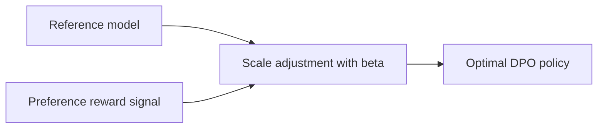
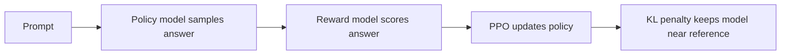
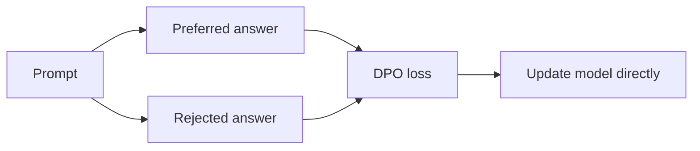

![[Fine-Tuning-Causal-LLMs-with-Human-Feedback-and-Direct-Preference-Coursera-07-09-2026_12_14.png]]

The best answer is likely:

**“The PPOConfig class is useful for specifying the model and learning rate for PPO training.”**

Your selected answer — **“configures the settings for PPO training”** — is conceptually true, but it is probably too general for the quiz. In the video/API context, `PPOConfig` is being used to define concrete training hyperparameters, such as:

```python
config = PPOConfig(
    model_name="...",
    learning_rate=1.41e-5,
    batch_size=...
)
```

So the role is not to train the model directly, compute KL divergence directly, or prepare batches. It is a **configuration container** passed into `PPOTrainer`.

Think of it like:


So:

|Option|Verdict|
|---|---|
|Configures settings for PPO training|True but too broad / quiz marked wrong|
|Trains model using KL divergence|No, `PPOTrainer` handles training|
|Specifies model and learning rate|Best quiz answer|
|Prepares data batches|No, handled by data pipeline/collator/trainer|

Pick the **third option**.

![[Fine-Tuning-Causal-LLMs-with-Human-Feedback-and-Direct-Preference-Coursera-07-09-2026_12_14 (1).png]]

The best answer is likely:

**“A policy that adjusts and scales the reference model using the beta parameter.”**

In DPO, the optimal policy is usually written like this:

```text
π*(y | x) = (1 / Z(x)) · π_ref(y | x) · exp(r(x, y) / β)
```

Meaning:

|Piece|Meaning|
|---|---|
|`π_ref(y|x)`|
|`r(x, y)`|reward preference signal|
|`β`|controls how far the new policy can move from the reference model|
|`Z(x)`|partition function / normalizer|

The key idea is: **DPO’s optimal policy is a reward-adjusted version of the reference policy**, with the adjustment controlled by **beta**.

Your selected option — **“eliminates the partition function”** — relates to a mathematical trick in the DPO derivation, but it is not the best description of the **optimal DPO solution itself**.

Think of it this way:



So pick the **fourth option**:

**“A policy that adjusts and scales the reference model using the beta parameter.”**

![[Fine-Tuning-Causal-LLMs-with-Human-Feedback-and-Direct-Preference-Coursera-07-09-2026_12_15.png]]

The best answer is likely:

**Revise the optimization problems to ignore numerical instability**

But the wording is bad. A clearer version would be:

**Use DPO because it reformulates preference optimization into a simpler supervised-style objective, avoiding PPO’s more unstable reinforcement-learning training loop.**

Why your selected answer was wrong:

**“Enhance the chance in sampling during inference”** sounds like generation-time behavior. DPO and PPO are **training/fine-tuning methods**, not primarily inference sampling methods.

The key idea:

**PPO RLHF setup:**



This can be unstable because PPO involves sampling, reward modeling, policy ratios, KL penalties, and RL-style gradient updates.

**DPO setup:**



DPO uses pairs like:

```text
Prompt: Explain LoRA simply.

Chosen answer: Clear, accurate explanation.
Rejected answer: Confusing or incorrect explanation.
```

Then it trains the model to assign higher probability to the chosen answer than the rejected answer.

So the intuition is:

**PPO says:** “Use reinforcement learning to make outputs score better under a reward model.”

**DPO says:** “Skip explicit RL. Directly train the model so preferred responses become more likely than rejected responses.”

That is why DPO is often preferred when you want a simpler, more stable optimization process.