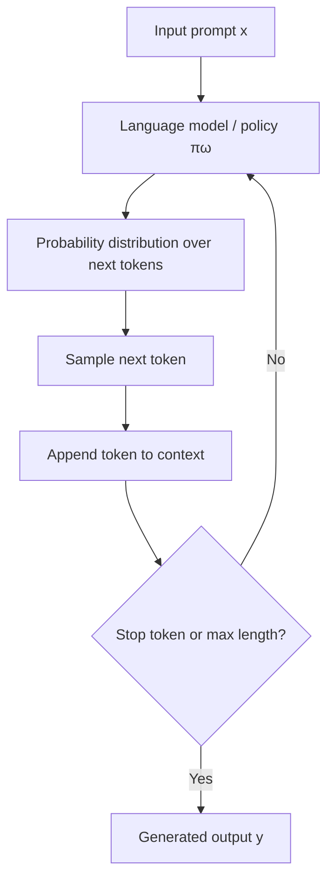
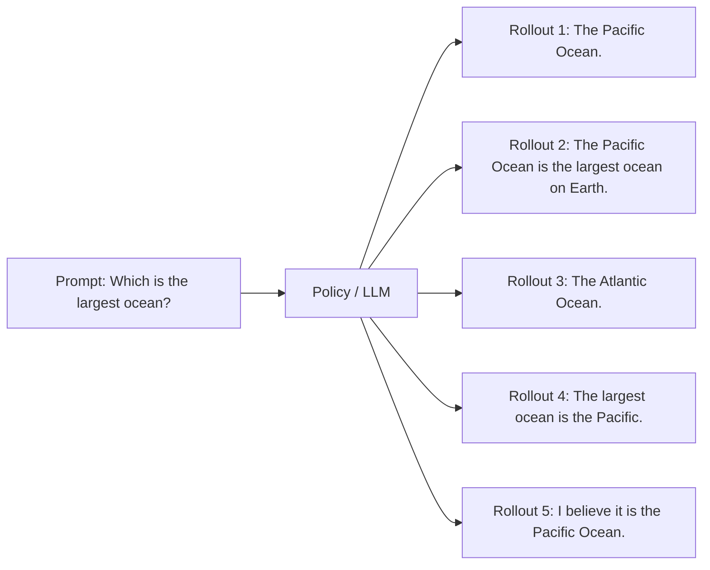
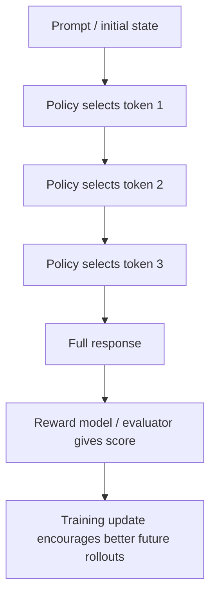
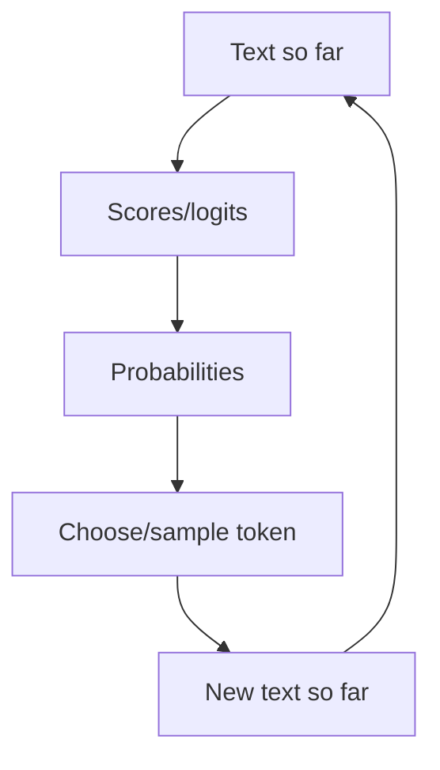
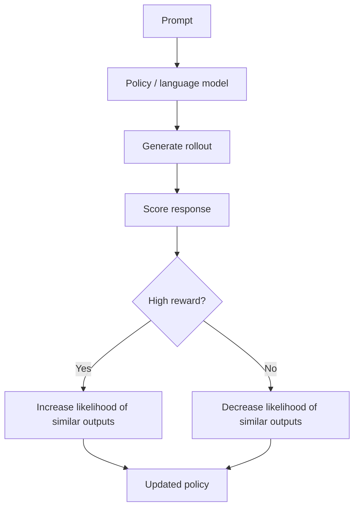

# From Distributions to Policies — Beginner-Friendly Notes

> Source transcript: `subtitle.txt`  
> Topic: How language models can be viewed as policies that generate rollouts by sampling from probability distributions.

---

## 1. Big Idea in Plain English

A **language model** can be thought of as a system that chooses the next token from a probability distribution.

A **policy** in reinforcement learning is also a system that chooses an action from a probability distribution.

So, for text generation, we can connect the two ideas:

> **A language model policy chooses the next token/action based on the current text/state.**

In normal language modeling, the model predicts text. In reinforcement learning language-model training, we often call the model's behavior a **policy** because it is choosing actions, where each action is usually the next token.

---

## 2. Corrected Transcript Terminology

The transcript has several awkward or likely incorrect phrases. Here are beginner-friendly corrections.

| Transcript wording | Better wording | Why |
|---|---|---|
| "generate policies using a language model for distributing and applying rollouts into policies" | "understand how a language model distribution can be treated as a policy, and how rollouts are generated from it" | Policies are not usually "applied into" rollouts. A policy generates actions; a rollout is a sampled sequence of actions. |
| "Policies in RL determine distributions for generating sequences of actions" | "A policy defines a distribution over possible actions given a state" | More precise. The policy says which actions are likely in each state. |
| "RL policy is used randomness" | "RL policies often use randomness to explore unseen possibilities" | The grammar is off; the concept is exploration. |
| "inserted query" | "input prompt" or "input sequence" | In LLMs, we usually say prompt, input text, or input sequence. |
| `y follows the policy given x` | `y ~ π_ω(· | x)` | This means the output sequence `y` is sampled from the policy distribution conditioned on input `x`. |
| "function of omega" | "policy parameterized by ω" | `ω` represents the model parameters/weights. More commonly, papers may use `θ`, but `ω` is fine if the course uses it. |
| "Atlantic Ocean is 155 million is the Atlantic Ocean" | "The Atlantic Ocean is about 106 million km², but it is not the largest ocean" | The example is likely intentionally wrong or transcript-corrupted. The Pacific Ocean is the largest. |
| "rollout libraries, such as Hugging Face differ from the reinforcement learning" | "The word rollout may be used differently in libraries and in RL" | In RL, a rollout often includes states, actions, rewards, and possibly observations. In text-generation code, people may loosely use rollout to mean generated output sequences. |

---

## 3. What Is a Policy?

In reinforcement learning, an **agent** interacts with an **environment**.

At each step:

1. The agent observes the current **state**.
2. The policy chooses an **action**.
3. The environment changes and may give a **reward**.

A policy is usually written as:

```text
π(a | s)
```

Read this as:

> The probability of choosing action `a` given state `s`.

### Layman's version

Imagine you are playing a game.

- **State**: what the game currently looks like.
- **Action**: what move you choose.
- **Policy**: your strategy for choosing moves.

A deterministic policy might always choose the same move in the same situation.

A stochastic policy gives probabilities:

| Possible action | Probability |
|---|---:|
| Move left | 10% |
| Move right | 70% |
| Jump | 20% |

The agent may then **sample** one of those actions.

---

## 4. How an LLM Can Be Viewed as a Policy

For a language model, the "state" is the current text context, and the "action" is the next token.

| Reinforcement Learning | Language Model |
|---|---|
| State `s` | Current prompt/context |
| Action `a` | Next token generated |
| Policy `π(a | s)` | Model probability distribution over next tokens |
| Rollout | Full generated response |
| Reward | Score/preference/helpfulness/safety signal, often used in RLHF/RLAIF-style training |

So this RL notation:

```text
π(a | s)
```

becomes something like this for language modeling:

```text
πω(next_token | prompt_so_far)
```

where `ω` means the model's learned parameters.

---

## 5. Sequence Notation: `y ~ πω(· | x)`

The transcript describes this relationship:

```text
y follows the policy given x
```

A cleaner mathematical version is:

```text
y ~ πω(· | x)
```

Read it as:

> Output sequence `y` is sampled from the policy `πω`, given input sequence `x`.

Where:

| Symbol | Meaning |
|---|---|
| `x` | input prompt/input sequence |
| `y` | generated output sequence |
| `π` | policy distribution |
| `ω` | model parameters/weights |
| `~` | "is sampled from" |
| `·` | placeholder for all possible outputs |

### Simple example

Input:

```text
x = "Which is the largest ocean?"
```

Possible outputs:

```text
y1 = "The Pacific Ocean."
y2 = "The Pacific Ocean is the largest ocean on Earth."
y3 = "The Atlantic Ocean."   # incorrect, but still possible if sampled
```

The model assigns probabilities to possible continuations.

For example:

| Candidate next phrase | Probability |
|---|---:|
| "The Pacific" | 0.78 |
| "Pacific" | 0.12 |
| "The Atlantic" | 0.03 |
| "I think" | 0.02 |
| Other | 0.05 |

A sampled response is one **rollout**.

---

## 6. Autoregressive Generation: One Token at a Time

Most decoder-style LLMs generate text one token at a time.

Given the prompt:

```text
Which is the largest ocean?
```

The model first predicts a probability distribution for the next token.

Maybe:

| Next token | Probability |
|---|---:|
| `The` | 0.60 |
| `Pacific` | 0.25 |
| `Atlantic` | 0.03 |
| `Indian` | 0.02 |
| Other | 0.10 |

Suppose it samples `The`.

Now the context becomes:

```text
Which is the largest ocean? The
```

Then it predicts the next token again.

Maybe:

| Next token | Probability |
|---|---:|
| `Pacific` | 0.88 |
| `Atlantic` | 0.04 |
| `largest` | 0.02 |
| Other | 0.06 |

This continues until the model finishes the response.

---

## 7. Mermaid Diagram: LLM as a Policy



### Key idea

The model does not directly "pull out" a finished answer from memory.

It repeatedly does this:

```text
current context → probability distribution → sampled next token
```

---

## 8. What Is a Rollout?

A **rollout** is one generated path through the model's possible choices.

For an LLM, a rollout is usually a full generated response sampled from the model.

Input prompt:

```text
Which is the largest ocean?
```

Possible rollouts:

| Rollout | Generated response | Correct? |
|---:|---|---|
| 1 | "The Pacific Ocean." | Yes |
| 2 | "The Pacific Ocean is the largest ocean on Earth." | Yes |
| 3 | "The Atlantic Ocean." | No |
| 4 | "The largest ocean is the Pacific." | Yes |
| 5 | "I believe it is the Pacific Ocean." | Yes |

The transcript says each possible response is a **rollout**. More precisely:

> Each sampled response from the model is a rollout.

The model could generate many rollouts from the same prompt if sampling is enabled.

---

## 9. Mermaid Diagram: Multiple Rollouts from One Prompt



---

## 10. Rollout in LLMs vs Rollout in Reinforcement Learning

The transcript notes that "rollout" can mean different things in different contexts.

That is important.

### In plain LLM generation

A rollout may simply mean:

> One generated response from the model.

Example:

```text
Prompt: "Write a Python function to add two numbers."
Rollout: "def add(a, b): return a + b"
```

### In reinforcement learning

A rollout often means a full trajectory of interaction:

```text
state_0 → action_0 → reward_0 → state_1 → action_1 → reward_1 → ...
```

For RL language-model training, this can map to:

```text
prompt → token/action → token/action → ... → full response → reward/score
```

### Comparison table

| Concept | Basic LLM generation | RL-style rollout |
|---|---|---|
| Starting point | Prompt | Initial state/prompt |
| Step | Generate next token | Take an action |
| Output | Generated text | Trajectory/episode |
| Reward included? | Usually no | Usually yes |
| Used for | Sampling text | Learning from outcomes |

---

## 11. Mermaid Diagram: RL-Style Language Model Rollout



---

## 12. Why Randomness Matters

The transcript says RL uses randomness to explore unseen possibilities.

That means the policy does not always pick the most likely action. Sometimes it samples from the distribution.

### Why not always pick the top token?

Because always choosing the most likely next token can make outputs repetitive or overly safe.

Sampling allows the model to explore alternatives.

Example next-token probabilities:

| Token | Probability |
|---|---:|
| `The` | 0.60 |
| `Pacific` | 0.25 |
| `largest` | 0.05 |
| `Atlantic` | 0.03 |
| Other | 0.07 |

Greedy decoding always picks:

```text
The
```

Sampling might pick:

```text
The
```

or:

```text
Pacific
```

or rarely:

```text
Atlantic
```

This is why sampling can produce diverse outputs, but it can also produce incorrect outputs.

---

## 13. Greedy Decoding vs Sampling

| Method | What it does | Strength | Weakness |
|---|---|---|---|
| Greedy decoding | Always picks the highest-probability token | Stable and predictable | Can be repetitive or less creative |
| Sampling | Randomly picks tokens based on probabilities | More diverse | Can produce mistakes |
| Top-k sampling | Samples only from the top `k` tokens | Limits weird choices | Still arbitrary cutoff |
| Top-p sampling | Samples from the smallest set of tokens whose probabilities add up to `p` | Adaptive and common in LLMs | Can still hallucinate |
| Temperature | Controls how sharp or flat the distribution is | Tunes creativity | Too high can become chaotic |

---

## 14. PyTorch-Shaped Pseudocode: Sampling One Token

This is not full production code. It is shaped like PyTorch to show the idea.

```python
import torch
import torch.nn.functional as F

# prompt_tokens: shape [batch_size, seq_len]
# model returns logits: shape [batch_size, seq_len, vocab_size]
logits = model(prompt_tokens)

# Get logits for the final position only
next_token_logits = logits[:, -1, :]  # [batch_size, vocab_size]

# Convert logits to probabilities
probs = F.softmax(next_token_logits, dim=-1)

# Sample one token from the probability distribution
next_token = torch.multinomial(probs, num_samples=1)  # [batch_size, 1]

# Append sampled token to context
prompt_tokens = torch.cat([prompt_tokens, next_token], dim=1)
```

### Shape intuition

If the vocabulary has 50,000 tokens, then the model produces 50,000 scores for the next token.

```text
next_token_logits shape = [batch_size, vocab_size]
                         = [1, 50000]
```

The policy is the probability distribution after softmax.

---

## 15. PyTorch-Shaped Pseudocode: Generating a Rollout

```python
import torch
import torch.nn.functional as F

@torch.no_grad()
def generate_rollout(model, input_ids, max_new_tokens=50, temperature=1.0):
    """
    input_ids: [batch_size, seq_len]
    returns:   [batch_size, seq_len + generated_tokens]
    """
    tokens = input_ids

    for _ in range(max_new_tokens):
        logits = model(tokens)                  # [batch, seq_len, vocab]
        next_logits = logits[:, -1, :]          # [batch, vocab]

        # Temperature controls randomness.
        # Lower temperature = sharper distribution.
        # Higher temperature = flatter distribution.
        next_logits = next_logits / temperature

        probs = F.softmax(next_logits, dim=-1)  # [batch, vocab]
        next_token = torch.multinomial(probs, num_samples=1)

        tokens = torch.cat([tokens, next_token], dim=1)

        # In real code, stop if next_token is EOS.

    return tokens
```

---

## 16. PyTorch-Shaped Pseudocode: Multiple Rollouts for One Prompt

```python
@torch.no_grad()
def generate_multiple_rollouts(model, tokenizer, prompt, num_rollouts=5):
    input_ids = tokenizer(prompt, return_tensors="pt").input_ids

    rollouts = []

    for _ in range(num_rollouts):
        output_ids = generate_rollout(
            model=model,
            input_ids=input_ids,
            max_new_tokens=40,
            temperature=0.8,
        )

        text = tokenizer.decode(output_ids[0], skip_special_tokens=True)
        rollouts.append(text)

    return rollouts
```

Conceptually, this is what the transcript means when it says the model generates several random responses for each query.

---

## 17. Important Correction: A Policy Is Not Just the Final Answer

A common beginner mistake is to think:

> The policy is the answer the model gives.

Better:

> The policy is the probability rule the model uses to generate the answer.

The answer is a **sample** from the policy.

Analogy:

| Analogy | Policy | Rollout |
|---|---|---|
| Dice | Probability of each face | One dice roll result |
| Music playlist | Song selection rules | One playlist generated |
| Chess | Strategy for choosing moves | One full game |
| LLM | Distribution over next tokens | One generated response |

---

## 18. First-Principles Mental Model

Start with the simplest idea:

1. A model sees some text.
2. It outputs scores for possible next tokens.
3. Scores become probabilities.
4. A token is selected.
5. The selected token is added to the context.
6. Repeat until the response is complete.

That repeated process is the model acting as a policy.



---

## 19. Simple Worked Example

Prompt:

```text
Which is the largest ocean?
```

Step 1 distribution:

| Candidate token | Probability |
|---|---:|
| `The` | 0.60 |
| `Pacific` | 0.25 |
| `Atlantic` | 0.03 |
| Other | 0.12 |

Sampled token:

```text
The
```

Current text:

```text
Which is the largest ocean? The
```

Step 2 distribution:

| Candidate token | Probability |
|---|---:|
| `Pacific` | 0.88 |
| `Atlantic` | 0.04 |
| `largest` | 0.03 |
| Other | 0.05 |

Sampled token:

```text
Pacific
```

Current text:

```text
Which is the largest ocean? The Pacific
```

Continue:

```text
Ocean is the largest ocean on Earth.
```

Final rollout:

```text
The Pacific Ocean is the largest ocean on Earth.
```

---

## 20. Where Rewards Enter the Picture

In plain text generation, the model may just sample text.

In RL-style language-model training, a generated response may be scored.

Example:

| Rollout | Response | Reward/score |
|---:|---|---:|
| 1 | "The Pacific Ocean." | 0.95 |
| 2 | "The Pacific Ocean is the largest ocean on Earth." | 0.98 |
| 3 | "The Atlantic Ocean." | 0.05 |
| 4 | "I don't know." | 0.20 |

The training process can then push the policy toward responses with higher rewards.

### Layman's version

The model tries several answers.

A scoring system says:

- "Good answer, do more like that."
- "Bad answer, do less like that."

Over time, the policy changes.

---

## 21. Mermaid Diagram: Policy Improvement Loop



---

## 22. Key Takeaways

- A **policy** is a rule/distribution for choosing actions.
- In an LLM, the action is often the **next token**.
- The model's probability distribution over next tokens can be viewed as a **policy**.
- A **rollout** is one sampled generated path, often a complete response.
- Multiple rollouts can come from the same prompt because sampling introduces randomness.
- In RL, rollouts usually include rewards; in casual LLM generation, rollout may simply mean generated text.
- Rewards can be used to update the model so better rollouts become more likely.

---

## 23. Common Confusions

### Is the policy the same thing as the model?

Not exactly.

The model contains the learned parameters. The policy is the behavior/distribution produced by the model.

In practice, people often say "the policy" when they mean "the model being trained to generate responses."

### Is a rollout always random?

Not always.

If you use greedy decoding, the rollout is deterministic. But when people discuss rollouts in RL or LLM sampling, they often mean sampled/generated trajectories.

### Can a rollout be wrong?

Yes.

A rollout is just what the model generated. It can be correct, incorrect, incomplete, unsafe, or low-quality.

### Why generate multiple rollouts?

Because multiple outputs give more options to score, compare, rank, or learn from.

---

## 24. Mini Glossary

| Term | Simple definition |
|---|---|
| Policy | A strategy/distribution for choosing actions |
| Distribution | A set of probabilities over possible choices |
| Token | A chunk of text the model reads or generates |
| Logits | Raw model scores before softmax |
| Softmax | Function that turns scores into probabilities |
| Sampling | Randomly choosing based on probabilities |
| Rollout | One generated sequence/path from the policy |
| Reward | Score that says how good an action or response was |
| Trajectory | RL term for a sequence of states, actions, and rewards |
| Parameters `ω` | The model's learned weights |

---

## 25. Self-Check Questions

### Conceptual questions

1. In an LLM, what is the "action" if we view the model as a policy?
2. What does `y ~ πω(· | x)` mean in plain English?
3. Why can the same prompt produce multiple different rollouts?
4. What is the difference between a policy and a rollout?
5. Why might RL training use rewards after generating responses?

### Applied questions

6. Given the prompt `"Write a greeting"`, list three possible rollouts.
7. If a model always chooses the highest-probability next token, is it sampling or greedy decoding?
8. Why might a high-temperature generation produce more surprising outputs?
9. In RL terms, what would the state be for an LLM generating text?
10. Why is the response `"The Atlantic Ocean"` a bad rollout for the prompt `"Which is the largest ocean?"`?

---

## 26. Answer Key

1. The action is usually the next token generated.
2. The output sequence `y` is sampled from the policy/model distribution given input `x`.
3. Because the model can sample from a probability distribution instead of always choosing the same token.
4. The policy is the probability rule; the rollout is one generated result from that rule.
5. Rewards tell the model which generated responses are better or worse.
6. Example rollouts: `"Hello!"`, `"Hi there, how are you?"`, `"Good morning!"`.
7. Greedy decoding.
8. Higher temperature flattens the distribution, making lower-probability tokens more likely.
9. The current prompt plus generated text so far.
10. Because the Pacific Ocean is the largest ocean, not the Atlantic.

---

## 27. One-Sentence Summary

A language model can be viewed as a **policy** because it uses the current text context to choose next-token actions from a probability distribution, and each generated response is a **rollout** sampled from that policy.
