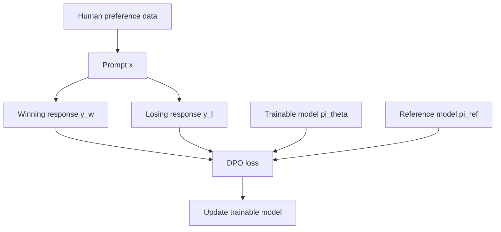
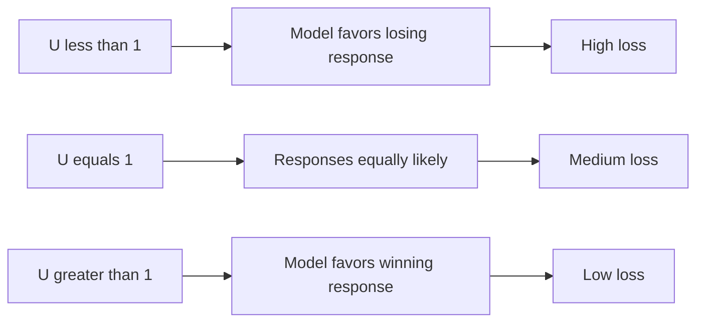
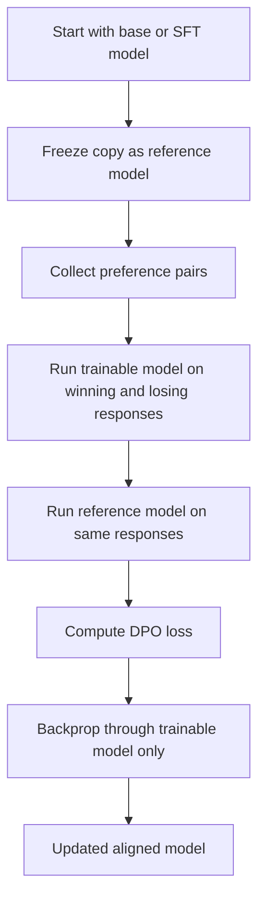
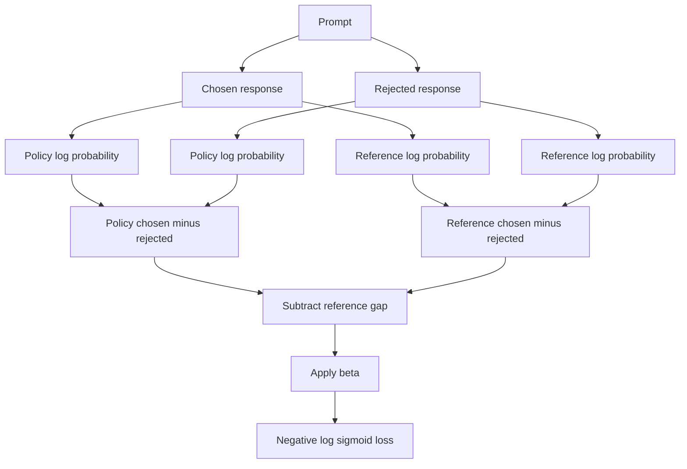

# From Optimal Policy to DPO: Beginner-Friendly Notes

## 1. Big Picture

This transcript explains **Direct Preference Optimization (DPO)**, a method for fine-tuning a causal language model using **human preference data**.

Instead of asking humans to assign exact scores like `8.7/10` or `3.2/10`, DPO works with easier judgments:

> For the same prompt, which response is better?

That gives us pairs like:

| Prompt | Preferred response | Rejected response |
|---|---|---|
| “Explain gravity simply.” | “Gravity is like an invisible pull…” | “Gravity is a field equation…” |

DPO uses these pairs to train the model to make the preferred response more likely than the rejected response.

---

## 2. Corrected Transcript Terminology

| Transcript wording | Corrected wording | Meaning |
|---|---|---|
| “from optimal policy to DPO” | **From Optimal Policy to DPO** | Topic title |
| “generative causal LLM” | **causal language model** | A next-token prediction model, like GPT-style models |
| “Tilda” | **tilde** `~` | Sampling notation, as in `x ~ D` |
| “WIN represents response A and L, loss represents response B” | **`y_w` is the winning response and `y_l` is the losing response** | Standard DPO notation |
| “Pi or policy r” | **policy `π`** | The model’s probability distribution over responses |
| “Piref” | **`π_ref`** | The frozen reference model |
| “Beta” | **`β`** | Controls how far the trained policy can move from the reference policy |
| “Pi torch” | **PyTorch** | Deep learning library |
| “hugging faces built in DPO trainer” | **Hugging Face TRL `DPOTrainer`** | Common DPO implementation |
| “loss” as response B | **losing / rejected response** | The transcript likely meant “losing,” not “loss” |

---

## 3. Why DPO Exists

Traditional **RLHF** often uses several stages:

1. Train or start with a supervised language model.
2. Collect human preference data.
3. Train a separate reward model.
4. Use reinforcement learning, often PPO, to optimize the model against that reward.

That works, but it can be difficult.

### RLHF Problems DPO Tries to Avoid

| Problem | Simple explanation |
|---|---|
| Computational complexity | PPO-style RLHF can be expensive and slow. |
| Instability | Reinforcement learning updates can be sensitive and hard to tune. |
| Reward model dependency | You need a separate model that predicts human preference. |
| Non-differentiability of human judgment | Humans do not give smooth mathematical gradients. |

DPO avoids much of this by directly training on preference pairs.

---

## 4. Mental Model: DPO in One Sentence

DPO says:

> Given a prompt, make the model assign higher probability to the human-preferred answer than to the rejected answer, while not drifting too far from the original reference model.

Think of the reference model as an anchor.

- The new model should improve.
- But it should not become weird, unstable, or over-optimized.

---

## 5. Preference Data

Instead of precise scores, DPO usually uses preference pairs.

### Scored Data

| Prompt `x` | Response `y` | Human score |
|---|---:|---:|
| “Explain photosynthesis.” | “Plants use sunlight to make food…” | 9 |
| “Explain photosynthesis.” | “Photosynthesis is when plants breathe…” | 4 |

### Preference-Pair Data

| Prompt `x` | Winning response `y_w` | Losing response `y_l` |
|---|---|---|
| “Explain photosynthesis.” | “Plants use sunlight, water, and carbon dioxide to make sugar and oxygen.” | “Photosynthesis is when plants breathe in oxygen.” |

The second format is easier for humans because ranking is usually easier than scoring.

---

## 6. Notation

| Symbol | Meaning | Beginner translation |
|---|---|---|
| `x` | Prompt / query | What the user asks |
| `y` | Response | What the model answers |
| `y_w` | Winning response | The better response |
| `y_l` | Losing response | The worse response |
| `D` | Dataset | Collection of preference examples |
| `(x, y_w, y_l) ~ D` | Sample from dataset | Pick one prompt and its preferred/rejected answers |
| `π_θ(y \| x)` | Trainable policy model | Current model’s probability of response `y` given prompt `x` |
| `π_ref(y \| x)` | Reference policy | Frozen original model’s probability |
| `r(x, y)` | Reward | How good response `y` is for prompt `x` |
| `β` | Regularization strength | How strongly we constrain the model to stay near the reference |
| `Z(x)` | Partition function | Normalizing term that is hard to compute directly |

---

## 7. Workflow Diagram



### Layman’s Explanation

Imagine training a student:

- You show two answers to the same question.
- You say, “This answer is better than that one.”
- The student learns to prefer answers like the better one.
- The reference model acts like the student’s original habits, preventing the student from changing too wildly.

---

## 8. Bradley-Terry Model

The **Bradley-Terry model** is a probability model for pairwise comparisons.

It says the probability that response `y_w` is preferred over response `y_l` depends on the difference between their rewards.

```math
P(y_w \succ y_l \mid x) = \sigma(r(x, y_w) - r(x, y_l))
```

Where:

```math
\sigma(z) = \frac{1}{1 + e^{-z}}
```

The larger the reward difference, the more confident we are that `y_w` should beat `y_l`.

### Intuition

If:

```math
r(x, y_w) - r(x, y_l)
```

is large and positive, then the model is saying:

> The winning response is much better than the losing response.

If the difference is near zero, then the two responses seem about equally good.

If the difference is negative, the model is confused because it thinks the losing response is better.

---

## 9. From Summation to Expected Value

Instead of writing a loss as a sum over all examples, we can write it as an expectation over the dataset.

### Summation Form

```math
\mathcal{L} = -\sum_{(x, y_w, y_l) \in D} \log \sigma(r(x, y_w) - r(x, y_l))
```

### Expected Value Form

```math
\mathcal{L} = -\mathbb{E}_{(x, y_w, y_l) \sim D}
\left[\log \sigma(r(x, y_w) - r(x, y_l))\right]
```

### Simple Translation

The expected value version means:

> On average, over examples from the dataset, make the preferred response score higher than the rejected response.

---

## 10. The Optimal Policy Expression

The transcript references a key equation connecting the optimal policy, the reference policy, and the reward.

A common form is:

```math
\pi_r(y \mid x) = \frac{1}{Z(x)} \pi_{ref}(y \mid x) \exp\left(\frac{1}{\beta} r(x, y)\right)
```

Where:

- `π_r` is the reward-optimal policy.
- `π_ref` is the reference policy.
- `r(x, y)` is the reward function.
- `β` controls how much we penalize moving away from the reference model.
- `Z(x)` is the partition function.

---

## 11. What Is the Partition Function?

The partition function `Z(x)` normalizes probabilities so they sum to 1.

Conceptually:

```math
Z(x) = \sum_y \pi_{ref}(y \mid x) \exp\left(\frac{1}{\beta} r(x, y)\right)
```

The problem is that `y` ranges over possible responses.

For language models, that means every possible generated sequence.

That is astronomically large.

### Layman’s Explanation

Imagine trying to score every possible essay that could be written in English, then adding all those scores together. That is basically why `Z(x)` is not practical to compute directly.

DPO’s math cleverly removes the need to calculate it.

---

## 12. Solving for the Reward

Start from:

```math
\pi_r(y \mid x) = \frac{1}{Z(x)} \pi_{ref}(y \mid x) \exp\left(\frac{1}{\beta} r(x, y)\right)
```

Multiply both sides by `Z(x)`:

```math
Z(x) \pi_r(y \mid x) = \pi_{ref}(y \mid x) \exp\left(\frac{1}{\beta} r(x, y)\right)
```

Divide by `π_ref(y | x)`:

```math
\frac{Z(x) \pi_r(y \mid x)}{\pi_{ref}(y \mid x)} = \exp\left(\frac{1}{\beta} r(x, y)\right)
```

Take the natural log:

```math
\log Z(x) + \log \pi_r(y \mid x) - \log \pi_{ref}(y \mid x) = \frac{1}{\beta} r(x, y)
```

Solve for reward:

```math
r(x, y) = \beta \left[\log \pi_r(y \mid x) - \log \pi_{ref}(y \mid x) + \log Z(x)\right]
```

In DPO, the trainable model `π_θ` plays the role of the optimized policy.

So we use:

```math
r_\theta(x, y) = \beta \left[\log \pi_\theta(y \mid x) - \log \pi_{ref}(y \mid x) + \log Z(x)\right]
```

---

## 13. Why the Partition Function Cancels

The Bradley-Terry model compares two responses for the same prompt:

```math
r_\theta(x, y_w) - r_\theta(x, y_l)
```

Substitute the reward expression:

```math
\beta \left[\log \pi_\theta(y_w \mid x) - \log \pi_{ref}(y_w \mid x) + \log Z(x)\right]
-
\beta \left[\log \pi_\theta(y_l \mid x) - \log \pi_{ref}(y_l \mid x) + \log Z(x)\right]
```

Because both responses share the same prompt `x`, the same `log Z(x)` appears in both terms.

So it cancels:

```math
+ \log Z(x) - \log Z(x) = 0
```

Leaving:

```math
r_\theta(x, y_w) - r_\theta(x, y_l)
=
\beta \left[
\log \frac{\pi_\theta(y_w \mid x)}{\pi_{ref}(y_w \mid x)}
-
\log \frac{\pi_\theta(y_l \mid x)}{\pi_{ref}(y_l \mid x)}
\right]
```

This is the key trick.

DPO avoids directly training a reward model and avoids computing the partition function.

---

## 14. DPO Objective

The DPO loss is commonly written as:

```math
\mathcal{L}_{DPO}(\pi_\theta; \pi_{ref})
=
-\mathbb{E}_{(x, y_w, y_l) \sim D}
\left[
\log \sigma
\left(
\beta
\left[
\log \frac{\pi_\theta(y_w \mid x)}{\pi_{ref}(y_w \mid x)}
-
\log \frac{\pi_\theta(y_l \mid x)}{\pi_{ref}(y_l \mid x)}
\right]
\right)
\right]
```

### Plain-English Meaning

DPO asks:

> Compared to the reference model, has the trainable model increased the preferred response more than the rejected response?

That phrase is important.

DPO does **not** only compare:

```math
\pi_\theta(y_w \mid x)
\quad\text{vs}\quad
\pi_\theta(y_l \mid x)
```

It compares how the trainable model changes relative to the reference model.

---

## 15. Why the Reference Model Matters

Suppose the reference model already strongly prefers a good answer. If the trainable model also prefers it, that may not be a big improvement.

DPO looks at the ratio:

```math
\frac{\pi_\theta(y \mid x)}{\pi_{ref}(y \mid x)}
```

This means:

> How much more or less does the new model like this response compared to the old model?

### Example

| Response | Reference probability | New model probability | Ratio |
|---|---:|---:|---:|
| Winning response | 0.20 | 0.40 | 2.0 |
| Losing response | 0.10 | 0.05 | 0.5 |

The new model increased the winning response and decreased the losing response.

That is good.

---

## 16. Simplified Loss Intuition

The transcript simplifies by setting:

- `β = 1`
- `π_ref` to a constant `C`

This gives a rough intuition where the loss depends mainly on:

```math
U = \frac{\pi_\theta(y_w \mid x)}{\pi_\theta(y_l \mid x)}
```

Then the loss behaves like:

```math
-\log \sigma(\log U)
```

### What Happens as `U` Changes?

| Value of `U` | Meaning | Loss behavior |
|---:|---|---|
| `0 < U < 1` | Model gives losing response more probability than winning response | High loss |
| `U = 1` | Model treats both responses equally | Medium loss |
| `U > 1` | Model gives winning response more probability | Lower loss |
| `U → ∞` | Model strongly prefers winning response | Loss approaches 0 |

---

## 17. Loss Curve Diagram



Another way to think about it:

```text
U small                U = 1                 U large
bad model              uncertain             good model
high loss              medium loss           low loss
```

---

## 18. DPO Compared with PPO-Style RLHF

| Feature | PPO-style RLHF | DPO |
|---|---|---|
| Needs preference data | Yes | Yes |
| Needs separate reward model | Usually yes | No explicit reward model needed |
| Uses reinforcement learning loop | Yes | No |
| Usually simpler to implement | No | Yes |
| Stability | Can be tricky | Often simpler and more stable |
| Main training signal | Reward model output | Preference-pair loss |
| Common implementation | PPO trainer | DPO trainer |

### Layman’s Analogy

PPO-style RLHF is like:

> Build a judge, then train the student to maximize the judge’s score.

DPO is like:

> Skip building the judge separately. Directly train the student from examples of better-vs-worse answers.

---

## 19. DPO Training Pipeline



Important detail:

- The **trainable model** gets updated.
- The **reference model** stays frozen.

---

## 20. PyTorch-Shaped Pseudocode

This is not full production code. It is shaped like PyTorch to show the idea.

```python
import torch
import torch.nn.functional as F


def sequence_logprob(model, input_ids, attention_mask, labels):
    """
    Return log probability of each full response sequence.

    In a real implementation, labels would mask out the prompt tokens
    so the loss only scores the response tokens.
    """
    outputs = model(input_ids=input_ids, attention_mask=attention_mask)
    logits = outputs.logits

    # Shift for causal language modeling:
    # token at position t predicts token at position t + 1.
    shifted_logits = logits[:, :-1, :]
    shifted_labels = labels[:, 1:]

    log_probs = F.log_softmax(shifted_logits, dim=-1)

    token_log_probs = torch.gather(
        log_probs,
        dim=-1,
        index=shifted_labels.unsqueeze(-1),
    ).squeeze(-1)

    # Ignore masked tokens, commonly label == -100 in real training.
    mask = shifted_labels.ne(-100)
    sequence_log_probs = (token_log_probs * mask).sum(dim=-1)

    return sequence_log_probs


def dpo_loss(
    policy_chosen_logps,
    policy_rejected_logps,
    ref_chosen_logps,
    ref_rejected_logps,
    beta=0.1,
):
    """
    policy_* comes from the trainable model.
    ref_* comes from the frozen reference model.
    chosen means winning response.
    rejected means losing response.
    """
    policy_log_ratio = policy_chosen_logps - policy_rejected_logps
    ref_log_ratio = ref_chosen_logps - ref_rejected_logps

    logits = beta * (policy_log_ratio - ref_log_ratio)

    # -log sigmoid(logits)
    losses = -F.logsigmoid(logits)
    return losses.mean()
```

### What the Code Is Doing

For each example, it computes:

```math
\beta \left[
(\log \pi_\theta(y_w \mid x) - \log \pi_\theta(y_l \mid x))
-
(\log \pi_{ref}(y_w \mid x) - \log \pi_{ref}(y_l \mid x))
\right]
```

Then it applies:

```math
-\log \sigma(\cdot)
```

If the model improves the winning-vs-losing gap relative to the reference model, the loss goes down.

---

## 21. Tiny Numerical Example

Suppose for one prompt:

| Quantity | Value |
|---|---:|
| `log π_θ(y_w \| x)` | `-2.0` |
| `log π_θ(y_l \| x)` | `-4.0` |
| `log π_ref(y_w \| x)` | `-2.5` |
| `log π_ref(y_l \| x)` | `-3.0` |
| `β` | `0.1` |

Policy log-ratio:

```math
-2.0 - (-4.0) = 2.0
```

Reference log-ratio:

```math
-2.5 - (-3.0) = 0.5
```

DPO logit:

```math
0.1 \times (2.0 - 0.5) = 0.15
```

Loss:

```math
-\log \sigma(0.15)
```

Because the logit is positive, the policy is doing better than the reference at preferring the winning response.

---

## 22. Important Concept: Sequence Probability

For language models, `π(y | x)` is not usually a single token probability.

It is the probability of the full response sequence.

If the response has tokens:

```text
y = [token_1, token_2, token_3]
```

Then:

```math
\pi(y \mid x)
= \pi(token_1 \mid x)
\times \pi(token_2 \mid x, token_1)
\times \pi(token_3 \mid x, token_1, token_2)
```

In practice, we use log probabilities because multiplying many small probabilities causes numerical problems:

```math
\log \pi(y \mid x)
= \sum_t \log \pi(token_t \mid x, token_{<t})
```

---

## 23. Why Use Logs?

Logs turn multiplication into addition.

Instead of:

```math
0.01 \times 0.02 \times 0.03
```

we use:

```math
\log(0.01) + \log(0.02) + \log(0.03)
```

This is more stable for computers and easier to optimize.

---

## 24. What Does Beta Do?

`β` controls how strongly the DPO objective pushes the model away from the reference model.

| Beta value | Effect |
|---:|---|
| Smaller `β` | More conservative updates |
| Larger `β` | Stronger preference optimization |

A useful mental model:

> `β` is like the volume knob on preference learning.

Turn it too low, and the model barely changes.

Turn it too high, and the model may over-optimize preferences and drift too much.

---

## 25. DPO vs Supervised Fine-Tuning

| Question | Supervised Fine-Tuning | DPO |
|---|---|---|
| What data does it use? | Prompt + ideal response | Prompt + preferred response + rejected response |
| What does it teach? | Imitate this answer | Prefer this answer over that answer |
| Does it compare alternatives? | Not directly | Yes |
| Common use | Teach format, style, task behavior | Align model preferences |

SFT says:

> Copy this good answer.

DPO says:

> Prefer this answer over that one.

---

## 26. Common Beginner Misunderstandings

### Misunderstanding 1: DPO does not use rewards at all

More precise:

> DPO avoids training an explicit separate reward model, but its math is derived from a reward-based formulation.

### Misunderstanding 2: DPO only maximizes the winning response probability

More precise:

> DPO increases the winning response relative to the rejected response and relative to the reference model.

### Misunderstanding 3: The reference model is trained too

Usually no.

> The reference model is frozen. Only the policy model is updated.

### Misunderstanding 4: `π(y | x)` means one token

Not usually.

> In DPO, it usually refers to the probability of the whole response sequence given the prompt.

---

## 27. Practical Implementation Notes

In real DPO training, you usually need:

1. A base or supervised fine-tuned model.
2. A frozen reference model.
3. A dataset with `prompt`, `chosen`, and `rejected` fields.
4. A tokenizer.
5. A DPO training loop or library trainer.

Common dataset shape:

```python
example = {
    "prompt": "Explain overfitting simply.",
    "chosen": "Overfitting is when a model memorizes training examples instead of learning the general pattern.",
    "rejected": "Overfitting is when the model becomes too big and cannot run."
}
```

Common library approach:

```python
# Conceptual only
trainer = DPOTrainer(
    model=policy_model,
    ref_model=reference_model,
    train_dataset=preference_dataset,
    beta=0.1,
    tokenizer=tokenizer,
)

trainer.train()
```

---

## 28. End-to-End Intuition Diagram



---

## 29. Simple Worked Example in Words

Prompt:

```text
Explain what a GPU does.
```

Chosen response:

```text
A GPU is a chip that performs many small calculations in parallel, which makes it useful for graphics and machine learning.
```

Rejected response:

```text
A GPU is basically the computer's storage drive.
```

DPO training asks:

1. How likely is the trainable model to produce the chosen answer?
2. How likely is it to produce the rejected answer?
3. How likely was the frozen reference model to produce each one?
4. Has the trainable model improved the chosen-over-rejected gap compared to the reference model?
5. If yes, lower loss.
6. If no, higher loss.

---

## 30. Key Takeaways

- DPO trains a language model from **preference pairs**.
- A preference pair contains a prompt, a winning response, and a losing response.
- DPO is derived from the Bradley-Terry model and an optimal-policy formulation.
- The partition function `Z(x)` is impossible to compute directly, but it cancels when comparing winning and losing responses for the same prompt.
- The DPO loss uses both the trainable model and a frozen reference model.
- DPO avoids training a separate reward model.
- DPO is often simpler than PPO-style RLHF.
- The core goal is to make the model prefer `y_w` over `y_l` more than the reference model does.

---

## 31. Self-Check Questions

### Conceptual

1. Why is ranking two responses usually easier for humans than assigning exact scores?
2. What are `y_w` and `y_l`?
3. Why does DPO keep a frozen reference model?
4. What does the partition function `Z(x)` do?
5. Why is `Z(x)` hard to compute for language models?
6. Why does `Z(x)` cancel in the DPO derivation?
7. What is the Bradley-Terry model used for?
8. How is DPO different from PPO-style RLHF?
9. What does `β` control?
10. Why do we use log probabilities instead of raw probabilities?

### Applied

1. Given a prompt and two responses, identify which is `chosen` and which is `rejected`.
2. If the model gives higher probability to the rejected response, what should happen to the DPO loss?
3. If the policy model and reference model behave exactly the same, has DPO learned a preference improvement?
4. Why might making `β` too large be risky?
5. Why is DPO usually considered easier to implement than PPO-style RLHF?

---

## 32. Quick Memory Hook

Remember DPO like this:

```text
DPO = Directly Prefer the better Output
```

More technically:

```text
DPO trains the policy to prefer chosen responses over rejected responses,
relative to a frozen reference policy.
```
