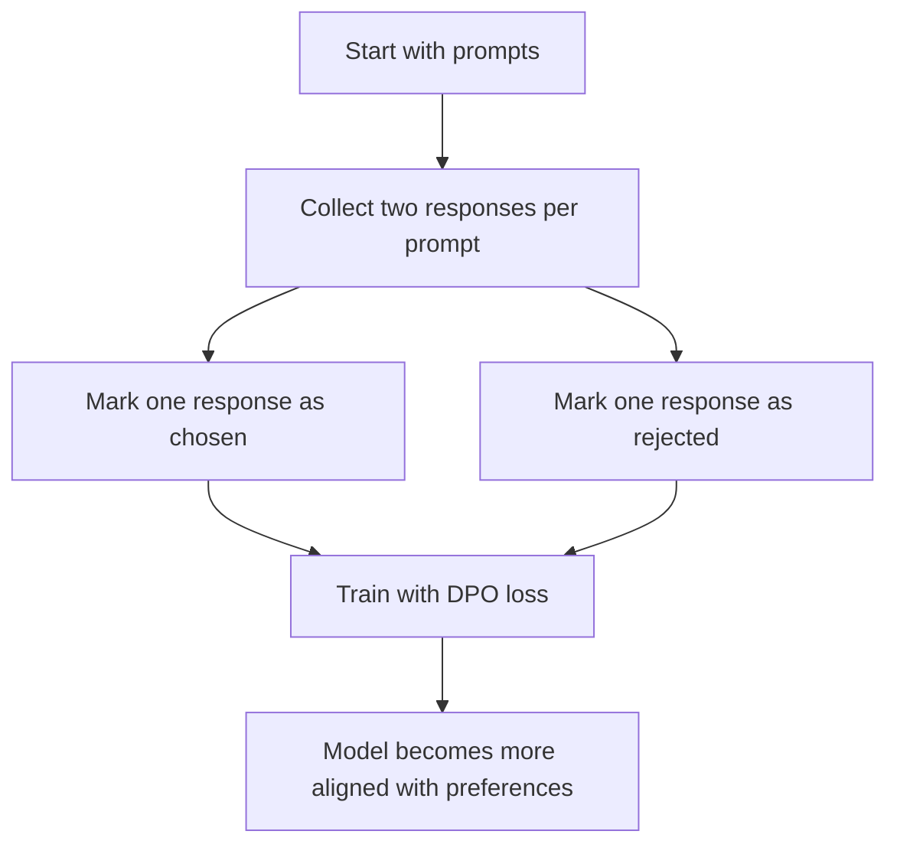
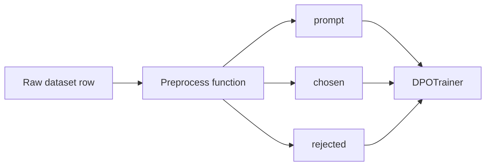
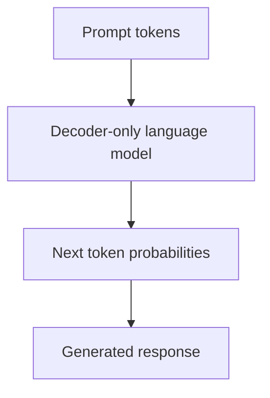
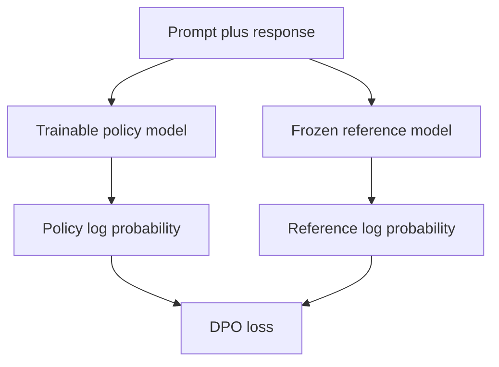
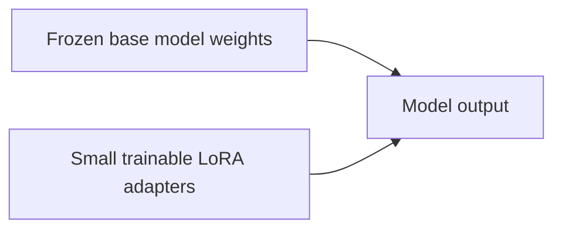
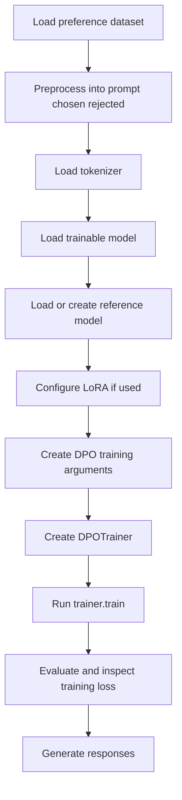
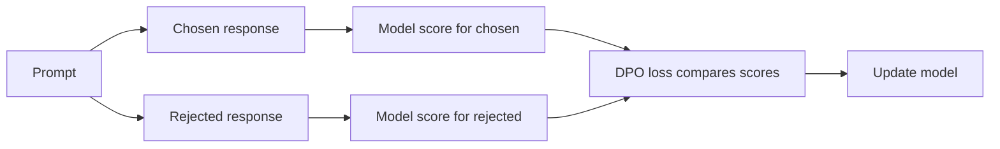
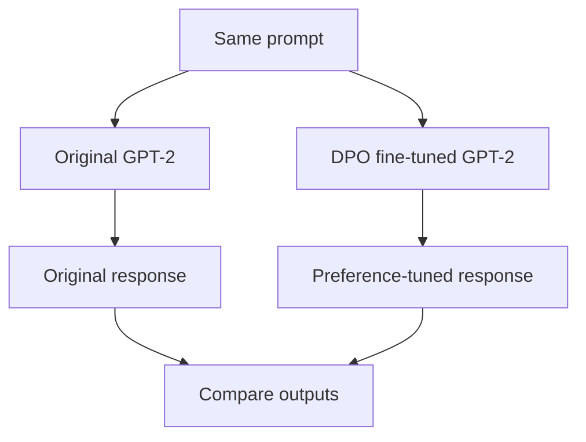
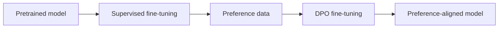
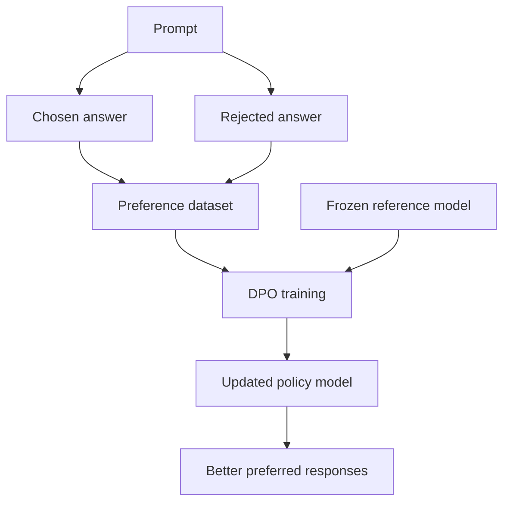

# DPO with Hugging Face — Beginner-Friendly Notes

## 1. Big Picture

**DPO** stands for **Direct Preference Optimization**.

It is a method for fine-tuning a language model so that it becomes more likely to produce responses people prefer and less likely to produce responses people reject.

In plain English:

> DPO teaches a model:  
> “For this prompt, answer like this preferred response, not like that weaker response.”

DPO is often compared with **PPO**, or **Proximal Policy Optimization**, because both are used in alignment training. But DPO is usually simpler to implement because it does **not** require a separate reward model or an online reinforcement learning loop.

---

## 2. Corrected Transcript Terminology

| Transcript wording | Better terminology | Meaning |
|---|---|---|
| `pre processing data set` | **preprocessing dataset** | Cleaning and reshaping the dataset before training |
| `positive and negative selected pairs` | **chosen and rejected response pairs** | A preferred answer and a less-preferred answer for the same prompt |
| `maximize the log likelihood of the DPO loss` | **optimize the DPO objective** | Train the model to assign higher probability to chosen responses than rejected ones |
| `Barra Home` | likely a dataset/user name from Hugging Face | The transcript appears to refer to a Hugging Face dataset provider, but the name may be mis-transcribed |
| `loader reference model` | **load a reference model** | Load a frozen baseline model used for comparison during DPO |
| `parameter efficient lower configurations` | **parameter-efficient LoRA configurations** | LoRA adapters reduce the number of trainable parameters |
| `adapter lower layers` | **LoRA adapter layers** | Small trainable matrices inserted into parts of the model |
| `training laws` | **training loss** | A number that should generally decrease during training |
| `inferencing the model` | **running inference with the model** | Using the trained model to generate text |

---

## 3. What Problem Does DPO Solve?

A base language model is trained mostly to predict text. That does not automatically mean it gives the most helpful, safe, concise, or human-preferred answer.

For example:

**Prompt**

```text
Is higher octane gasoline better for your car?
```

**Rejected response**

```text
Yes, higher octane is always better and will make every car faster.
```

**Chosen response**

```text
Not necessarily. Higher octane helps if your engine requires it, but most cars do not benefit from using a higher octane than the manufacturer recommends.
```

DPO uses examples like this to push the model toward the chosen style of answer.

---

## 4. DPO in One Sentence

DPO fine-tunes a model using examples shaped like:

```text
prompt + chosen response + rejected response
```

and trains the model to prefer the chosen response over the rejected response.

---

## 5. The Two Main DPO Steps

The transcript describes two main steps:

1. **Data collection**
2. **Optimization**



### Step 1: Data Collection

You need a **preference dataset**.

Each training example usually has:

```python
{
    "prompt": "Question or instruction",
    "chosen": "Preferred response",
    "rejected": "Less preferred response"
}
```

The key idea is **pairwise preference**.

You are not just saying:

> “This answer is good.”

You are saying:

> “For this exact prompt, this answer is better than that answer.”

That comparison is powerful because the model learns relative preference.

### Step 2: Optimization

DPO trains the model directly on those comparisons.

The model learns:

- increase the probability of the **chosen** response
- decrease the probability of the **rejected** response
- stay reasonably close to the original/reference model

---

## 6. DPO vs PPO

| Feature | DPO | PPO |
|---|---|---|
| Full name | Direct Preference Optimization | Proximal Policy Optimization |
| Uses preference pairs? | Yes | Usually yes, indirectly through a reward model |
| Needs reward model? | No separate reward model is usually required | Usually yes |
| Training style | Direct supervised-like preference optimization | Reinforcement learning style |
| Complexity | Simpler | More complex |
| Common use | Fine-tune model from chosen/rejected pairs | RLHF-style alignment loop |

### Layman’s analogy

Imagine teaching someone to cook.

**PPO style**

You hire a food critic.  
The person cooks.  
The critic scores the meal.  
The person updates their behavior based on the score.

**DPO style**

You show two dishes side by side and say:

> “Make food more like dish A, less like dish B.”

DPO skips the separate critic and learns directly from comparisons.

---

## 7. Dataset Shape for DPO

A DPO dataset usually needs three important columns:

| Column | Meaning |
|---|---|
| `prompt` | The input question or instruction |
| `chosen` | The preferred response |
| `rejected` | The less-preferred response |

Example:

```python
sample = {
    "prompt": "Explain gravity to a child.",
    "chosen": "Gravity is the invisible pull that keeps your feet on the ground.",
    "rejected": "Gravity is a complex curvature of spacetime tensors and geodesics."
}
```

The rejected answer is not always “wrong.” Sometimes it is just less helpful for the intended audience.

---

## 8. Why Preprocessing Is Needed

The raw dataset may contain extra columns.

For DPO training, you usually want to reshape each row into this clean format:

```python
{
    "prompt": "...",
    "chosen": "...",
    "rejected": "..."
}
```

A preprocessing function extracts only what the trainer needs.



---

## 9. PyTorch-Shaped Pseudocode: Dataset Preprocessing

This is not exact production code. It is shaped like typical Hugging Face and PyTorch workflows.

```python
from datasets import load_dataset

dataset = load_dataset("some_preference_dataset")

def preprocess(example):
    return {
        "prompt": example["prompt"],
        "chosen": example["chosen"],
        "rejected": example["rejected"],
    }

processed_dataset = dataset.map(
    preprocess,
    remove_columns=dataset["train"].column_names,
)

train_dataset = processed_dataset["train"]
eval_dataset = processed_dataset["test"]
```

### What `.map()` does

`.map()` applies your function to each dataset row.

In plain English:

> “For every row in the dataset, convert it into the format my trainer expects.”

---

## 10. Model, Tokenizer, and Reference Model

The transcript uses **GPT-2** as the decoder-only language model.

A decoder-only model is good for text generation because it predicts the next token repeatedly.



### Main components

| Component | Role |
|---|---|
| Model | The trainable language model |
| Tokenizer | Converts text into token IDs and token IDs back into text |
| Reference model | Frozen baseline model used to compare how much the trained model changes |

---

## 11. Why Use a Reference Model?

DPO does not only ask:

> “Does the model like the chosen response more than the rejected response?”

It also asks something like:

> “Compared with the original model, is the new model becoming more preference-aligned without drifting too wildly?”

The **reference model** is usually the original model before DPO fine-tuning.



### Layman’s analogy

Think of the reference model as the “before” photo.

DPO training compares the model after updates against that original baseline so the model improves without forgetting how to speak like a language model.

---

## 12. What Is LoRA?

**LoRA** stands for **Low-Rank Adaptation**.

Instead of updating all model weights, LoRA adds small trainable adapter matrices.

That means you can fine-tune large models with less memory.



### Full fine-tuning vs LoRA

| Method | What gets trained? | Memory use | Common use |
|---|---|---|---|
| Full fine-tuning | Most or all model weights | High | When you have lots of compute |
| LoRA | Small adapter weights | Lower | Efficient fine-tuning |
| QLoRA | Quantized base model plus LoRA adapters | Even lower | Fine-tuning larger models on limited GPU memory |

---

## 13. Why Set the GPT-2 Pad Token?

GPT-2 was originally trained without a dedicated padding token.

But batching examples often requires padding shorter sequences so all examples in a batch have the same length.

A common workaround is:

```python
tokenizer.pad_token = tokenizer.eos_token
```

This means:

> “When padding is needed, use the end-of-sequence token as the padding token.”

### Simple batching example

Without padding:

```text
Example 1: [12, 44, 91]
Example 2: [18, 27, 31, 52, 90]
```

With padding:

```text
Example 1: [12, 44, 91, EOS, EOS]
Example 2: [18, 27, 31, 52, 90]
```

Now both examples have length 5, so they can be stacked into a batch tensor.

---

## 14. Training Arguments

The transcript mentions that most hyperparameters are familiar from other training methods, but DPO has an important one:

## `beta`

`beta` controls how strongly DPO cares about staying close to the reference model versus pushing harder toward preferences.

A common range in many examples is around:

```text
0.1 to 0.5
```

### Intuition

| Smaller beta | Larger beta |
|---|---|
| Weaker preference pressure | Stronger preference pressure |
| More conservative updates | More aggressive updates |
| Less drift from reference behavior | More risk of over-optimization |

A useful first mental model:

> `beta` is like a steering sensitivity knob.

Low beta means gentle steering.  
High beta means sharper steering.

---

## 15. DPO Training Flow



---

## 16. PyTorch-Shaped Pseudocode: DPO Training

This is simplified pseudocode to show the shape of the process.

```python
from transformers import AutoModelForCausalLM, AutoTokenizer
from peft import LoraConfig
from trl import DPOConfig, DPOTrainer

model_name = "gpt2"

tokenizer = AutoTokenizer.from_pretrained(model_name)
tokenizer.pad_token = tokenizer.eos_token

policy_model = AutoModelForCausalLM.from_pretrained(model_name)

lora_config = LoraConfig(
    r=8,
    lora_alpha=16,
    lora_dropout=0.05,
    target_modules=["c_attn"],
    task_type="CAUSAL_LM",
)

training_args = DPOConfig(
    output_dir="./dpo-gpt2",
    beta=0.1,
    per_device_train_batch_size=2,
    per_device_eval_batch_size=2,
    num_train_epochs=1,
    learning_rate=5e-5,
    logging_steps=10,
)

trainer = DPOTrainer(
    model=policy_model,
    args=training_args,
    train_dataset=train_dataset,
    eval_dataset=eval_dataset,
    processing_class=tokenizer,
    peft_config=lora_config,
)

trainer.train()
```

### Important note

APIs can change across versions of `trl`, `transformers`, and `peft`.

If your installed version expects `tokenizer=` instead of `processing_class=`, or has a different `DPOTrainer` signature, check your local package version and documentation.

---

## 17. What Does the DPO Loss Do?

The exact math can look intimidating, but the idea is simple.

For the same prompt, DPO compares two responses:

- chosen response
- rejected response

The model should assign a better score to the chosen response.



### Plain-English loss idea

DPO asks:

> “How much more does the policy model prefer the chosen answer than the rejected answer, compared with the reference model?”

If the chosen answer is not preferred enough, the loss is high.

If the chosen answer is clearly preferred, the loss is lower.

---

## 18. Training Loss

The transcript says the training loss decreases during training.

That is usually a good sign, but it is not enough by itself.

### What decreasing loss means

A decreasing training loss means:

> The model is getting better at fitting the preference pairs in the training data.

### What it does not guarantee

It does not automatically prove:

- the model is better in real use
- the model is safer
- the model generalizes to new prompts
- the responses are factually correct
- the model has not overfit the dataset

You still need evaluation.

---

## 19. Better Evaluation Questions

After DPO training, ask:

1. Does the model prefer chosen responses on held-out validation data?
2. Are generated responses more helpful?
3. Are responses shorter only because the chosen examples were shorter?
4. Does the model hallucinate less or more?
5. Does it still follow instructions?
6. Did it forget useful behavior from the base model?

---

## 20. Inference After Training

After training, you can compare:

- the original GPT-2 model
- the DPO fine-tuned GPT-2 model



Example prompt:

```text
Is higher octane gasoline better for your car?
```

A base model might give a vague or incorrect answer.

A DPO model trained on good preference data may give a more direct answer:

```text
Higher octane gasoline is not automatically better. Use the octane rating recommended in your owner's manual. Higher octane mainly helps engines designed for it.
```

---

## 21. PyTorch-Shaped Pseudocode: Generation

```python
from transformers import AutoTokenizer, AutoModelForCausalLM

tokenizer = AutoTokenizer.from_pretrained("./dpo-gpt2")
model = AutoModelForCausalLM.from_pretrained("./dpo-gpt2")

prompt = "Is higher octane gasoline better for your car?"

inputs = tokenizer(
    prompt,
    return_tensors="pt",
    padding=True,
)

outputs = model.generate(
    **inputs,
    max_new_tokens=80,
    do_sample=True,
    temperature=0.7,
    top_p=0.9,
)

response = tokenizer.decode(
    outputs[0],
    skip_special_tokens=True,
)

print(response)
```

---

## 22. How DPO Relates to SFT

DPO is usually not the first step.

A common training pipeline is:



### What is SFT?

**SFT** means **Supervised Fine-Tuning**.

It teaches the model to answer instructions using examples like:

```python
{
    "prompt": "Explain photosynthesis simply.",
    "response": "Photosynthesis is how plants use sunlight to make food."
}
```

### What DPO adds

DPO teaches preference:

```python
{
    "prompt": "Explain photosynthesis simply.",
    "chosen": "Photosynthesis is how plants use sunlight to make food.",
    "rejected": "Photosynthesis is a biochemical process involving chlorophyll pigments."
}
```

The rejected answer may be technically correct, but less appropriate for a simple explanation.

---

## 23. Common Beginner Confusions

### Confusion 1: Is the rejected response always false?

No.

The rejected response may be:

- too long
- too vague
- too technical
- too confident
- less helpful
- less safe
- less aligned with the desired style

### Confusion 2: Does DPO require humans to label every pair?

Not always.

Preference data can come from:

- human raters
- expert annotators
- model-assisted ranking
- existing public preference datasets
- synthetic preference pipelines

But quality matters. Bad preference labels can teach bad behavior.

### Confusion 3: Is DPO reinforcement learning?

DPO is related to RLHF, but it avoids the usual reinforcement learning training loop.

A practical way to think about it:

> DPO is a direct preference-learning shortcut for alignment fine-tuning.

### Confusion 4: Why compare to a reference model?

Because you want preference improvement without uncontrolled drift.

Without a reference model, the policy model might over-optimize and become strange, repetitive, or overly biased toward superficial features of the chosen examples.

---

## 24. Simple Mental Model

Imagine the model has two possible answers:

```text
Answer A: helpful and accurate
Answer B: misleading or less useful
```

DPO nudges the model:

```text
More like A.
Less like B.
Do not drift too far from your original language ability.
```

That is the core idea.

---

## 25. Minimal End-to-End DPO Checklist

```text
1. Load preference dataset.
2. Keep or create prompt, chosen, and rejected columns.
3. Load tokenizer.
4. Load base causal language model.
5. Optionally configure LoRA or QLoRA.
6. Configure DPO training arguments.
7. Create DPOTrainer.
8. Train.
9. Inspect loss.
10. Evaluate on held-out preference data.
11. Compare generations against the base model.
12. Save the trained model or adapter.
```

---

## 26. Practical Tips

### Start small

Use a small model and a small dataset slice first.

```python
small_train = train_dataset.select(range(500))
```

This helps you catch formatting and memory problems before a long training run.

### Watch sequence length

DPO examples include prompt plus chosen and prompt plus rejected responses.

That can become long quickly.

Longer sequences use much more GPU memory.

### Compare outputs manually

Loss curves are useful, but always inspect actual generated answers.

### Keep the base model for comparison

Use the same prompt with:

- original model
- DPO model

Then compare helpfulness, accuracy, style, and concision.

---

## 27. Tiny Worked Example

Suppose your preference dataset contains this:

```python
{
    "prompt": "What is overfitting?",
    "chosen": "Overfitting is when a model memorizes training examples so well that it performs poorly on new data.",
    "rejected": "Overfitting is when the model has too much fitting and becomes over."
}
```

DPO training pushes the model to assign higher probability to the chosen response.

After training, when asked:

```text
What is overfitting?
```

The model is more likely to produce something clear and useful.

---

## 28. Mermaid Summary Diagram



---

## 29. Self-Check Questions

### Conceptual

1. What does DPO stand for?
2. What three fields are commonly needed in a DPO dataset?
3. Why is DPO often simpler than PPO?
4. What is the purpose of the reference model?
5. Is the rejected answer always factually wrong?
6. What does `beta` control in DPO?
7. Why might LoRA be useful during DPO fine-tuning?
8. Why do we compare the DPO model with the original model during inference?

### Practical

1. What could go wrong if your `chosen` and `rejected` columns are swapped?
2. Why should you evaluate on held-out examples?
3. Why might decreasing training loss not be enough evidence that the model improved?
4. Why can long prompts and responses cause GPU memory issues?
5. Why might a DPO model become too short or too formulaic?

---

## 30. Answers to Self-Check Questions

### Conceptual Answers

1. **Direct Preference Optimization.**
2. `prompt`, `chosen`, and `rejected`.
3. DPO directly trains from preference pairs and usually avoids a separate reward model and PPO reinforcement learning loop.
4. The reference model acts as a frozen baseline so the new model does not drift too far.
5. No. It may simply be less helpful, less safe, too verbose, too vague, or stylistically worse.
6. `beta` controls the strength of the preference optimization relative to the reference model behavior.
7. LoRA reduces the number of trainable parameters, making fine-tuning more memory efficient.
8. Comparing with the original model helps show whether DPO actually improved the generated responses.

### Practical Answers

1. The model would learn the wrong preference and become worse.
2. Held-out examples test whether the model generalizes beyond the training set.
3. The model may overfit, exploit dataset quirks, or improve loss without improving real outputs.
4. Transformer memory usage grows with sequence length, and DPO processes chosen and rejected continuations.
5. If the chosen examples are mostly short or formulaic, the model may learn that style too strongly.

---

## 31. Key Takeaway

DPO is a practical way to align a language model with preference data.

The whole method can be summarized as:

> Given a prompt, make the model more likely to produce the chosen response than the rejected response, while staying close to the original model.

That is why DPO is popular: it turns preference alignment into a relatively direct fine-tuning problem.
