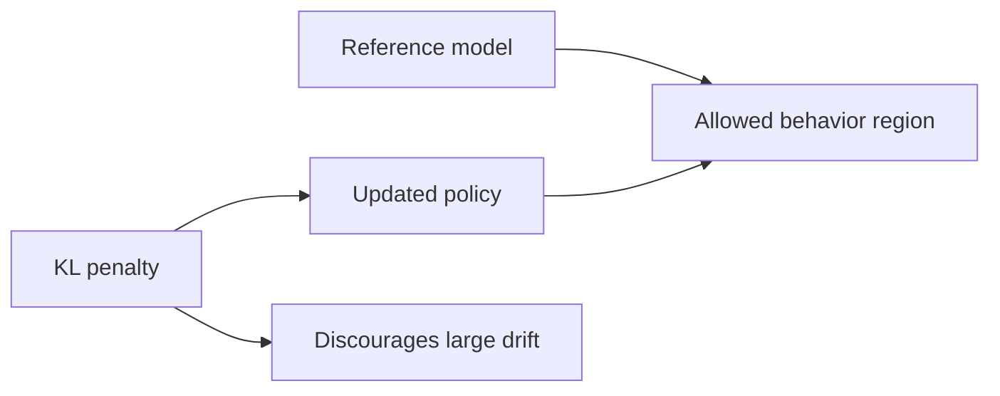
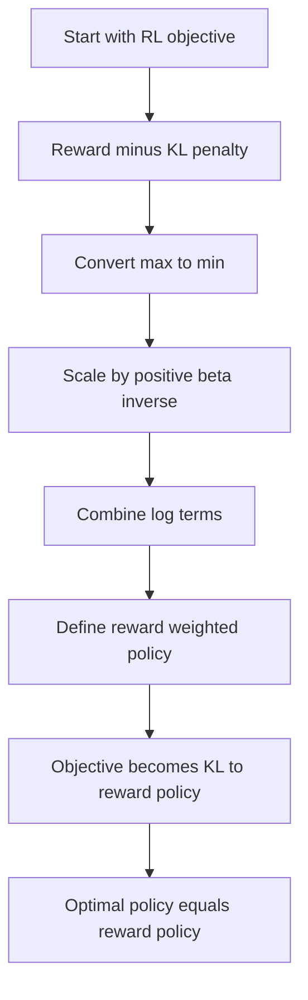
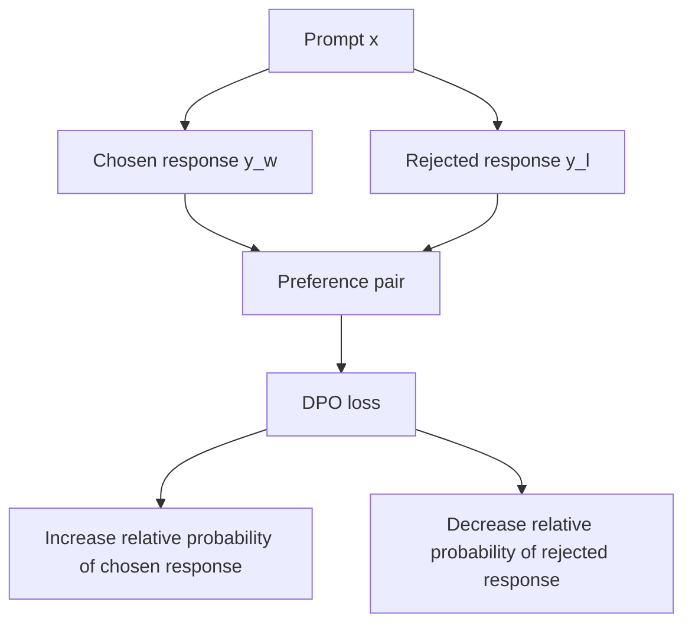
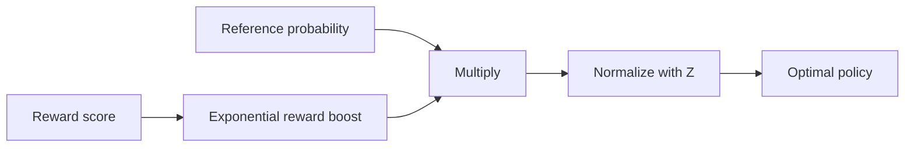

# DPO Optimal Solution: Beginner-Friendly Notes

> Source: cleaned and expanded from the uploaded transcript `subtitle.txt`.

## 1. Big Picture

This lesson explains a key mathematical bridge behind **Direct Preference Optimization**, usually called **DPO**.

The main idea is:

> If we start with a reference language model and a reward function, the best policy under a KL-regularized RL objective has a closed-form shape.

That closed-form shape is:

```text
new policy = reference policy × reward boost, then normalize
```

More formally:

```math
\pi^*(y \mid x)
= \frac{1}{Z(x)} \pi_{ref}(y \mid x) \exp\left(\frac{r(x,y)}{\beta}\right)
```

Where:

| Symbol | Meaning | Layman's explanation |
|---|---|---|
| `x` | Prompt or input | The text given to the model |
| `y` | Response or output | A possible answer from the model |
| `π_ref(y | x)` | Reference policy | The original model's probability of response `y` |
| `r(x, y)` | Reward | A score saying how good response `y` is for prompt `x` |
| `β` | Beta temperature / KL strength | Controls how strongly the model follows the reward versus staying close to the reference model |
| `Z(x)` | Partition function / normalizer | A number that makes all output probabilities sum to 1 |
| `π*(y | x)` | Optimal policy | The best policy for the objective |

---

## 2. Corrected Transcript Terminology

Some terms in the transcript are worth cleaning up.

| Transcript wording | Better wording | Why |
|---|---|---|
| “DPO optimal solution” | “Optimal solution for the KL-regularized RL objective used to motivate DPO” | DPO itself avoids explicitly fitting a reward model during optimization, but it is derived from this RL setup. |
| “denotated as w hat” | “denoted as w-hat” | The standard word is **denoted**. |
| `Pi star` | `π*` or `π_star` | This means the optimal or desired policy. |
| `Pi_ref` | `π_ref` | The reference policy, often the supervised fine-tuned model. |
| `z(x)` | `Z(x)` | Partition functions are commonly written uppercase `Z`. |
| “UBA, aaron, and zyzzyiva” | “example vocabulary tokens such as `aardvark`, `Aaron`, `zyzzyva`” | The transcript likely misheard example tokens. `zyzzyva` is a real word often used as an alphabetically late vocabulary example. |
| “probability approximately one to reward function” | “probability close to 1 for the response `reward function`” | “Reward function” is being used as an example output string, not the actual reward function object. |

---

## 3. What Is an Objective Function?

An **objective function** is the thing a machine learning system tries to optimize.

In ordinary supervised learning, the objective might be:

```text
Make predictions close to the labels.
```

In language model alignment, the objective is more like:

```text
Produce high-reward answers, but do not drift too far from the original model.
```

That second part matters because a model trained only to maximize reward can become weird, repetitive, exploitive, or brittle. The reference model acts like an anchor.

### Simple analogy

Imagine you are improving a recipe.

- The **reference policy** is the original recipe.
- The **reward function** is a food critic score.
- The **KL penalty** says: “Improve the recipe, but do not turn it into a completely different dish.”

---

## 4. Policies in Language Models

A **policy** is just a probability distribution over actions.

For a language model:

```text
policy = probability distribution over possible next tokens or full responses
```

So:

```math
\pi(y \mid x)
```

means:

```text
The probability that the model outputs response y when given prompt x.
```

Example:

| Prompt `x` | Candidate response `y` | `π_ref(y | x)` |
|---|---:|---:|
| `This is a` | `cat` | 0.80 |
| `This is a` | `reward function` | 0.10 |
| `This is a` | `transformer` | 0.05 |
| `This is a` | `sandwich` | 0.05 |

The values must sum to 1 across all possible responses.

---

## 5. KL Divergence: Measuring Policy Drift

**KL divergence** measures how different one probability distribution is from another.

For policies:

```math
D_{KL}(\pi \parallel \pi_{ref})
= \mathbb{E}_{y \sim \pi(y \mid x)}
\left[\log \frac{\pi(y \mid x)}{\pi_{ref}(y \mid x)}\right]
```

Layman's version:

> KL divergence is a “how much did you move away from the reference model?” score.

Important details:

- KL divergence is always greater than or equal to 0.
- It equals 0 only when the two distributions are identical.
- In alignment, KL keeps the updated model from drifting too far from the reference model.

### Mermaid diagram: KL as a leash



---

## 6. The KL-Regularized RL Objective

The alignment objective can be written as:

```math
\max_{\pi}\n\mathbb{E}_{x \sim D,\ y \sim \pi(y \mid x)}
\left[
    r(x,y)
    - \beta \log \frac{\pi(y \mid x)}{\pi_{ref}(y \mid x)}
\right]
```

This says:

```text
Choose a policy π that gets high reward,
but pays a penalty when it moves too far from π_ref.
```

The two forces are:

| Term | Pushes the model to... |
|---|---|
| `r(x, y)` | Prefer better responses |
| `- β KL(...)` | Stay close to the reference model |

### Role of beta

`β` controls the tradeoff.

| Beta value | Effect |
|---:|---|
| Small `β` | Reward matters more; model can move farther from reference |
| Large `β` | KL penalty matters more; model stays closer to reference |

Analogy:

- Small beta = loose leash.
- Large beta = tight leash.

---

## 7. Math Trick 1: Turning a Maximum into a Minimum

Sometimes it is easier to solve an optimization problem as a minimization problem.

If:

```math
\hat{w} = \arg\max_w f(w)
```

Then the same point is also:

```math
\hat{w} = \arg\min_w -f(w)
```

Why?

Because the highest point of `f(w)` becomes the lowest point of `-f(w)`.

### Tiny example

Suppose:

| `w` | `f(w)` | `-f(w)` |
|---:|---:|---:|
| 1 | 2 | -2 |
| 2 | 10 | -10 |
| 3 | 4 | -4 |

`f(w)` is maximum at `w = 2`.

`-f(w)` is minimum at `w = 2`.

The location did not change.

---

## 8. Math Trick 2: Scaling by a Positive Constant

Multiplying an objective by a **positive scalar** does not change the location of the optimum.

If `c > 0`, then:

```math
\arg\min_w f(w) = \arg\min_w c f(w)
```

The graph becomes taller or shorter, but the minimum stays at the same `w`.

Important caveat:

> If `c` is negative, max and min flip. If `c` is positive, the optimum location stays the same.

---

## 9. Math Trick 3: Adding or Subtracting a Constant

Adding or subtracting a constant also does not change the location of the optimum.

```math
\arg\min_w f(w) = \arg\min_w \left[f(w) - c\right]
```

The graph moves up or down, but the best `w` stays the same.

This matters because `log Z(x)` does not depend on the policy being optimized, so it can be treated as a constant during optimization.

---

## 10. Deriving the Reward-Weighted Policy

Start with the KL-regularized objective:

```math
\max_{\pi}
\mathbb{E}_{x \sim D,\ y \sim \pi}
\left[
    r(x,y)
    - \beta \log \frac{\pi(y \mid x)}{\pi_{ref}(y \mid x)}
\right]
```

Convert the maximization into a minimization by multiplying by `-1`:

```math
\min_{\pi}
\mathbb{E}_{x \sim D,\ y \sim \pi}
\left[
    \beta \log \frac{\pi(y \mid x)}{\pi_{ref}(y \mid x)}
    - r(x,y)
\right]
```

Scale by positive `1 / β`:

```math
\min_{\pi}
\mathbb{E}_{x \sim D,\ y \sim \pi}
\left[
    \log \frac{\pi(y \mid x)}{\pi_{ref}(y \mid x)}
    - \frac{1}{\beta} r(x,y)
\right]
```

Rewrite the reward term as a log exponential:

```math
\frac{1}{\beta} r(x,y)
= \log \exp\left(\frac{r(x,y)}{\beta}\right)
```

So:

```math
\log \frac{\pi(y \mid x)}{\pi_{ref}(y \mid x)}
- \log \exp\left(\frac{r(x,y)}{\beta}\right)
```

Combine logs:

```math
\log
\frac{\pi(y \mid x)}
{\pi_{ref}(y \mid x) \exp\left(\frac{r(x,y)}{\beta}\right)}
```

Now define the reward-weighted policy:

```math
\pi_r(y \mid x)
= \frac{1}{Z(x)}
\pi_{ref}(y \mid x)
\exp\left(\frac{r(x,y)}{\beta}\right)
```

Where:

```math
Z(x)
= \sum_y \pi_{ref}(y \mid x)
\exp\left(\frac{r(x,y)}{\beta}\right)
```

Then the objective becomes equivalent to:

```math
\min_{\pi}
\mathbb{E}_{x \sim D}
\left[
D_{KL}(\pi(y \mid x) \parallel \pi_r(y \mid x))
\right]
```

The minimum KL divergence happens when the two distributions are equal:

```math
\pi^*(y \mid x) = \pi_r(y \mid x)
```

So the optimal policy is:

```math
\boxed{
\pi^*(y \mid x)
= \frac{1}{Z(x)}
\pi_{ref}(y \mid x)
\exp\left(\frac{r(x,y)}{\beta}\right)
}
```

### Mermaid diagram: the derivation path



---

## 11. Intuition for the Optimal Policy

The formula:

```math
\pi^*(y \mid x)
= \frac{1}{Z(x)} \pi_{ref}(y \mid x) \exp\left(\frac{r(x,y)}{\beta}\right)
```

has three steps:

1. Start with the reference model probability.
2. Multiply by a reward-based boost.
3. Normalize so probabilities sum to 1.

### Simple example

Prompt:

```text
This is a
```

Candidate outputs:

| Response `y` | Reference probability `π_ref(y | x)` | Reward `r(x,y)` |
|---|---:|---:|
| `cat` | 0.80 | 0.0 |
| `reward function` | 0.10 | 4.0 |
| `sandwich` | 0.10 | 0.5 |

Let `β = 1`.

Compute unnormalized scores:

```math
score(y) = \pi_{ref}(y \mid x) \exp(r(x,y))
```

| Response | Calculation | Unnormalized score |
|---|---:|---:|
| `cat` | `0.80 × exp(0.0)` | 0.80 |
| `reward function` | `0.10 × exp(4.0)` | 5.46 |
| `sandwich` | `0.10 × exp(0.5)` | 0.16 |

Normalize:

```math
Z(x) = 0.80 + 5.46 + 0.16 = 6.42
```

| Response | Final probability under `π*` |
|---|---:|
| `cat` | `0.80 / 6.42 = 0.125` |
| `reward function` | `5.46 / 6.42 = 0.850` |
| `sandwich` | `0.16 / 6.42 = 0.025` |

The output `reward function` started with low reference probability, but because it had high reward, its final probability increased sharply.

---

## 12. What Does `Z(x)` Do?

`Z(x)` is the normalizer, also called the **partition function**.

It makes sure the final probabilities add up to 1.

```math
Z(x)
= \sum_y \pi_{ref}(y \mid x)
\exp\left(\frac{r(x,y)}{\beta}\right)
```

In plain English:

> Try every possible response, compute its reward-weighted score, add all those scores together, and divide by that total.

That sounds simple, but for language models it is usually impossible to compute exactly.

---

## 13. Why the Partition Function Is Impractical

For a language model, `y` is not just one token. It can be a whole sequence.

If the vocabulary size is `V` and the response length is `T`, then the number of possible sequences is:

```math
V^T
```

Example with a vocabulary of 50,000 tokens:

| Sequence length `T` | Number of possible sequences |
|---:|---:|
| 1 | `50,000` |
| 2 | `2,500,000,000` |
| 10 | `50,000^10` |
| 100 | `50,000^100` |

This grows exponentially.

That is why directly computing `Z(x)` is impractical for real LLMs.

### Mermaid diagram: exponential growth


---

## 14. How This Connects to DPO

DPO uses a clever move.

Instead of explicitly training a reward model and then solving RL with the expensive partition function, DPO learns from **preference pairs**:

```text
For the same prompt x:
chosen response y_w is preferred over rejected response y_l
```

DPO uses the relationship:

```math
r(x,y)
= \beta \log \frac{\pi^*(y \mid x)}{\pi_{ref}(y \mid x)}
+ \beta \log Z(x)
```

For two responses to the same prompt, `log Z(x)` cancels out:

```math
r(x,y_w) - r(x,y_l)
= \beta
\left[
\log \frac{\pi^*(y_w \mid x)}{\pi_{ref}(y_w \mid x)}
-
\log \frac{\pi^*(y_l \mid x)}{\pi_{ref}(y_l \mid x)}
\right]
```

That cancellation is one reason DPO is practical.

The DPO loss is commonly written as:

```math
\mathcal{L}_{DPO}(\pi_\theta; \pi_{ref})
= -\mathbb{E}_{(x,y_w,y_l) \sim D}
\left[
\log \sigma
\left(
\beta
\left[
\log \frac{\pi_\theta(y_w \mid x)}{\pi_{ref}(y_w \mid x)}
-
\log \frac{\pi_\theta(y_l \mid x)}{\pi_{ref}(y_l \mid x)}
\right]
\right)
\right]
```

Where:

| Symbol | Meaning |
|---|---|
| `y_w` | Winning / preferred response |
| `y_l` | Losing / rejected response |
| `π_θ` | Trainable policy model |
| `π_ref` | Frozen reference model |
| `σ` | Sigmoid function |
| `β` | Controls preference strength and reference-model anchoring |

### Mermaid diagram: DPO training data



---

## 15. RLHF vs DPO Comparison

| Feature | RLHF with PPO-style optimization | DPO |
|---|---|---|
| Uses preference data | Yes | Yes |
| Trains a reward model explicitly | Usually yes | No, not as a separate optimization target |
| Uses RL rollout optimization | Usually yes | No |
| Needs a reference model | Yes | Yes |
| Penalizes drifting from reference model | Yes, via KL penalty | Yes, implicitly through the log-ratio against `π_ref` |
| Simpler training loop | Usually no | Usually yes |
| Main data shape | Prompt, response, reward | Prompt, chosen response, rejected response |

Layman's version:

> RLHF says: “Train a judge, then use RL to make the model please the judge.”
>
> DPO says: “Use preference pairs directly to adjust the model toward preferred answers.”

---

## 16. PyTorch-Shaped Pseudocode: Reward-Weighted Policy

This pseudocode shows the closed-form idea for a tiny toy vocabulary.

```python
import torch

# Toy setup for one prompt x and three possible responses.
responses = ["cat", "reward function", "sandwich"]

# Reference model probabilities pi_ref(y | x).
pi_ref = torch.tensor([0.80, 0.10, 0.10])

# Reward model scores r(x, y).
reward = torch.tensor([0.0, 4.0, 0.5])

beta = 1.0

# Unnormalized optimal policy scores:
# pi_ref(y | x) * exp(r(x, y) / beta)
unnormalized = pi_ref * torch.exp(reward / beta)

# Partition function Z(x).
Z = unnormalized.sum()

# Closed-form optimal policy pi_star.
pi_star = unnormalized / Z

for y, p in zip(responses, pi_star):
    print(y, float(p))
```

Expected behavior:

```text
cat              lower than before
reward function  much higher than before
sandwich         slightly changed
```

---

## 17. PyTorch-Shaped Pseudocode: DPO Loss

This pseudocode shows the shape of the DPO loss.

```python
import torch
import torch.nn.functional as F


def sequence_logprob(model, input_ids, response_mask):
    """
    Return log probability of each response sequence.

    input_ids: tokenized prompt plus response
    response_mask: 1 for response tokens, 0 for prompt or padding tokens
    """
    logits = model(input_ids).logits

    # Shift for next-token prediction.
    logits = logits[:, :-1, :]
    labels = input_ids[:, 1:]
    mask = response_mask[:, 1:]

    token_logprobs = F.log_softmax(logits, dim=-1)
    selected = token_logprobs.gather(dim=-1, index=labels.unsqueeze(-1)).squeeze(-1)

    # Sum log probabilities only over response tokens.
    return (selected * mask).sum(dim=-1)


def dpo_loss(policy_model, ref_model, batch, beta=0.1):
    """
    batch contains:
      chosen_input_ids
      chosen_response_mask
      rejected_input_ids
      rejected_response_mask
    """
    pi_chosen = sequence_logprob(
        policy_model,
        batch["chosen_input_ids"],
        batch["chosen_response_mask"],
    )
    pi_rejected = sequence_logprob(
        policy_model,
        batch["rejected_input_ids"],
        batch["rejected_response_mask"],
    )

    with torch.no_grad():
        ref_chosen = sequence_logprob(
            ref_model,
            batch["chosen_input_ids"],
            batch["chosen_response_mask"],
        )
        ref_rejected = sequence_logprob(
            ref_model,
            batch["rejected_input_ids"],
            batch["rejected_response_mask"],
        )

    policy_logratio = pi_chosen - pi_rejected
    ref_logratio = ref_chosen - ref_rejected

    logits = beta * (policy_logratio - ref_logratio)

    # Maximize log sigmoid(logits), so minimize negative log sigmoid.
    loss = -F.logsigmoid(logits).mean()
    return loss
```

Key idea:

```text
DPO does not only ask:
"Did the policy assign high probability to the chosen answer?"

It asks:
"Did the policy prefer the chosen answer over the rejected answer
more than the reference model did?"
```

---

## 18. Common Confusions

### Confusion 1: Is `π_ref` the same as the reward model?

No.

- `π_ref` is a language model policy.
- The reward model gives scores.

The closed-form solution combines them:

```text
reference probability × reward boost
```

---

### Confusion 2: Why not just maximize reward?

Because the model may exploit the reward function.

This is called **reward hacking**.

Example:

```text
Reward says: longer answers are better.
Bad model behavior: produce huge repetitive answers.
```

The KL term discourages the model from becoming too different from the reference model.

---

### Confusion 3: Why is `Z(x)` hard?

Because it requires summing over every possible output sequence.

For realistic language models, the space of possible completions is astronomically large.

---

### Confusion 4: Does beta make rewards bigger or smaller?

`β` appears in:

```math
\exp\left(\frac{r(x,y)}{\beta}\right)
```

So:

- Smaller `β` makes reward differences more extreme.
- Larger `β` smooths reward differences.

Example:

| Reward | `exp(reward / 0.5)` | `exp(reward / 2.0)` |
|---:|---:|---:|
| 1 | 7.39 | 1.65 |
| 2 | 54.60 | 2.72 |
| 4 | 2980.96 | 7.39 |

Small beta can strongly amplify high-reward responses.

---

## 19. Mental Model Summary

Use this mental model:

```text
The reference model says what is plausible.
The reward says what is preferred.
Beta controls how aggressively preference overrides plausibility.
The partition function turns the result back into probabilities.
```

Or even shorter:

```text
π* = plausibility × preference, then normalize
```

### Mermaid diagram: final mental model



---

## 20. Self-Check Questions

### Conceptual

1. What does a policy represent in a language model?
2. What does KL divergence measure between `π` and `π_ref`?
3. Why do we include a KL penalty instead of only maximizing reward?
4. What does beta control?
5. Why is the partition function `Z(x)` hard to compute exactly?
6. In one sentence, how does DPO avoid explicitly computing `Z(x)`?

### Math intuition

7. Why does multiplying an objective by `-1` turn a max problem into a min problem?
8. Why does adding or subtracting a constant not change the optimizer?
9. What happens to `π*(y | x)` when a response has high reward but very low reference probability?
10. What happens when beta becomes very large?

### Practical ML

11. What is the training data format for DPO?
12. Why is the reference model usually frozen during DPO training?
13. What does the DPO loss compare between the chosen and rejected response?
14. Why do we use sequence log probabilities instead of token probabilities alone?

---

## 21. Answers to Self-Check Questions

1. A policy is a probability distribution over possible outputs given an input.
2. KL divergence measures how much the current policy has moved away from the reference policy.
3. Because reward-only optimization can cause reward hacking or unnatural model behavior.
4. Beta controls the tradeoff between following reward and staying close to the reference model.
5. Because it requires summing over all possible output sequences, which grows as `V^T`.
6. DPO uses preference pairs where the `Z(x)` terms cancel when comparing two responses to the same prompt.
7. The highest point of `f` becomes the lowest point of `-f`.
8. A constant shifts the graph up or down but does not move the best input value.
9. Its probability can increase if the reward boost is strong enough, but the reference probability still matters.
10. Reward differences become less influential, so the optimal policy stays closer to the reference policy.
11. DPO uses prompt, chosen response, and rejected response triples.
12. Freezing the reference model gives a stable baseline for measuring how the policy changes.
13. It compares how much more the policy prefers the chosen response over the rejected response, relative to the reference model.
14. A response is a sequence of tokens, so its probability is the product of token probabilities, usually handled as a sum of log probabilities.

---

## 22. One-Page Recap

```text
Goal:
Train a model to prefer better responses without drifting too far from the original model.

Reference model:
The original model distribution, π_ref.

Reward:
A score r(x, y) saying how good response y is for prompt x.

KL penalty:
A constraint that discourages the new policy from moving too far from π_ref.

Optimal policy:
π*(y | x) = π_ref(y | x) × exp(r(x,y) / beta), then normalized by Z(x).

Problem:
Z(x) is impractical because it sums over all possible output sequences.

DPO insight:
Use preference pairs so the normalization term cancels in the comparison.
```

