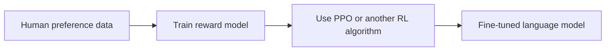
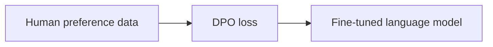
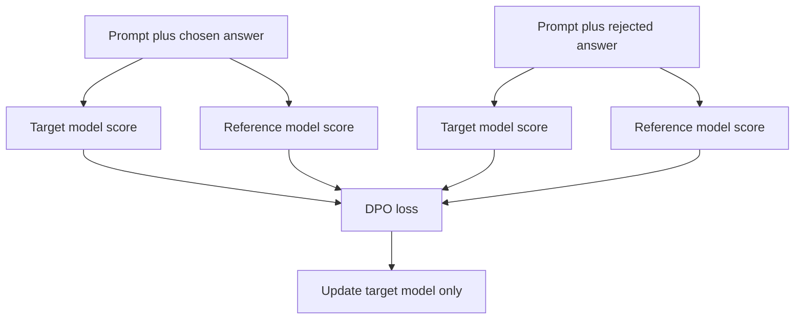
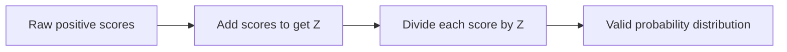
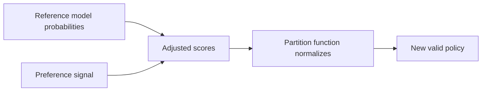
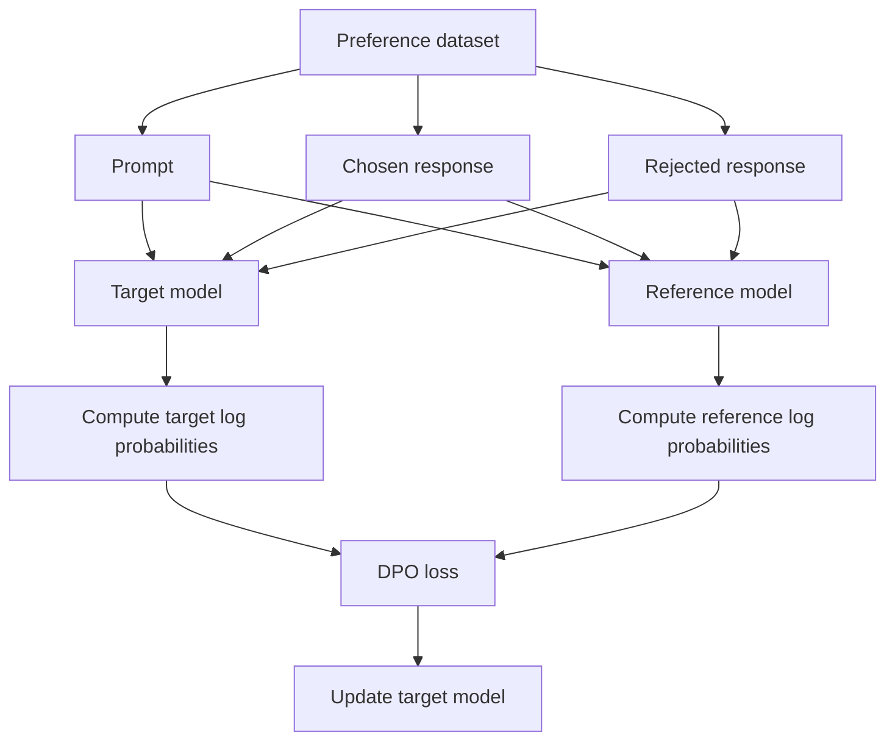

# DPO and the Partition Function — Beginner-Friendly Notes

Source: `subtitle.txt`

## 1. Big Picture

This transcript introduces **Direct Preference Optimization (DPO)** and uses a simple probability example to explain the idea of a **partition function**.

At a high level:

- **DPO** is a way to fine-tune language models using human preferences.
- Instead of asking a model to maximize a separately trained reward model through complex reinforcement learning, DPO trains directly from examples like:
  - prompt
  - preferred answer
  - rejected answer
- A **partition function** is a normalization tool. It turns raw positive scores into a valid probability distribution by making sure all probabilities add up to 1.

Layman’s version:

> DPO teaches a model: “When given this prompt, sound more like the answer humans preferred and less like the answer humans rejected.”
>
> A partition function is like resizing slices of a pie so that all slices together still make one whole pie.

---

## 2. Corrected Transcript Terminology

The transcript is mostly understandable, but a few phrases need correction or clarification.

| Transcript wording | Better wording | Why |
|---|---|---|
| “DPO is a reinforcement learning technique” | DPO is often part of the RLHF family, but it avoids the usual explicit RL optimization loop | DPO is derived from an RL objective, but it is usually trained with a supervised-style loss rather than PPO-style RL updates. |
| “DPO involves three models: the reward function, target decoder, and reference model” | DPO uses a target policy and a reference policy; the reward function is implicit in the derivation | In practical DPO, you usually do not train or run a separate reward model. |
| “reward function uses an encoder model” | A reward model can be encoder-based or decoder-based, but DPO does not require an explicit reward model during training | Reward models are common in PPO-style RLHF, not required as a separate model in DPO training. |
| “logistics probability function” | logistic probability function | “Logistic,” not “logistics.” |
| “shown in reduced” | likely “shown in red” | Transcript error. |
| “partition function z” | partition function `Z(x)` | Conventionally written as uppercase `Z`. |
| “scale by z” | normalize by dividing by `Z(x)` | The partition function is used to normalize raw scores into probabilities. |

---

## 3. DPO in Plain English

Imagine you ask a model:

> “Explain gradient descent to a beginner.”

The model gives two answers:

- Answer A: clear, simple, correct
- Answer B: confusing, overly technical, maybe partially wrong

A human chooses Answer A as better.

DPO trains the model to increase the probability of Answer A and decrease the probability of Answer B, while staying close to the original model.

That “stay close” part matters. Without it, the model might overfit the preference data or become weirdly overconfident.

---

## 4. DPO Data Shape

DPO usually trains on preference pairs.

Each training example looks like this:

```text
prompt:        “Explain what dropout is.”
chosen:        “Dropout randomly turns off some neurons during training...”
rejected:      “Dropout deletes data from the dataset...”
```

The model should learn:

```text
probability(chosen answer) > probability(rejected answer)
```

More precisely, it learns to make the chosen response more likely than the rejected response **relative to the reference model**.

---

## 5. DPO vs PPO-Style RLHF

Traditional RLHF often uses a pipeline like this:



DPO simplifies the pipeline:



The key simplification:

> DPO skips training a separate reward model and skips PPO-style reinforcement learning.

---

## 6. The Main Models in DPO

In practical DPO, think about two language models:

| Model | What it does |
|---|---|
| Target policy | The model being trained. Its parameters are updated. |
| Reference policy | A frozen copy of the original model. It acts like an anchor. |

The reference model helps prevent the target model from drifting too far away from the original model.

Analogy:

> The target model is a student improving its answers. The reference model is the student’s original writing style. DPO says: improve, but do not become unrecognizable.

---

## 7. What Is the Reference Model?

The **reference model** is usually the model before preference fine-tuning.

For example:

```text
Start with base instruction model:
    llama-3-8b-instruct

Make a frozen copy:
    reference_model = original model, not trained

Train another copy:
    target_model = updated with DPO
```

During training, both models score the chosen and rejected answers.



---

## 8. Why DPO Needs a Reference Model

Without a reference model, the target model might simply learn:

```text
Always make chosen examples very likely.
Always make rejected examples very unlikely.
```

That sounds good, but it can cause problems:

- The model may overfit the preference dataset.
- The model may lose general language ability.
- The model may become too different from the original model.
- The model may learn shortcuts instead of real preference alignment.

The reference model gives DPO a comparison point.

DPO asks something closer to:

> Compared with the original model, did the target model increase the chosen answer more than the rejected answer?

---

## 9. The DPO Objective Intuition

A simplified DPO idea:

```text
chosen should beat rejected
```

But DPO does not only compare raw probabilities from the target model. It compares how the target model changed relative to the reference model.

Conceptually:

```text
target improvement on chosen answer
should be greater than
target improvement on rejected answer
```

A more math-shaped version:

```text
score = beta * [
    log pi_theta(chosen | prompt)
  - log pi_ref(chosen | prompt)
  - log pi_theta(rejected | prompt)
  + log pi_ref(rejected | prompt)
]

loss = -log sigmoid(score)
```

Where:

| Symbol | Meaning |
|---|---|
| `pi_theta` | target policy being trained |
| `pi_ref` | frozen reference policy |
| `chosen` | preferred response |
| `rejected` | less preferred response |
| `beta` | controls how strongly the model is regularized against the reference model |
| `sigmoid` | squashes a number into a value between 0 and 1 |

Layman’s explanation:

> DPO rewards the target model when it becomes more confident in the preferred answer than the rejected answer, but only in a controlled way compared to the original model.

---

## 10. What Is a Partition Function?

A **partition function** is a normalizer.

It takes raw scores and turns them into probabilities.

For probabilities to be valid, they must satisfy:

```text
Each probability must be non-negative.
All probabilities must add up to 1.
```

Suppose you have raw positive scores:

```text
score(cat) = 2
score(dog) = 6
score(fish) = 2
```

These are not probabilities yet because they add up to 10, not 1.

The partition function is the sum:

```text
Z = 2 + 6 + 2 = 10
```

Now divide each score by `Z`:

```text
P(cat)  = 2 / 10 = 0.2
P(dog)  = 6 / 10 = 0.6
P(fish) = 2 / 10 = 0.2
```

Now the probabilities add up to 1:

```text
0.2 + 0.6 + 0.2 = 1.0
```

---

## 11. Partition Function Diagram



In plain terms:

> The partition function is the denominator that makes the whole distribution behave like a real probability distribution.

---

## 12. Logistic Function Refresher

The transcript introduces the logistic function, usually called the **sigmoid** function.

```text
sigmoid(x) = 1 / (1 + exp(-x))
```

It maps any real number into a value between 0 and 1.

Examples:

| `x` | `sigmoid(x)` approximately |
|---:|---:|
| `-5` | `0.0067` |
| `0` | `0.5` |
| `5` | `0.9933` |

For binary classification:

```text
P(y = 1 | x) = sigmoid(x)
P(y = 0 | x) = 1 - sigmoid(x)
```

These already add up to 1:

```text
P(y = 0 | x) + P(y = 1 | x) = 1
```

So in this simple logistic case, the partition function is effectively already handled.

---

## 13. Turning Raw Scores Into Probabilities

Now suppose we create custom positive scores.

For example:

```text
raw_score(y = 0, x) = exp(-abs(x))
raw_score(y = 1, x) = exp(-(x - 2)^2)
```

These are positive, but they are not automatically probabilities.

So we define:

```text
Z(x) = raw_score(y = 0, x) + raw_score(y = 1, x)
```

Then normalize:

```text
P(y = 0 | x) = raw_score(y = 0, x) / Z(x)
P(y = 1 | x) = raw_score(y = 1, x) / Z(x)
```

Now:

```text
P(y = 0 | x) + P(y = 1 | x) = 1
```

---

## 14. Simple Numerical Example

Suppose at some value of `x`, the raw scores are:

```text
raw_score(y = 0) = 3
raw_score(y = 1) = 7
```

Then:

```text
Z = 3 + 7 = 10
```

So:

```text
P(y = 0) = 3 / 10 = 0.3
P(y = 1) = 7 / 10 = 0.7
```

The raw scores became valid probabilities.

---

## 15. Why the Partition Function Matters for DPO

In the deeper DPO derivation, the optimal policy can be written in a form that looks like a normalized version of the reference policy multiplied by an exponentiated reward.

Conceptually:

```text
new_policy = reference_policy * preference_based_adjustment / normalizer
```

The normalizer is the partition function.

It makes sure the new policy is still a valid probability distribution over possible responses.

Simplified idea:



Important beginner point:

> In DPO, you do not usually calculate the partition function directly during training. The DPO derivation rearranges the objective so training can happen with preference pairs instead.

---

## 16. DPO Training Flow



Only the target model is updated.

The reference model stays frozen.

---

## 17. PyTorch-Shaped Pseudocode

This is not full runnable training code. It is shaped like PyTorch to show the logic.

```python
import torch
import torch.nn.functional as F


def sequence_logprob(model, input_ids, attention_mask, response_mask):
    """
    Return log probability of the response tokens under the model.

    input_ids: full prompt plus response tokens
    response_mask: 1 for response tokens, 0 for prompt/padding tokens
    """
    outputs = model(input_ids=input_ids, attention_mask=attention_mask)
    logits = outputs.logits

    # Decoder-only models predict the next token.
    shift_logits = logits[:, :-1, :]
    shift_labels = input_ids[:, 1:]
    shift_response_mask = response_mask[:, 1:]

    token_logprobs = F.log_softmax(shift_logits, dim=-1)
    selected_logprobs = token_logprobs.gather(
        dim=-1,
        index=shift_labels.unsqueeze(-1)
    ).squeeze(-1)

    response_logprob = (selected_logprobs * shift_response_mask).sum(dim=-1)
    return response_logprob


def dpo_loss(policy_model, reference_model, batch, beta=0.1):
    chosen_policy_logp = sequence_logprob(
        policy_model,
        batch["chosen_input_ids"],
        batch["chosen_attention_mask"],
        batch["chosen_response_mask"],
    )

    rejected_policy_logp = sequence_logprob(
        policy_model,
        batch["rejected_input_ids"],
        batch["rejected_attention_mask"],
        batch["rejected_response_mask"],
    )

    with torch.no_grad():
        chosen_ref_logp = sequence_logprob(
            reference_model,
            batch["chosen_input_ids"],
            batch["chosen_attention_mask"],
            batch["chosen_response_mask"],
        )

        rejected_ref_logp = sequence_logprob(
            reference_model,
            batch["rejected_input_ids"],
            batch["rejected_attention_mask"],
            batch["rejected_response_mask"],
        )

    policy_log_ratio = chosen_policy_logp - rejected_policy_logp
    reference_log_ratio = chosen_ref_logp - rejected_ref_logp

    logits = beta * (policy_log_ratio - reference_log_ratio)
    loss = -F.logsigmoid(logits).mean()

    return loss
```

Key idea:

```text
If the policy model favors chosen over rejected more than the reference model does, the loss goes down.
```

---

## 18. DPO Compared With Supervised Fine-Tuning

| Method | Training data | What the model learns |
|---|---|---|
| Supervised fine-tuning | Prompt plus ideal answer | Imitate the provided answer |
| Preference modeling | Prompt plus ranked answers | Predict which answer humans prefer |
| PPO-style RLHF | Reward model plus RL loop | Generate answers that maximize reward |
| DPO | Prompt, chosen answer, rejected answer | Prefer chosen over rejected directly |

Simple distinction:

> Supervised fine-tuning says: “Copy this answer.”
>
> DPO says: “Prefer this answer over that answer.”

---

## 19. Small Example: Preference Pair

Prompt:

```text
Explain what a partition function does.
```

Chosen response:

```text
A partition function is a normalizer. It turns raw scores into probabilities that add up to 1.
```

Rejected response:

```text
A partition function divides computer memory into disk partitions.
```

The rejected response may sound plausible because of the word “partition,” but it is wrong in this ML/probability context.

DPO trains the model to assign a higher probability to the chosen explanation than the rejected one.

---

## 20. Common Beginner Confusions

### Confusion 1: Is DPO the same as PPO?

No.

PPO is a reinforcement learning algorithm. DPO is a preference-optimization method that avoids the explicit PPO training loop.

### Confusion 2: Does DPO need a reward model?

Not as a separate trained model during DPO training.

The reward function appears in the math derivation, but practical DPO uses preference pairs, a target model, and a reference model.

### Confusion 3: Is the partition function always calculated directly?

No.

In many ML derivations, the partition function explains how a distribution would be normalized. But some training objectives are rearranged so you do not need to calculate it directly.

### Confusion 4: Why must probabilities add up to 1?

Because probabilities represent the full set of possible outcomes.

If there are only two labels, `0` and `1`, then:

```text
P(y = 0) + P(y = 1) = 1
```

That means one of those outcomes must happen.

---

## 21. Mental Model

Think of DPO as a controlled preference update.

```text
Original model:
    Has general language ability.

Preference data:
    Shows which responses humans like better.

DPO:
    Updates the model toward preferred responses,
    while comparing against the original model.
```

And think of the partition function as:

```text
The thing that turns raw scores into proper probabilities.
```

---

## 22. Self-Check Questions

### Basic

1. What does DPO stand for?
2. What kind of data does DPO train on?
3. What is the difference between a chosen response and a rejected response?
4. What is the role of the reference model?
5. What does a partition function do?

### Intermediate

6. Why does DPO not usually require a separate reward model?
7. Why might a model need to stay close to a reference model during preference tuning?
8. What does `beta` control in the DPO objective?
9. Why are raw positive scores not necessarily valid probabilities?
10. Why does dividing by `Z` make scores into probabilities?

### Applied

11. Suppose `score(A) = 4` and `score(B) = 6`. What are the normalized probabilities?
12. In DPO, why compare the target model against a reference model instead of only comparing chosen vs rejected under the target model?
13. If a chosen answer is already much more likely under the reference model, what should DPO be careful about?
14. What could go wrong if the target policy moves too far away from the reference policy?
15. In the pseudocode, why are reference model log probabilities computed inside `torch.no_grad()`?

---

## 23. Answers to Selected Self-Check Questions

1. **DPO** stands for **Direct Preference Optimization**.
2. DPO trains on preference pairs: a prompt, a chosen response, and a rejected response.
4. The reference model acts as an anchor so the target model does not drift too far from the original model.
5. A partition function normalizes raw scores into probabilities that add up to 1.
11. `Z = 4 + 6 = 10`, so `P(A) = 0.4` and `P(B) = 0.6`.
15. The reference model is frozen. We only need its scores, not gradients for updating it.

---

## 24. Key Takeaways

- DPO fine-tunes models directly from human preference pairs.
- DPO is simpler than PPO-style RLHF because it avoids a separate reward model and explicit RL loop.
- Practical DPO usually uses two models: a trainable target policy and a frozen reference policy.
- The reference model keeps the target model from drifting too far.
- A partition function normalizes raw scores into valid probabilities.
- In DPO theory, the partition function helps explain how a reward-adjusted policy can become a valid probability distribution.
- In practical DPO training, the objective is rearranged so you usually do not calculate the partition function directly.
