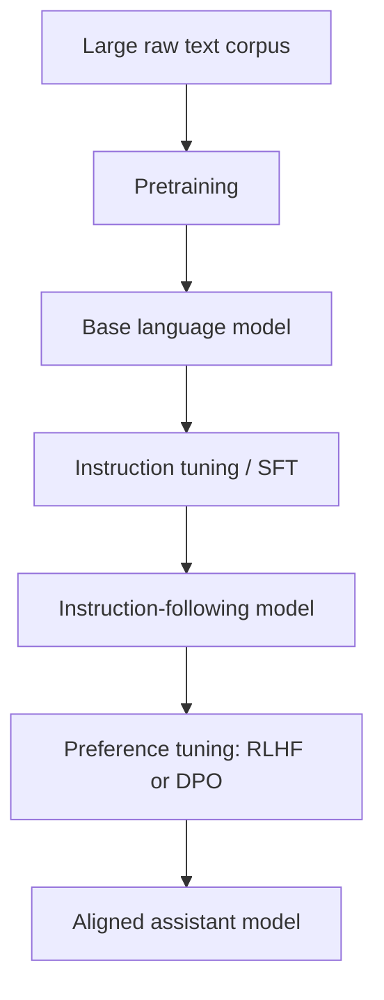
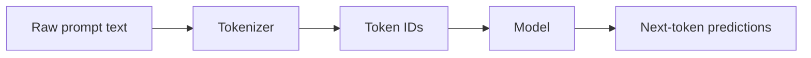
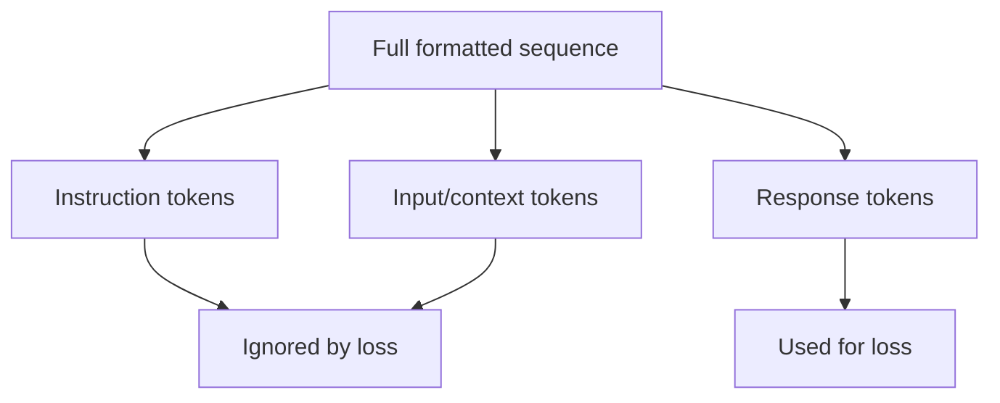
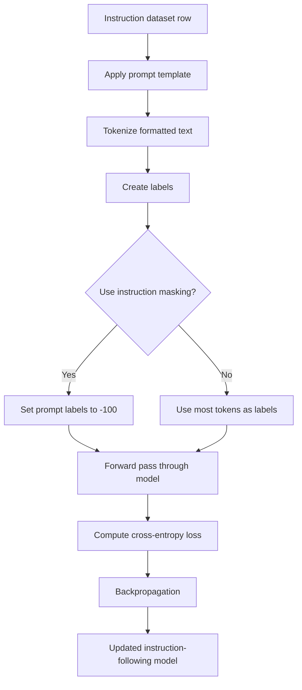
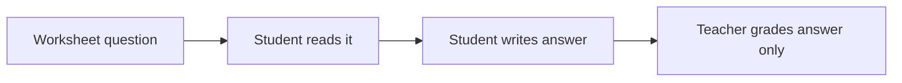

# Beginner-Friendly Notes: Instruction Tuning, Prompt Formats, and Instruction Masking

Source: `subtitle.txt`

## 1. Big Picture

This transcript explains **instruction tuning**, also called **supervised fine-tuning (SFT)**.

In simple terms:

> Instruction tuning teaches a pre-trained language model how to follow human-style instructions.

A base GPT-like model is trained mainly to predict the next token. After pretraining, it can often continue text well, but it may not reliably behave like an assistant. Instruction tuning gives it examples like:

```text
Instruction: Answer the question.
Input: Which is the largest ocean?
Output: The Pacific Ocean.
```

The model learns the pattern:

```text
human request → helpful answer
```

---

## 2. Corrected Transcript Terminology

Some transcript wording is a little imprecise. Here are the cleaned-up terms.

| Transcript wording | Better terminology | Why |
|---|---|---|
| “predicting the next word” | **predicting the next token** | Models usually predict tokens, not always full words. A word may be split into multiple tokens. |
| “causal language model and GPT-like model” | **GPT-like models are causal language models** | GPT-style models are a type of causal language model. They predict the next token from previous tokens. |
| “expert datasets” | **expert-curated / labeled instruction-response datasets** | SFT data usually contains examples written or curated by humans or generated and filtered carefully. |
| “the model generates the instruction and response” | **the model is trained over the full formatted sequence, but loss may only count the response** | During training, the sequence may contain instruction + response. Depending on masking, loss may be applied only to response tokens. |
| “token indices or IDs help the model process correctly” | **special prompt markers become tokens, and the model learns their meaning from formatting patterns** | The tokenizer maps text to IDs. The model learns from repeated patterns like `### Instruction:` and `### Response:`. |
| `DataCollatorForCompletionOnlyLM` | **`DataCollatorForCompletionOnlyLM` from TRL** | This is commonly associated with Hugging Face TRL, not the base Transformers library. |
| “special tokens are typically masked” | **padding and non-answer prompt tokens are often masked from loss** | Padding should not contribute to loss. Prompt/instruction tokens may or may not be masked depending on training setup. |

---

## 3. What Is Instruction Tuning?

Instruction tuning is a training stage where a model is shown many examples of tasks described in natural language.

Instead of just learning:

```text
previous tokens → next token
```

the model sees examples like:

```text
Instruction: Summarize the paragraph.
Input: Transformers use attention mechanisms to process tokens...
Output: Transformers process text by letting tokens attend to each other.
```

The model still learns by next-token prediction, but the examples are formatted so it learns assistant-like behavior.

### Layman’s Explanation

Imagine a person who has read millions of books but has never worked at a help desk.

They know a lot, but they may not know how to respond when someone says:

```text
Explain this simply.
Write a function.
Translate this.
Summarize this.
```

Instruction tuning is like giving that person many examples of good customer-support-style answers.

---

## 4. Typical Training Pipeline

A simplified LLM training path often looks like this:



### Stages

| Stage | What the model learns | Example |
|---|---|---|
| Pretraining | General language patterns and world knowledge | Predict next token in books, articles, code, web text |
| Instruction tuning / SFT | How to follow instructions | Given a prompt, produce a helpful answer |
| RLHF / DPO | Which answers humans prefer | Prefer safer, clearer, more useful responses |

---

## 5. GPT-like Models and Causal Language Modeling

A **causal language model** predicts the next token using only previous tokens.

For example:

```text
The largest ocean is the
```

The model predicts:

```text
Pacific
```

Then maybe:

```text
Ocean
```

Then maybe:

```text
.
```

A GPT-like model is a causal language model because it predicts left-to-right.


The model cannot look into the future while predicting the next token. It only uses tokens to the left.

---

## 6. Instruction Tuning Data Format

Instruction tuning datasets often use three fields:

```text
Instruction
Input
Output
```

### Instruction

The task you want the model to perform.

Examples:

```text
Summarize the text.
Translate to Spanish.
Write a Python function.
Answer the question.
```

### Input

The content the model should operate on.

Examples:

```text
A paragraph to summarize
A sentence to translate
A question to answer
A list of numbers to process
```

Some examples do **not** need a separate input.

### Output

The ideal answer.

Example:

```text
Instruction: Answer the question.
Input: Which is the largest ocean?
Output: The Pacific Ocean.
```

---

## 7. Example With and Without Input

### Example A: With Input

```text
Instruction: Summarize the text.
Input: Photosynthesis lets plants convert sunlight into energy.
Output: Plants use photosynthesis to turn sunlight into energy.
```

### Example B: Without Input

```text
Instruction: Write a Python function that squares a number.
Output:
def square(x):
    return x * x
```

The `Input` field is optional because sometimes the instruction already contains everything needed.

---

## 8. Why Prompt Formatting Matters

The model does not magically know where the instruction ends and where the answer begins.

So datasets often use formatting markers such as:

```text
### Instruction:
Answer the question.

### Input:
Which is the largest ocean?

### Response:
The Pacific Ocean.
```

Or a chat-style format:

```text
### Human:
Which is the largest ocean?

### Assistant:
The Pacific Ocean.
```

Modern chat models may use special chat tokens instead, such as:

```text
<|user|>
Which is the largest ocean?
<|assistant|>
The Pacific Ocean.
```

The exact format depends on the model and tokenizer.

---

## 9. Special Symbols and Newlines

The transcript mentions symbols such as `\n`.

`\n` means **newline**.

This:

```text
def f(x):\n    return x**2 + 3*x
```

is harder for a human to read.

Rendered with newlines, it becomes:

```python
def f(x):
    return x**2 + 3*x
```

Formatting matters because code, lists, and structured responses depend heavily on spacing and line breaks.

---

## 10. Tokenizers and Prompt Markers

A tokenizer converts text into token IDs.

Example idea:

```text
"Pacific Ocean" → [token_1, token_2]
```

Prompt markers like this:

```text
### Instruction:
### Response:
```

also become tokens.

The model sees those markers repeatedly during training, so it learns:

```text
tokens after "### Instruction:" describe the task
tokens after "### Response:" are the answer to generate
```



---

## 11. The Counterintuitive Part: The Model Sees the Whole Sequence

During SFT, one training example may be packed into a single sequence:

```text
### Instruction:
Answer the question.

### Input:
Which is the largest ocean?

### Response:
The Pacific Ocean.
```

The model is still doing next-token prediction.

So internally, the training target is the same sequence shifted by one token.

Very simplified:

```text
Input tokens:   [###, Instruction, ..., Response, The, Pacific, Ocean]
Target tokens:  [Instruction, ..., Response, The, Pacific, Ocean, EOS]
```

`EOS` means **end-of-sequence**.

---

## 12. What Is Instruction Masking?

**Instruction masking** means:

> Do not calculate training loss on the instruction/prompt tokens. Calculate loss only on the answer tokens.

The model still reads the instruction. But we only punish or reward it for how well it predicts the response.

### Without Instruction Masking

The loss is calculated on almost every token:

```text
### Instruction:
Answer the question.

### Input:
Which is the largest ocean?

### Response:
The Pacific Ocean.
```

The model is trained to predict:

```text
Instruction tokens + input tokens + response tokens
```

### With Instruction Masking

The loss is calculated mainly on:

```text
The Pacific Ocean. EOS
```

The prompt tokens are ignored for loss.



---

## 13. Why Mask the Instruction?

Because at inference time, the user already provides the instruction.

The model does not need to learn to generate the prompt. It needs to learn to generate the answer.

Example at inference:

```text
User gives:
Which is the largest ocean?

Model should generate:
The Pacific Ocean.
```

So it often makes sense to focus the loss on the response.

---

## 14. But Should Instructions Always Be Masked?

Not always.

The transcript correctly notes that masking is a training choice.

| Approach | What happens | Possible benefit | Possible downside |
|---|---|---|---|
| Mask instruction tokens | Loss only counts answer tokens | Focuses training on responses | May waste some learning signal in small datasets |
| Do not mask instruction tokens | Loss counts prompt and answer tokens | More tokens contribute to training | Model spends loss learning to reproduce prompt format |
| Mask only padding/special tokens | Most of sequence contributes | Simple and dense training signal | May not focus enough on response quality |

For many assistant fine-tuning setups, response-only loss is common. But some experiments find that unmasked prompts can help, especially with smaller datasets.

---

## 15. Loss Calculation: Simple Intuition

The model produces logits.

**Logits** are raw scores before probabilities.

For each position, the model predicts the next token.

Example:

```text
Prompt: The largest ocean is
Correct next token: Pacific
```

The model might assign scores:

| Token | Raw score/logit |
|---|---:|
| Pacific | 8.2 |
| Atlantic | 3.1 |
| Indian | 2.4 |
| banana | -1.7 |

Cross-entropy loss rewards the model for assigning high probability to the correct token.

---

## 16. PyTorch-Shaped Pseudocode: Standard Causal LM Loss

This is simplified pseudocode, not a full training script.

```python
# tokens shape: [batch_size, seq_len]
tokens = tokenizer(batch_texts)

# The model predicts the next token at every position.
logits = model(tokens).logits
# logits shape: [batch_size, seq_len, vocab_size]

# Shift so position t predicts token t+1.
shift_logits = logits[:, :-1, :]
shift_labels = tokens[:, 1:]

loss = cross_entropy(
    shift_logits.reshape(-1, vocab_size),
    shift_labels.reshape(-1)
)
```

---

## 17. PyTorch-Shaped Pseudocode: Instruction Masking

In PyTorch-style training, labels often use `-100` to mean:

> Ignore this token when computing cross-entropy loss.

```python
IGNORE_INDEX = -100

tokens = tokenizer(batch_texts)
labels = tokens.clone()

for example in batch:
    response_start = find_response_start(example.tokens)

    # Ignore prompt/instruction/input tokens.
    labels[example.index, :response_start] = IGNORE_INDEX

    # Optionally ignore padding too.
    labels[example.index, example.padding_positions] = IGNORE_INDEX

logits = model(tokens).logits

shift_logits = logits[:, :-1, :]
shift_labels = labels[:, 1:]

loss = cross_entropy(
    shift_logits.reshape(-1, vocab_size),
    shift_labels.reshape(-1),
    ignore_index=IGNORE_INDEX
)
```

The model can still **attend to** the instruction tokens. They are only ignored in the **loss**.

That distinction matters:

```text
Visible to model?       Yes.
Counted in loss?        No, if masked.
```

---

## 18. Concrete Example: Masking

Full training text:

```text
### Instruction:
Answer the question.

### Input:
Which is the largest ocean?

### Response:
The Pacific Ocean.
```

During response-only training, labels might look conceptually like:

```text
Tokens:
[### Instruction: Answer the question. ### Input: Which is the largest ocean? ### Response: The Pacific Ocean. EOS]

Labels:
[-100 -100 -100 -100 -100 -100 -100 -100 -100 -100 The Pacific Ocean . EOS]
```

The `-100` values mean “do not calculate loss here.”

---

## 19. Comparison: Pretraining vs Instruction Tuning

| Feature | Pretraining | Instruction tuning / SFT |
|---|---|---|
| Main goal | Learn general language patterns | Learn to follow instructions |
| Data | Huge raw text corpus | Instruction-response examples |
| Objective | Next-token prediction | Still next-token prediction, usually on formatted examples |
| Example input | Wikipedia text, books, code | `Instruction + Input + Output` |
| Model behavior after stage | Completes text | Answers, summarizes, translates, follows tasks |

---

## 20. Comparison: SFT vs RLHF vs DPO

| Method | What it uses | What it teaches |
|---|---|---|
| SFT | Good example answers | “Here is how to answer.” |
| RLHF | Human preference feedback and reward modeling | “Humans prefer this answer over that one.” |
| DPO | Preference pairs directly | “Increase probability of preferred answers, decrease rejected ones.” |

SFT usually comes before RLHF or DPO because the model needs a decent instruction-following foundation first.

---

## 21. Simple End-to-End Example

Suppose we want to train a model to answer science questions.

### Dataset row

```json
{
  "instruction": "Answer the question in one sentence.",
  "input": "What planet is known as the Red Planet?",
  "output": "Mars is known as the Red Planet."
}
```

### Formatted prompt

```text
### Instruction:
Answer the question in one sentence.

### Input:
What planet is known as the Red Planet?

### Response:
Mars is known as the Red Planet.
```

### During training

The model receives the whole sequence.

With instruction masking, the loss focuses on:

```text
Mars is known as the Red Planet. EOS
```

### During inference

The user provides:

```text
What planet is known as the Red Planet?
```

The model generates:

```text
Mars is known as the Red Planet.
```

---

## 22. Mermaid Diagram: Full SFT Flow



---

## 23. Beginner Mental Model

Think of the model like a student.

### Pretraining

The student reads a giant library and learns how language works.

### Instruction tuning

The student sees worked examples:

```text
Question → Good answer
Task → Correct completion
Request → Helpful response
```

### Instruction masking

The teacher grades only the student’s answer, not the question printed on the worksheet.



---

## 24. Common Confusions

### “If the instruction is masked, does the model ignore it?”

No.

Masking means the instruction does not contribute to the loss. The model still uses the instruction as context.

### “Is instruction tuning different from next-token prediction?”

The objective is still next-token prediction. The difference is the data format and often the masking strategy.

### “Does the model learn to generate instructions?”

If loss is applied to prompt tokens, yes, somewhat. If prompt tokens are masked, the model mainly learns to generate responses.

### “Are `### Instruction:` and `### Response:` magic?”

No. They are formatting conventions. The model learns their meaning because they appear consistently in training data.

### “Do all models use the same prompt format?”

No. Different models use different chat templates and special tokens.

---

## 25. Practical Notes for Fine-Tuning

When fine-tuning an instruction-following model, pay attention to:

1. **Prompt template**
   - Use the format expected by the model.
   - Chat models often have official chat templates.

2. **Tokenizer**
   - Make sure special markers and chat tokens are handled correctly.

3. **Labels**
   - Decide whether to mask prompt tokens.

4. **Padding**
   - Padding tokens should usually be ignored in the loss.

5. **EOS token**
   - Include an end-of-sequence marker so the model learns when to stop.

6. **Dataset quality**
   - Bad examples teach bad behavior.
   - Clear instructions and high-quality outputs matter more than just dataset size.

---

## 26. Minimal PyTorch-Shaped Data Collator

This pseudocode shows how a batch might be prepared.

```python
class InstructionTuningCollator:
    def __init__(self, tokenizer, response_marker="### Response:"):
        self.tokenizer = tokenizer
        self.response_marker = response_marker
        self.ignore_index = -100

    def format_example(self, example):
        if example.get("input"):
            return (
                "### Instruction:\n"
                f"{example['instruction']}\n\n"
                "### Input:\n"
                f"{example['input']}\n\n"
                "### Response:\n"
                f"{example['output']}"
            )

        return (
            "### Instruction:\n"
            f"{example['instruction']}\n\n"
            "### Response:\n"
            f"{example['output']}"
        )

    def __call__(self, examples):
        texts = [self.format_example(ex) for ex in examples]

        batch = self.tokenizer(
            texts,
            padding=True,
            truncation=True,
            return_tensors="pt",
        )

        labels = batch["input_ids"].clone()

        for i, text in enumerate(texts):
            response_char_index = text.index(self.response_marker)
            response_text = text[:response_char_index + len(self.response_marker)]

            response_token_index = len(
                self.tokenizer(response_text)["input_ids"]
            )

            labels[i, :response_token_index] = self.ignore_index

        labels[batch["attention_mask"] == 0] = self.ignore_index
        batch["labels"] = labels

        return batch
```

Real implementations need careful handling of token boundaries, truncation, model-specific chat templates, and special tokens.

---

## 27. Key Takeaways

- **Instruction tuning** is supervised fine-tuning on instruction-response examples.
- It teaches a base model to behave more like a helpful assistant.
- GPT-like models are **causal language models** that predict the next token.
- Instruction-tuning examples are often formatted with instruction, optional input, and output fields.
- Prompt formatting matters because the model learns from consistent structure.
- **Instruction masking** means calculating loss only on response tokens.
- Masked prompt tokens are still visible to the model; they are just not graded.
- SFT often comes before preference tuning methods like RLHF or DPO.

---

## 28. Self-Check Questions

### Concept Questions

1. What is instruction tuning trying to teach a model?
2. Why is instruction tuning also called supervised fine-tuning?
3. What is the difference between pretraining data and instruction-tuning data?
4. Why do GPT-like models use next-token prediction?
5. What is the purpose of `### Instruction:` and `### Response:` markers?

### Masking Questions

6. What does `-100` usually mean in PyTorch cross-entropy labels?
7. If instruction tokens are masked, can the model still read them?
8. Why might we want to calculate loss only on response tokens?
9. Why might unmasked instructions sometimes help on smaller datasets?
10. Which tokens should almost always be masked from loss?

### Application Questions

11. Create an instruction-tuning example with `instruction`, `input`, and `output`.
12. Create an example where no separate `input` field is needed.
13. Explain why the EOS token is useful.
14. What could go wrong if the prompt template at inference time differs from the training template?
15. Why is dataset quality especially important during SFT?

---

## 29. Quick Answers

1. It teaches the model to follow instructions and produce useful responses.
2. Because the model is trained on labeled examples of desired outputs.
3. Pretraining data is mostly raw text; SFT data is structured as tasks and answers.
4. Because GPT-like models generate text left-to-right.
5. They separate the task from the answer.
6. It means “ignore this position when computing loss.”
7. Yes.
8. Because the answer is what we want the model to learn to generate.
9. More tokens contribute useful learning signal.
10. Padding tokens.
11. Example: `Instruction: Translate. Input: Hello. Output: Hola.`
12. Example: `Instruction: Write a haiku about rain. Output: ...`
13. It teaches the model when to stop generating.
14. The model may misunderstand where the answer should start.
15. The model imitates the examples it sees.

---

## 30. One-Sentence Summary

Instruction tuning is supervised training that shows a pre-trained language model many examples of instructions and ideal answers, often using response-only loss so the model learns to generate the answer rather than reproduce the prompt.
