# Instruction-Tuning with Hugging Face — Beginner-Friendly Notes

> Source: transcript from the uploaded `subtitle.txt`.

## 1. Big Picture

Instruction-tuning is a way to fine-tune a language model so it learns to follow human-style instructions.

Instead of only training on raw text like:

```text
Python is a programming language...
```

instruction-tuning trains on examples shaped like:

```text
### Instruction:
Write a Python function that adds two numbers.

### Response:
def add(a, b):
    return a + b
```

The model learns the pattern:

```text
instruction + optional context -> useful response
```

### Layman’s explanation

Think of a base language model as someone who has read a huge library but has not been specifically trained to answer classroom-style questions.

Instruction-tuning is like giving that person many examples of:

- what the user asked
- what a good answer looks like
- where the answer should stop

Over time, the model becomes better at producing responses that match the requested task.

---

## 2. Corrected Transcript Terminology

The transcript contains several likely speech-to-text or wording errors. Here are the important corrections.

| Transcript wording | Better wording | Why |
|---|---|---|
| `instruction GPT` | **instruction-tuning** or **instruction-fine-tuning** | This is the general process. “InstructGPT” is a specific OpenAI model family, not the generic name. |
| `CodeAlpaca-20k` | **CodeAlpaca 20k** | Common dataset name/style. |
| `EPOC` | **epoch** | One full pass through the training data. |
| `GT PET model` | **get_peft_model** | The PEFT library function is `get_peft_model(...)`. |
| `PET` | **PEFT** | Parameter-Efficient Fine-Tuning. |
| `low-ranking adaptation` | **Low-Rank Adaptation, LoRA** | LoRA adapts large models using small low-rank matrices. |
| `causal LLM` | **causal language modeling / causal LM** | Decoder-style next-token prediction task. |
| `transformers reinforcement learning or TRL` | **TRL: Transformer Reinforcement Learning** | TRL is a Hugging Face library that includes SFT utilities. |
| `MAX sequence length controls the maximum length of the output responses` | **max sequence length controls the maximum token length of model inputs during training** | It usually limits the total prompt + response sequence, not just output. |
| `bilingual evaluation under study` | **Bilingual Evaluation Understudy, BLEU** | BLEU is a text similarity metric. |
| `blue score` | **BLEU score** | Metric name. |
| `Sacrebleu` | **SacreBLEU** | Standardized BLEU implementation. |
| `14.7 by 100` | **14.7 / 100** | BLEU-style score out of 100. |

---

## 3. Dataset Structure

The transcript uses the **CodeAlpaca 20k** dataset, which is a programming instruction dataset.

Each example can contain:

| Field | Meaning | Example |
|---|---|---|
| `instruction` | The task the model should follow | `Write a Python function to reverse a string.` |
| `input` | Optional extra context | `Input: "hello"` |
| `output` | The expected answer | `return s[::-1]` |

### Example record

```json
{
  "instruction": "Write a Python function to check if a number is even.",
  "input": "",
  "output": "def is_even(n):\n    return n % 2 == 0"
}
```

Some examples include an `input` field; others do not. The transcript says the lesson drops samples that contain an input value, likely to simplify the training format.

### Why remove examples with `input`?

For beginners, it is easier to start with only:

```text
Instruction -> Response
```

instead of:

```text
Instruction + Context/Input -> Response
```

This reduces formatting complexity.

---

## 4. Train / Validation Split

The transcript describes splitting the dataset into:

- **80% training**
- **20% validation**

### What does that mean?

The model learns from the training set.

The validation set is held aside and used to check whether the model is improving on examples it did not directly train on.

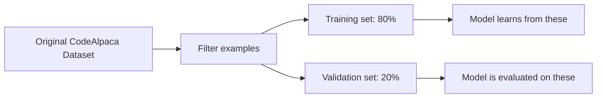

### Simple analogy

Training data is like homework problems with answers.

Validation data is like a practice quiz. You use it to see whether learning is generalizing.

---

## 5. Prompt Formatting

Before training, each dataset example is converted into a prompt.

A common instruction-tuning format is:

```text
### Instruction:
<instruction text>

### Response:
<answer text><EOS>
```

Example:

```text
### Instruction:
Write a Python function that adds two numbers.

### Response:
def add(a, b):
    return a + b
<EOS>
```

## Why add an EOS token?

`EOS` means **End Of Sequence**.

It tells the model:

> This answer ends here.

Without an EOS token, the model may keep generating text longer than needed.

---

## 6. Formatting With and Without Responses

The transcript describes two formatting functions.

### A. Training format: includes the response

Used during fine-tuning.

```text
### Instruction:
Write a Python function that adds two numbers.

### Response:
def add(a, b):
    return a + b
<EOS>
```

The model sees both the prompt and the correct response.

### B. Validation / generation format: no response

Used when asking the model to generate an answer.

```text
### Instruction:
Write a Python function that adds two numbers.

### Response:
```

The model must complete the response itself.

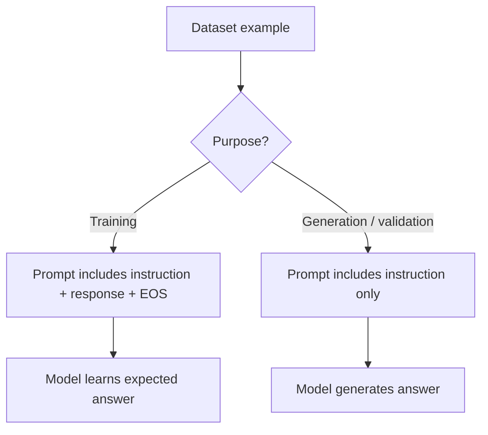

---

## 7. Tokenization

Models do not directly read words. They read **tokens**.

A tokenizer converts text into token IDs.

Example:

```text
"Write a function"
```

might become something like:

```text
[2417, 10, 1412]
```

The exact numbers depend on the tokenizer.

### Layman’s explanation

A tokenizer is like a translator between human text and model-readable numbers.

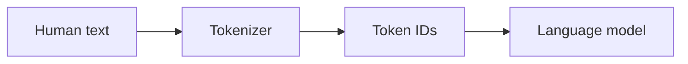

---

## 8. Creating a Torch Dataset

The transcript mentions creating a custom list dataset class.

In PyTorch-style training, data usually needs to behave like a dataset object.

That means it should support:

```python
len(dataset)
dataset[index]
```

### PyTorch-shaped pseudocode

```python
class InstructionDataset(torch.utils.data.Dataset):
    def __init__(self, examples):
        self.examples = examples

    def __len__(self):
        return len(self.examples)

    def __getitem__(self, idx):
        return self.examples[idx]
```

This lets a trainer or dataloader retrieve training examples one at a time.

---

## 9. Base Model: `facebook/opt-350m`

The transcript fine-tunes a base model called:

```text
facebook/opt-350m
```

This is a causal language model.

### What is a causal language model?

A causal language model predicts the next token from previous tokens.

Example:

```text
Input:  The cat sat on the
Target: mat
```

It predicts from left to right.

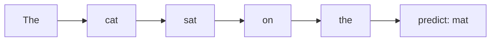

### Encoder vs decoder intuition

| Model type | Common use | Example |
|---|---|---|
| Encoder model | Understand input | BERT-style classification, embeddings |
| Decoder / causal LM | Generate text | GPT-style text generation |
| Encoder-decoder | Transform one text into another | Translation, summarization |

Instruction-tuning in this transcript uses a decoder-style causal LM.

---

## 10. PEFT and LoRA

The transcript uses **PEFT** and **LoRA**.

PEFT means **Parameter-Efficient Fine-Tuning**.

Instead of updating all model weights, PEFT updates a small number of extra parameters.

LoRA means **Low-Rank Adaptation**.

### Why use LoRA?

Large models have many weights. Full fine-tuning can require a lot of GPU memory.

LoRA freezes the original model weights and trains small adapter matrices.

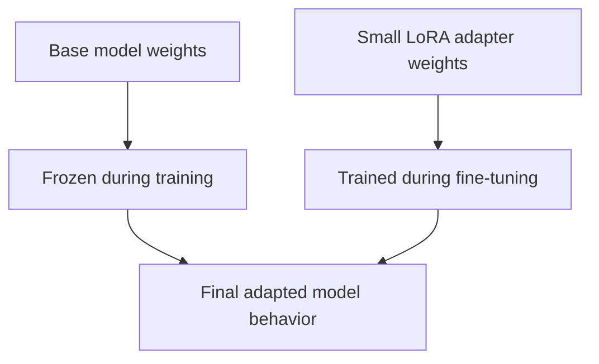

### Layman’s explanation

Imagine the base model is a huge machine.

Full fine-tuning rebuilds many parts of the machine.

LoRA adds small adjustable attachments to the machine and tunes only those attachments.

### Comparison

| Fine-tuning method | What changes? | Pros | Cons |
|---|---|---|---|
| Full fine-tuning | Many or all model weights | Maximum flexibility | Expensive, memory-heavy |
| LoRA / PEFT | Small adapter weights | Cheaper, faster, memory-efficient | May be less flexible than full fine-tuning |

---

## 11. LoRA Configuration

The transcript mentions a `lora_config` object with parameters like:

- LoRA rank
- target modules
- task type

### LoRA rank

The rank controls the size/capacity of the LoRA adapter.

A higher rank means:

- more trainable parameters
- potentially more learning capacity
- more memory usage

A lower rank means:

- fewer trainable parameters
- cheaper training
- possibly less adaptation power

### Target modules

Target modules are the parts of the model where LoRA adapters are inserted.

For transformer models, these are often attention projection layers.

Example names may include:

```python
target_modules = ["q_proj", "v_proj"]
```

or, depending on the model architecture:

```python
target_modules = ["query", "value"]
```

The exact names depend on the model.

### Task type

For this transcript, the task type is causal language modeling.

In PEFT this is often represented as:

```python
TaskType.CAUSAL_LM
```

### PyTorch-shaped pseudocode

```python
from peft import LoraConfig, get_peft_model, TaskType

lora_config = LoraConfig(
    r=8,
    lora_alpha=16,
    target_modules=["q_proj", "v_proj"],
    lora_dropout=0.05,
    bias="none",
    task_type=TaskType.CAUSAL_LM,
)

model = get_peft_model(base_model, lora_config)
```

---

## 12. SFT: Supervised Fine-Tuning

The transcript uses **SFT**, which means **Supervised Fine-Tuning**.

Supervised means the model trains on examples with expected answers.

```text
Input prompt -> Expected response
```

During training, the model predicts tokens and compares its predictions to the correct response tokens.

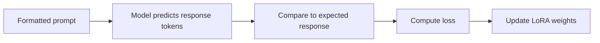

---

## 13. Training Arguments

The transcript mentions several training arguments.

| Argument | Beginner meaning |
|---|---|
| `output_dir` | Where checkpoints, logs, and model files are saved |
| `num_train_epochs` | How many full passes over the training set |
| `per_device_train_batch_size` | How many examples each device processes per training step |
| `per_device_eval_batch_size` | Batch size during validation |
| `evaluation_strategy="epoch"` | Run validation after each epoch |
| `max_seq_length` | Maximum number of tokens in each training sequence |
| `fp16=True` | Use 16-bit floating point to reduce memory and speed up training on compatible GPUs |

### Important correction about `max_seq_length`

The transcript says max sequence length controls the maximum length of output responses.

More precisely:

```text
max_seq_length controls the total sequence length used during training.
```

That sequence often includes:

```text
instruction + response
```

If the prompt and response together exceed the limit, the sequence may be truncated.

---

## 14. What the Collator Does

The transcript discusses `DataCollatorForCompletionOnlyLM`.

A collator prepares multiple examples into a batch.

### Without a collator

Examples can have different lengths:

```text
Example 1: 20 tokens
Example 2: 80 tokens
Example 3: 43 tokens
```

A GPU batch usually needs a rectangular tensor:

```text
batch_size x sequence_length
```

So the collator pads shorter examples.

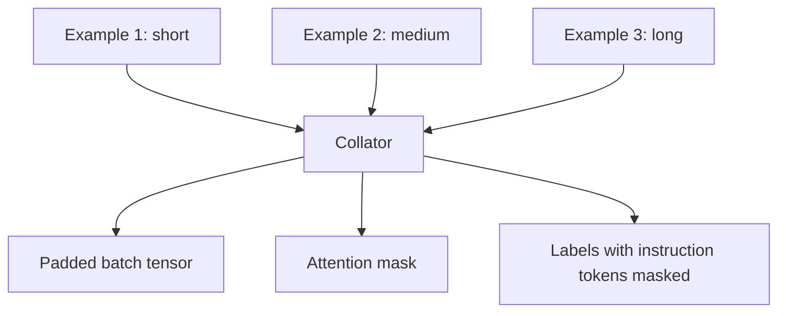

### Main collator jobs

| Job | Meaning |
|---|---|
| Padding | Add pad tokens so examples in a batch have the same length |
| Truncation | Cut sequences that are too long |
| Attention mask | Mark real tokens vs padding tokens |
| Label masking | Ignore instruction tokens when calculating loss |
| Batch creation | Combine examples into tensors |

---

## 15. Why Mask the Instruction Part?

For instruction-tuning, the goal is usually:

> Given the instruction, learn to generate the response.

So we do not want the model’s loss to punish or reward it for predicting the instruction text itself.

We mostly care about whether it predicts the response correctly.

### Example

Training sequence:

```text
### Instruction:
Write a function that adds two numbers.

### Response:
def add(a, b):
    return a + b
```

The collator can mask the instruction part:

```text
### Instruction:
Write a function that adds two numbers.

### Response:
```

Loss ignored here.

Then calculate loss on:

```text
def add(a, b):
    return a + b
```

### Label masking intuition

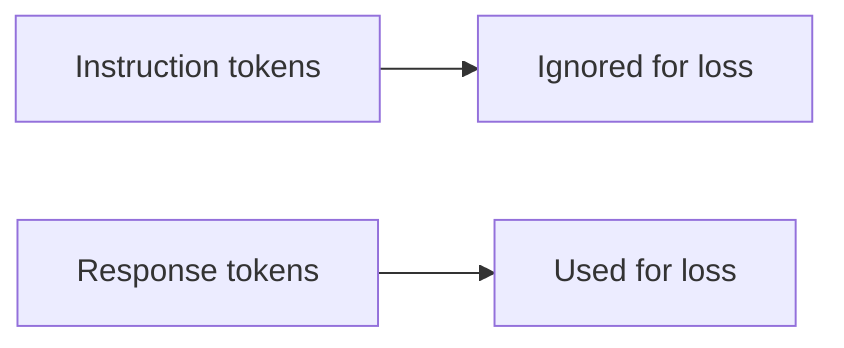

### PyTorch-shaped pseudocode

```python
input_ids = tokenizer(prompt_plus_response)

labels = input_ids.copy()

# Ignore everything before the response starts.
for i in range(response_start_index):
    labels[i] = -100

# In PyTorch cross entropy, label -100 is commonly ignored.
loss = model(input_ids=input_ids, labels=labels).loss
```

---

## 16. Packing

The transcript says `packing=False`.

Packing means combining multiple short examples into one long sequence to use tokens more efficiently.

### Packing false

Each example stays separate.

```text
Example A -> sequence
Example B -> sequence
Example C -> sequence
```

### Packing true

Multiple short examples may be joined together.

```text
Example A + Example B + Example C -> one packed sequence
```

### Comparison

| Setting | Meaning | Beginner-friendly reason to use |
|---|---|---|
| `packing=False` | Keep examples separate | Simpler and easier to reason about |
| `packing=True` | Combine short examples | More efficient, but formatting/loss boundaries matter more |

---

## 17. Training Loss

Training loss measures how wrong the model is.

For causal language modeling, the model predicts the next token.

If the correct next token is assigned high probability, loss is lower.

If the correct next token is assigned low probability, loss is higher.

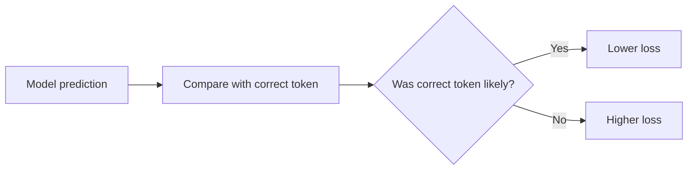

### Simple example

Correct response:

```python
return a + b
```

If the model predicts:

```python
return a + b
```

loss should be low.

If the model predicts:

```python
print("hello")
```

loss should be higher.

---

## 18. Full Training Pipeline

Here is the whole process described in the transcript.

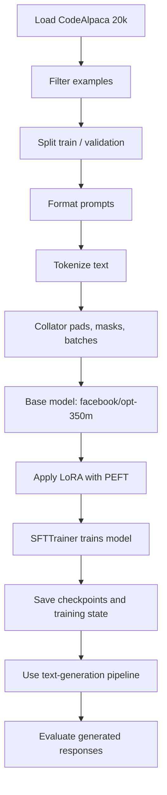

---

## 19. Text Generation Pipeline

After training, the transcript uses Hugging Face’s `pipeline`.

A text-generation pipeline simplifies inference by handling:

- tokenization
- model input creation
- generation
- decoding tokens back into text

### Pseudocode

```python
from transformers import pipeline

generator = pipeline(
    task="text-generation",
    model=model,
    tokenizer=tokenizer,
    max_length=256,
    return_full_text=False,
)

prompt = """
### Instruction:
Write a Python function that adds two numbers.

### Response:
""".strip()

result = generator(
    prompt,
    num_beams=4,
    early_stopping=True,
)

print(result[0]["generated_text"])
```

---

## 20. Generation Parameters

The transcript mentions:

| Parameter | Meaning |
|---|---|
| `max_length` | Maximum total generated sequence length, depending on API behavior |
| `return_full_text=False` | Return only the generated completion, not the original prompt |
| `num_beams` | Use beam search to explore multiple possible completions |
| `early_stopping` | Stop beam search when completed candidates are found |

### Beam search intuition

Beam search keeps several possible answers alive at once and chooses among them.

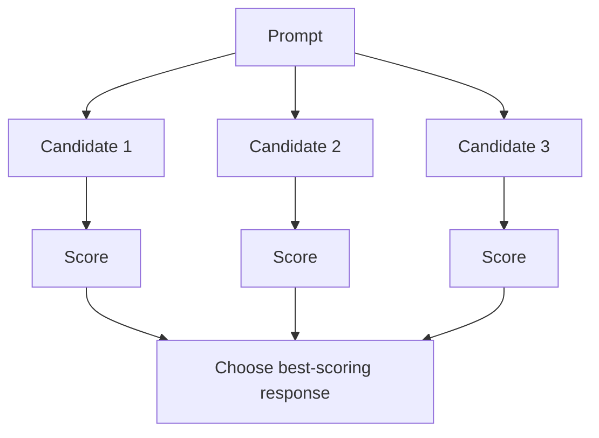

### Beam search vs greedy decoding

| Method | What it does | Pros | Cons |
|---|---|---|---|
| Greedy decoding | Always picks the most likely next token | Simple and fast | Can get stuck in bland or bad completions |
| Beam search | Tracks multiple likely sequences | Often better for structured tasks | Slower and can still be repetitive |
| Sampling | Randomly samples from likely tokens | More creative | Less predictable |

---

## 21. Evaluation with BLEU and SacreBLEU

The transcript evaluates generated answers with BLEU / SacreBLEU.

BLEU compares generated text to reference text.

For code-generation datasets, BLEU can sometimes help measure overlap between generated code and expected code.

### Example

Reference answer:

```python
def add(a, b):
    return a + b
```

Generated answer:

```python
def add_numbers(x, y):
    return x + y
```

A simple overlap metric may give partial credit because both answers have similar structure.

### Important limitation

BLEU does not truly understand whether code works.

These two functions are semantically equivalent:

```python
def add(a, b):
    return a + b
```

```python
def sum_two(x, y):
    return x + y
```

But a text-overlap metric may score them lower because the variable and function names differ.

For code, stronger evaluation may include:

- unit tests
- exact match
- execution-based correctness
- human review
- semantic code analysis

---

## 22. Why the Fine-Tuned Model Improves

The transcript says the fine-tuned model gets a much better SacreBLEU score than the base model.

This makes sense because the base model was not specifically trained to follow the CodeAlpaca prompt format.

After instruction-tuning, the model has seen many examples like:

```text
### Instruction:
...

### Response:
...
```

So it learns:

- where the answer begins
- what style of response is expected
- how to produce code-oriented answers
- when to stop

---

## 23. Practical Mental Model

Instruction-tuning is not teaching the model programming from scratch.

It is more like teaching the model:

> When you see this kind of instruction, respond in this kind of format.

The base model already has language and code knowledge from pretraining.

Fine-tuning shapes that knowledge toward a specific behavior.

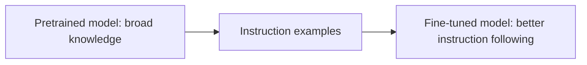

---

## 24. Common Beginner Confusions

### Confusion 1: Is the model learning from the instruction or the response?

Both are in the input sequence, but the loss is often calculated only on the response.

The instruction tells the model what task is being answered.

The response is what the model is trained to generate.

---

### Confusion 2: Why not train on the whole prompt?

If you train loss on the instruction too, the model spends capacity learning to reproduce user prompts.

But during real use, the user already provides the instruction.

You mainly want the model to learn the answer.

---

### Confusion 3: Is validation the same as generation?

Not exactly.

Validation during training usually calculates loss on held-out examples.

Generation asks the model to produce text and may then compare the output to expected answers.

---

### Confusion 4: Does LoRA replace the base model?

No.

LoRA adds small trainable adapter weights to the base model.

The base model remains the foundation.

---

### Confusion 5: Does a lower training loss always mean a better model?

Not always.

Loss is useful, but a model can overfit.

You also need validation performance and task-specific evaluation.

For code, runnable tests are often more meaningful than loss alone.

---

## 25. PyTorch-Shaped End-to-End Pseudocode

This is not exact production code. It is shaped like real Hugging Face / PyTorch code to help you understand the moving parts.

```python
from datasets import load_dataset
from transformers import AutoModelForCausalLM, AutoTokenizer, TrainingArguments
from peft import LoraConfig, get_peft_model, TaskType
from trl import SFTTrainer, DataCollatorForCompletionOnlyLM

MODEL_NAME = "facebook/opt-350m"

# 1. Load dataset.
dataset = load_dataset("sahil2801/CodeAlpaca-20k")

# 2. Keep simpler examples without extra input context.
dataset = dataset.filter(lambda ex: not ex["input"].strip())

# 3. Split train/validation.
split = dataset["train"].train_test_split(test_size=0.2)
train_dataset = split["train"]
eval_dataset = split["test"]

# 4. Load tokenizer and model.
tokenizer = AutoTokenizer.from_pretrained(MODEL_NAME)
model = AutoModelForCausalLM.from_pretrained(MODEL_NAME)

# Some causal LMs need an explicit pad token.
tokenizer.pad_token = tokenizer.eos_token

# 5. Format examples.
def formatting_prompts_func(examples):
    texts = []
    for instruction, output in zip(examples["instruction"], examples["output"]):
        text = (
            "### Instruction:\n"
            f"{instruction.strip()}\n\n"
            "### Response:\n"
            f"{output.strip()}"
            f"{tokenizer.eos_token}"
        )
        texts.append(text)
    return texts

# 6. Apply LoRA.
lora_config = LoraConfig(
    r=8,
    lora_alpha=16,
    lora_dropout=0.05,
    target_modules=["q_proj", "v_proj"],
    bias="none",
    task_type=TaskType.CAUSAL_LM,
)

model = get_peft_model(model, lora_config)

# 7. Training arguments.
training_args = TrainingArguments(
    output_dir="./opt-350m-codealpaca-lora",
    num_train_epochs=3,
    per_device_train_batch_size=4,
    per_device_eval_batch_size=4,
    evaluation_strategy="epoch",
    fp16=True,
    logging_steps=10,
)

# 8. Collator masks everything before the response.
collator = DataCollatorForCompletionOnlyLM(
    response_template="### Response:",
    tokenizer=tokenizer,
)

# 9. Trainer.
trainer = SFTTrainer(
    model=model,
    args=training_args,
    train_dataset=train_dataset,
    eval_dataset=eval_dataset,
    formatting_func=formatting_prompts_func,
    data_collator=collator,
    packing=False,
    max_seq_length=512,
)

# 10. Train.
trainer.train()

# 11. Save.
trainer.save_model()
```

---

## 26. Mini Example: One Training Sample

Original dataset row:

```json
{
  "instruction": "Create a function that returns the square of a number.",
  "input": "",
  "output": "def square(n):\n    return n * n"
}
```

Formatted training text:

```text
### Instruction:
Create a function that returns the square of a number.

### Response:
def square(n):
    return n * n
<EOS>
```

Tokenized:

```text
[101, 342, 987, 222, ...]
```

Labels after masking:

```text
Instruction tokens: -100, -100, -100, ...
Response tokens: actual token IDs
```

Loss is computed only on:

```python
def square(n):
    return n * n
```

---

## 27. Key Takeaways

1. Instruction-tuning trains a model to follow task instructions.
2. The dataset usually contains instruction/response pairs.
3. Prompt formatting matters because the model learns the pattern.
4. EOS tokens teach the model where answers should stop.
5. Tokenization converts text into model-readable numbers.
6. LoRA fine-tunes a small number of adapter weights instead of the whole model.
7. A collator prepares batches and can mask instruction tokens from the loss.
8. SFTTrainer handles supervised fine-tuning.
9. The text-generation pipeline simplifies inference.
10. BLEU/SacreBLEU can compare generated text to references, but code should ideally be evaluated with tests too.

---

## 28. Self-Check Questions

### Conceptual questions

1. What is instruction-tuning trying to teach the model?
2. Why does the dataset need expected responses?
3. What is the difference between a training prompt and a generation prompt?
4. Why is an EOS token useful?
5. Why might examples with an `input` field be removed in a beginner lesson?
6. What does a tokenizer do?
7. What is the difference between full fine-tuning and LoRA?
8. Why does the collator pad examples?
9. Why are instruction tokens often masked from the loss?
10. Why is BLEU limited for evaluating code?

### Applied questions

1. Given this instruction, write the formatted training prompt:

```text
Instruction: Write a Python function to multiply two numbers.
Output: def multiply(a, b): return a * b
```

2. In the following sequence, which part should usually be used for loss?

```text
### Instruction:
Sort a list in Python.

### Response:
def sort_list(items):
    return sorted(items)
```

3. Suppose your model generates answers that never stop. What token or training behavior might be missing?

4. Suppose validation loss improves but generated code fails tests. What does that tell you?

5. Suppose you increase LoRA rank. What trade-off are you making?

---

## 29. Answers to Self-Check Questions

### Conceptual answers

1. It teaches the model to produce useful responses when given task instructions.
2. Expected responses tell the model what a good answer looks like.
3. A training prompt includes the answer; a generation prompt leaves the answer blank for the model to complete.
4. EOS tells the model where the response ends.
5. Removing `input` examples simplifies formatting to instruction-response only.
6. A tokenizer converts text into token IDs.
7. Full fine-tuning updates many model weights; LoRA trains small adapter weights.
8. Padding makes examples the same length so they can fit into one batch tensor.
9. Because the goal is to generate the response, not reproduce the user’s instruction.
10. BLEU measures text overlap, not whether code actually works.

### Applied answers

1. Formatted prompt:

```text
### Instruction:
Write a Python function to multiply two numbers.

### Response:
def multiply(a, b): return a * b
<EOS>
```

2. Usually only this part is used for loss:

```python
def sort_list(items):
    return sorted(items)
```

3. The model may not have learned or received an EOS token properly.
4. The model may be learning surface patterns but not producing functionally correct code.
5. Higher LoRA rank gives more adaptation capacity but uses more memory and compute.
