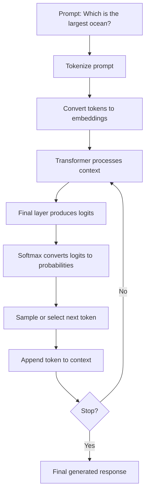
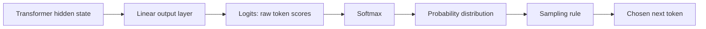
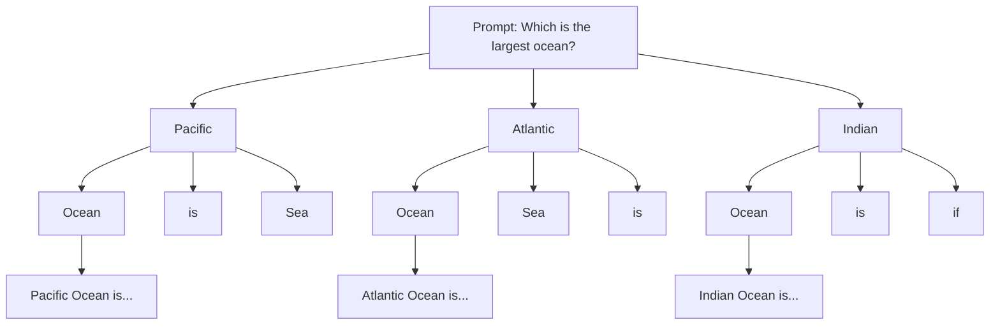
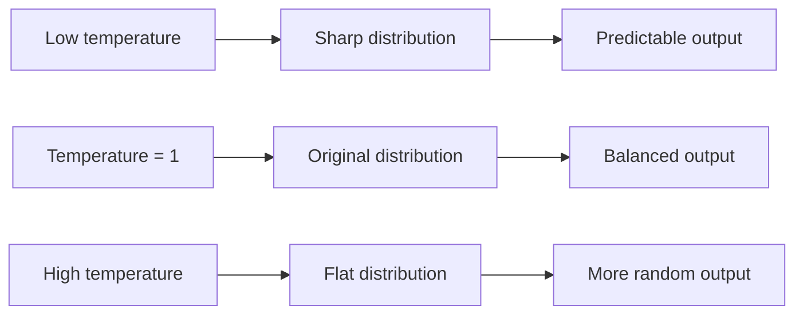
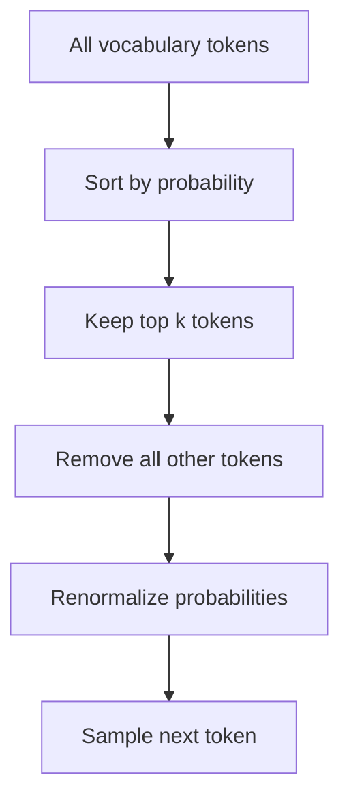

# LLMs as Distributions: Beginner-Friendly Notes

## Source

These notes are based on the uploaded transcript `subtitle.txt`. The transcript explains how large language models generate text by producing probability distributions over possible next tokens, then sampling from those distributions.

---

## 1. Big Idea

A large language model does **not** directly “know” the one correct next word.

Instead, at each generation step, it asks:

> “Given everything I have seen so far, how likely is each possible next token?”

Then it creates a probability distribution over the vocabulary.

For example, for the prompt:

```text
Which is the largest ocean?
```

The model may assign probabilities like:

| Possible next token | Probability |
|---|---:|
| Pacific | 0.70 |
| Atlantic | 0.12 |
| Indian | 0.08 |
| Arctic | 0.03 |
| other tokens | 0.07 |

The model can then either:

- choose the most likely token, or
- randomly sample a token according to the probabilities.

That is why the same prompt can sometimes produce different responses.

---

## 2. Corrected Transcript Terminology

| Transcript wording                     | Better terminology                    | Explanation                                                                            |
| -------------------------------------- | ------------------------------------- | -------------------------------------------------------------------------------------- |
| “LLMs as distributions”                | LLMs define probability distributions | An LLM outputs probabilities over possible next tokens.                                |
| “X approximate D”                      | `x ~ D`                               | Means input prompt `x` is sampled from a data distribution `D`.                        |
| “Y distributed Pi Y/XY”                | `y ~ π(y\|x)`                         | Means response `y` is sampled from the model policy/distribution given prompt `x`.     |
| “timestamp”                            | time step                             | In token generation, `t`, `t + 1`, etc. are usually called time steps, not timestamps. |
| “word at time Omega t”                 | token `ω_t` or `x_t`                  | The symbol likely refers to the token generated at time step `t`.                      |
| “specific”                             | Pacific                               | The transcript likely misheard “Pacific” as “specific.”                                |
| “changing sequences”                   | generation parameters                 | Parameters like temperature and top-k change how text is sampled.                      |
| “the input model is the largest ocean” | the input prompt is tokenized         | The prompt is converted into tokens and embeddings before entering the transformer.    |

---

## 3. Tokens, Not Always Words

The transcript often says “words,” but LLMs usually operate on **tokens**.

A token can be:

- a whole word: `ocean`
- part of a word: `un`, `believ`, `able`
- punctuation: `?`
- whitespace-like pieces
- special tokens, such as `<EOS>` meaning “end of sequence”

So when we say “next word,” the more accurate phrase is usually **next token**.

### Simple example

```text
Prompt: Which is the largest ocean?
Possible next token: Pacific
```

The model does not choose from only normal English words. It chooses from its entire vocabulary of tokens.

---

## 4. LLM as a Conditional Probability Distribution

A language model can be viewed as a function that produces probabilities.

Given a prompt `x`, it defines a distribution over possible responses `y`:

```math
 y \sim \pi(y \mid x)
```

Read this as:

> The response `y` is sampled from the model’s distribution `π`, conditioned on the prompt `x`.

In plain English:

> The model generates an answer based on the prompt, but the exact answer may vary because generation can involve sampling.

---

## 5. Token-by-Token Generation

The response is generated one token at a time.

Suppose the prompt is:

```text
Which is the largest ocean?
```

The model first predicts probabilities for the next token:

```text
Pacific:  70%
Atlantic: 12%
Indian:    8%
Arctic:    3%
Other:     7%
```

If it samples `Pacific`, then the context becomes:

```text
Which is the largest ocean? Pacific
```

Now the model predicts the next token again:

```text
Ocean: 80%
is:    10%
Sea:    4%
Other:  6%
```

If it samples `Ocean`, the context becomes:

```text
Which is the largest ocean? Pacific Ocean
```

This repeats until the model stops.

---

## 6. Mermaid Diagram: Generation Loop



---

## 7. Logits and Softmax

Before the model gives probabilities, it produces raw scores called **logits**.

A logit is not yet a probability. It is just a score.

Example:

| Token | Logit |
|---|---:|
| Pacific | 4.0 |
| Atlantic | 2.0 |
| Indian | 1.5 |
| Arctic | 0.5 |

The **softmax** function converts these scores into probabilities that add up to 1.

```math
 P(token_i) = \frac{e^{z_i}}{\sum_j e^{z_j}}
```

Where:

- `z_i` is the logit for token `i`
- `e^{z_i}` makes higher scores much stronger
- the denominator normalizes everything so probabilities sum to 1

### Layman’s explanation

Softmax is like turning “preference scores” into a voting chart.

If `Pacific` has a much higher score than the others, softmax gives it most of the probability.

---

## 8. Mermaid Diagram: Logits to Sampled Token



---

## 9. Why Sampling Produces Different Outputs

If the model always chooses the highest-probability token, it uses **argmax decoding**.

Example:

```text
Pacific: 70%
Atlantic: 12%
Indian: 8%
```

Argmax always chooses:

```text
Pacific
```

But sampling treats the probabilities like weighted chances.

So most of the time the model chooses `Pacific`, but sometimes it may choose `Atlantic` or another token.

This is why the same prompt might produce:

```text
The Pacific Ocean is the largest ocean on Earth.
```

or:

```text
The largest ocean is the Pacific Ocean.
```

or, with too much randomness:

```text
Atlantic sea timeline lake...
```

---

## 10. Important Correction: The Next Distribution Depends on the Full Previous Context

The transcript says the distribution at time `t + 1` depends on the previous values.

That is correct, but for causal transformers the stronger version is:

> The probability distribution for the next token depends on all previous tokens in the current context window.

So:

```math
 P(x_{t+1} \mid x_0, x_1, x_2, ..., x_t)
```

Read this as:

> The probability of the next token depends on every earlier token the model can currently attend to.

### Example

The next-token probabilities after these two contexts may be very different:

```text
Pacific
```

versus:

```text
Which is the largest ocean? Pacific
```

In the second case, the model has more context, so `Ocean` becomes very likely.

---

## 11. Mermaid Diagram: Branching Possible Sequences



Each branch represents a possible generated sequence. More likely branches are chosen more often, but less likely branches can still happen if sampling allows them.

---

## 12. Temperature

Temperature controls how sharp or flat the probability distribution is.

The temperature-adjusted softmax is:


$$
P(token_i) = \frac{e^{z_i / \tau}}{\sum_j e^{z_j / \tau}}
$$

Where:

- `z_i` is the logit for token `i`
- `τ` is temperature, pronounced “tau”

### What temperature does

| Temperature | Effect | Behavior |
|---:|---|---|
| Very low, such as `0.1` | Very sharp distribution | The model strongly prefers the highest-probability token. |
| `1.0` | Normal softmax | Uses the original probability shape. |
| Higher, such as `2.0` | Flatter distribution | Less likely tokens become more possible. |
| Very high, such as `10+` | Almost uniform | Output becomes much more random. |

### Layman’s explanation

Temperature is like a “creativity/randomness knob.”

- Low temperature: safe, predictable, repetitive
- Medium temperature: balanced
- High temperature: creative, but can become incoherent

---

## 13. Temperature Example

Suppose the raw model strongly prefers `Pacific`.

At lower temperature:

| Token | Probability |
|---|---:|
| Pacific | 0.92 |
| Atlantic | 0.04 |
| Indian | 0.03 |
| Arctic | 0.01 |

At higher temperature:

| Token | Probability |
|---|---:|
| Pacific | 0.45 |
| Atlantic | 0.25 |
| Indian | 0.18 |
| Arctic | 0.12 |

The high-temperature version gives weaker tokens more chance.

---

## 14. Mermaid Diagram: Temperature Intuition



---

## 15. Top-k Sampling

Top-k sampling restricts the model to only the `k` most likely next tokens.

If `k = 3`, the model keeps only the top 3 tokens and removes the rest.

Example before top-k:

| Token | Probability |
|---|---:|
| Pacific | 0.70 |
| Atlantic | 0.12 |
| Indian | 0.08 |
| Arctic | 0.03 |
| banana | 0.02 |
| timeline | 0.01 |
| other | 0.04 |

With `k = 3`, keep:

| Token | Original probability |
|---|---:|
| Pacific | 0.70 |
| Atlantic | 0.12 |
| Indian | 0.08 |

Then renormalize so they add up to 1:

| Token | New probability after top-k |
|---|---:|
| Pacific | 0.778 |
| Atlantic | 0.133 |
| Indian | 0.089 |

### Layman’s explanation

Top-k says:

> “Only let the model choose from the top `k` reasonable options.”

This reduces weird outputs because very unlikely tokens are blocked.

---

## 16. Mermaid Diagram: Top-k Sampling



---

## 17. Top-p Sampling / Nucleus Sampling

Top-p sampling keeps the smallest set of tokens whose cumulative probability reaches some threshold `p`.

For example, if `p = 0.90`, keep enough tokens to cover 90% of the probability mass.

| Token | Probability | Cumulative probability | Keep? |
|---|---:|---:|---|
| Pacific | 0.70 | 0.70 | yes |
| Atlantic | 0.12 | 0.82 | yes |
| Indian | 0.08 | 0.90 | yes |
| Arctic | 0.03 | 0.93 | no |
| banana | 0.02 | 0.95 | no |

Top-p is adaptive.

If the model is confident, top-p may keep only a few tokens. If the model is uncertain, it may keep more tokens.

---

## 18. Top-k vs Top-p

| Method | What it controls | Example | Intuition |
|---|---|---|---|
| Top-k | Number of allowed tokens | Keep top 3 tokens | “Choose from exactly this many candidates.” |
| Top-p | Total probability mass | Keep tokens until cumulative probability reaches 0.90 | “Choose from enough likely candidates.” |

Top-k uses a fixed count.

Top-p uses a probability threshold.

---

## 19. Beam Search

Beam search is different from random sampling.

Instead of randomly picking one token at a time, beam search keeps several strong candidate sequences and expands them.

If beam size is 3, it tracks the top 3 partial sequences at each step.

### Simple example

At step 1:

```text
1. Pacific
2. Atlantic
3. Indian
```

At step 2, it expands each:

```text
Pacific Ocean
Pacific is
Atlantic Ocean
Atlantic Sea
Indian Ocean
Indian is
```

Then it keeps the best few sequences.

Beam search is useful when you want a high-probability output, but it can sometimes produce less diverse or more generic text.

---

## 20. Repetition Penalty

A repetition penalty discourages the model from repeating the same tokens or phrases too much.

Without repetition penalty, a model might produce:

```text
The Pacific Ocean is the largest ocean ocean ocean ocean...
```

With repetition penalty, repeated tokens become less likely, encouraging the model to move forward.

---

## 21. Max Tokens and Min Tokens

Generation usually has length controls.

| Parameter | Meaning |
|---|---|
| `max_new_tokens` | Maximum number of new tokens the model may generate. |
| `min_new_tokens` | Minimum number of new tokens before stopping is allowed. |
| `<EOS>` token | A special token meaning “end of sequence.” |

Example:

```text
Prompt: Which is the largest ocean?
max_new_tokens = 8
Output: The Pacific Ocean is the largest ocean.
```

If `max_new_tokens` is too small, the output may stop early.

If it is too large, the model may ramble.

---

## 22. Comparison of Generation Parameters

| Parameter | Main purpose | Too low / restrictive | Too high / loose |
|---|---|---|---|
| Temperature | Controls randomness | Boring, repetitive, deterministic | Weird, unstable, incoherent |
| Top-k | Limits candidates by count | May remove useful alternatives | May allow too many weak tokens |
| Top-p | Limits candidates by probability mass | May become too conservative | May become too random |
| Beam search | Searches strong sequences | Low diversity | Expensive and sometimes generic |
| Repetition penalty | Reduces repeated text | May over-penalize useful repeated terms | Repetition may remain |
| Max tokens | Controls output length | Output cut off | Output may ramble |

---

## 23. PyTorch-Shaped Pseudocode: Basic Next-Token Sampling

This is not full production code. It is shaped like PyTorch to show the logic.

```python
import torch
import torch.nn.functional as F

# prompt_ids shape: [batch_size, sequence_length]
prompt_ids = tokenizer("Which is the largest ocean?", return_tensors="pt").input_ids

# The model returns logits for every position in the sequence.
# logits shape: [batch_size, sequence_length, vocab_size]
outputs = model(prompt_ids)
logits = outputs.logits

# We only need the logits for the final position.
# next_token_logits shape: [batch_size, vocab_size]
next_token_logits = logits[:, -1, :]

# Convert logits to probabilities.
probs = F.softmax(next_token_logits, dim=-1)

# Sample one token from the probability distribution.
next_token_id = torch.multinomial(probs, num_samples=1)

# Add sampled token to the current sequence.
new_input_ids = torch.cat([prompt_ids, next_token_id], dim=-1)
```

### Important shapes

| Tensor | Shape | Meaning |
|---|---|---|
| `prompt_ids` | `[batch_size, sequence_length]` | Token IDs for the input prompt. |
| `logits` | `[batch_size, sequence_length, vocab_size]` | Raw scores for every vocabulary token at every position. |
| `next_token_logits` | `[batch_size, vocab_size]` | Raw scores for the next token only. |
| `probs` | `[batch_size, vocab_size]` | Probability distribution over the vocabulary. |
| `next_token_id` | `[batch_size, 1]` | The sampled next token. |

---

## 24. PyTorch-Shaped Pseudocode: Temperature

```python
def apply_temperature(logits, temperature: float):
    # Lower temperature sharpens the distribution.
    # Higher temperature flattens the distribution.
    return logits / temperature

next_token_logits = logits[:, -1, :]
scaled_logits = apply_temperature(next_token_logits, temperature=0.8)
probs = F.softmax(scaled_logits, dim=-1)
next_token_id = torch.multinomial(probs, num_samples=1)
```

---

## 25. PyTorch-Shaped Pseudocode: Top-k Sampling

```python
def top_k_filter(logits, k: int):
    # Keep only the top k logits.
    values, indices = torch.topk(logits, k=k, dim=-1)

    # Start with everything blocked out.
    filtered_logits = torch.full_like(logits, float("-inf"))

    # Restore only the top k token scores.
    filtered_logits.scatter_(dim=-1, index=indices, src=values)
    return filtered_logits

next_token_logits = logits[:, -1, :]
filtered_logits = top_k_filter(next_token_logits, k=3)
probs = F.softmax(filtered_logits, dim=-1)
next_token_id = torch.multinomial(probs, num_samples=1)
```

Why use `-inf`?

Because softmax turns `-inf` into probability `0`, which blocks those tokens from being sampled.

---

## 26. PyTorch-Shaped Pseudocode: Top-p Sampling

```python
def top_p_filter(logits, p: float):
    # Sort tokens from highest to lowest logit.
    sorted_logits, sorted_indices = torch.sort(logits, descending=True, dim=-1)

    # Convert sorted logits into probabilities.
    sorted_probs = F.softmax(sorted_logits, dim=-1)

    # Compute cumulative probability.
    cumulative_probs = torch.cumsum(sorted_probs, dim=-1)

    # Remove tokens after cumulative probability exceeds p.
    remove_mask = cumulative_probs > p

    # Keep at least the first token above the threshold boundary.
    remove_mask[..., 1:] = remove_mask[..., :-1].clone()
    remove_mask[..., 0] = False

    # Apply mask.
    sorted_logits = sorted_logits.masked_fill(remove_mask, float("-inf"))

    # Put logits back into original vocabulary order.
    filtered_logits = torch.full_like(logits, float("-inf"))
    filtered_logits.scatter_(dim=-1, index=sorted_indices, src=sorted_logits)
    return filtered_logits

next_token_logits = logits[:, -1, :]
filtered_logits = top_p_filter(next_token_logits, p=0.90)
probs = F.softmax(filtered_logits, dim=-1)
next_token_id = torch.multinomial(probs, num_samples=1)
```

---

## 27. Putting It Together: Autoregressive Generation

A causal language model generates text autoregressively.

**Autoregressive** means:

> The model generates the next token using the tokens already generated.

```python
def generate(model, tokenizer, prompt, max_new_tokens=20, temperature=1.0, top_k=None):
    input_ids = tokenizer(prompt, return_tensors="pt").input_ids

    for _ in range(max_new_tokens):
        outputs = model(input_ids)
        logits = outputs.logits[:, -1, :]

        # Apply temperature.
        logits = logits / temperature

        # Optional top-k filtering.
        if top_k is not None:
            logits = top_k_filter(logits, k=top_k)

        probs = F.softmax(logits, dim=-1)
        next_token_id = torch.multinomial(probs, num_samples=1)

        input_ids = torch.cat([input_ids, next_token_id], dim=-1)

        if next_token_id.item() == tokenizer.eos_token_id:
            break

    return tokenizer.decode(input_ids[0])
```

---

## 28. Argmax vs Sampling

| Method | What it does | Pros | Cons |
|---|---|---|---|
| Argmax | Always chooses the highest-probability token | Predictable, stable | Can be repetitive and less creative |
| Sampling | Randomly chooses based on probabilities | More variety | Can produce mistakes or weird outputs |

### Example

Probability distribution:

```text
Pacific: 70%
Atlantic: 12%
Indian: 8%
Arctic: 3%
Other: 7%
```

Argmax:

```text
Always chooses Pacific.
```

Sampling:

```text
Usually chooses Pacific, but sometimes chooses another token.
```

---

## 29. Practical Mental Model

Think of the model like a very advanced autocomplete system.

At each step, it has a weighted list of possible next tokens:

```text
Pacific  ███████████████████████████████████
Atlantic ██████
Indian   ████
Arctic   ██
Other    ███
```

Generation parameters change how the model uses this list.

- Temperature reshapes the probabilities.
- Top-k cuts the list to a fixed number of candidates.
- Top-p cuts the list based on cumulative probability.
- Beam search tracks multiple high-scoring paths.
- Repetition penalty reduces repeated words or phrases.
- Max/min tokens control output length.

---

## 30. Common Beginner Misunderstandings

### Misunderstanding 1: “The model chooses words directly.”

Better:

> The model usually chooses tokens, not necessarily full words.

### Misunderstanding 2: “Softmax creates meaning.”

Better:

> Softmax converts raw scores into probabilities. The meaningful scores come from the transformer’s learned representations.

### Misunderstanding 3: “Temperature changes the model’s knowledge.”

Better:

> Temperature changes how the model samples from its scores. It does not add new knowledge.

### Misunderstanding 4: “Top-k and top-p are the same.”

Better:

> Top-k keeps a fixed number of tokens. Top-p keeps enough tokens to reach a probability threshold.

### Misunderstanding 5: “A higher temperature is always more creative.”

Better:

> A higher temperature increases randomness. Sometimes that feels creative; sometimes it is just wrong or incoherent.

---

## 31. Simple End-to-End Example

Prompt:

```text
Which is the largest ocean?
```

Step 1 distribution:

| Token | Probability |
|---|---:|
| Pacific | 0.70 |
| Atlantic | 0.12 |
| Indian | 0.08 |
| Arctic | 0.03 |
| Other | 0.07 |

Sampled token:

```text
Pacific
```

New context:

```text
Which is the largest ocean? Pacific
```

Step 2 distribution:

| Token | Probability |
|---|---:|
| Ocean | 0.80 |
| is | 0.10 |
| Sea | 0.04 |
| Other | 0.06 |

Sampled token:

```text
Ocean
```

New context:

```text
Which is the largest ocean? Pacific Ocean
```

Final likely response:

```text
The Pacific Ocean is the largest ocean on Earth.
```

---

## 32. Self-Check Questions

### Question 1

What does an LLM output before selecting the next token?

<details>
<summary>Answer</summary>

It outputs logits, which are raw scores over the vocabulary. These logits are usually converted into probabilities using softmax.

</details>

---

### Question 2

Why can the same prompt produce different answers?

<details>
<summary>Answer</summary>

Because generation can involve sampling from a probability distribution. The highest-probability token is chosen often, but lower-probability tokens can also be selected.

</details>

---

### Question 3

What does temperature control?

<details>
<summary>Answer</summary>

Temperature controls how sharp or flat the probability distribution is. Lower temperature makes the model more deterministic. Higher temperature makes it more random.

</details>

---

### Question 4

What is the difference between top-k and top-p?

<details>
<summary>Answer</summary>

Top-k keeps a fixed number of highest-probability tokens. Top-p keeps the smallest set of tokens whose cumulative probability reaches a threshold such as 0.90.

</details>

---

### Question 5

Why does the distribution at time step `t + 1` depend on earlier tokens?

<details>
<summary>Answer</summary>

Because causal transformers predict the next token using the current context. The context includes the prompt and all previously generated tokens within the model’s context window.

</details>

---

### Question 6

What does `<EOS>` mean?

<details>
<summary>Answer</summary>

EOS means end of sequence. It is a special token that tells the model generation can stop.

</details>

---

## 33. Mini Practice

Given this distribution:

| Token | Probability |
|---|---:|
| Pacific | 0.60 |
| Atlantic | 0.20 |
| Indian | 0.10 |
| Arctic | 0.06 |
| banana | 0.04 |

### Practice A

With argmax decoding, which token is selected?

<details>
<summary>Answer</summary>

`Pacific`, because it has the highest probability.

</details>

### Practice B

With top-k where `k = 3`, which tokens are allowed?

<details>
<summary>Answer</summary>

`Pacific`, `Atlantic`, and `Indian`.

</details>

### Practice C

With top-p where `p = 0.90`, which tokens are allowed?

<details>
<summary>Answer</summary>

`Pacific`, `Atlantic`, and `Indian`, because their cumulative probability is:

```text
0.60 + 0.20 + 0.10 = 0.90
```

</details>

---

## 34. Final Summary

An LLM generates text by repeatedly predicting a probability distribution over the next token.

The main flow is:

```text
prompt → tokens → embeddings → transformer → logits → softmax → probabilities → sampled token → repeat
```

Generation parameters control how the model chooses from those probabilities:

- **Temperature** changes randomness.
- **Top-k** limits sampling to the top `k` tokens.
- **Top-p** limits sampling to enough tokens to cover probability mass `p`.
- **Beam search** tracks multiple high-scoring sequences.
- **Repetition penalty** discourages repeated text.
- **Max/min tokens** control generated length.

The key mental model:

> An LLM is not simply writing one fixed answer. It is repeatedly sampling from probability distributions conditioned on the current context.
