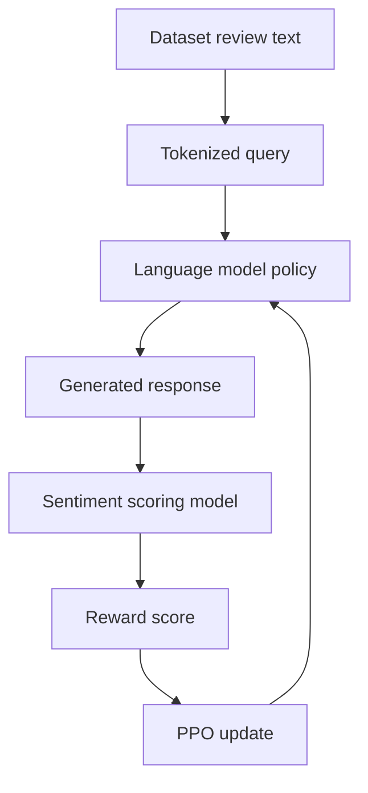
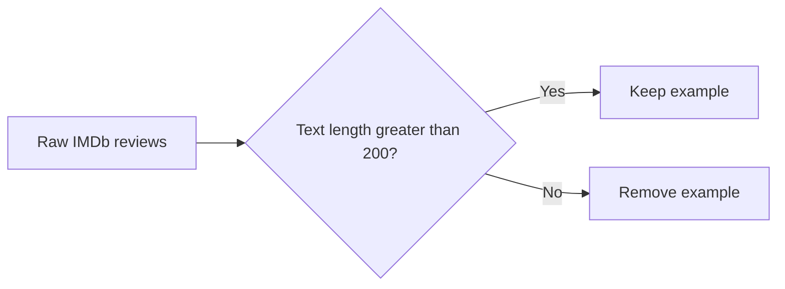
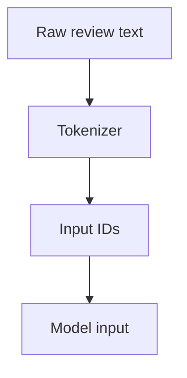
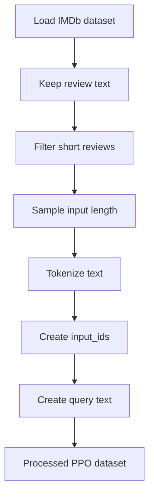

# PPO with Hugging Face — Beginner-Friendly Notes

## 1. Big Picture

This transcript is about using **PPO** — **Proximal Policy Optimization** — with Hugging Face tools.

In this lesson, PPO is used in a language-model setting:

1. A model receives some text, called a **query**.
2. The model generates a **response**.
3. A separate scoring model evaluates the response.
4. That score becomes a **reward**.
5. PPO updates the model so it becomes more likely to produce higher-reward responses.

In the transcript, the reward comes from a **sentiment analysis model**. Positive responses receive higher rewards than negative responses.

### Layman’s explanation

Think of a chatbot as a student writing answers.

A sentiment model acts like a quick grader:

- Positive response → higher grade
- Negative response → lower grade

PPO is the training method that says:

> “Keep doing more of what earned a good score, but do not change your behavior too wildly all at once.”

---

## 2. Corrected Transcript Terminology

| Transcript wording | Better terminology | Meaning |
|---|---|---|
| “PPO with Hugging Face” | PPO using Hugging Face / TRL-style tools | Training a language model with reinforcement learning tools from the Hugging Face ecosystem |
| “scoring function” | reward function / reward model | A function or model that gives generated text a numerical score |
| “sentiment analysis for responses” | sentiment-based reward signal | Using sentiment predictions as rewards |
| “pre-trained model, fine-tuned in the IMDB reviews” | pretrained sentiment classifier fine-tuned on IMDB reviews | A model trained to classify movie reviews as positive or negative |
| “Internet Movie Database or IMDB” | IMDb | The movie review dataset commonly used for sentiment classification |
| “applied function is none” | `function_to_apply="none"` | Return raw model outputs/logits instead of applying softmax or sigmoid inside the pipeline |
| “all scores should be returned” | `return_all_scores=True` | Return scores for every label, such as negative and positive |
| “DS” | dataset examples / dataset rows | Individual rows in the dataset |
| “length of 200 or less are filtered out” | examples with text length `<= 200` are removed | Keeps only longer reviews |
| “input IDs and queries are created” | tokenized IDs and query text are created | The dataset now has model-ready token IDs plus readable prompt text |

---

## 3. What PPO Means in This Context

PPO is a reinforcement learning algorithm.

In normal supervised learning, the model is trained with “correct answers.”

In PPO-style language model training, the model is trained with **rewards**.

### Basic PPO loop



### Key idea

The language model is called the **policy** because it chooses actions.

For a language model:

| Reinforcement Learning term | Language Model version |
|---|---|
| State / observation | Prompt or query |
| Action | Generated token |
| Trajectory | Full generated response |
| Reward | Score assigned to the response |
| Policy | The language model |
| Policy update | Training step that changes model weights |

---

## 4. Why Sentiment Analysis Can Be Used as a Reward Function

The transcript uses sentiment analysis as a simple reward function.

A sentiment classifier reads text and predicts labels like:

- `NEGATIVE`
- `POSITIVE`

For PPO, we can use the positive sentiment score as the reward.

### Example

Suppose the model generates two responses:

| Generated response | Sentiment model output | Reward idea |
|---|---:|---:|
| “This movie was boring and badly made.” | Positive score: `0.05` | Low reward |
| “This movie was thoughtful and beautifully acted.” | Positive score: `0.98` | High reward |

The PPO trainer tries to make the language model more likely to generate responses like the second one.

### Important warning

A sentiment reward is easy to understand, but it is not the same as “truth,” “helpfulness,” or “good writing.”

A model trained only to maximize positive sentiment might learn to produce overly cheerful, shallow, or fake-sounding text.

That is why real RLHF systems usually use more complex reward models.

---

## 5. What the Sentiment Pipeline Is Doing

The transcript describes initializing a Hugging Face sentiment analysis pipeline.

Conceptually:

```python
from transformers import pipeline

sentiment_pipe = pipeline(
    "sentiment-analysis",
    model="sentiment-model-fine-tuned-on-imdb",
)
```

Then the pipeline is applied to generated texts.

```python
texts = [
    "This was a terrible movie.",
    "This was a wonderful movie.",
]

outputs = sentiment_pipe(
    texts,
    return_all_scores=True,
    function_to_apply="none",
    batch_size=2,
)
```

### What `sent_kwargs` likely means

The transcript mentions a `sent_kwargs` dictionary.

That means the code probably looked something like this:

```python
sent_kwargs = {
    "return_all_scores": True,
    "function_to_apply": "none",
    "batch_size": 2,
}
```

Then:

```python
pipe_outputs = sentiment_pipe(texts, **sent_kwargs)
```

### What each setting means

| Setting | Meaning |
|---|---|
| `return_all_scores=True` | Return scores for all sentiment labels |
| `function_to_apply="none"` | Return raw model scores instead of normalized probabilities |
| `batch_size=2` | Process two texts at the same time |

---

## 6. Turning Sentiment Scores into Rewards

The transcript says the outputs are looped over, converted into tensors, and stored in a rewards list.

The purpose is:

> Extract the positive sentiment score and use it as the reward for PPO.

### Conceptual output

A sentiment pipeline might return something shaped like:

```python
pipe_outputs = [
    [
        {"label": "NEGATIVE", "score": 2.1},
        {"label": "POSITIVE", "score": -1.4},
    ],
    [
        {"label": "NEGATIVE", "score": -2.0},
        {"label": "POSITIVE", "score": 3.2},
    ],
]
```

If `function_to_apply="none"`, these may be **raw logits**, not probabilities.

Then you might extract the positive score:

```python
import torch

rewards = []

for output in pipe_outputs:
    positive_score = output[1]["score"]
    reward = torch.tensor(positive_score)
    rewards.append(reward)
```

Now `rewards` can be passed into PPO training.

### Layman’s explanation

The sentiment model returns several grades.

We choose the “positive” grade and tell PPO:

> “Treat this number as the reward.”

---

## 7. Dataset Used: IMDb Reviews

The transcript says the IMDb dataset contains **50,000 movie reviews**.

These reviews are commonly used for sentiment classification.

For this PPO example, the review text is used as input.

A raw example may look like:

```text
This film starts slowly, but the characters become more interesting over time...
```

The dataset might originally contain fields like:

| Field | Meaning |
|---|---|
| `text` | The movie review |
| `label` | Whether the review is negative or positive |

The transcript says the lesson only uses the **review text**.

---

## 8. Filtering the Dataset

The transcript says reviews with length `<= 200` are removed.

That means:

```python
dataset = dataset.filter(lambda example: len(example["text"]) > 200)
```

### Why filter short text?

Short examples may not provide enough context for generation.

For example:

```text
Bad movie.
```

This is probably too short for a useful PPO prompt.

A longer example gives the model more context:

```text
The film begins with a quiet family dinner, but the tension slowly grows...
```

### Diagram



---

## 9. Length Sampler

The transcript mentions a **length sampler**.

A length sampler randomly chooses how many tokens to use from each review.

Instead of always using the same prompt length, the code may sample a length between a minimum and maximum.

Example:

```python
input_min_text_length = 2
input_max_text_length = 8

length_sampler = LengthSampler(
    input_min_text_length,
    input_max_text_length,
)
```

Then for each review:

```python
sampled_length = length_sampler()
```

### Layman’s explanation

Imagine cutting movie reviews into prompt snippets.

Sometimes you give the model a short snippet.

Sometimes you give it a longer snippet.

This helps the model practice responding to different prompt sizes.

### Why this helps

| Benefit | Explanation |
|---|---|
| More variety | The model sees prompts of different lengths |
| More realistic | Real user prompts are not always the same length |
| Better batching control | Very long inputs can be expensive |
| Robustness | The model learns to handle varied context sizes |

---

## 10. Tokenization

Tokenization converts text into numbers.

A language model cannot directly read strings like:

```text
This movie was great.
```

It needs token IDs like:

```python
[1212, 3185, 373, 1049, 13]
```

### Tokenization pipeline



### Why set the padding token to EOS?

Many causal language models do not have a dedicated padding token.

So the transcript says the tokenizer sets:

```python
tokenizer.pad_token = tokenizer.eos_token
```

That means:

> “Use the end-of-sequence token when padding is needed.”

Padding is used so multiple sequences in a batch can have the same length.

Example:

| Original sequence | Padded sequence |
|---|---|
| `[10, 20, 30]` | `[10, 20, 30, EOS, EOS]` |
| `[5, 6, 7, 8, 9]` | `[5, 6, 7, 8, 9]` |

---

## 11. Building the Processed Dataset

The transcript says a function combines the steps into a dataset-building function.

The process is:



A simplified version:

```python
def build_dataset(dataset, tokenizer, length_sampler):
    def tokenize(example):
        text = example["text"]
        sampled_length = length_sampler()

        tokenized = tokenizer(
            text,
            truncation=True,
            max_length=sampled_length,
        )

        example["input_ids"] = tokenized["input_ids"]
        example["query"] = tokenizer.decode(tokenized["input_ids"])
        return example

    dataset = dataset.filter(lambda example: len(example["text"]) > 200)
    dataset = dataset.map(tokenize)

    return dataset
```

### Before processing

```python
{
    "text": "This movie was surprisingly emotional...",
    "label": 1
}
```

### After processing

```python
{
    "text": "This movie was surprisingly emotional...",
    "label": 1,
    "input_ids": [1212, 3185, 373, 7568, 9056],
    "query": "This movie was surprisingly emotional"
}
```

The transcript says:

- two keys are added
- the number of rows decreases

That makes sense because:

1. `input_ids` and `query` are added
2. short reviews are removed

---

## 12. PyTorch-Shaped PPO Pseudocode

This is not full runnable PPO code.

It is shaped like PyTorch so the training flow is easier to understand.

```python
import torch

# 1. Get a batch of tokenized prompts
batch = next(iter(dataloader))

query_tensors = batch["input_ids"]       # shape: [batch_size, query_length]
queries = batch["query"]                 # readable text prompts

# 2. Generate responses from the language model policy
response_tensors = policy_model.generate(
    input_ids=query_tensors,
    max_new_tokens=32,
)

# 3. Decode generated responses into text
responses = tokenizer.batch_decode(
    response_tensors,
    skip_special_tokens=True,
)

# 4. Score responses with sentiment model
pipe_outputs = sentiment_pipe(
    responses,
    return_all_scores=True,
    function_to_apply="none",
    batch_size=len(responses),
)

# 5. Extract positive sentiment score as reward
rewards = []

for output in pipe_outputs:
    positive_score = output[1]["score"]
    rewards.append(torch.tensor(positive_score))

# 6. PPO update
ppo_trainer.step(
    query_tensors,
    response_tensors,
    rewards,
)
```

### Shape intuition

| Object | Example shape | Meaning |
|---|---:|---|
| `query_tensors` | `[batch_size, query_length]` | Prompt token IDs |
| `response_tensors` | `[batch_size, response_length]` | Generated token IDs |
| `responses` | list of strings | Generated text |
| `rewards` | list of scalar tensors | One reward per generated response |

---

## 13. PPO vs Supervised Fine-Tuning

| Concept | Supervised Fine-Tuning | PPO Training |
|---|---|---|
| Training signal | Correct target text | Reward score |
| Example data | Prompt and ideal answer | Prompt, generated answer, reward |
| Main question | “Did the model match the answer?” | “Was the model’s response rewarded?” |
| Update style | Learn from labeled examples | Learn from scored behavior |
| Risk | Overfit to examples | Exploit weak reward function |

### Simple analogy

Supervised fine-tuning is like copying a teacher’s answer key.

PPO is like practicing, getting a score, and adjusting your strategy.

---

## 14. Important Concept: Reward Hacking

Because the reward comes from sentiment, the model may learn shortcuts.

For example, if positive words get high rewards, the model might overuse words like:

```text
amazing, wonderful, excellent, beautiful
```

Even when the response is not actually good.

This is called **reward hacking**.

### Example

Prompt:

```text
Explain why the movie was confusing.
```

Bad PPO-optimized response:

```text
The movie was amazing, wonderful, excellent, and beautiful!
```

It may score positive, but it does not answer the prompt well.

### Lesson

A reward function should measure what you actually care about.

If the reward is too simple, the model may learn to game it.

---

## 15. Mini Example From Start to Finish

### Step 1: Raw review

```text
The movie started slowly, but the acting became more powerful near the end.
```

### Step 2: Tokenized query

```python
query = "The movie started slowly"
input_ids = [464, 3807, 1408, 6166]
```

### Step 3: Model generates response

```text
and developed into a thoughtful and emotional story.
```

### Step 4: Sentiment model scores response

```python
[
    {"label": "NEGATIVE", "score": -1.2},
    {"label": "POSITIVE", "score": 2.7},
]
```

### Step 5: Positive score becomes reward

```python
reward = torch.tensor(2.7)
```

### Step 6: PPO update

The model is updated to make similar high-reward responses more likely in the future.

---

## 16. Common Beginner Confusions

### Is the sentiment model the same as the language model?

No.

There are usually two different models:

| Model | Job |
|---|---|
| Language model / policy | Generates text |
| Sentiment model / reward model | Scores generated text |

### Is PPO predicting the sentiment label?

No.

The sentiment model predicts sentiment.

PPO uses the sentiment score to update the language model.

### Are IMDb labels used directly in PPO?

In this transcript’s flow, the review text is used as prompt data.

The sentiment labels are not the main PPO target.

Instead, generated responses are scored by a sentiment pipeline.

### Why tokenize the dataset?

Because the language model needs token IDs, not raw text.

### Why keep the decoded `query` field?

It is useful for debugging, logging, and passing readable prompts around.

---

## 17. Self-Check Questions

### Question 1

In PPO language-model training, what is the **policy**?

<details>
<summary>Answer</summary>

The policy is the language model that generates tokens or responses.
</details>

---

### Question 2

What is the reward in this transcript’s example?

<details>
<summary>Answer</summary>

The reward is the positive sentiment score from the sentiment analysis pipeline.
</details>

---

### Question 3

Why are short IMDb reviews filtered out?

<details>
<summary>Answer</summary>

Because very short reviews may not provide enough useful context for generating responses.
</details>

---

### Question 4

What does tokenization do?

<details>
<summary>Answer</summary>

Tokenization converts text into token IDs that the model can process.
</details>

---

### Question 5

Why might `tokenizer.pad_token = tokenizer.eos_token` be used?

<details>
<summary>Answer</summary>

Some causal language models do not have a separate padding token, so the end-of-sequence token is reused for padding.
</details>

---

### Question 6

What is one danger of using sentiment as a reward?

<details>
<summary>Answer</summary>

The model may learn to produce overly positive text even when that text is not helpful, accurate, or relevant.
</details>

---

### Question 7

What is the difference between supervised fine-tuning and PPO?

<details>
<summary>Answer</summary>

Supervised fine-tuning learns from target answers. PPO learns from generated responses that receive reward scores.
</details>

---

## 18. Practical Mental Model

Use this simple chain:

```text
Prompt -> Model response -> Reward score -> PPO update
```

Or even simpler:

```text
Try -> Get scored -> Adjust
```

That is the core idea behind this transcript.

The Hugging Face sentiment pipeline supplies the score.

PPO uses that score to adjust the language model.
