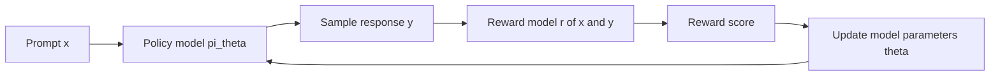
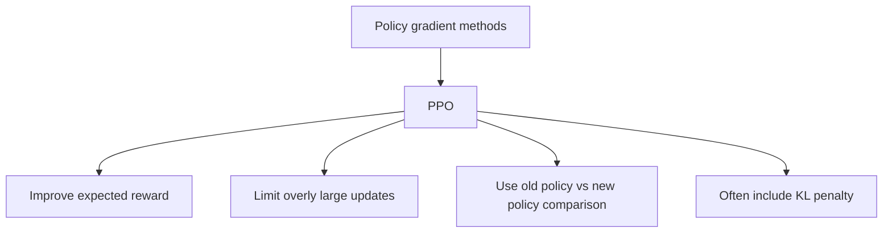
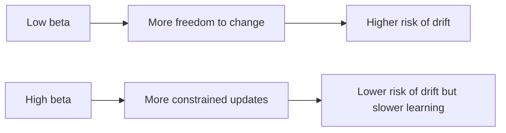
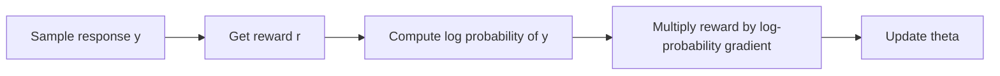
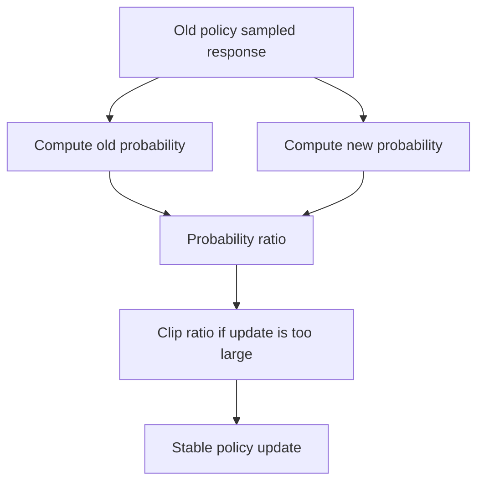
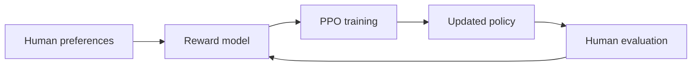
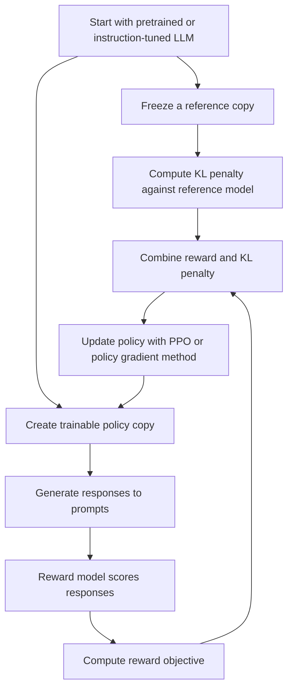

# Proximal Policy Optimization (PPO) and Policy Gradients — Beginner-Friendly Notes

## 1. Big Picture

This transcript introduces **policy gradient methods**, **PPO**, the **KL penalty**, and the **log-derivative trick** in the context of fine-tuning a language model with rewards.

In plain English:

> We have a language model that produces an answer.  
> A reward model scores that answer.  
> We update the language model so it becomes more likely to produce high-reward answers, while not drifting too far from the original model.

This is one common idea behind **RLHF**: Reinforcement Learning from Human Feedback.

---

## 2. Corrected Transcript Terminology

The transcript has a few rough or unclear phrases. Here are corrected versions.

| Transcript phrase | Better terminology | Meaning |
|---|---|---|
| `agent or large language model [LLM] with learnable parameters theta` | **Policy model** with parameters `theta` | The trainable LLM we are updating |
| `query x` | **Prompt / input** `x` | The user instruction or question |
| `response y` | **Generated completion / output** `y` | The model's answer |
| `query and response that is rollout` | **A rollout/sample** `(x, y)` | A sampled interaction from the model |
| `reward function encoder` | **Reward model** `r(x, y)` | A model/function that scores the response |
| `regulation term` | **Regularization term** | A constraint that prevents the model from changing too much |
| `reference model` | **Reference policy/model** `pi_ref` | Usually the original frozen model |
| `KL penalty coefficient beta` | **KL penalty strength** `beta` | Controls how strongly we penalize drift from the reference model |
| `estimate the reward for the pairs of inputs x and y` | **Score prompt-response pairs** | Compute how good the response is |
| `derive the sample response y from the given dataset` | **Sample response y from the current policy** | Generate an answer using the model |
| `convert the individual queries to an analytical distribution` | **Rewrite the expectation as a sum/integral over the policy distribution** | Make the math differentiable using the log-derivative trick |

---

## 3. The RLHF/PPO Setup

We start with:

- A prompt/query: `x`
- A trainable policy model: `pi_theta`
- A sampled response: `y`
- A reward model: `r(x, y)`
- A reference model: `pi_ref`
- A KL penalty coefficient: `beta`

The policy model generates responses. The reward model scores them. PPO/policy-gradient training changes the policy so better responses become more likely.



### Layman’s version

Imagine training a student:

1. You give the student a question.
2. The student writes an answer.
3. A grader gives a score.
4. The student adjusts their habits to write more answers like the high-scoring ones.
5. But you also prevent the student from becoming weird or over-optimized by comparing them to their original behavior.

That “don’t become too weird” part is where the **KL penalty** helps.

---

## 4. What Is a Policy?

In reinforcement learning, a **policy** is the thing that chooses actions.

For an LLM:

- The **state/input** is the prompt and previous tokens.
- The **action** is choosing the next token.
- The **policy** is the probability distribution over possible next tokens.

So when we write:

```text
pi_theta(y | x)
```

we mean:

> The probability that the model with parameters `theta` generates response `y` given prompt `x`.

---

## 5. What Are Policy Gradient Methods?

A **policy gradient method** updates the model by directly improving the policy.

The goal is to maximize expected reward:

```text
maximize E[ r(x, y) ]
where y is sampled from pi_theta(y | x)
```

In words:

> Make the model more likely to generate responses that receive high reward.

### Simple example

Prompt:

```text
Explain gravity to a 5-year-old.
```

Possible responses:

| Response | Reward |
|---|---:|
| `Gravity is a force that pulls things down.` | 0.8 |
| `Gravity is an advanced relativistic spacetime curvature phenomenon.` | 0.3 |
| `Bananas are blue.` | -0.5 |

Policy gradient training increases the probability of the first response and decreases the probability of worse responses.

---

## 6. Why PPO?

Plain policy gradient updates can be unstable.

The model might discover ways to get high reward that are not actually good, such as:

- Repeating phrases the reward model likes
- Becoming overly verbose
- Ignoring user intent
- Drifting far away from the original language model
- Exploiting reward model weaknesses

**PPO**, or **Proximal Policy Optimization**, is designed to make policy updates safer and more stable.

The word **proximal** means “nearby.”

So PPO roughly means:

> Improve the policy, but do not move it too far in one update.



---

## 7. The KL Penalty

### What is KL divergence?

**KL divergence** measures how different one probability distribution is from another.

For PPO/RLHF, we often compare:

- The current trainable model: `pi_theta`
- The reference/original model: `pi_ref`

If the current model becomes too different from the reference model, the KL penalty gets larger.

### Intuition

Imagine the original model is a careful writer.

The reward model may encourage the model to become more “reward-seeking,” but we do not want it to lose the general language ability it started with.

The KL penalty says:

> You can improve, but stay close to the original model’s behavior.

### Simplified objective

A common RLHF-style objective looks like this:

```text
maximize E[ r(x, y) - beta * KL(pi_theta || pi_ref) ]
```

Where:

- `r(x, y)` rewards good responses.
- `KL(pi_theta || pi_ref)` penalizes drifting away from the reference model.
- `beta` controls how strong the penalty is.

### What beta does

| Beta value | Effect |
|---:|---|
| Small beta | Model can change more aggressively |
| Large beta | Model is forced to stay closer to the reference model |
| Too small | May exploit the reward model or become unstable |
| Too large | May barely learn from rewards |



---

## 8. The Advantage Function

The transcript briefly mentions the **advantage function**.

An advantage answers:

> Was this action/response better than expected?

A reward by itself says how good the response was.  
An advantage compares that reward to a baseline.

```text
advantage = actual reward - expected/baseline reward
```

Example:

| Response reward | Baseline expected reward | Advantage |
|---:|---:|---:|
| 0.9 | 0.6 | +0.3 |
| 0.5 | 0.6 | -0.1 |
| 0.6 | 0.6 | 0.0 |

Positive advantage means:

> This response was better than expected. Make it more likely.

Negative advantage means:

> This response was worse than expected. Make it less likely.

---

## 9. Why the Log-Derivative Trick Is Needed

The transcript says it is hard to solve the optimization because we are sampling.

That is the key issue.

The model samples text. But sampling is not directly differentiable in the normal way.

Example:

```text
Prompt: "Tell me a joke."
Model samples: "Why did the chicken cross the road?"
Reward model gives: 0.7
```

We can compute a reward after the text is sampled, but the sampled words are discrete. We cannot directly backpropagate through the act of choosing tokens as if it were a smooth function.

The **log-derivative trick** helps us estimate gradients from samples.

---

## 10. The Log-Derivative Trick

Start with the expected reward:

```text
J(theta) = E_y~pi_theta [ r(y) ]
```

For a prompt-conditioned LLM:

```text
J(theta) = E_y~pi_theta(y | x) [ r(x, y) ]
```

The gradient is:

```text
grad_theta J(theta)
```

The log-derivative trick uses this identity:

```text
grad_theta pi_theta(y | x)
=
pi_theta(y | x) * grad_theta log pi_theta(y | x)
```

That allows us to rewrite the gradient as:

```text
grad_theta J(theta)
=
E_y~pi_theta [ r(x, y) * grad_theta log pi_theta(y | x) ]
```

### Layman’s version

Instead of asking:

> How do I differentiate the sampled text?

We ask:

> How do I change the probability of sampling this text next time?

If a sampled response gets high reward, increase its log-probability.

If a sampled response gets low reward, decrease its log-probability.



---

## 11. Gradient Ascent vs Gradient Descent

Most supervised learning uses **gradient descent**, where we minimize loss.

Policy gradient methods are often described as **gradient ascent**, where we maximize reward.

They are closely related.

| Goal | Method | Direction |
|---|---|---|
| Minimize loss | Gradient descent | Move downhill |
| Maximize reward | Gradient ascent | Move uphill |

If you want to use ordinary deep learning optimizers that minimize loss, you can convert reward maximization into loss minimization:

```text
loss = -reward_objective
```

Then minimizing `loss` is equivalent to maximizing reward.

---

## 12. PPO Compared with Basic Policy Gradient

| Concept | Basic policy gradient | PPO |
|---|---|---|
| Main goal | Increase expected reward | Increase reward safely |
| Stability | Can be unstable | More stable |
| Update size control | Weak or absent | Stronger |
| Uses old policy comparison | Not necessarily | Yes |
| Common in RLHF | Conceptually foundational | Very common historically |
| Risk | Large policy jumps | Reduced large jumps |

---

## 13. PyTorch-Shaped Pseudocode

This is not full production PPO code. It is simplified to show the shape of the idea.

```python
# Pseudocode only

policy = TrainableLLM()
reference_policy = FrozenOriginalLLM()
reward_model = FrozenRewardModel()

optimizer = torch.optim.AdamW(policy.parameters(), lr=learning_rate)

for batch in dataloader:
    prompts = batch["prompts"]

    # 1. Generate responses from the current policy
    responses = policy.generate(prompts, temperature=temperature)

    # 2. Score responses with the reward model
    rewards = reward_model.score(prompts, responses)

    # 3. Compute log probabilities under current policy
    logprobs_current = policy.log_prob(prompts, responses)

    # 4. Compute log probabilities under reference policy
    with torch.no_grad():
        logprobs_reference = reference_policy.log_prob(prompts, responses)

    # 5. Approximate KL penalty
    kl_penalty = logprobs_current - logprobs_reference

    # 6. Reward with KL regularization
    objective = rewards - beta * kl_penalty

    # 7. Convert maximization into minimization
    loss = -objective.mean()

    optimizer.zero_grad()
    loss.backward()
    optimizer.step()
```

### Important simplification

Real PPO usually includes:

- An old policy snapshot
- Probability ratios
- A clipped surrogate objective
- Value function estimates
- Advantage estimation
- Multiple mini-batch epochs
- Careful KL monitoring

The pseudocode above focuses on the transcript’s main ideas: reward maximization and KL regularization.

---

## 14. PPO-Style Clipped Objective, Simplified

Although the transcript says it only reviews the general policy gradient objective and KL penalty, PPO is famous for a **clipped surrogate objective**.

The key ratio is:

```text
ratio = pi_theta(y | x) / pi_old(y | x)
```

This compares:

- New policy probability
- Old policy probability

If the ratio gets too large or too small, PPO clips it.

```text
clipped_ratio = clamp(ratio, 1 - epsilon, 1 + epsilon)
```

### Layman’s version

PPO says:

> Do not let the new model become too much more or less likely to produce the sampled response in one update.



---

## 15. Temperature During Sampling

The transcript says to increase temperature to explore more options.

Temperature controls randomness during generation.

| Temperature | Behavior |
|---:|---|
| Low | More predictable, conservative responses |
| Medium | Balanced responses |
| High | More diverse, creative, risky responses |

In RLHF/PPO training, sampling with some randomness helps the model explore different possible responses. But too much randomness can generate noisy or low-quality samples.

---

## 16. Human Feedback and Reward Models

The transcript says to regularly evaluate using human feedback.

This matters because the reward model is only an approximation of human preference.

A reward model can be wrong.

For example, it might over-reward:

- Long answers
- Confident wording
- Certain phrases
- Overly polite but unhelpful responses

Human evaluation helps catch reward hacking.



---

## 17. End-to-End RLHF/PPO Mental Model



---

## 18. Common Beginner Confusions

### Confusion 1: Is PPO the same as RLHF?

No.

**RLHF** is the broader training process using human feedback.  
**PPO** is one possible optimization algorithm used inside RLHF.

```text
RLHF = overall process
PPO = one training algorithm that can be used in that process
```

---

### Confusion 2: Is the reward model the same as the policy model?

No.

| Model | Role |
|---|---|
| Policy model | Generates responses |
| Reward model | Scores responses |
| Reference model | Anchors the policy so it does not drift too far |

---

### Confusion 3: Why not just train on the highest-rated answers?

That would be closer to supervised fine-tuning.

Policy optimization is different because it updates the model based on the probability of sampled behavior and its reward.

In other words:

> PPO trains the model not just to imitate answers, but to change its response-generation behavior toward higher-reward outputs.

---

### Confusion 4: Why do we need a reference model?

Because optimizing only reward can make the model exploit the reward model.

The reference model acts like a behavioral anchor.

---

## 19. Tiny Numeric Example

Suppose the model generates three responses:

| Response | Current log probability | Reward | KL penalty | Final score |
|---|---:|---:|---:|---:|
| A | -1.2 | 0.9 | 0.1 | 0.8 |
| B | -0.8 | 0.5 | 0.1 | 0.4 |
| C | -2.0 | 0.7 | 0.5 | 0.2 |

Assume:

```text
beta = 1.0
final score = reward - beta * KL penalty
```

Response A has the best final score, so training should make A-like responses more likely.

Response C has decent reward but a large KL penalty, so it is less attractive because it drifted too far from the reference model.

---

## 20. Practical Training Tips

From the transcript, corrected and expanded:

1. **Regularly evaluate with humans**
   - Reward models can be fooled.
   - Human review helps catch quality regressions.

2. **Start with a moderate beta**
   - Too low: model may drift or reward-hack.
   - Too high: model may barely improve.

3. **Use temperature carefully**
   - Some exploration helps.
   - Too much randomness creates noisy samples.

4. **Monitor KL**
   - If KL grows too fast, the policy is moving too far from the reference model.

5. **Watch reward and quality separately**
   - Higher reward model score does not always mean better human-perceived quality.

---

## 21. Key Formulas

### Policy probability

```text
pi_theta(y | x)
```

The probability of response `y` given prompt `x`.

### Expected reward

```text
J(theta) = E_y~pi_theta(y | x) [ r(x, y) ]
```

The average reward we expect from the current policy.

### RLHF-style objective with KL penalty

```text
J(theta) = E_y~pi_theta(y | x) [ r(x, y) - beta * KL(pi_theta || pi_ref) ]
```

Improve reward while staying close to the reference model.

### Log-derivative trick

```text
grad_theta J(theta)
=
E_y~pi_theta [ r(x, y) * grad_theta log pi_theta(y | x) ]
```

This lets us estimate gradients using sampled responses.

### PPO probability ratio

```text
ratio = pi_theta(y | x) / pi_old(y | x)
```

Measures how much the new policy changed relative to the old policy.

---

## 22. Simple Analogy

Think of PPO like coaching a musician.

- The musician is the policy model.
- The song request is the prompt.
- The performance is the response.
- The judge’s score is the reward.
- The original style of the musician is the reference model.
- The KL penalty prevents the musician from completely abandoning their original skill/style just to please one judge.
- PPO makes improvements gradually instead of radically changing everything after one score.

---

## 23. Self-Check Questions

### Concept questions

1. What does the policy model do?
2. What does the reward model do?
3. Why do we keep a frozen reference model?
4. What does the KL penalty discourage?
5. What does beta control?
6. Why can plain policy gradients be unstable?
7. What does PPO try to prevent?
8. What does the log-derivative trick help us do?

### Applied questions

1. If reward increases but KL also increases sharply, what might be happening?
2. If beta is too large, what problem might occur?
3. If beta is too small, what problem might occur?
4. Why might human evaluation still be needed after reward-model training?
5. What is the difference between maximizing reward and minimizing loss?

### Short answers

<details>
<summary>Show answers</summary>

1. The policy model generates responses.
2. The reward model scores prompt-response pairs.
3. The reference model anchors the policy and helps prevent drift.
4. The KL penalty discourages the new model from becoming too different from the reference model.
5. Beta controls the strength of the KL penalty.
6. Plain policy gradients can make large unstable updates.
7. PPO tries to prevent overly large policy updates.
8. The log-derivative trick lets us estimate gradients from sampled responses.

Applied:

1. The model may be drifting or exploiting the reward model.
2. The model may learn too slowly or barely change.
3. The model may drift, become unstable, or reward-hack.
4. Reward models are imperfect and can be fooled.
5. Maximizing reward moves uphill; minimizing loss moves downhill. In code, reward maximization is often written as minimizing the negative objective.

</details>

---

## 24. One-Sentence Summary

**PPO fine-tunes a policy model by making high-reward responses more likely while using mechanisms like clipping and KL penalties to keep updates stable and prevent the model from drifting too far from its reference behavior.**
