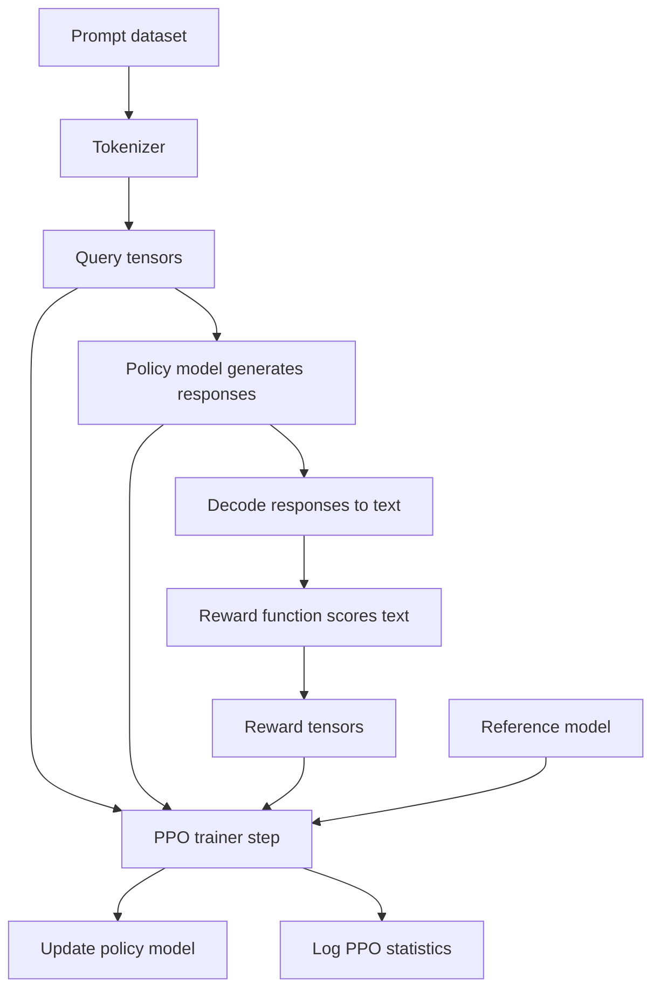
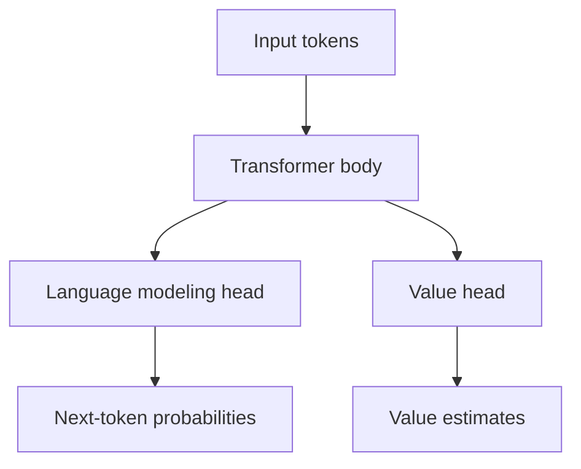
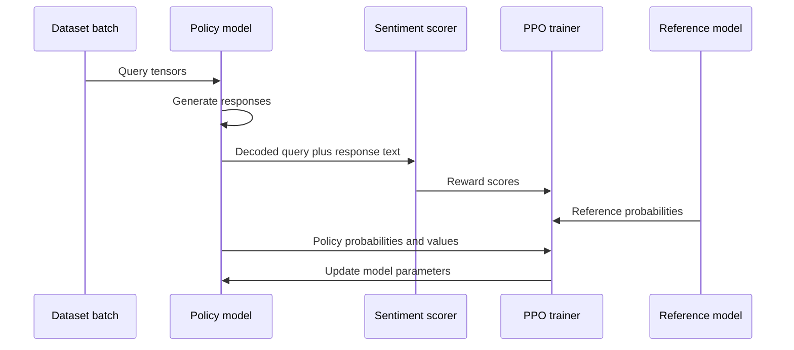
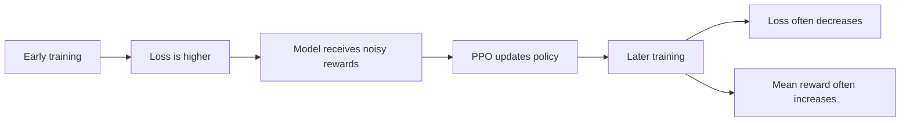

# PPO Trainer Beginner Notes

_Source transcript: `subtitle.txt`_

## 1. Big Picture

This transcript explains how **PPO training** can be used to fine-tune a language model so that it generates responses with a desired behavior, such as **more positive sentiment** or **more negative sentiment**.

In plain English:

> PPO is a reinforcement learning method that nudges a model toward outputs that receive higher rewards, while trying not to let the model drift too far away from the original model.

In this example, the reward comes from a **sentiment analysis model**:

- Positive response → higher reward for the positive model.
- Negative response → higher reward for the negative model.
- Neutral/original response → usually comes from the reference model.

---

## 2. Corrected Transcript Terminology

| Transcript wording | Corrected wording | Explanation |
|---|---|---|
| `collateral function` | `collator function` or `data collator` | A collator prepares examples into batches. |
| `list stats all` | `stats_all` or `all_stats` | A list that stores training statistics for each PPO batch. |
| `sentiment score change score` | likely `sentiment_score` or `score` | The transcript is describing reward selection based on sentiment score. |
| `setting related to objective equals true` | `related_to_objective=True` | Shows objective-related PPO metrics like losses. |
| `related to objects equals false` | `related_to_objective=False` | Shows other RL metrics like rewards and advantages. |
| `AutoModelForCausalLMWithValueHead` | `AutoModelForCausalLMWithValueHead` | Correct name. This is a causal language model plus a value head. |
| `PPO updates the model using KL divergence` | PPO uses a KL penalty/constraint while updating the policy | PPO does not only “update using KL.” KL helps keep the trained model close to the reference model. |

---

## 3. What Problem Is PPO Solving?

A normal language model is trained to predict the next token. That gives it general language ability.

But after pretraining or supervised fine-tuning, we may want to make the model behave in a certain way:

- Be more helpful.
- Be safer.
- Be more positive.
- Follow instructions better.
- Avoid toxic or unwanted outputs.

PPO lets us use a **reward signal** to push the model toward preferred behavior.

Simple analogy:

> Imagine a student writes answers. A teacher gives each answer a score. PPO helps the student improve based on those scores, but also prevents the student from becoming too weird compared with their original writing style.

---

## 4. Main PPO Components

| Component | Simple meaning | In this transcript |
|---|---|---|
| Policy model | The model being trained | Generates responses and gets updated |
| Reference model | Frozen original model | Used to prevent excessive drift |
| Reward model or reward function | Scores outputs | Sentiment analysis pipeline |
| PPO trainer | Training controller | Runs generation, reward scoring, and PPO updates |
| Tokenizer | Converts text to token IDs | Prepares queries and decodes responses |
| Dataset | Training prompts | Provides input queries |
| Data collator | Batch formatter | Groups examples into usable batches |

---

## 5. Policy Model vs Reference Model

The **policy model** is the model being trained.

The **reference model** is usually a frozen copy of the original model. It is not trained during PPO. Instead, it acts like an anchor.

Why use a reference model?

Because without an anchor, the policy model may learn to exploit the reward model in strange ways.

For example, if the model is rewarded for positive sentiment, it might start generating repetitive responses like:

> great great great great great great

That may score as positive, but it is not useful. The KL penalty helps reduce this kind of drift.

---

## 6. Mermaid Diagram: PPO Training Loop



---

## 7. What Is KL Divergence Doing Here?

**KL divergence** measures how different two probability distributions are.

In PPO fine-tuning, we compare:

- The current policy model's output probabilities.
- The reference model's output probabilities.

If the policy model becomes too different from the reference model, the KL penalty increases.

Plain English:

> KL divergence is like a “do not wander too far from the original model” warning signal.

Formula idea:

```text
Final PPO objective ≈ reward - penalty_for_drifting_too_far
```

So the model is encouraged to get high reward, but not by becoming unstable or bizarre.

---

## 8. Why Add a Value Head?

The transcript mentions:

```python
AutoModelForCausalLMWithValueHead
```

This means:

> Take a normal causal language model and add a small extra head that estimates the value of generated tokens or responses.

A normal causal language model predicts the next token.

A PPO model needs two things:

1. **Policy output**: What token should I generate?
2. **Value estimate**: How good do I expect this state or response to be?

The value head helps PPO estimate whether the model did better or worse than expected.

---

## 9. Mermaid Diagram: Causal LM With Value Head



The transformer body is shared. The model produces both token predictions and value estimates.

---

## 10. What Does the Data Collator Do?

The transcript says the collator prepares data batches.

A **data collator** takes individual examples and combines them into a batch.

Example individual samples:

```python
sample_1 = {"query": "I had a bad day"}
sample_2 = {"query": "I failed my test"}
sample_3 = {"query": "I lost my keys"}
```

A collator may turn them into:

```python
batch = {
    "query": [
        "I had a bad day",
        "I failed my test",
        "I lost my keys",
    ],
    "input_ids": tensor([...]),
    "attention_mask": tensor([...]),
}
```

Simple analogy:

> The dataset gives you individual lunch orders. The collator packs several orders into one delivery box so the model can process them together.

---

## 11. PPO Training Loop in Plain English

For each batch:

1. Take prompts from the dataset.
2. Tokenize the prompts.
3. Use the current policy model to generate responses.
4. Decode the generated tokens into text.
5. Combine each prompt and response.
6. Score the combined text using a sentiment classifier.
7. Convert sentiment scores into reward tensors.
8. Run a PPO update using:
   - queries,
   - responses,
   - rewards.
9. Log the training statistics.
10. Repeat.

---

## 12. Mermaid Diagram: One PPO Batch



---

## 13. PyTorch-Shaped Pseudocode

This is not exact runnable code. It is shaped like PyTorch/Hugging Face code so the training logic is easier to understand.

```python
from trl import PPOConfig, PPOTrainer
from trl import AutoModelForCausalLMWithValueHead
from transformers import AutoTokenizer, pipeline
import torch

model_name = "some-causal-lm"

config = PPOConfig(
    model_name=model_name,
    learning_rate=1.4e-5,
)

tokenizer = AutoTokenizer.from_pretrained(model_name)

policy_model = AutoModelForCausalLMWithValueHead.from_pretrained(model_name)

reference_model = AutoModelForCausalLMWithValueHead.from_pretrained(model_name)
reference_model.eval()

sentiment_pipe = pipeline("sentiment-analysis")

ppo_trainer = PPOTrainer(
    config=config,
    model=policy_model,
    ref_model=reference_model,
    tokenizer=tokenizer,
    dataset=dataset,
    data_collator=data_collator,
)

all_stats = []

for batch in ppo_trainer.dataloader:
    query_tensors = batch["input_ids"]

    response_tensors = []

    for query_tensor in query_tensors:
        response_tensor = ppo_trainer.generate(
            query_tensor,
            max_new_tokens=32,
        )

        response_tensors.append(response_tensor)

    batch["response"] = tokenizer.batch_decode(
        response_tensors,
        skip_special_tokens=True,
    )

    texts = [
        query + response
        for query, response in zip(batch["query"], batch["response"])
    ]

    sentiment_outputs = sentiment_pipe(texts)

    rewards = []

    for output in sentiment_outputs:
        score = output["score"]

        if output["label"] == "POSITIVE":
            reward = score
        else:
            reward = -score

        rewards.append(torch.tensor(reward))

    stats = ppo_trainer.step(
        query_tensors,
        response_tensors,
        rewards,
    )

    ppo_trainer.log_stats(stats, batch, rewards)
    all_stats.append(stats)
```

---

## 14. Positive Model vs Negative Model

The transcript describes training two models:

| Model | Reward setup | Expected behavior |
|---|---|---|
| Model 1 | Reward positive sentiment | Generates more positive responses |
| Model 0 | Reward negative sentiment | Generates more negative responses |
| Reference model | No PPO sentiment fine-tuning | Generates more neutral/default responses |

Example prompt:

```text
I am worried about tomorrow.
```

Possible outputs:

| Model | Possible response |
|---|---|
| Positive PPO model | `Tomorrow could be a chance to improve. You can prepare one step at a time.` |
| Negative PPO model | `Tomorrow will probably be stressful and difficult.` |
| Reference model | `It is normal to feel worried about tomorrow.` |

The point is not that one model is universally better. The point is that PPO can push model behavior toward a reward.

---

## 15. Important Warning: Reward Hacking

A model can learn to exploit a reward function.

If the reward is “positive sentiment,” the model might learn that saying lots of positive words gets a high score.

Bad generated response:

```text
Amazing wonderful fantastic great excellent perfect happy happy happy.
```

This might score as positive, but it is low quality.

That is why PPO commonly uses:

- KL penalty,
- reference model,
- careful reward design,
- human evaluation,
- safety checks.

---

## 16. What Are PPO Statistics?

The transcript says `all_stats` stores statistics for each batch.

Common PPO statistics may include:

| Statistic | Meaning |
|---|---|
| Reward | How good the output was according to the reward model |
| Policy loss | How much the policy update is changing generation behavior |
| Value loss | How well the value head predicts expected reward |
| KL divergence | How far the policy model moved from the reference model |
| Entropy | How random or diverse the model output distribution is |
| Advantage | How much better or worse the output was than expected |

---

## 17. Objective Metrics vs Other RL Metrics

The transcript mentions a function for displaying values where `related_to_objective=True` or `False`.

A cleaner interpretation:

### Objective-related metrics

These are directly tied to optimization:

- policy loss,
- value loss,
- total loss,
- KL penalty.

### Other reinforcement learning metrics

These help diagnose training:

- rewards,
- advantages,
- returns,
- response length,
- KL trend,
- entropy.

Simple distinction:

> Objective metrics tell you what the optimizer is directly minimizing or maximizing. Diagnostic metrics help you understand what is happening during training.

---

## 18. Expected Training Curves

The transcript says:

- PPO loss decreases over time.
- PPO mean reward increases over time.

That is the ideal pattern.



But in real training, curves may be noisy.

A reward curve can increase while quality gets worse if the model is exploiting the reward model.

So always inspect actual generations, not only graphs.

---

## 19. Why You Cannot Use a Normal Text Generation Pipeline

The transcript says:

> You cannot use the text generation pipeline with the `AutoModelForCausalLMWithValueHead` class.

Reason:

A Hugging Face text generation pipeline expects a standard causal language model interface.

`AutoModelForCausalLMWithValueHead` wraps the model with an extra value head for reinforcement learning. This can make it incompatible with some standard generation pipeline assumptions.

Instead, you usually call generation directly from the model or PPO trainer.

---

## 20. Simple End-to-End Example

Imagine your prompt dataset contains complaints:

```text
I failed my exam.
My laptop broke.
I lost my wallet.
I feel nervous about work.
```

You want a chatbot that responds positively and supportively.

The PPO loop does this:

1. Model generates a response.
2. Sentiment classifier scores it.
3. Positive response gets high reward.
4. PPO updates the model so similar responses become more likely.
5. KL penalty keeps it close to the original model.

After training, the model may learn to respond with more supportive language.

Before PPO:

```text
That sounds unfortunate.
```

After PPO for positive sentiment:

```text
That sounds tough, but you can recover from this one step at a time.
```

---

## 21. Comparison: Supervised Fine-Tuning vs PPO

| Feature | Supervised fine-tuning | PPO fine-tuning |
|---|---|---|
| Learns from | Example input-output pairs | Rewards from generated outputs |
| Training signal | Correct target text | Reward score |
| Model generates during training? | Usually no, uses target labels | Yes |
| Common use | Teach format or task behavior | Optimize preferences or alignment |
| Risk | Overfits demonstrations | Reward hacking or instability |
| Needs reference model? | Usually no | Commonly yes |

Simple explanation:

> Supervised fine-tuning says, “Copy examples like this.” PPO says, “Try an answer, get a score, and adjust.”

---

## 22. Comparison: Reward Model vs Reference Model

| Model | Job |
|---|---|
| Reward model | Scores whether an output is good |
| Reference model | Anchors the policy so it does not drift too far |
| Policy model | Generates responses and gets trained |

They are easy to confuse because they are all “models,” but they have different jobs.

---

## 23. Mental Model

Think of PPO training like training a dog with treats, but with a leash.

- The **reward model** gives the treat.
- The **policy model** is the dog learning behavior.
- The **reference model plus KL penalty** is the leash.
- The **PPO trainer** is the training process.

Without treats, there is no learning signal.

Without the leash, the model may run off in a strange direction.

---

## 24. Common Beginner Mistakes

### Mistake 1: Thinking PPO directly teaches “truth”

PPO only optimizes the reward signal you give it.

If the reward signal is bad, the model can learn bad behavior.

### Mistake 2: Thinking higher reward always means better model

Higher reward means the model is better according to the reward model.

That may or may not match human judgment.

### Mistake 3: Ignoring the reference model

The reference model is important because it keeps the trained model grounded.

### Mistake 4: Using sentiment as if it equals helpfulness

Positive sentiment is not the same as helpfulness.

A response can be positive but useless.

Example:

```text
Everything is amazing!
```

That is positive, but not necessarily helpful.

---

## 25. Minimal Conceptual PPO Formula

A simplified PPO objective looks like this:

```text
Better policy = maximize reward while limiting how much the policy changes
```

Another simplified version:

```text
PPO goal = high reward + stable updates + limited drift from old behavior
```

In RLHF-style language model training:

```text
Good update = generate preferred responses without moving too far from the reference model
```

---

## 26. Self-Check Questions

### Concept Questions

1. What is the difference between the policy model and the reference model?
2. Why does PPO use a reward signal?
3. What does the data collator do?
4. Why is KL divergence useful during PPO training?
5. What can go wrong if the reward model is too simple?

### Applied Questions

1. If a model is rewarded only for positive sentiment, what bad behavior might it learn?
2. Why should you inspect generated text instead of only looking at reward curves?
3. What would happen if the KL penalty were too weak?
4. What would happen if the KL penalty were too strong?
5. Why might a neutral reference model be useful when training a positive sentiment model?

### Code Understanding Questions

1. Why do we decode generated token IDs back into text before scoring sentiment?
2. Why are rewards converted into tensors?
3. What is stored in `all_stats`?
4. Why does PPO need both response tensors and reward tensors?
5. Why might `AutoModelForCausalLMWithValueHead` not work with a normal text generation pipeline?

---

## 27. Answers to Self-Check Questions

### Concept Answers

1. The policy model is trained. The reference model is usually frozen and used as an anchor.
2. PPO needs a reward signal to know which generated outputs are better.
3. The data collator groups individual examples into batches.
4. KL divergence discourages the policy model from drifting too far from the reference model.
5. The model may exploit the reward model, producing outputs that score well but are not actually useful.

### Applied Answers

1. It might generate repetitive or shallow positive phrases.
2. Reward curves can improve even when real output quality gets worse.
3. The model may drift too far and become unstable or weird.
4. The model may barely learn because updates are overly restricted.
5. It gives a baseline behavior that helps keep the fine-tuned model grounded.

### Code Answers

1. Sentiment classifiers usually score text, not raw token IDs.
2. PPO training expects tensor values for computation.
3. Training statistics such as losses, rewards, KL, and advantages.
4. PPO needs to know what the model generated and how good those generations were.
5. The value-head wrapper may not match the expected interface of a standard text generation pipeline.

---

## 28. Key Takeaways

- PPO is a reinforcement learning method used to optimize model behavior using rewards.
- In this transcript, sentiment analysis provides the reward signal.
- The policy model is trained; the reference model is used as an anchor.
- KL divergence helps prevent the model from drifting too far.
- A data collator prepares batches for training.
- `AutoModelForCausalLMWithValueHead` adds value prediction to a normal causal language model.
- PPO statistics help diagnose training progress.
- Higher reward does not automatically mean better human-perceived quality.
- Always inspect generated outputs, not just loss and reward graphs.
