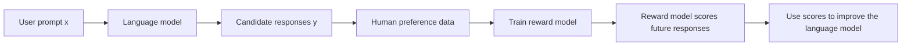
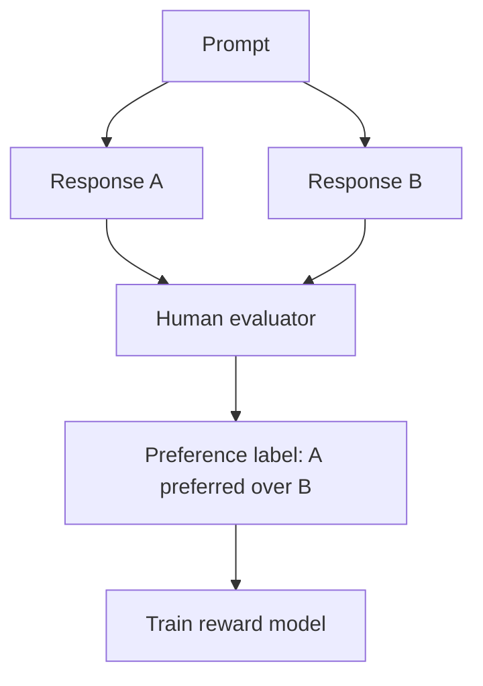
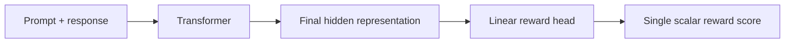
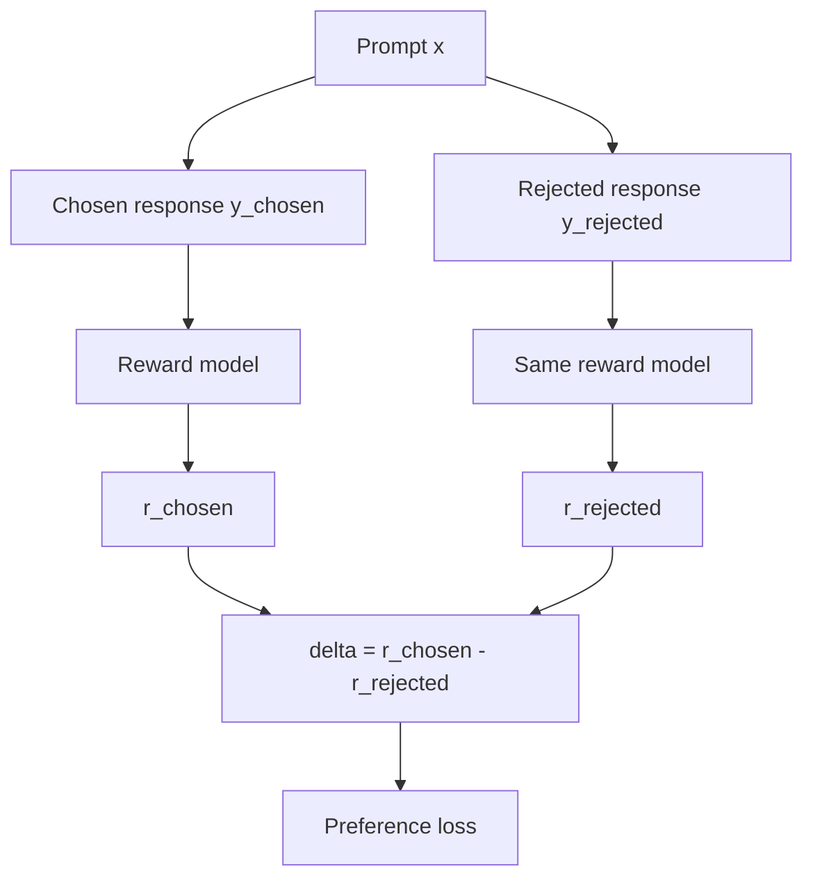
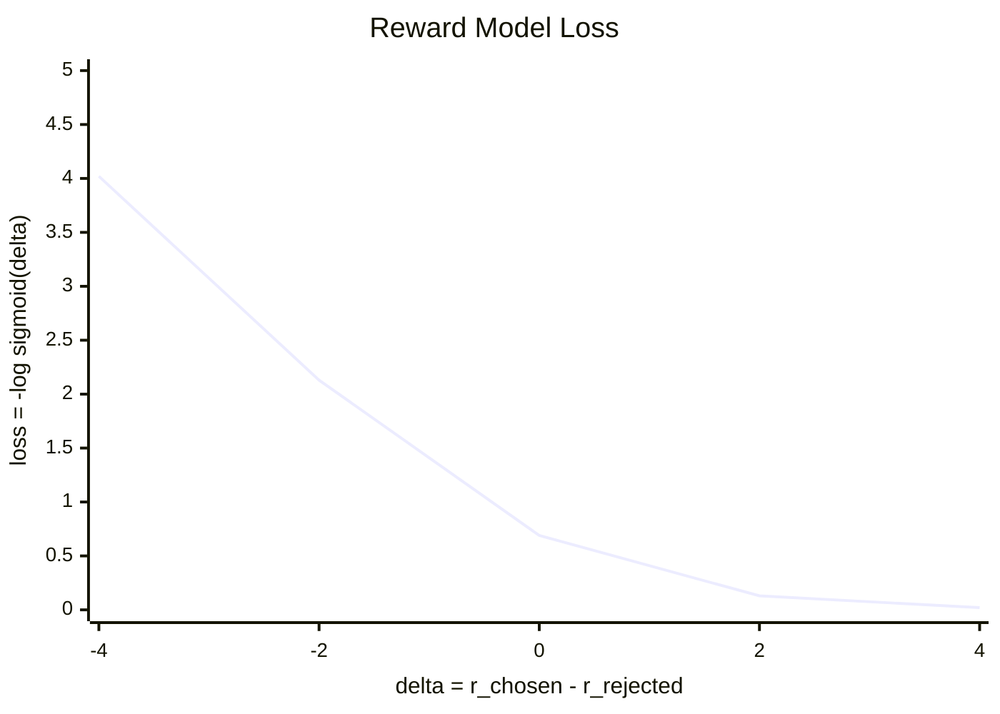
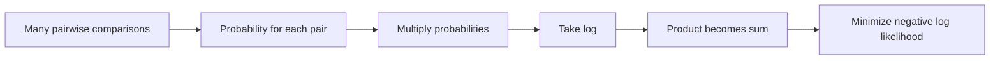
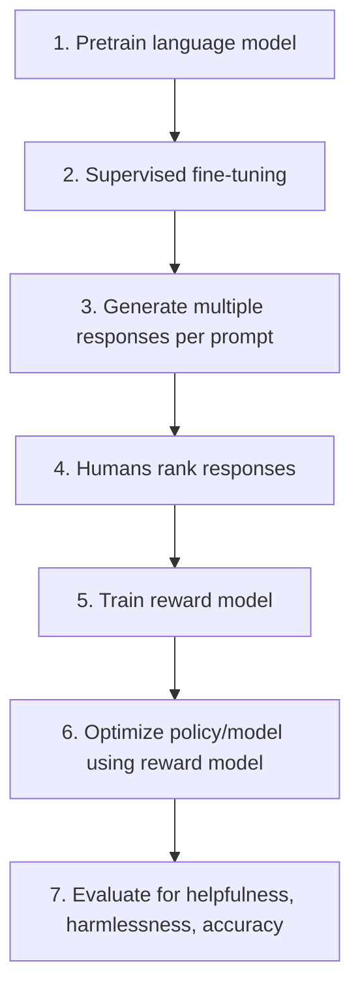
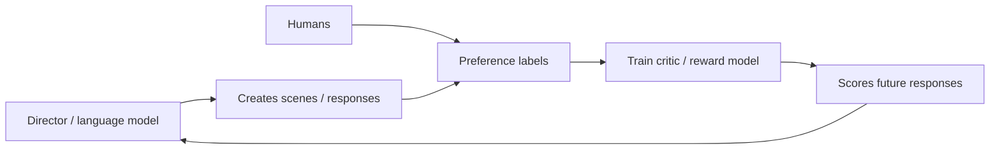

# Reward Model Training — Beginner-Friendly Notes

> Source: `subtitle.txt` transcript on reward model training.

## 1. Big Picture

A **reward model** is a model that reads:

- a user query / prompt
- a model response

and outputs **one scalar score** saying how good that response is.

In reinforcement learning from human feedback (**RLHF**), the reward model acts like a learned judge. Instead of asking humans to score every new model output forever, we train a model to imitate human preferences.



Layman’s version:

> Humans teach a “judge model” which answers:  
> “Between these responses, which one is better?”  
> Later, that judge helps train the chatbot to produce better answers.

---

## 2. Corrected Transcript Terminology

The transcript contains a few phrases that are understandable but imprecise. Here are cleaner versions.

| Transcript wording | Better wording | Why |
|---|---|---|
| “Reward model loss is a discrepancy between predicted responses and their scores...” | Reward model loss measures whether the model gives a higher score to the human-preferred response than to the rejected response. | Reward models usually do **not** predict the response itself. They score responses. |
| “Actual response and score received from the modeled environment or system” | Human preference label, such as “response A is preferred over response B.” | In RLHF reward modeling, the label often comes from humans ranking responses, not from an environment. |
| “Humans assign scores” | Humans often compare or rank responses instead of assigning exact scores. | Pairwise preferences are easier and more reliable than exact numerical scores. |
| “A decoder model like BERT” | BERT is an **encoder-only** transformer. GPT is a **decoder-only** transformer. | BERT and GPT are different transformer families. |
| “Bidirectional representation of transformers” | **Bidirectional Encoder Representations from Transformers** | Correct expansion of BERT. |
| “denotated as Za” | denoted as `z_a` or `r(x, y_a)` | “Denoted” is the standard term. |
| “negative sigmoid loss” | Usually **negative log-sigmoid loss**: `-log σ(r_chosen - r_rejected)` | The common Bradley–Terry / preference loss uses the log. |
| “the law should decrease” | the **loss** should decrease | Obvious transcript error. |
| “finding optimal parameter value ϕ minimizes the difference” | finding optimal parameters `ϕ` minimizes the loss and usually increases the reward gap for preferred responses | We do not want to minimize the reward difference itself. |

---

## 3. What Problem Is Reward Modeling Solving?

Suppose a chatbot answers a prompt in two different ways.

**Prompt**

> Explain gravity to a child.

**Response A**

> Gravity is the invisible pull that keeps your feet on the ground and makes a ball fall when you drop it.

**Response B**

> Gravity is because planets like things and want them nearby.

Most humans would prefer **Response A**. It is clearer and more accurate.

The reward model should learn:

```text
reward(prompt, Response A) > reward(prompt, Response B)
```

The exact score does not matter as much as the **ordering**.

---

## 4. Why Use Rankings Instead of Exact Scores?

Humans are usually better at comparisons than exact scoring.

It is hard to answer:

> Is this response a 7.3 or an 8.1?

It is easier to answer:

> Which response is better, A or B?

That is why reward model training often uses **pairwise preference data**.



---

## 5. Core Notation

The transcript uses notation like:

```text
r_ϕ(x, y)
```

Meaning:

| Symbol | Meaning |
|---|---|
| `x` | the query, prompt, or instruction |
| `y` | a response |
| `y_a` | preferred / chosen / better response |
| `y_b` | rejected / worse response |
| `r_ϕ(x, y)` | reward model score for response `y` given prompt `x` |
| `ϕ` | trainable reward model parameters |
| `z_a` | scalar reward score for the preferred response |
| `z_b` | scalar reward score for the rejected response |

So:

```text
z_a = r_ϕ(x, y_a)
z_b = r_ϕ(x, y_b)
```

The training goal is:

```text
z_a > z_b
```

---

## 6. What Does the Reward Model Actually Output?

A reward model usually outputs **one number**.

Example:

| Prompt | Response | Reward score |
|---|---|---:|
| “Explain gravity to a child.” | Good explanation | `2.7` |
| “Explain gravity to a child.” | Bad explanation | `-0.8` |

The numbers are not absolute truth. They are useful because their **relative order** says which response the model prefers.



For a BERT-style encoder reward model, the input might look like:

```text
[CLS] prompt tokens [SEP] response tokens [SEP]
```

The model uses the final hidden state of `[CLS]` or another pooled representation, then passes it through a small linear layer:

```text
hidden_size -> 1
```

For example, if the hidden size is 768:

```text
Linear(768, 1)
```

This produces one scalar reward.

---

## 7. Encoder vs Decoder Reward Models

The transcript mentions BERT and GPT. Here is the clean distinction.

| Model family | Architecture type | Common reward-model usage |
|---|---|---|
| BERT | Encoder-only | Good for scoring complete prompt-response pairs with bidirectional attention |
| RoBERTa / DeBERTa | Encoder-only | Similar to BERT, often strong for classification/scoring |
| GPT-style models | Decoder-only | Can also be adapted into reward models by adding a scalar head, often using the final token representation |
| T5 | Encoder-decoder | Less common as a reward model, but possible |

Important correction:

> BERT is not a decoder model.  
> BERT is an encoder-only transformer.

---

## 8. Pairwise Reward Model Training

For each training example, we have:

```text
prompt x
chosen response y_chosen
rejected response y_rejected
```

The reward model computes:

```text
r_chosen = reward_model(x, y_chosen)
r_rejected = reward_model(x, y_rejected)
```

Then we compute the reward gap:

```text
delta = r_chosen - r_rejected
```

We want `delta` to be large and positive.



The two reward-model boxes represent the **same model with shared parameters**, run on two different prompt-response pairs.

---

## 9. The Bradley–Terry Preference Model

The **Bradley–Terry model** turns the reward difference into a probability.

```text
P(chosen preferred over rejected) = σ(r_chosen - r_rejected)
```

Where `σ` is the sigmoid function:

```text
σ(t) = 1 / (1 + exp(-t))
```

### Intuition

If:

```text
r_chosen - r_rejected = large positive number
```

then:

```text
σ(delta) ≈ 1
```

Meaning:

> The reward model strongly believes the chosen response is better.

If:

```text
r_chosen - r_rejected = 0
```

then:

```text
σ(delta) = 0.5
```

Meaning:

> The model is unsure.

If:

```text
r_chosen - r_rejected = negative number
```

then:

```text
σ(delta) < 0.5
```

Meaning:

> The model is incorrectly scoring the rejected response higher.

---

## 10. Reward Model Loss

The standard pairwise reward model loss is:

```text
loss = -log σ(r_chosen - r_rejected)
```

Equivalently:

```text
loss = -log σ(delta)
```

Where:

```text
delta = r_chosen - r_rejected
```

### What happens as delta changes?

| `r_chosen` | `r_rejected` | `delta` | Meaning | Loss behavior |
|---:|---:|---:|---|---|
| `3.0` | `0.5` | `2.5` | chosen clearly scored higher | low loss |
| `1.0` | `1.0` | `0.0` | model is unsure | medium loss |
| `0.2` | `2.0` | `-1.8` | rejected scored higher | high loss |

The model is rewarded for making this true:

```text
r_chosen > r_rejected
```

It is penalized when this happens:

```text
r_chosen <= r_rejected
```

---

## 11. Visual Intuition for the Loss



As `delta` increases, the loss decreases.

Layman’s version:

> The more confidently the reward model scores the better answer above the worse answer, the happier the loss function is.

---

## 12. Why Use `log`?

Without the log, we might try to maximize:

```text
σ(delta_1) * σ(delta_2) * σ(delta_3) * ...
```

That product can become tiny and hard to work with.

Using log turns products into sums:

```text
log(a * b * c) = log(a) + log(b) + log(c)
```

So the training objective becomes easier and numerically safer:

```text
loss = -sum log σ(r_chosen_i - r_rejected_i)
```

This is called **negative log likelihood**.



---

## 13. Tiny Numeric Example

Imagine one prompt with two responses.

```text
Prompt: "What is photosynthesis?"
Chosen response: accurate explanation
Rejected response: nonsense answer
```

The reward model currently outputs:

```text
r_chosen = 1.2
r_rejected = 0.4
```

Then:

```text
delta = 1.2 - 0.4 = 0.8
```

Sigmoid:

```text
σ(0.8) ≈ 0.69
```

Loss:

```text
loss = -log(0.69) ≈ 0.37
```

That is decent, because the chosen response is scored higher.

Now imagine the model gets it backward:

```text
r_chosen = 0.2
r_rejected = 1.4
```

Then:

```text
delta = 0.2 - 1.4 = -1.2
σ(-1.2) ≈ 0.23
loss = -log(0.23) ≈ 1.47
```

Higher loss means the model made a worse ranking mistake.

---

## 14. PyTorch-Shaped Pseudocode

This is not meant to be copy-paste production code. It shows the shape of reward model training.

```python
import torch
import torch.nn as nn
import torch.nn.functional as F

class RewardModel(nn.Module):
    def __init__(self, transformer, hidden_size: int):
        super().__init__()
        self.transformer = transformer
        self.reward_head = nn.Linear(hidden_size, 1)

    def forward(self, input_ids, attention_mask):
        outputs = self.transformer(
            input_ids=input_ids,
            attention_mask=attention_mask,
        )

        # Encoder-style example:
        # use the [CLS] token hidden state as the summary representation.
        cls_hidden = outputs.last_hidden_state[:, 0, :]

        reward = self.reward_head(cls_hidden)

        # Shape: [batch_size]
        return reward.squeeze(-1)


def reward_model_loss(
    model,
    chosen_input_ids,
    chosen_attention_mask,
    rejected_input_ids,
    rejected_attention_mask,
):
    r_chosen = model(chosen_input_ids, chosen_attention_mask)
    r_rejected = model(rejected_input_ids, rejected_attention_mask)

    delta = r_chosen - r_rejected

    # -log(sigmoid(delta))
    loss = -F.logsigmoid(delta).mean()

    return loss
```

### Shape intuition

If batch size is 4:

```text
r_chosen   shape: [4]
r_rejected shape: [4]
delta      shape: [4]
loss       shape: scalar
```

Each item in the batch is one pairwise comparison.

---

## 15. Decoder-Only Reward Model Pseudocode

For a GPT-style reward model, we usually feed the prompt and response together and use a final-token representation.

```python
class DecoderRewardModel(nn.Module):
    def __init__(self, decoder_model, hidden_size: int):
        super().__init__()
        self.decoder_model = decoder_model
        self.reward_head = nn.Linear(hidden_size, 1)

    def forward(self, input_ids, attention_mask):
        outputs = self.decoder_model(
            input_ids=input_ids,
            attention_mask=attention_mask,
        )

        hidden_states = outputs.last_hidden_state

        # Find the last non-padding token for each sequence.
        lengths = attention_mask.sum(dim=1) - 1
        batch_indices = torch.arange(input_ids.size(0), device=input_ids.device)

        final_token_hidden = hidden_states[batch_indices, lengths]

        reward = self.reward_head(final_token_hidden)
        return reward.squeeze(-1)
```

The core loss is the same:

```python
loss = -F.logsigmoid(r_chosen - r_rejected).mean()
```

---

## 16. How This Fits Into RLHF

Reward modeling is usually one middle step in a larger RLHF-style pipeline.



Simplified version:

1. Train a language model to generate text.
2. Ask it to generate several answers.
3. Humans rank those answers.
4. Train a reward model to predict the rankings.
5. Use that reward model to improve the language model.

---

## 17. Reward Model vs Classifier

A reward model is similar to a classifier, but not exactly the same.

| Feature | Classifier | Reward model |
|---|---|---|
| Output | class probabilities | scalar reward score |
| Example output | “positive sentiment: 91%” | `reward = 2.3` |
| Training label | class label | preference comparison or ranking |
| Goal | choose correct category | score better responses higher |
| Common head | linear layer to `num_classes` | linear layer to `1` |

A reward model can be viewed as a **scoring model**.

---

## 18. Reward Model vs Language Model

| Question | Language model | Reward model |
|---|---|---|
| What does it generate? | text tokens | usually no text |
| What does it output? | probability distribution over vocabulary | one scalar score |
| What is it trained to do? | predict/generate text | judge response quality |
| Example | “The next word is probably...” | “This answer is better than that answer.” |

Layman’s version:

> The language model is the writer.  
> The reward model is the judge.

---

## 19. Common Beginner Confusions

### Confusion 1: Does the reward model generate the better response?

Usually, no.

The reward model scores responses. The language model generates responses.

### Confusion 2: Are the reward scores absolute?

Not really.

A reward score of `3.0` does not mean “objectively 3 units good.” The score is mostly useful compared to another score.

### Confusion 3: Why not just ask humans for scores?

Because exact scores are noisy. Ranking two responses is easier and more consistent.

### Confusion 4: Is `ϕ` the same as the response?

No.

`ϕ` represents the reward model’s trainable parameters: weights and biases.

### Confusion 5: Is BERT a decoder?

No.

BERT is an encoder-only transformer. GPT-style models are decoder-only.

---

## 20. Minimal Training Loop Pseudocode

```python
model = RewardModel(transformer, hidden_size=768)
optimizer = torch.optim.AdamW(model.parameters(), lr=1e-5)

for batch in dataloader:
    chosen_input_ids = batch["chosen_input_ids"]
    chosen_attention_mask = batch["chosen_attention_mask"]

    rejected_input_ids = batch["rejected_input_ids"]
    rejected_attention_mask = batch["rejected_attention_mask"]

    loss = reward_model_loss(
        model,
        chosen_input_ids,
        chosen_attention_mask,
        rejected_input_ids,
        rejected_attention_mask,
    )

    optimizer.zero_grad()
    loss.backward()
    optimizer.step()
```

What this loop does:

1. Scores the chosen response.
2. Scores the rejected response.
3. Computes the gap.
4. Penalizes the model if the gap is too small or negative.
5. Updates model weights.

---

## 21. Simple Dataset Format

A pairwise preference dataset might look like this:

```json
{
  "prompt": "Explain recursion simply.",
  "chosen": "Recursion is when a function solves a problem by calling itself on smaller versions of the same problem.",
  "rejected": "Recursion is when code goes around in circles forever."
}
```

During tokenization, we create two inputs:

```text
chosen input:
[prompt] + [chosen response]

rejected input:
[prompt] + [rejected response]
```

Both are passed through the same reward model.

---

## 22. Practical Notes

### Good reward model training needs good preference data

The reward model can only learn what the labels teach it. If human rankings are inconsistent or biased, the reward model can learn those issues.

### Reward models can be gamed

A language model trained against a reward model may learn to exploit the reward model instead of actually becoming better. This is one reason RLHF systems need careful evaluation.

### Reward score is not the same as truth

A high reward score means the reward model predicts humans would prefer the response. It does not guarantee the response is correct.

### Pairwise loss does not require exact human scores

The model learns from comparisons:

```text
chosen > rejected
```

not from exact labels like:

```text
chosen = 9.1
rejected = 4.2
```

---

## 23. One-Screen Summary

A reward model learns to score responses.

For each training example:

```text
prompt x
chosen response y_c
rejected response y_r
```

The reward model outputs:

```text
r_c = r_ϕ(x, y_c)
r_r = r_ϕ(x, y_r)
```

The goal is:

```text
r_c > r_r
```

The reward gap is:

```text
delta = r_c - r_r
```

The common loss is:

```text
loss = -log σ(delta)
```

If the chosen response receives a much higher reward than the rejected response, the loss is small.

---

## 24. Self-Check Questions

### Conceptual

1. What does a reward model output?
2. Why are pairwise rankings often easier than exact numerical scores?
3. What is the difference between a language model and a reward model?
4. What does `r_ϕ(x, y)` mean?
5. Why do we want `r_chosen - r_rejected` to be positive?

### Architecture

6. Why might an encoder-only model like BERT be useful for reward modeling?
7. Why can a decoder-only model like GPT also be used as a reward model?
8. What does the final linear reward head output?
9. If the transformer hidden size is 768, what shape might the reward head have?
10. Is BERT encoder-only or decoder-only?

### Loss Function

11. What does the sigmoid function do to the reward difference?
12. What happens to the loss when `r_chosen` is much greater than `r_rejected`?
13. What happens to the loss when the rejected response gets a higher score?
14. Why is `-log σ(delta)` used instead of just `σ(delta)`?
15. What does negative log likelihood mean in this context?

---

## 25. Answers to Self-Check Questions

1. One scalar score representing predicted response quality.
2. Humans are usually more consistent at choosing the better of two options than assigning exact scores.
3. A language model generates text; a reward model scores text.
4. The reward score given by a model with parameters `ϕ` for prompt `x` and response `y`.
5. Because the chosen response should receive a higher score than the rejected response.
6. It can read the full prompt-response pair with bidirectional attention and produce a useful scoring representation.
7. A GPT-style model can process the full prompt-response text and use the final hidden state to predict a scalar reward.
8. One number.
9. `Linear(768, 1)`.
10. BERT is encoder-only.
11. It turns the reward difference into a probability-like value between 0 and 1.
12. The loss becomes small.
13. The loss becomes large.
14. The log turns products into sums and gives a stable minimization objective.
15. It is the negative log probability that the model assigns to the human-preferred ordering.

---

## 26. Mental Model

Think of reward modeling like training a movie critic.

The critic does not make movies. It watches two movie scenes and learns which one people prefer.

Later, a director uses the critic’s feedback to improve future scenes.



In AI terms:

```text
language model = writer
human preference data = audience feedback
reward model = learned critic
RLHF optimization = writer improving using critic feedback
```
