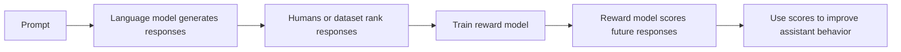
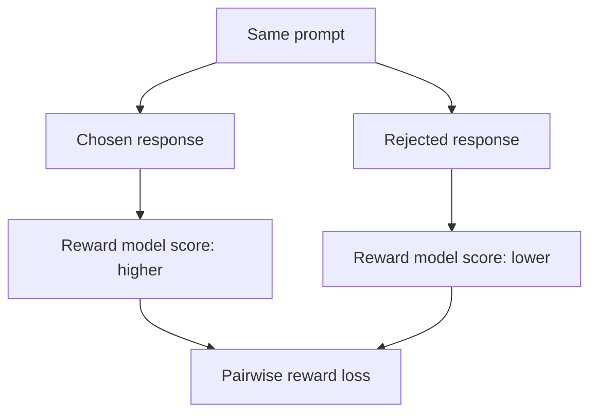
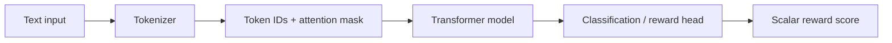
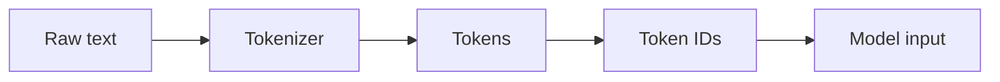
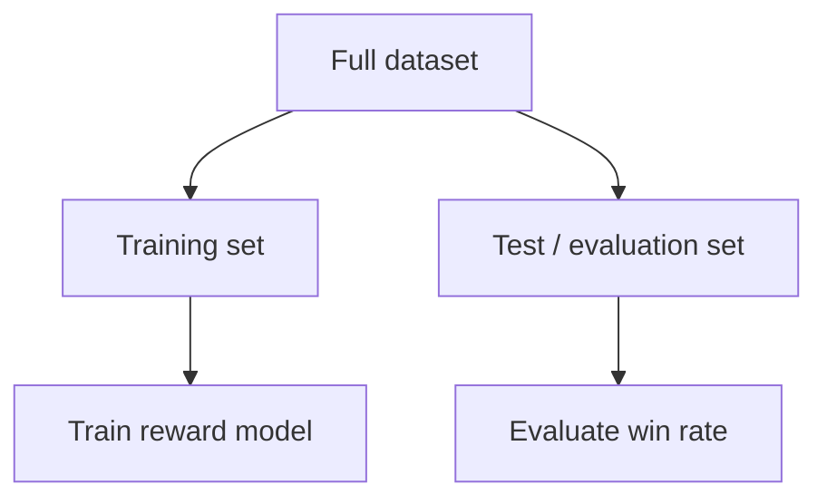
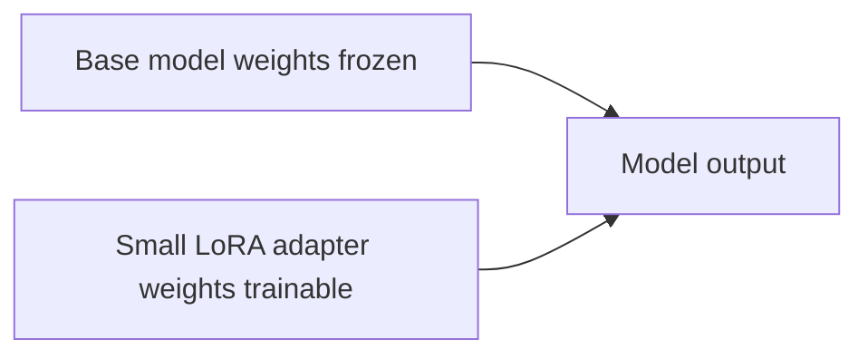
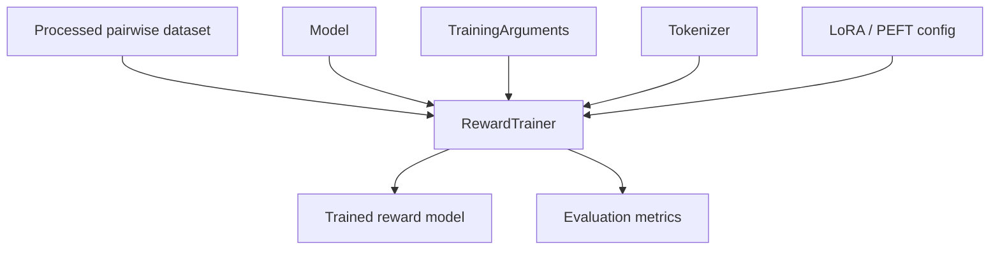
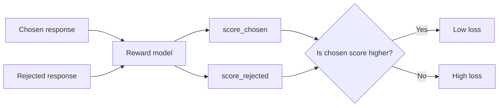
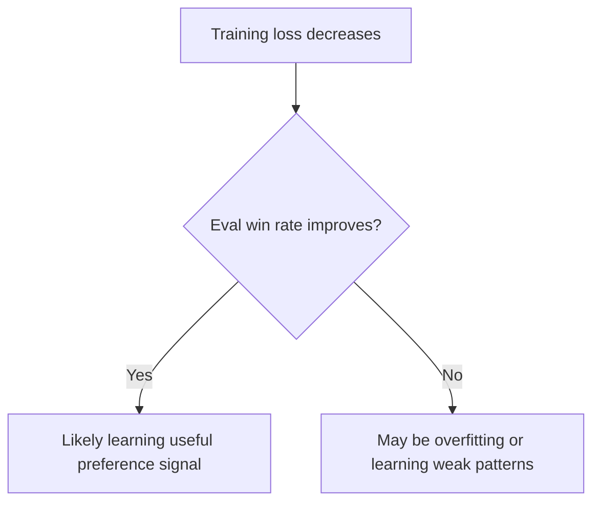
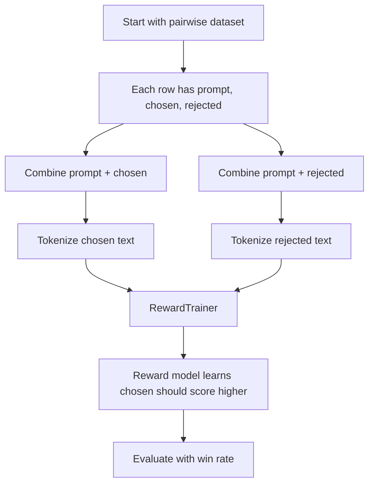

# Reward Modeling with Hugging Face — Beginner-Friendly Notes

## 1. Big Picture

Reward modeling is a way to train a model to **score responses**.

Instead of asking a model to directly generate an answer, we train a separate model called a **reward model** to answer this question:

> “Given two possible responses to the same prompt, which response is better?”

This is commonly used in RLHF-style workflows:



A reward model does **not** usually produce a full text answer. It produces a **score**.

A higher score means:

> “The model thinks this response is better.”

---

## 2. Corrected Transcript Terminology

The transcript has several obvious speech-to-text errors. Here are the corrected terms.

| Transcript wording | Correct term | Meaning |
|---|---|---|
| `Dahoas/synthetic- instruction-gptj-pairwise` | `Dahoas/synthetic-instruct-gptj-pairwise` | Hugging Face pairwise preference dataset |
| `lower config` | `LoraConfig` | LoRA configuration object from PEFT |
| `PET library` | `PEFT library` | Parameter-Efficient Fine-Tuning library |
| `Matt method` | `map method` | Dataset method that applies a function to many examples |
| `prompt projected` | `prompt rejected` | Text made from prompt + rejected response |
| `market is 1` | `mark it as 1` | Count the prediction as correct |
| `user reward trainer` | `use RewardTrainer` | Use the trainer to train/evaluate the reward model |
| `one neuron at the output layer` | scalar output head | A single numeric score for each input sequence |

---

## 3. Dataset: Prompt, Chosen, Rejected

The transcript uses a Hugging Face dataset designed for **pairwise preference learning**.

Each row has three main parts:

| Field | Meaning |
|---|---|
| `prompt` | The instruction or question given to the assistant |
| `chosen` | The preferred/better response |
| `rejected` | The worse/less preferred response |

Example:

```text
prompt:
Explain photosynthesis simply.

chosen:
Photosynthesis is how plants use sunlight, water, and carbon dioxide to make food.

rejected:
Photosynthesis is when plants eat dirt and turn it into oxygen.
```

The reward model should learn:

```text
score(prompt + chosen) > score(prompt + rejected)
```

In plain English:

> The better answer should get a higher score than the worse answer.

---

## 4. Why Pairwise Data?

A normal classifier might learn labels like:

```text
positive / negative
spam / not spam
cat / dog
```

A reward model learns from **comparisons**:

```text
Response A is better than Response B.
```

This is useful because human preference is often easier to express comparatively.

It may be hard to say:

> “This answer deserves exactly 8.7 out of 10.”

But it is easier to say:

> “This answer is better than that one.”



---

## 5. The Reward Model as a Score Function

The transcript describes using GPT-2 for **sequence classification**.

That means we take a language model backbone and attach a small output head that produces one number.



The output is usually shaped like:

```text
(batch_size, 1)
```

For example, if the batch has 3 responses:

```text
scores = [1.8, -0.4, 2.2]
```

These numbers are not probabilities. They are learned preference scores.

---

## 6. Formatting the Data

The transcript describes a function like `get_response` or `add_combined_columns`.

The goal is to turn separate fields into full conversation-style strings.

Original row:

```python
{
    "prompt": "Explain gravity simply.",
    "chosen": "Gravity is the force that pulls objects toward each other.",
    "rejected": "Gravity is when air pushes everything down."
}
```

Formatted row:

```python
{
    "prompt_chosen": "Human: Explain gravity simply.\nAssistant: Gravity is the force that pulls objects toward each other.",
    "prompt_rejected": "Human: Explain gravity simply.\nAssistant: Gravity is when air pushes everything down."
}
```

Why combine the prompt with each response?

Because the reward model should judge the response **in context**.

The same response can be good for one prompt and bad for another.

Example:

```text
Prompt: What is 2 + 2?
Response: 4
Good answer.

Prompt: Write a poem about rain.
Response: 4
Bad answer.
```

---

## 7. Tokenization

Models do not directly understand raw text. They understand numbers.

Tokenization converts text into token IDs.



Example:

```text
Text:
Human: Explain gravity.

Tokens:
["Human", ":", "Explain", "gravity", "."]

Token IDs:
[20490, 25, 18438, 11985, 13]
```

The transcript mentions these fields:

| Field | Meaning |
|---|---|
| `input_ids_chosen` | Token IDs for prompt + chosen response |
| `attention_mask_chosen` | Which chosen tokens are real tokens vs padding |
| `input_ids_rejected` | Token IDs for prompt + rejected response |
| `attention_mask_rejected` | Which rejected tokens are real tokens vs padding |

---

## 8. Attention Masks

An **attention mask** tells the model which tokens are real and which tokens are padding.

Suppose sequences need to be padded to length 6.

```text
Tokens:
[Hello, world, EOS, PAD, PAD, PAD]

Attention mask:
[1,     1,     1,   0,   0,   0]
```

Meaning:

| Mask value | Meaning |
|---|---|
| `1` | Pay attention to this token |
| `0` | Ignore this padding token |

Without the attention mask, the model might accidentally treat padding as meaningful text.

---

## 9. Filtering by Max Length

The transcript mentions filtering samples shorter than a specified max length.

This is done because transformer models have a maximum sequence length.

For example, if the max length is 512 tokens:

```text
prompt_chosen length = 430 tokens    keep
prompt_rejected length = 480 tokens  keep

prompt_chosen length = 700 tokens    remove or truncate
prompt_rejected length = 520 tokens  remove or truncate
```

Why it matters:

1. The model cannot accept unlimited-length input.
2. Very long examples use more GPU memory.
3. Keeping lengths controlled makes training more stable.

---

## 10. The `map` Method

The transcript says “Matt method,” but the correct term is the **`map` method**.

In Hugging Face Datasets, `.map()` applies a function to many examples.

Simple analogy:

> A `map` operation is like applying the same worksheet instruction to every row in a spreadsheet.

Example:

```python
processed_dataset = raw_dataset.map(preprocess_function, batched=True)
```

Meaning:

```text
For every example in the dataset:
    tokenize prompt_chosen
    tokenize prompt_rejected
    store the resulting input IDs and attention masks
```

`batched=True` means the function processes multiple examples at once, which is usually faster.

---

## 11. Train/Test Split

The transcript says to split the dataset into training and testing.

| Split | Purpose |
|---|---|
| Training set | Used to update the model weights |
| Test/evaluation set | Used to check whether the model learned useful patterns |

Why not evaluate only on training data?

Because a model can memorize training examples.

A good reward model should score **new examples** correctly, not just examples it already saw.



---

## 12. LoRA: Low-Rank Adaptation

LoRA stands for **Low-Rank Adaptation**.

It is a parameter-efficient fine-tuning method.

Instead of updating all model weights, LoRA freezes the main model and trains small adapter matrices.



Layman’s explanation:

> Instead of remodeling the whole house, LoRA adds small adjustable attachments to key places.

Why use LoRA?

| Full fine-tuning | LoRA fine-tuning |
|---|---|
| Updates most/all model weights | Updates small adapter weights |
| More GPU memory | Less GPU memory |
| Larger checkpoints | Smaller checkpoints |
| More expensive | Cheaper and often practical |

The transcript says the LoRA config is for a sequence classification task. In PEFT, this usually means something like:

```python
from peft import LoraConfig, TaskType

peft_config = LoraConfig(
    task_type=TaskType.SEQ_CLS,
    r=8,
    lora_alpha=16,
    lora_dropout=0.05,
    bias="none",
)
```

Important: exact parameters can vary depending on the model and library version.

---

## 13. Training Arguments

The transcript mentions several training parameters.

| Parameter | Example value | Meaning |
|---|---:|---|
| `per_device_train_batch_size` | `3` | Number of examples processed per device at once |
| `num_train_epochs` | `3` | Number of full passes through the training set |
| `gradient_accumulation_steps` | `8` | Number of mini-batches to accumulate before an optimizer update |
| `learning_rate` | `1.41e-5` | Step size used by the optimizer |

### Effective Batch Size

If you use gradient accumulation, your effective batch size is larger than the per-device batch size.

Formula:

```text
effective_batch_size = per_device_train_batch_size × gradient_accumulation_steps × number_of_devices
```

Example with one GPU:

```text
3 × 8 × 1 = 24
```

So even though the GPU sees 3 examples at a time, the optimizer update behaves more like a batch of 24 examples.

---

## 14. RewardTrainer

The transcript describes `RewardTrainer` as the tool that orchestrates training.

The trainer handles:

- batching
- forward passes
- reward loss calculation
- backpropagation
- optimizer steps
- evaluation
- checkpoint saving



In code, this often looks conceptually like:

```python
trainer = RewardTrainer(
    model=model,
    args=training_args,
    tokenizer=tokenizer,
    train_dataset=train_dataset,
    eval_dataset=eval_dataset,
    peft_config=peft_config,
)

trainer.train()
metrics = trainer.evaluate()
```

---

## 15. Reward Loss

Reward modeling usually uses a pairwise loss.

The goal is:

```text
reward(chosen) > reward(rejected)
```

A common reward loss is based on this idea:

```text
loss = -log(sigmoid(score_chosen - score_rejected))
```

You do not need to memorize the formula immediately. The intuition matters more.

### Intuition

If the chosen response already scores much higher than the rejected response:

```text
score_chosen = 5.0
score_rejected = 1.0
```

The model is doing well, so the loss is low.

If the rejected response scores higher:

```text
score_chosen = 1.0
score_rejected = 5.0
```

The model is wrong, so the loss is high.



---

## 16. PyTorch-Shaped Pseudocode

This is not meant to be exact copy-paste production code. It is shaped like PyTorch/Hugging Face code to help you understand the flow.

```python
# 1. Load dataset
raw_dataset = load_dataset("Dahoas/synthetic-instruct-gptj-pairwise")

# 2. Create combined prompt + response fields
def add_combined_columns(example):
    prompt = example["prompt"]
    chosen = example["chosen"]
    rejected = example["rejected"]

    example["prompt_chosen"] = f"Human: {prompt}\nAssistant: {chosen}"
    example["prompt_rejected"] = f"Human: {prompt}\nAssistant: {rejected}"
    return example

formatted_dataset = raw_dataset.map(add_combined_columns)

# 3. Tokenize chosen/rejected pairs
def preprocess_function(batch):
    chosen_tokens = tokenizer(
        batch["prompt_chosen"],
        truncation=True,
        padding="max_length",
        max_length=512,
    )

    rejected_tokens = tokenizer(
        batch["prompt_rejected"],
        truncation=True,
        padding="max_length",
        max_length=512,
    )

    return {
        "input_ids_chosen": chosen_tokens["input_ids"],
        "attention_mask_chosen": chosen_tokens["attention_mask"],
        "input_ids_rejected": rejected_tokens["input_ids"],
        "attention_mask_rejected": rejected_tokens["attention_mask"],
    }

processed_dataset = formatted_dataset.map(preprocess_function, batched=True)

# 4. Split train/eval
split = processed_dataset["train"].train_test_split(test_size=0.1)
train_dataset = split["train"]
eval_dataset = split["test"]

# 5. Train reward model
trainer = RewardTrainer(
    model=model,
    args=training_args,
    tokenizer=tokenizer,
    train_dataset=train_dataset,
    eval_dataset=eval_dataset,
    peft_config=peft_config,
)

trainer.train()
metrics = trainer.evaluate()
```

---

## 17. How Scoring Works After Training

Once trained, the reward model can score new responses.

```python
def get_score(text):
    tokens = tokenizer(text, return_tensors="pt", truncation=True)

    with torch.no_grad():
        output = model(**tokens)

    score = output.logits.squeeze().item()
    return score
```

Then compare two responses:

```python
def choose_better(prompt, response_a, response_b):
    text_a = f"Human: {prompt}\nAssistant: {response_a}"
    text_b = f"Human: {prompt}\nAssistant: {response_b}"

    score_a = get_score(text_a)
    score_b = get_score(text_b)

    if score_a > score_b:
        return "A is preferred"
    else:
        return "B is preferred"
```

Example:

```text
Prompt:
What is gravity?

Response A:
Gravity is a force that pulls objects with mass toward each other.

Response B:
Gravity is electricity inside the ground.

Reward model should produce:
score(A) > score(B)
```

---

## 18. Win Rate

The transcript evaluates the model using **win rate**.

Win rate asks:

> “How often does the model assign a higher score to the chosen response than to the rejected response?”

Formula:

```text
win_rate = correct_pairwise_predictions / total_pairs
```

Example:

```text
Total evaluated pairs: 100
Correct selections: 73

win_rate = 73 / 100 = 0.73 = 73%
```

Pseudocode:

```python
correct = 0
n = 100

for example in eval_dataset.select(range(n)):
    chosen_score = get_score(example["prompt_chosen"])
    rejected_score = get_score(example["prompt_rejected"])

    if chosen_score > rejected_score:
        correct += 1

win_rate = correct / n
print(f"Win rate: {win_rate:.2%}")
```

Important caution from the transcript:

> A 100% win rate on a small synthetic dataset does not necessarily mean the reward model is excellent in the real world.

It may mean:

- the dataset is simple
- the evaluation set is too small
- the model saw similar examples during training
- the data is synthetic and easier than real human preference data

---

## 19. Training Loss vs Win Rate

These are related but not identical.

| Metric | What it tells you |
|---|---|
| Training loss | Whether the model is improving on the training objective |
| Evaluation loss | Whether the model is improving on held-out examples |
| Win rate | How often the model ranks chosen above rejected |

A decreasing training loss is good, but it is not enough.

You also want good evaluation performance.



---

## 20. Reward Model vs Language Model

| Question | Language model | Reward model |
|---|---|---|
| What does it output? | Next-token probabilities or generated text | A scalar score |
| What is it trained to do? | Predict/generate text | Rank responses by preference |
| Example input | `Explain gravity` | `Prompt + response` |
| Example output | `Gravity is...` | `2.37` |
| Used for | Text generation | Evaluating/ranking responses |

A simple way to remember:

> A language model writes. A reward model judges.

---

## 21. End-to-End Mental Model



The whole workflow is basically:

```text
1. Give the model a prompt + good response.
2. Give the model the same prompt + bad response.
3. Ask the model to score both.
4. Penalize it when the bad response scores higher.
5. Repeat many times.
```

---

## 22. Common Beginner Confusions

### Confusion 1: Is the reward model generating answers?

Usually, no.

The reward model scores a response. It does not usually generate the response.

### Confusion 2: Is the scalar score a probability?

Not necessarily.

The score is a learned number used for ranking. The important thing is often the relative comparison:

```text
chosen score > rejected score
```

### Confusion 3: Why include the prompt in both inputs?

Because response quality depends on the prompt.

A response is not good or bad in isolation. It is good or bad **for a specific prompt**.

### Confusion 4: Does 100% win rate mean the model is perfect?

No.

It may only mean it performed perfectly on that particular evaluation slice. Real-world preference modeling is much harder.

### Confusion 5: Why use LoRA?

Because it allows fine-tuning with fewer trainable parameters, which saves memory and compute.

---

## 23. Mini Example from Scratch

Suppose we have this tiny dataset:

| Prompt | Chosen | Rejected |
|---|---|---|
| Explain rain. | Rain is water falling from clouds. | Rain is made of fire. |
| Explain addition. | Addition combines numbers. | Addition removes numbers. |
| Explain dogs. | Dogs are domesticated animals. | Dogs are planets. |

The reward model should learn:

```text
score("Explain rain" + "Rain is water falling from clouds")
>
score("Explain rain" + "Rain is made of fire")
```

After many examples, it starts learning patterns of helpfulness, correctness, and instruction-following.

---

## 24. Practical Engineering Notes

### Batch Size

Small batch size uses less memory but may train more noisily.

Large batch size uses more memory but can make training more stable.

Gradient accumulation helps simulate a larger batch without requiring all examples to fit in memory at once.

### Max Length

Longer max length allows more context but uses more memory.

Shorter max length is cheaper but may truncate important information.

### Synthetic Data

Synthetic preference data is useful for learning, testing, and demos.

But real-world reward modeling usually needs more careful evaluation because synthetic data may be too clean or too easy.

---

## 25. Self-Check Questions

### Basic

1. What are the three main fields in a pairwise reward modeling dataset?
2. What does the `chosen` response mean?
3. What does the `rejected` response mean?
4. Does a reward model usually generate text or score text?
5. Why do we combine the prompt with each response before tokenizing?

### Intermediate

6. What is the purpose of `input_ids_chosen`?
7. What is the purpose of `attention_mask_rejected`?
8. Why might we filter or truncate examples longer than `max_length`?
9. What does `batched=True` do in `.map()`?
10. What is the difference between training loss and win rate?

### Applied

11. If `score_chosen = 1.2` and `score_rejected = 0.3`, is the model correct for that pair?
12. If `score_chosen = -0.5` and `score_rejected = 2.0`, what should happen to the loss?
13. If a model gets 100% win rate on 20 synthetic examples, what should you be cautious about?
14. Why is LoRA useful when fine-tuning large models?
15. What does the formula `score(prompt + chosen) > score(prompt + rejected)` mean in plain English?

---

## 26. Answer Key

1. `prompt`, `chosen`, and `rejected`.
2. The preferred or better response.
3. The worse or less preferred response.
4. It usually scores text.
5. Because the response must be judged in the context of the prompt.
6. Token IDs for the prompt plus chosen response.
7. It tells the model which rejected-side tokens are real tokens versus padding.
8. Because models have maximum context lengths and long examples use more memory.
9. It processes multiple examples at once for efficiency.
10. Training loss measures optimization progress; win rate measures how often chosen beats rejected.
11. Yes, because the chosen score is higher.
12. The loss should be high because the rejected response scored higher.
13. It may not generalize; the test set may be small, easy, synthetic, or too similar to training data.
14. It trains fewer parameters, saving memory and compute.
15. The better answer should receive a higher reward score than the worse answer.

---

## 27. One-Sentence Summary

Reward modeling trains a model to assign higher scores to preferred responses than rejected responses, usually by comparing prompt-response pairs and optimizing a pairwise loss.
