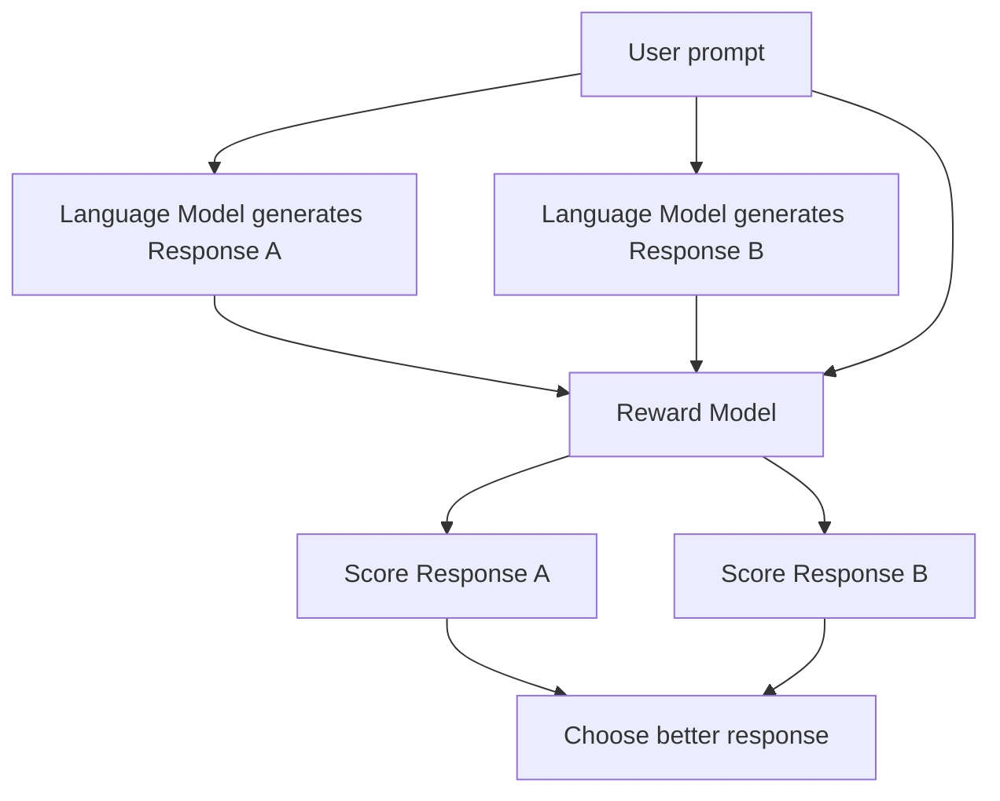
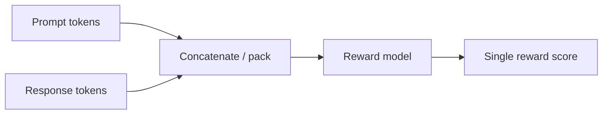
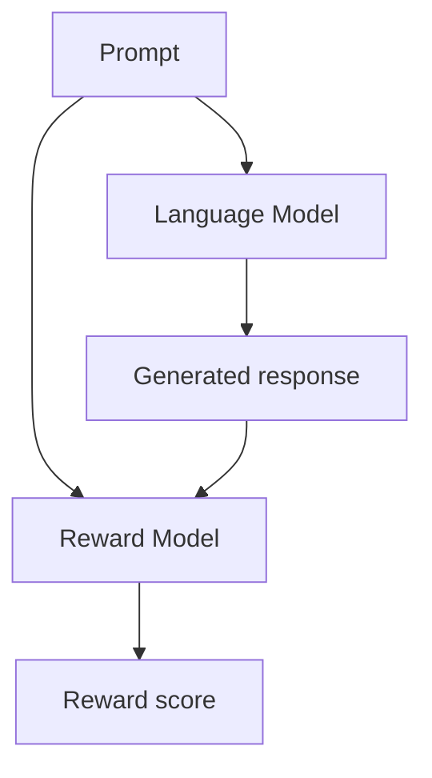
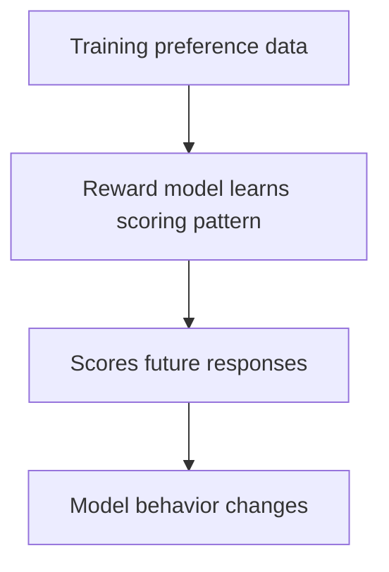
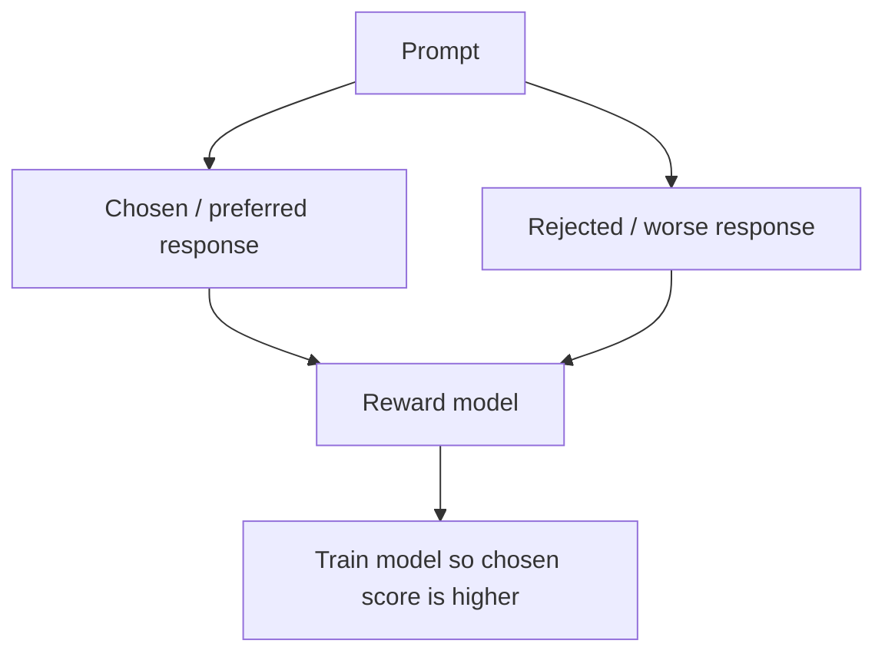
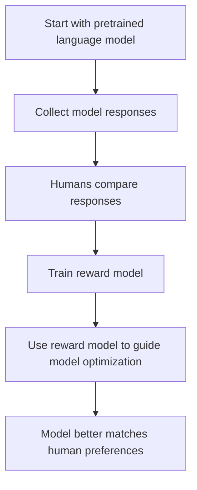
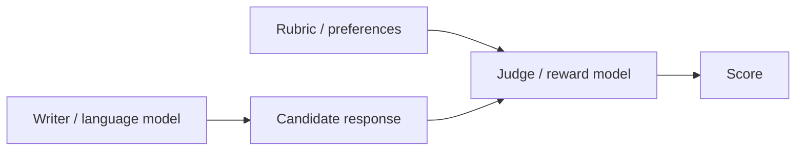

# Reward Modeling and Response Evaluation — Beginner-Friendly Notes

## 1. Big Picture

This transcript explains **reward modeling**, a core idea used when training or evaluating chat-style language models.

In plain English:

> A **reward model** is like a judge. It looks at a prompt and one or more possible answers, then gives each answer a score based on what humans or training preferences say is better.

For example, given the question:

> Which country owns Antarctica?

A reward model should score this answer highly:

> Antarctica is not owned by one country. It is governed through the Antarctic Treaty System.

And score this answer poorly:

> Penguin overlords run Antarctica.

The first answer is factual. The second is playful but wrong.

---

## 2. Corrected Transcript Terminology

Some wording in the transcript is understandable but slightly imprecise. Here are clearer corrections.

| Transcript wording | Better wording | Why |
|---|---|---|
| “The reward evaluates the degree of alignment” | **The reward score estimates how well a response matches a preference or goal.** | A reward is a number, not the full evaluation process. |
| “Causal decoder, such as chatbots” | **Decoder-only language model used in chatbots** | Chatbots often use decoder-only transformer models, but “chatbot” is the application, not the architecture. |
| “Training a reward function assigns high rewards to responses such as cats” | **A reward model can be trained to assign higher scores to responses that match a chosen preference, such as liking cats.** | The “cats” example is about preference, not universal correctness. |
| “The reward model takes prompt as input and responds as output regarding reward or score” | **The reward model takes a prompt-response pair and outputs a scalar reward score.** | A reward model usually needs both the prompt and the response. |
| “Response B may receive a higher score by training the scoring function to prioritize assumption” | **Response B could receive a higher score only if the reward model were trained to prefer imaginative or fictional answers instead of factual ones.** | “Prioritize assumption” is unclear. |
| “Omega hat represents an estimation” | **The hat notation often means generated/predicted output tokens.** | In ML/math, a hat usually means estimated, predicted, or generated. |

---

## 3. What Is Reward Modeling?

A **reward model** is a model trained to assign a score to an answer.

It usually receives:

1. A **prompt** or user query.
2. A **candidate response** from a language model.
3. It outputs a **reward score**, often a single number.

Simple form:

```text
reward_score = reward_model(prompt, response)
```

Example:

```text
Prompt:   Which country owns Antarctica?
Answer A: Antarctica is governed by the Antarctic Treaty System.
Score:    0.89

Prompt:   Which country owns Antarctica?
Answer B: Penguin overlords run Antarctica.
Score:    0.03
```

The reward model is not directly generating the final answer. It is **evaluating** answers.

---

## 4. Layman’s Explanation

Imagine a teacher grading two student answers.

Question:

> Who owns Antarctica?

Student A says:

> No single country owns Antarctica. It is governed through international agreements.

Student B says:

> Penguins own Antarctica.

The teacher gives:

```text
Student A: 89 / 100
Student B: 3 / 100
```

A reward model does something similar, except it uses learned patterns from training data rather than human judgment in the moment.

---

## 5. Response Evaluation Workflow

The transcript describes a common response-evaluation process:

1. Start with a prompt.
2. Generate or collect multiple candidate responses.
3. Feed each prompt-response pair into a reward model.
4. Get a score for each response.
5. Prefer the response with the higher score.



---

## 6. Prompt-Response Pair

A reward model usually does not score a response by itself. It scores the response **in context of the prompt**.

That matters because the same response can be good or bad depending on the question.

### Example

Prompt 1:

```text
Tell me a silly fictional story about Antarctica.
```

Response:

```text
Penguin overlords run Antarctica.
```

This could be a good response because the user asked for fiction.

Prompt 2:

```text
Which country owns Antarctica?
```

Same response:

```text
Penguin overlords run Antarctica.
```

This is a bad response because the user asked for factual information.

So the reward model needs both:

```text
(prompt, response)
```

not just:

```text
(response)
```

---

## 7. What Does “Alignment” Mean Here?

In this context, **alignment** means:

> The model’s response matches the desired behavior.

Desired behavior could mean different things depending on the training goal:

| Goal | A high-scoring response should be... |
|---|---|
| Factual accuracy | Correct and grounded |
| Helpfulness | Useful and relevant |
| Safety | Avoiding harmful instructions |
| Style preference | Written in the desired tone |
| User preference | Matching what users tend to prefer |

A reward model converts those preferences into numbers.

---

## 8. Reward Score as a Number

A reward model often outputs one scalar value.

A **scalar** is just a single number.

Example:

```text
r(prompt, response) = 0.89
```

That means the reward model thinks the response is relatively good according to its learned preference criteria.

Another response might get:

```text
r(prompt, response) = 0.03
```

That means the reward model thinks the response is poor.

The exact range depends on implementation. Scores might be:

- Between `0` and `1`
- Any real number, such as `-2.4`, `0.7`, or `5.1`
- Logits that are later converted into probabilities or rankings

---

## 9. Tokenization and Notation

The transcript uses omega notation:

```text
ω
```

and omega-hat notation:

```text
ω̂
```

A beginner-friendly interpretation:

| Symbol | Meaning |
|---|---|
| `ω` | Tokens from the prompt/query |
| `ω̂_A` | Generated tokens for Response A |
| `ω̂_B` | Generated tokens for Response B |
| `r` | Reward/scoring function |

So the reward model may be written like this:

```text
r(ω, ω̂_A) = score for Response A
r(ω, ω̂_B) = score for Response B
```

In plain English:

```text
score_A = reward_model(prompt_tokens, response_A_tokens)
score_B = reward_model(prompt_tokens, response_B_tokens)
```

---

## 10. Tokenization Example

Prompt:

```text
Which country owns Antarctica?
```

A tokenizer might split it into tokens like:

```text
["Which", " country", " owns", " Antarctica", "?"]
```

Response A:

```text
Antarctica is governed by the Antarctic Treaty System.
```

Possible tokens:

```text
["Antarctica", " is", " governed", " by", " the", " Antarctic", " Treaty", " System", "."]
```

The reward model may receive something like:

```text
[Prompt tokens] + [Response tokens]
```

Often with special separator tokens, depending on the model.



---

## 11. Do Responses Need to Be the Same Length?

No.

The transcript correctly says the sequences do **not** need to be the same length.

Example:

Response A:

```text
No single country owns Antarctica.
```

Response B:

```text
No single country owns Antarctica. It is governed by the Antarctic Treaty System, which regulates international activity on the continent.
```

Response B is longer, but both can still be scored.

The reward model can process variable-length text, usually with padding and attention masks during batching.

---

## 12. Important Distinction: Reward Model vs Language Model

A normal language model predicts text.

A reward model scores text.

| Model type | Input | Output | Main job |
|---|---|---|---|
| Language model | Prompt | Generated response | Produce text |
| Reward model | Prompt + response | Score | Judge response quality |



---

## 13. Why Reward Modeling Matters

Reward modeling helps with:

### 1. Comparing responses

Instead of only saying “A seems better than B,” we assign scores.

```text
Response A: 0.89
Response B: 0.03
```

### 2. Training better models

The reward score can be used to improve a language model so it produces responses that humans prefer.

### 3. Capturing preferences

Different reward models can be trained for different preferences.

For example:

| Preference | Higher score goes to... |
|---|---|
| Factual answers | Correct, evidence-based responses |
| Friendly tone | Warm, conversational responses |
| Concise answers | Short, direct responses |
| Creative writing | Imaginative responses |
| Safety | Responses that avoid dangerous guidance |

---

## 14. Preference Is Not Always the Same as Truth

This is an important point.

A reward model learns from the preference data it is trained on.

If the preference data says factual answers are better, then factual answers should get higher scores.

But if the preference data rewards entertaining fictional answers, then fictional answers may get higher scores.

So reward models depend heavily on training data.



This means reward models can inherit mistakes, biases, or bad incentives from the data used to train them.

---

## 15. Simple Cats Example

The transcript gives a simplified preference example involving cats.

Suppose the preference is:

> Prefer responses that like cats.

Prompt:

```text
What do you think about cats?
```

Response A:

```text
Cats are wonderful pets.
```

Response B:

```text
Cats are just okay.
```

Possible scores:

```text
Response A: 0.95
Response B: 0.50
```

This does **not** mean Response A is objectively more factual. It means Response A better matches the chosen preference.

---

## 16. Factual Accuracy Example

Preference:

> Prefer factual, contextually accurate answers.

Prompt:

```text
Which country owns Antarctica?
```

Response A:

```text
No single country owns Antarctica. Antarctica is governed through the Antarctic Treaty System.
```

Response B:

```text
Penguin overlords run Antarctica.
```

Possible scores:

```text
Response A: 0.89
Response B: 0.03
```

Here, Response A should score higher because it better matches factual accuracy.

---

## 17. PyTorch-Shaped Pseudocode

This is not full production code. It is shaped like PyTorch to show the basic idea.

```python
import torch
import torch.nn as nn

class RewardModel(nn.Module):
    def __init__(self, base_transformer, hidden_size):
        super().__init__()
        self.transformer = base_transformer
        self.reward_head = nn.Linear(hidden_size, 1)

    def forward(self, input_ids, attention_mask):
        outputs = self.transformer(
            input_ids=input_ids,
            attention_mask=attention_mask,
        )

        # Use the final hidden state of a special token or pooled representation.
        pooled = outputs.last_hidden_state[:, -1, :]

        # Output one scalar reward per prompt-response pair.
        reward = self.reward_head(pooled)
        return reward.squeeze(-1)
```

Conceptually:

```python
prompt = "Which country owns Antarctica?"
response_a = "No single country owns Antarctica. It is governed by the Antarctic Treaty System."
response_b = "Penguin overlords run Antarctica."

input_a = tokenizer(prompt, response_a, return_tensors="pt")
input_b = tokenizer(prompt, response_b, return_tensors="pt")

score_a = reward_model(**input_a)
score_b = reward_model(**input_b)

best_response = response_a if score_a > score_b else response_b
```

---

## 18. Pairwise Preference Training

Reward models are often trained from comparisons, not just absolute scores.

Humans may label examples like:

```text
Prompt: Which country owns Antarctica?
Preferred response: Response A
Rejected response: Response B
```

The reward model is trained so that:

```text
reward(prompt, preferred_response) > reward(prompt, rejected_response)
```

In formula-like form:

```text
r(prompt, chosen) > r(prompt, rejected)
```



---

## 19. PyTorch-Shaped Pairwise Loss

A common training idea is to make the chosen response score higher than the rejected response score.

```python
chosen_score = reward_model(**chosen_batch)
rejected_score = reward_model(**rejected_batch)

# Encourage chosen_score to be greater than rejected_score.
loss = -torch.nn.functional.logsigmoid(chosen_score - rejected_score).mean()

loss.backward()
optimizer.step()
```

Layman’s explanation:

- If the chosen answer already scores much higher, the loss is small.
- If the rejected answer scores higher, the loss is large.
- Training updates the reward model so it becomes better at ranking preferred answers above rejected answers.

---

## 20. How This Connects to RLHF

Reward modeling is commonly used in **RLHF**, which stands for:

> Reinforcement Learning from Human Feedback

A simplified RLHF pipeline:



The reward model acts like a learned stand-in for human feedback.

Instead of asking humans to score every future answer, the reward model estimates what humans would likely prefer.

---

## 21. Where Reward Modeling Can Go Wrong

Reward models are useful, but they are not perfect.

| Problem | Explanation |
|---|---|
| Bad preference data | The reward model learns bad judgments if training labels are poor. |
| Reward hacking | The language model may learn tricks that get high scores without truly being helpful. |
| Over-optimization | A model may become too tuned to the reward model and less generally useful. |
| Bias | Human preference data can contain cultural, political, or stylistic bias. |
| Ambiguous goals | “Good answer” can mean different things in different contexts. |

Example of reward hacking:

A reward model might overvalue confident-sounding answers. Then the language model may learn to sound confident even when it is wrong.

---

## 22. Simple Mental Model

Think of the system as three roles:

| Role | Analogy | ML version |
|---|---|---|
| Writer | Student writing an answer | Language model |
| Judge | Teacher grading the answer | Reward model |
| Rubric | Grading criteria | Human preference data |



---

## 23. Key Takeaways

- A **reward model** scores responses.
- It usually takes a **prompt-response pair** as input.
- The output is usually a **single scalar reward score**.
- Higher scores mean the response better matches the learned preference.
- Reward modeling can prioritize factual accuracy, helpfulness, safety, style, or other preferences.
- The reward model depends heavily on the quality of its training data.
- Reward modeling is commonly used in RLHF and related alignment methods.

---

## 24. Mini Glossary

| Term | Beginner-friendly meaning |
|---|---|
| Reward model | A model that scores responses. |
| Reward score | A number representing how good a response seems according to learned preferences. |
| Prompt | The user’s input or question. |
| Response | The model’s answer. |
| Prompt-response pair | The prompt and answer evaluated together. |
| Scalar | A single number. |
| Token | A piece of text processed by the model. |
| Tokenization | Splitting text into tokens. |
| Alignment | Matching desired behavior or human preferences. |
| RLHF | Training models using human feedback, often through a reward model. |
| Chosen response | The response humans preferred in training data. |
| Rejected response | The response humans ranked lower. |

---

## 25. Self-Check Questions

### Conceptual

1. What does a reward model output?
2. Why does the reward model need both the prompt and the response?
3. Is a high reward score always the same as factual truth? Why or why not?
4. What is the difference between a language model and a reward model?
5. What does “alignment” mean in this context?

### Applied

6. Suppose a prompt asks for a factual answer, but the response is funny and incorrect. Should a factuality-focused reward model score it high or low?
7. Suppose a prompt asks for a creative bedtime story. Could a fictional answer get a high reward score?
8. Why might two reward models give different scores to the same response?
9. What could go wrong if the reward model overvalues confident language?
10. Why is pairwise comparison useful for training reward models?

---

## 26. Answers to Self-Check Questions

1. Usually a single numerical reward score.
2. Because the same response can be good or bad depending on the prompt.
3. No. A reward score reflects learned preferences, which may or may not prioritize truth.
4. A language model generates text. A reward model scores text.
5. The response matches the desired behavior or preference.
6. Low.
7. Yes, if creativity is the goal.
8. They may have been trained on different preferences or data.
9. The model may learn to sound certain even when it is wrong.
10. It is often easier for humans to say which response is better than to assign exact numerical scores.

---

## 27. One-Sentence Summary

A reward model is a learned scoring system that evaluates how well a language model’s response matches desired preferences, such as being helpful, accurate, safe, concise, or stylistically appropriate.
