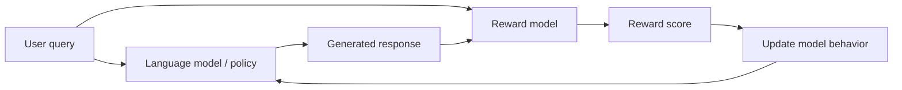
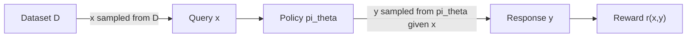
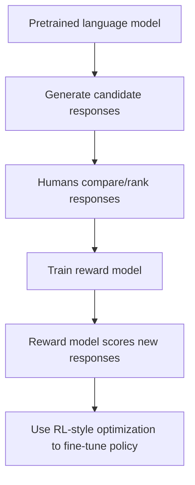
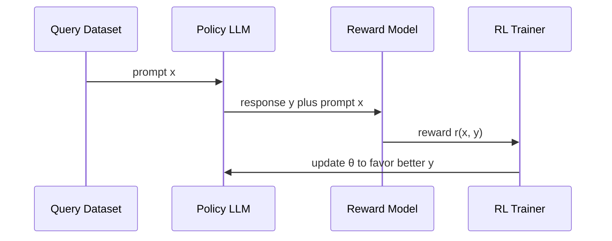
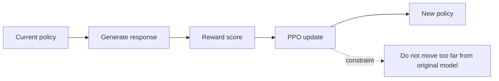
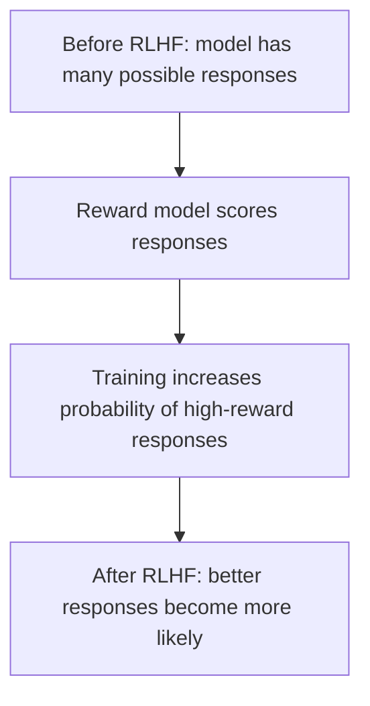
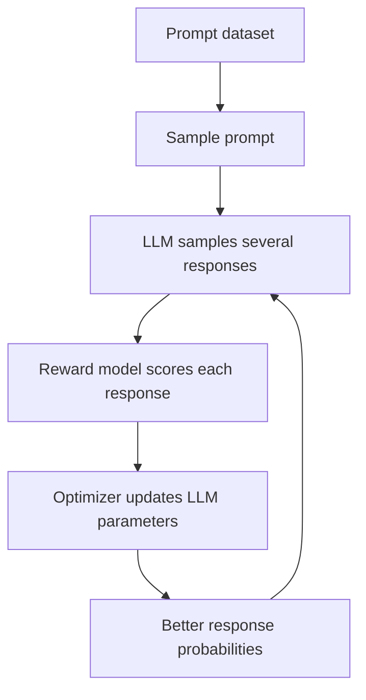

# Reinforcement Learning from Human Feedback (RLHF) — Beginner-Friendly Notes

> Source: cleaned and expanded from the uploaded transcript `subtitle.txt`.

## 1. Big Picture

**RLHF** stands for **Reinforcement Learning from Human Feedback**.

In simple terms, RLHF is a way to improve a language model by rewarding better answers and discouraging worse answers.

A pretrained language model already knows how to generate text. RLHF tries to make that text more helpful, truthful, safe, and aligned with what people prefer.

The transcript uses a monkey-and-banana analogy:

- A monkey types random text.
- A reviewer checks whether the text is useful.
- If the text is good, the monkey gets a banana.
- Over time, the monkey is encouraged toward better text.

For language models:

- The **model** generates an answer.
- A **reward model** scores the answer.
- The language model is updated to make high-scoring answers more likely.



---

## 2. Corrected Transcript Terminology

The transcript is understandable, but several terms are easier to read using standard ML notation.

| Transcript wording | Cleaner terminology | Meaning |
|---|---|---|
| “reward function represented as r(X, Y)” | `r(x, y)` | A function that scores response `y` for query `x`. |
| “x approximate d” | `x ~ D` | Query `x` is sampled from dataset/distribution `D`. |
| “Y approximate D1” | `y ~ πθ(. | x)` or `y ~ D_x` | Response `y` is sampled from the model’s response distribution for query `x`. |
| “language model as a table” | Policy distribution | The model assigns probabilities to possible responses. |
| “agent or LLM” | Policy / model / agent | In RL terms, the model being trained is often called the policy or agent. |
| “learnable parameters theta” | `θ` | The model weights that training updates. |
| “query and response are known as rollout” | Rollout | A sampled model interaction: prompt in, response out, reward assigned. |

A useful corrected sentence is:

> We sample a query `x` from a dataset `D`, generate a response `y` from the model policy `πθ(y | x)`, score it with a reward function `r(x, y)`, and update the model parameters `θ` to increase expected reward.

---

## 3. The Reward Function

A **reward function** gives a score to a model response.

The transcript writes this as:

```text
r(x, y)
```

Where:

- `x` = the query or prompt
- `y` = the model’s response
- `r(x, y)` = the reward score for that response

Example:

```text
Query x:
Which country owns Antarctica?

Response y1:
?9dfsa
Reward: 0.0

Response y2:
No country owns Antarctica.
Reward: 0.9

Response y3:
Antarctica is governed by an international treaty system.
Reward: 1.0
```

### Layman’s explanation

Think of the reward function like a teacher grading answers.

- Nonsense answer → low score
- Mostly correct answer → good score
- Best answer → highest score

The reward score does **not** have to be perfect. It just gives the model a signal about which responses are better.

---

## 4. RLHF as a Training Loop

RLHF can be understood as a repeated loop:

1. Pick a query.
2. Ask the model to generate a response.
3. Score the response using human preference data or a reward model.
4. Update the model so it becomes more likely to produce high-reward responses.

```mermaid
flowchart TD
    A[Sample query x] --> B[Model generates response y]
    B --> C[Reward model scores r(x, y)]
    C --> D[Training algorithm updates θ]
    D --> E[Improved policy πθ]
    E --> B
```

---

## 5. What Is a Policy?

In reinforcement learning, a **policy** is the thing that decides what action to take.

For a language model:

- The **state/input** is the prompt.
- The **action/output** is the generated text.
- The **policy** is the model’s probability distribution over possible next tokens or responses.

Standard notation:

```text
πθ(y | x)
```

Read this as:

> The probability that the model with parameters `θ` generates response `y` given query `x`.

### Example

For the query:

```text
The largest ocean is ____
```

A model might assign probabilities like this:

| Possible response | Probability |
|---|---:|
| Pacific Ocean | 0.80 |
| Atlantic Ocean | 0.12 |
| Indian Ocean | 0.05 |
| Banana sandwich | 0.03 |

The model’s policy is not just one answer. It is a distribution over many possible answers.

---

## 6. What Is a Rollout?

A **rollout** is one sampled interaction from the model.

For RLHF, a rollout usually means:

```text
query x → model response y → reward r(x, y)
```

Example rollouts:

| Query `x` | Response `y` | Reward `r(x, y)` |
|---|---|---:|
| Which country owns Antarctica? | `?9dfsa` | 0.0 |
| Which country owns Antarctica? | Antarctica is a country. | 0.02 |
| Which country owns Antarctica? | Penguin overlords. | 0.09 |
| Which country owns Antarctica? | No country owns Antarctica. | 0.9 |
| Which country owns Antarctica? | Antarctica is governed by an international treaty system. | 1.0 |

### Layman’s explanation

A rollout is like asking the model to “try an answer” and then grading that attempt.

---

## 7. Sampling Queries and Responses

The transcript describes selecting queries from a table.

In standard notation:

```text
x ~ D
```

This means:

> Sample a query `x` from the dataset or distribution `D`.

Then the model samples a response:

```text
y ~ πθ(. | x)
```

This means:

> Sample a response `y` from the model’s response distribution given query `x`.



---

## 8. Expected Reward

The goal is not just to get one good answer once. The goal is to make the model better on average.

That is where **expected reward** comes in.

Expected reward means:

> If we keep sampling many queries and responses, what reward does the model get on average?

### Empirical average version

Suppose we have:

- `N` queries
- `K` responses sampled per query
- `r(x_n, y_{n,k})` as the reward for response `k` to query `n`

Then the empirical average reward is approximately:

```text
Average reward ≈ (1 / (N × K)) × Σ over n × Σ over k r(x_n, y_{n,k})
```

More compactly:

```text
J(θ) ≈ 1 / (N K) Σₙ Σₖ r(xₙ, yₙ,ₖ)
```

Where:

- `J(θ)` = objective we want to maximize
- `θ` = model parameters
- `xₙ` = query number `n`
- `yₙ,ₖ` = sampled response `k` for query `n`

### Expected value version

The more formal version is:

```text
J(θ) = E_{x ~ D, y ~ πθ(. | x)} [ r(x, y) ]
```

Read it as:

> The model’s objective is the expected reward when prompts come from the data distribution and responses come from the model policy.

---

## 9. Expected Reward for One Query

For one fixed query `x`, the expected reward is a weighted average over possible responses.

```text
E[r | x] = Σ_y πθ(y | x) r(x, y)
```

Meaning:

- Every possible response has a probability.
- Every possible response has a reward.
- Expected reward combines both.

Example:

| Response | Probability | Reward | Probability × Reward |
|---|---:|---:|---:|
| `?9dfsa` | 0.10 | 0.0 | 0.000 |
| Antarctica is a country. | 0.20 | 0.02 | 0.004 |
| No country owns Antarctica. | 0.50 | 0.9 | 0.450 |
| Antarctica is governed by an international treaty system. | 0.20 | 1.0 | 0.200 |

Expected reward:

```text
0.000 + 0.004 + 0.450 + 0.200 = 0.654
```

So for this query, the model’s expected reward is `0.654`.

---

## 10. Why Use a Reward Model?

Humans cannot manually grade every answer during every training step. That would be too slow and expensive.

So RLHF often uses a **reward model**.

A reward model is trained from human preference data. Once trained, it predicts which responses humans would likely prefer.

A common pipeline looks like this:



### Important distinction

The reward model is **not** the final chatbot.

It is a scoring model used to train the chatbot.

| Component | Job |
|---|---|
| Policy model / LLM | Generates responses. |
| Reward model | Scores responses. |
| RL optimization algorithm | Updates the policy model using reward scores. |

---

## 11. How Human Feedback Enters the System

Human feedback can enter RLHF in different ways.

The transcript describes a reward model evaluating query-response pairs.

A simplified flow:

```text
Human preferences → train reward model → reward model scores outputs → LLM fine-tuned
```

More concretely:

1. A model generates multiple responses to the same prompt.
2. Humans rank which response is better.
3. A reward model learns to predict those rankings.
4. The LLM is trained to produce responses that the reward model scores highly.



---

## 12. Negative Rewards

The transcript gives an example where the response is:

```text
He looks like Brad Pitt.
```

For the query:

```text
Who made this course?
```

The reward model assigns a very negative score, such as `-10,000`.

That example is exaggerated to make the point clear: bad or irrelevant answers can receive negative rewards.

In practice, reward values are usually scaled more carefully, because extremely large rewards or penalties can make training unstable.

---

## 13. RLHF Compared with Supervised Fine-Tuning

RLHF is often easier to understand when compared with supervised fine-tuning.

| Training method | What the model learns from | Basic idea |
|---|---|---|
| Pretraining | Huge text corpus | Predict text patterns. |
| Supervised fine-tuning | Human-written ideal answers | Imitate good examples. |
| RLHF | Human preferences / reward model | Prefer answers humans rate more highly. |

### Simple analogy

Pretraining:

> Read the internet and learn how language works.

Supervised fine-tuning:

> Watch examples of good answers and imitate them.

RLHF:

> Try multiple answers, get feedback, and learn which style of answer people prefer.

---

## 14. Where PPO Often Fits

Many RLHF explanations mention **PPO**, which stands for **Proximal Policy Optimization**.

The transcript does not deeply explain PPO, but it is commonly used as the RL optimization method.

PPO tries to update the model so it gets higher reward while avoiding updates that are too large.

Why avoid huge updates?

Because if the model changes too aggressively, it may:

- Forget useful language ability.
- Exploit weaknesses in the reward model.
- Produce strange outputs that score well but are not actually good.



---

## 15. PyTorch-Shaped Pseudocode

This is not complete production RLHF code. It is shaped like PyTorch to show the moving parts.

```python
# Pseudocode only: simplified RLHF-style loop

policy_model = LanguageModel()       # The LLM being fine-tuned
reward_model = RewardModel()         # Scores prompt-response pairs
optimizer = torch.optim.AdamW(policy_model.parameters(), lr=1e-6)

for batch in dataloader:
    prompts = batch["prompt"]

    # 1. Generate responses from the current policy
    responses = policy_model.generate(
        prompts,
        max_new_tokens=128,
        do_sample=True,
        temperature=0.8,
    )

    # 2. Score each prompt-response pair
    with torch.no_grad():
        rewards = reward_model(prompts, responses)

    # 3. Compute a policy-gradient-like loss
    # In real RLHF, PPO or another RL algorithm is usually used.
    log_probs = policy_model.log_prob(prompts, responses)
    loss = -(log_probs * rewards).mean()

    # 4. Update policy model parameters θ
    optimizer.zero_grad()
    loss.backward()
    optimizer.step()
```

### What this pseudocode is hiding

Real RLHF usually includes more details:

- Token-level log probabilities
- KL penalty against a reference model
- PPO clipping
- Advantage estimation
- Reward normalization
- Separate value model or value head
- Careful batching and generation settings

The core idea still remains:

```text
Generate → score → update toward higher reward
```

---

## 16. Small Numeric Example

Suppose the model answers one prompt three different ways.

Prompt:

```text
Which country owns Antarctica?
```

| Response | Probability before RLHF | Reward |
|---|---:|---:|
| `?9dfsa` | 0.20 | 0.0 |
| Antarctica is a country. | 0.30 | 0.02 |
| Antarctica is governed by an international treaty system. | 0.50 | 1.0 |

Expected reward before update:

```text
(0.20 × 0.0) + (0.30 × 0.02) + (0.50 × 1.0)
= 0 + 0.006 + 0.5
= 0.506
```

After RLHF, we want the probability distribution to shift:

| Response | Probability after RLHF | Reward |
|---|---:|---:|
| `?9dfsa` | 0.05 | 0.0 |
| Antarctica is a country. | 0.10 | 0.02 |
| Antarctica is governed by an international treaty system. | 0.85 | 1.0 |

Expected reward after update:

```text
(0.05 × 0.0) + (0.10 × 0.02) + (0.85 × 1.0)
= 0 + 0.002 + 0.85
= 0.852
```

The model improved because it now puts more probability mass on the high-reward response.

---

## 17. Mental Model: RLHF Is Probability Shaping

A language model does not simply “know” one answer. It assigns probabilities to many possible answers.

RLHF changes those probabilities.

Before RLHF:

```text
Good answer:      medium probability
Bad answer:       medium probability
Nonsense answer:  small but possible probability
```

After RLHF:

```text
Good answer:      higher probability
Bad answer:       lower probability
Nonsense answer:  much lower probability
```



---

## 18. Important Caveats

RLHF is powerful, but it is not magic.

### Caveat 1: Reward models can be wrong

If the reward model gives high scores to bad answers, the LLM may learn bad behavior.

### Caveat 2: Models can exploit reward functions

A model may learn to produce responses that score highly according to the reward model but are not actually useful.

This is sometimes called **reward hacking**.

### Caveat 3: Human preferences are not always objective truth

Human preference data can contain bias, inconsistency, or ambiguity.

### Caveat 4: RLHF usually needs constraints

Training often keeps the RLHF-tuned model close to the original model so it does not drift too far.

This is commonly done with a **KL penalty** against a reference model.

---

## 19. Key Terms

| Term | Beginner meaning |
|---|---|
| RLHF | Training a model using reward signals derived from human feedback. |
| Query / prompt `x` | The input given to the model. |
| Response `y` | The output generated by the model. |
| Reward `r(x, y)` | A score measuring how good the response is for the query. |
| Policy `πθ` | The model’s probability distribution over responses. |
| Parameters `θ` | The model weights that training changes. |
| Rollout | A sampled query-response-reward interaction. |
| Expected reward | Average reward the model would get over many prompts and responses. |
| Reward model | A model trained to predict human preferences. |
| PPO | A common RL optimization algorithm used in RLHF. |
| KL penalty | A constraint that discourages the fine-tuned model from moving too far from the original model. |

---

## 20. Common Confusions

### “Does the reward function directly write the answer?”

No.

The reward function scores an answer. The language model still generates the answer.

### “Is the reward model the same as the LLM?”

No.

The LLM generates responses. The reward model judges responses.

### “Does RLHF guarantee truth?”

No.

RLHF encourages responses that humans or reward models prefer. That often improves helpfulness, but it does not guarantee factual correctness.

### “Why sample multiple responses?”

Because the model has many possible outputs. Sampling lets training discover which outputs get better rewards.

### “What does expected reward really mean?”

It is the average score the model would get if it answered many prompts many times.

---

## 21. Simple End-to-End Example

Imagine this tiny training setup.

Dataset prompts:

```text
1. The largest ocean is ____.
2. Which country owns Antarctica?
3. Can you give me Python code to add two numbers?
```

For each prompt:

1. The model samples one or more responses.
2. The reward model scores them.
3. The optimizer adjusts the model to increase the probability of high-scoring responses.



---

## 22. Self-Check Questions

### Concept questions

1. What does RLHF stand for?
2. What is the role of the reward model?
3. In `r(x, y)`, what do `x` and `y` represent?
4. What is a rollout?
5. What does `πθ(y | x)` mean?
6. Why do we care about expected reward instead of only one reward score?
7. What is one risk of using a reward model?
8. Why might training include a KL penalty or similar constraint?

### Applied questions

For the query:

```text
What is 2 + 2?
```

Suppose the model gives these possible responses:

| Response | Probability | Reward |
|---|---:|---:|
| 4 | 0.60 | 1.0 |
| 5 | 0.20 | 0.0 |
| It depends on the moon. | 0.20 | -0.5 |

1. What is the expected reward?
2. After RLHF, which response should become more likely?
3. Which responses should become less likely?

<details>
<summary>Answers</summary>

1. Expected reward:

```text
(0.60 × 1.0) + (0.20 × 0.0) + (0.20 × -0.5)
= 0.60 + 0 - 0.10
= 0.50
```

2. `4` should become more likely.
3. `5` and `It depends on the moon.` should become less likely.

</details>

---

## 23. One-Sentence Summary

RLHF fine-tunes a language model by sampling responses, scoring them with human-feedback-derived rewards, and updating the model so high-reward responses become more likely.
